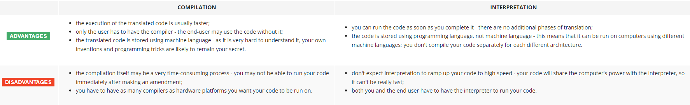

# Introduction to Python and computer programming

## What makes a language?

A language in which humans can write their programs and a language that computers may use to execute the programs, one that is far more complex than machine language and yet far simpler than natural language.
Such languages are often called **high-level** programming languages.

- an **alphabet**: a set of symbols used to build words of a certain language (e.g., the Latin alphabet for English)
- a **lexis**: (aka a dictionary) a set of words the language offers its users (e.g., the word "computer" comes from the English language dictionary, while "cmoptrue" doesn't; the word "chat" is present both in English and French dictionaries, but their meanings are different)
- a **syntax**: a set of rules (formal or informal, written or felt intuitively) used to determine if a certain string of words forms a valid sentence (e.g., "I am a python" is a syntactically correct phrase, while "I a python am" isn't)
- **semantics**: a set of rules determining if a certain phrase makes sense (e.g., "I ate a doughnut" makes sense, but "A doughnut ate me" doesn't)

Machine language is a low-level programming language made out of binary numbers or bits that can only be read by machines. It is also known as machine code or object code, in which instructions are executed directly by the CPU. Assembly language is a human-only language that is not understood by computers.

A program written in a high-level programming language is called a **source code** (in contrast to the machine code executed by computers). Similarly, the file containing the source code is called the **source file**.

Of course, such a composition has to be correct in many senses:

- **alphabetically** – a program needs to be written in a recognizable script, such as Roman, Cyrillic, etc.
- **lexically** – each programming language has its dictionary and you need to master it; thankfully, it's much simpler and smaller than the dictionary of any natural language;
- **syntactically** – each language has its rules and they must be obeyed;
- **semantically** – the program has to make sense.

## Compilation vs. interpretation

There are two different ways of **transforming a program from a high-level programming language into machine language**:

**COMPILATION** - the source program is translated once (however, this act must be repeated each time you modify the source code) by getting a file containing the machine code; now you can distribute the file worldwide; the program that performs this translation is called a compiler or translator;

**INTERPRETATION** - you can translate the source program each time it has to be run; the program performing this kind of transformation is called an interpreter, as it interprets the code every time it is intended to be executed; it also means that you cannot just distribute the source code as-is, because the end-user also needs the interpreter to execute it.

**What does this all mean for you?**

- Python is an **interpreted language**. This means that it inherits all the described advantages and disadvantages. Of course, it adds some of its unique features to both sets.
- To program in Python, interpreter is required. You won't be able to run your code without it. Fortunately, **Python is free**. This is one of its most important advantages.

Due to historical reasons, languages designed to be utilized in the interpretation manner are often called **scripting languages**, while the source programs encoded using them are called **scripts**.
