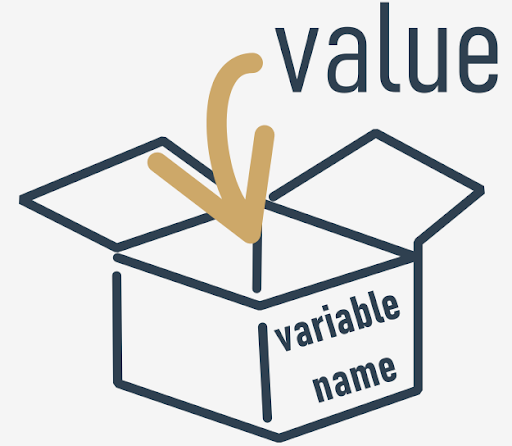

# Variables

Python offers special "boxes" (containers) to **store the results** of any operations, and these boxes are called **variables** - the name itself suggests that the content of these containers can be varied in (almost) any way.

What does every Python variable have?
- a name;
- a value (the content of the container)

If you want to give a name to a variable, you must follow some strict rules:

- the name of the variable must be composed of upper-case or lower-case letters, digits, and the character `_` (underscore)
- the name of the variable must begin with a letter;
- the underscore character is a letter;
- upper- and lower-case letters are treated as different (a little differently than in the real world - _Alice_ and _ALICE_ are the same first names, but in Python they are two different variable names, and consequently, two different variables);
- the name of the variable must not be any of Python's reserved words (the keywords - we'll explain more about this soon).

<p align="center">
  
</p>

### Correct and incorrect variable names
> Note that the same restrictions apply to function names.

Python does not impose restrictions on the length of variable names, but that doesn't mean that a long variable name is always better than a short one.

Here are some correct, but not always convenient variable names:

`MyVariable`, `i`, `t34`, `Exchange_Rate`, `counter`, `days_to_christmas`, `TheNameIsSoLongThatYouWillMakeMistakesWithIt`, `_`.


Moreover, Python lets you use not only Latin letters but also characters specific to languages that use other alphabets.

These variable names are also correct:

`Adiós_Señora`, `sûr_la_mer`, `Einbahnstraße`, `переменная`.

And now for some incorrect names:

`10t` (does not begin with a letter), `Exchange Rate` (contains a space)

> [!NOTE]
>The [PEP 8 -- Style Guide for Python Code](https://peps.python.org/pep-0008/) recommends the following naming convention for variables and functions in Python:
>
> - variable names should be lowercase, with words separated by underscores to improve readability (e.g., `var`, `my_variable`)
> - function names follow the same convention as variable names (e.g., `fun`, `my_function`)
> - it's also possible to use mixed case (e.g., `myVariable`), but only in contexts where that's already the prevailing style, to retain backwards compatibility with the adopted convention.

### Keywords
Take a look at the list of words that play a very special role in every Python program.

```python
['False', 'None', 'True', 'and', 'as', 'assert', 'break', 'class', 'continue', 'def', 'del', 'elif', 'else', 'except', 'finally', 'for', 'from', 'global', 'if', 'import', 'in', 'is', 'lambda', 'nonlocal', 'not', 'or', 'pass', 'raise', 'return', 'try', 'while', 'with', 'yield']
```

They are called **keywords** or (more precisely) **reserved keywords**. They are reserved because **you mustn't use them as names**: neither for your variables, nor functions, nor any other named entities you want to create.

The meaning of the reserved word is **predefined**, and mustn't be changed in any way.

Fortunately, due to the fact that Python is case-sensitive, you can modify any of these words by changing the case of any letter, thus creating a new word, which is not reserved anymore.

For example - **you can't name your** variable like this:
```python
import
```
You mustn't have a variable named in such a way - it is prohibited. But you can do this instead:
```python
Import
```

### Creating variables
**A variable comes into existence as a result of assigning a value to it**. Unlike in other languages, you don't need to declare it in any special way.

If you assign any value to a nonexistent variable, the variable will be **automatically created**. You don't need to do anything else.

The creation (or otherwise - its syntax) is extremely simple: **just use the name of the desired variable, then the equal sign (=) and the value you want to put into the variable**.
```python
var = 1
account_balance = 1000.0
client_name = 'John Doe'
print(var, account_balance, client_name)
```

You're **not allowed to use a variable which doesn't exist** (in other words, a variable that was not assigned a value).

This example will **cause an error**:
```python
var = 1
print(Var)
```

> [!IMPORTANT]
> `var` and `Var` are different entities, and have nothing in common as far as Python's concerned.

The equal sign is in fact an **assignment operator**. Although this may sound strange, the operator has a simple syntax and unambiguous interpretation.

Look at the code below:
```python
var = 1
print(var)
var = var + 1
print(var)
```

## Shortcut operators
Very often, we want to use one and the same variable both to the right and left sides of the `=` operator.

For example, if we need to calculate a series of successive values of powers of 2, we may use a piece like this:
```python
x = x * 2
```
Python offers you a shortened way of writing operations like these, which can be coded as follows:
```python
x *= 2
```

Let's try to present a general description for these operations.

If `op` is a two-argument operator (this is a very important condition) and the operator is used in the following context:
```python
variable = variable op expression
```
It can be simplified and shown as follows:
```python
variable op= expression
```
Take a look at the examples below. Make sure you understand them all.

`i = i + 2 * j` ⇒ `i += 2 * j`

`var = var / 2` ⇒ `var /= 2`

`rem = rem % 10` ⇒ `rem %= 10`

`j = j - (i + var + rem)` ⇒ `j -= (i + var + rem)`

`x = x ** 2` ⇒ `x **= 2`