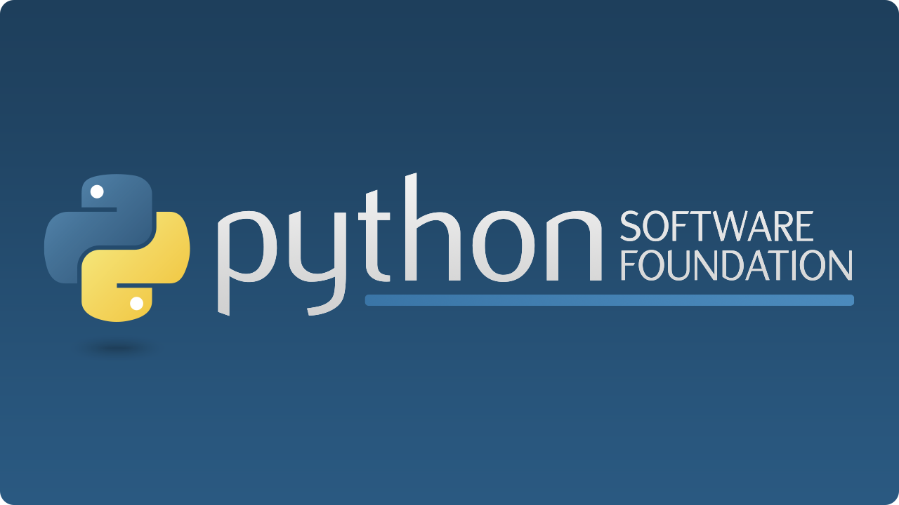
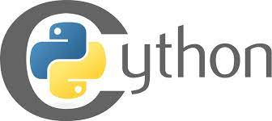
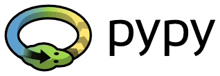
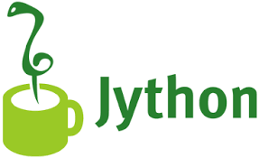

# Introduction to Python

## What is Python?

Python is a widely-used, interpreted, object-oriented, and high-level programming language with dynamic semantics, used for general-purpose programming.

And while you may know the python as a large snake, the name of the Python programming language comes from an old BBC television comedy sketch series called **Monty Python's Flying Circus**.

There are not many languages whose authors are known by name. Python was created by [Guido van Rossum](https://en.wikipedia.org/wiki/Guido_van_Rossum), born in 1956 in Haarlem, the Netherlands. Of course, Guido van Rossum did not develop and evolve all the Python components himself.

> **Linux users most probably have Python already installed** - this is the most likely scenario, as Python's infrastructure is intensively used by many Linux OS components.

**Python goals**

In 1999, Guido van Rossum defined his goals for Python:

- an **easy and intuitive** language just as powerful as those of the major competitors;
- **open source**, so anyone can contribute to its development;
- code that is as **understandable** as plain English;
- **suitable for everyday tasks**, allowing for short development times.

**Python rivals?**

Python has two direct competitors, with comparable properties and predispositions. These are:

- **Perl** – a scripting language originally authored by Larry Wall;
- **Ruby** – a scripting language originally authored by Yukihiro Matsumoto.

**Why not Python?**

Despite Python's growing popularity, there are still some niches where Python is absent, or is rarely seen:

- **low-level programming** (sometimes called "close to metal" programming): if you want to implement an extremely effective driver or graphical engine, you wouldn't use Python;
- **applications for mobile devices**: although this territory is still waiting to be conquered by Python, it will most likely happen someday.

## Versions of Python

### Python aka CPython

The Pythons which are maintained by the people gathered around the PSF ([Python Software Foundation](https://www.python.org/psf-landing/)), a community that aims to develop, improve, expand, and popularize Python and its environment. The PSF's president is Guido von Rossum himself, and for this reason, these Pythons are called **canonical**. They are also considered to be **reference Pythons**, as any other implementation of the language should follow all standards established by the PSF.

Guido van Rossum used the "C" programming language to implement the very first version of his language and this decision is still in force. All Pythons coming from the PSF are written in the "C" language.
- Python may be **easily ported and migrated** to all platforms with the ability to compile and run "C" language programs.

> This is why the PSF implementation is often referred to as **CPython**. This is the most influential Python among all the Pythons in the world.

### Cython

Another Python family member is **Cython**.

Cython is one of a possible number of solutions to the most painful of Python's traits – the lack of efficiency. Large and complex mathematical calculations may be easily coded in Python (much easier than in "C" or any other traditional language), but the resulting code execution may be extremely time-consuming.

How are these two contradictions reconciled? One solution is to write your mathematical ideas using Python, and when you're absolutely sure that your code is correct and produces valid results, you can translate it into "C". Certainly, "C" will run much faster than pure Python.

This is what Cython is intended to do – to automatically translate the Python code (clean and clear, but not too swift) into "C" code (complicated and talkative, but agile).

### PyPy and RPython

It's a logo of the **PyPy** - a Python within a Python. In other words, it represents a Python environment written in Python-like language named **RPython** (Restricted Python). It is actually a subset of Python.

The source code of PyPy is not run in the interpretation manner, but is instead translated into the C programming language and then executed separately.

This is useful because if you want to test any new feature that may be (but doesn't have to be) introduced into mainstream Python implementation, it's easier to check it with PyPy than with CPython. This is why PyPy is rather a tool for people developing Python than for the rest of the users.
> In addition, PyPy is compatible with the Python 3 language.

### Jython

Another version of Python is called **Jython**.

"J" is for "Java". Imagine a Python written in Java instead of C. This is useful, for example, if you develop large and complex systems written entirely in Java and want to add some Python flexibility to them. The traditional CPython may be difficult to integrate into such an environment, as C and Java live in completely different worlds and don't share many common ideas.

Jython can communicate with existing Java infrastructure more effectively. This is why some projects find it useful and necessary.

> Note: the current Jython implementation follows Python 2 standards. There is no Jython conforming to Python 3, so far.
