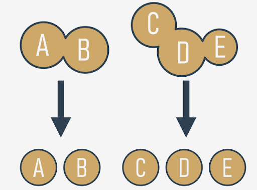
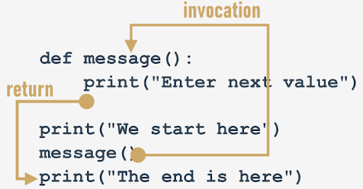

# Functions

### Why do we need functions?
**If a particular fragment of the code begins to appear in more than one place, consider the possibility of isolating it in the form of a function** invoked from the points where the original code was placed before.

It may happen that the algorithm you're going to implement is so complex that your code begins to grow in an uncontrolled manner, and suddenly you notice that you're not able to navigate through it so easily anymore.

You can try to cope with the issue by commenting the code extensively, but soon you find that this dramatically worsens your situation - **too many comments make the code larger and harder to read**. Some say that a **well-written function should be viewed entirely in one glance**.

A good and attentive developer **divides the code** (or more accurately: the problem) into well-isolated pieces, and **encodes each of them in the form of a function**.

This considerably simplifies the work of the program, because each piece of code can be encoded separately, and tested separately. The process described here is often called **decomposition**.

<p align="center">
    
</p>

**If a piece of code becomes so large that reading and understating it may cause a problem, consider dividing it into separate, smaller problems, and implement each of them in the form of a separate function.**

if you're going to divide the work among multiple programmers, **decompose the problem to allow the product to be implemented as a set of separately written functions packed together in different modules**.

### Where do the functions come from?
In general, functions come from at least three places:
- from Python itself - numerous functions (like `print()`) are an **integral part of Python**, and are always available without any additional effort on behalf of the programmer; we call these functions **built-in functions**;
- from Python's **preinstalled modules** - a lot of functions, very useful ones, but used significantly less often than built-in ones, are available in a number of modules installed together with Python; the use of these functions requires some additional steps from the programmer in order to make them fully accessible (we'll tell you about this in a while);
- **directly from your code** - you can write your own functions, place them inside your code, and use them freely;
- there is one other possibility, but it's connected with classes, so we'll omit it for now.

### Your first function
How do you make such a function?

You need to **define** it. The word _define_ is significant here.

This is what the simplest function definition looks like:
```python
def function_name():
    function_body
```
- It always starts with the **keyword** `def` (for _define_)
- next after `def` goes the **name of the function** (the rules for naming functions are exactly the same as for naming variables)
- after the function name, there's a place for a pair of **parentheses** (they contain nothing here, but that will change soon)
- the line has to be ended with a **colon**
- the line directly after `def` begins the **function body** ‒ a couple (at least one) of necessarily **nested instructions**, which will be executed every time the function is invoked; note: the **function ends where the nesting ends**, so you have to be careful.

We're ready to define our **prompting** function. We'll name it `message` ‒ here it is:
```python
def message():
    print("Enter a value: ")

print("We start here.")
print("We end here.")
```
The function is extremely simple, but fully **usable**. We've named it `message`, but you can label it according to your taste. Let's use it.

> [!NOTE]
> We don't use the function at all ‒ there's no **invocation** of it inside the code.

When you run it, you see the following output:
```python
We start here.
We end here.
```
This means that Python reads the function's definitions and remembers them, but won't launch any of them without your permission.

We've inserted the **function's invocation** between the start and end messages:
```python
def message():
    print("Enter a value: ")

print("We start here.")
message()
print("We end here.")
```
The output looks different now:
```python
We start here.
Enter a value: 
We end here.
```
### How functions work

<p align="center">
    
</p>

It tries to show you the whole process:
- when you **invoke** a function, Python remembers the place where it happened and _jumps_ into the invoked function;
- the body of the function is then **executed**;
- reaching the end of the function forces Python to **return** to the place directly after the point of invocation.

There are two, very important, catches. Here's the first of them:

**You mustn't invoke a function which is not known at the moment of invocation.**

> [!IMPORTANT]
> Python reads your code from top to bottom. It's not going to look ahead in order to find a function you forgot to put in the right place ("right" means "before invocation".)

We've inserted an error into this code - can you see the difference?
```python
print("We start here.")
message()
print("We end here.")


def message():
    print("Enter a value: ")
```
We've moved the function to the end of the code. Is Python able to find it when the execution reaches the invocation?

No, it isn't. The error message will read:
```
NameError: name 'message' is not defined
```
Don't try to force Python to look for functions you didn't deliver at the right time.

The second catch sounds a little simpler:

**You mustn't have a function and a variable of the same name.**

The following snippet is erroneous:
```python
def message():
    print("Enter a value: ")

message = 1
```
Assigning a value to the name message causes Python to forget its previous role. The function named `message` becomes unavailable.

Fortunately, you're free to **mix your code with functions** - you're not obliged to put all your functions at the top of your source file.

Look at the snippet:
```python
print("We start here.")


def message():
    print("Enter a value: ")

message()

print("We end here.")
```
It may look strange, but it's completely correct, and works as intended.

Let's return to our primary example, and employ the function for the right job, like here:
```python
def message():
    print("Enter a value: ")

message()
a = int(input())
message()
b = int(input())
message()
c = int(input())
```
Modifying the prompting message is now easy and clear - you can do it by **changing the code in just one place** - inside the function's body.
