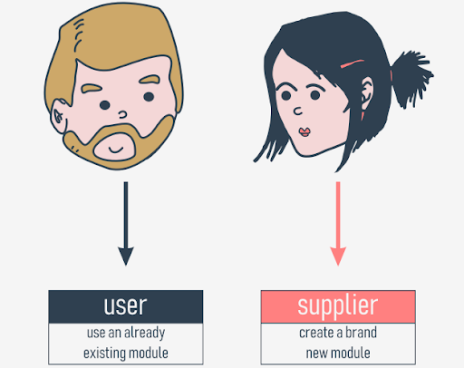
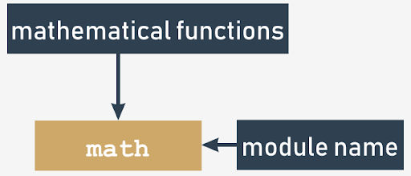
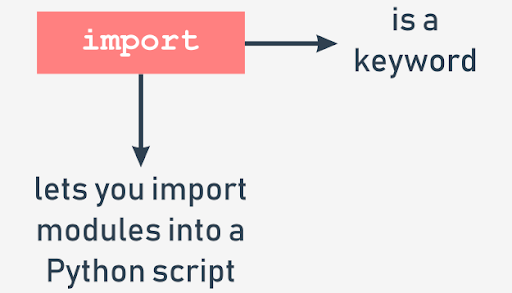
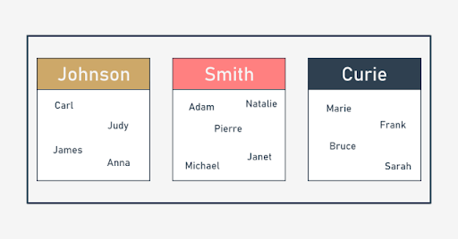

# Modules

## What is a module?
Computer code has a tendency to grow. Growing code is in fact a growing problem. A larger code always means tougher maintenance. Searching for bugs is always easier where the code is smaller (just as finding a mechanical breakage is simpler when the machinery is simpler and smaller).

If you want such a software project to be completed successfully, you have to have the means allowing you to:

- divide all the tasks among the developers;
- join all the created parts into one working whole.

Each of these parts can be (most likely) divided into smaller ones, and so on. Such a process is often called **decomposition**.

### How to make use of a module?
So what is a module? The [Python Tutorial](https://docs.python.org/3/tutorial/modules.html) defines it as **a file containing Python definitions and statements**, which can be later imported and used when necessary.

The handling of modules consists of two different issues:

- the first (probably the most common) happens when you want to use an already existing module, written by someone else, or created by yourself during your work on some complex project - in this case you are the module's **user**;
- the second occurs when you want to create a brand new module, either for your own use, or to make other programmers' lives easier - you are the module's **supplier**.

<p align="center">
    
</p>

First of all, a module is identified by its **name**. If you want to use any module, you need to know the name. Each module consists of entities (like a book consists of chapters). These entities can be functions, variables, constants, classes, and objects. If you know how to access a particular module, you can make use of any of the entities it stores.

<p align="center">
    
</p>

Let's start the discussion with one of the most frequently used modules, named `math`. Its name speaks for itself - the module contains a rich collection of entities (not only functions) which enable a programmer to effectively implement calculations demanding the use of mathematical functions, like `sin()` or `log()`.

## Importing a module
To make a module usable, you must **import** it (think of it like of taking a book off the shelf). Importing a module is done by an instruction named `import`. Note: `import` is also a keyword (with all the consequences of this fact).

<p align="center">
    
</p>

Let's assume that you want to use two entities provided by the `math` module:
- a symbol (constant) representing a precise (as precise as possible using double floating-point arithmetic) value of π (although using a Greek letter to name a variable is fully possible in Python, the symbol is named **pi** - it's a more convenient solution, especially for that part of the world which neither has nor is going to use a Greek keyboard)
- a function named `sin()` (the computer equivalent of the mathematical sine function)

Both these entities are available through the `math` module, but the way in which you can use them strongly depends on how the import has been done.

The simplest way to import a particular module is to use the import instruction as follows:
```python
import math
```
The clause contains:
- the `import` keyword;
- the **name of the module** which is subject to import.

The instruction may be located anywhere in your code, but it must be placed **before the first use of any of the module's entities**.

If you want to (or have to) import more than one module, you can do it by repeating the `import` clause (preferred):
```python
import math
import sys
```
or by listing the modules after the `import` keyword, like here:
```python
import math, sys
```
The instruction imports two modules, first the one named `math` and then the second named `sys`.

The modules' list may be arbitrarily long.

### namespace

A **namespace** is a space (understood in a non-physical context) in which some names exist and the names don't conflict with each other (i.e., there are not two different objects of the same name). We can say that each social group is a namespace - the group tends to name each of its members in a unique way (e.g., parents won't give their children the same first names).

<p align="center">
    
</p>

This uniqueness may be achieved in many ways, e.g., by using nicknames along with the first names (it will work inside a small group like a class in a school) or by assigning special identifiers to all members of the group (the US Social Security Number is a good example of such practice).

**Inside a certain namespace, each name must remain unique.** This may mean that some names may disappear when any other entity of an already known name enters the namespace. We'll show you how it works and how to control it, but first, let's return to imports.

If the module of a specified name **exists and is accessible** (a module is in fact a **Python source file**), Python imports its contents, i.e., **all the names defined in the module become known**, but they don't enter your code's namespace.

This means that you can have your own entities named `sin` or `pi` and they won't be affected by the import in any way.

<p align="center">
    
</p>

At this point, you may be wondering how to access the `pi` coming from the `math` module.

To do this, you have to qualify the `pi` with the name of its original module.
```python
math.pi
math.sin
```
It's simple, you put:
- the **name of the module** (e.g., `math`)
- a **dot** (i.e., `.`)
- the **name of the entity** (e.g., `pi`)

Such a form clearly indicates the namespace in which the name exists.

> [!NOTE]
> Using this qualification is **compulsory** if a module has been imported by the import module instruction. It doesn't matter if any of the names from your code and from the module's namespace are in conflict or not.

### Importing a module
This first example won't be very advanced - we just want to print the value of **sin(½π)**.
```python
import math
print(math.sin(math.pi/2))
```
The code outputs the expected value: `1.0`.

> [!NOTE]
> Removing any of the two qualifications will make the code erroneous. There is no other way to enter math's namespace if you did the following:
>```python
>import math
>```

Now we're going to show you how the two namespaces (yours and the module's one) can coexist.
```python
import math


def sin(x):
    if 2 * x == pi:
        return 0.99999999
    else:
        return None


pi = 3.14

print(sin(pi/2))
print(math.sin(math.pi/2))
```
We've defined our own `pi` and `sin` here.

Run the program. The code should produce the following output:
```
0.99999999
1.0
```

As you can see, the entities don't affect each other.

### Importing a module: `from`
In the second method, the `import`'s syntax precisely points out which module's entity (or entities) are acceptable in the code:
```python
from math import pi
```
The instruction consists of the following elements:
- the `from` keyword;
- the **name of the module** to be (selectively) imported;
- the `import` keyword;
- the **name or list of names of the entity/entities** which are being imported into the namespace.

The instruction has this effect:
- the listed entities (and only those ones) are **imported from the indicated module**;
- the names of the imported entities are **accessible without qualification**.

> [!IMPORTANT]
> No other entities are imported. Moreover, you cannot import additional entities using a qualification - a line like this one:
>
> ```print(math.e)```

will cause an error (`e` is Euler's number: 2.71828...)

Let's rewrite the previous script to incorporate the new technique.

Here it is:
```python
from math import sin, pi

print(sin(pi/2))
```


The output should be the same as previously, as in fact we've used the same entities as before: `1.0`.

```python
from math import sin, pi

print(sin(pi / 2))

pi = 3.14


def sin(x):
    if 2 * x == pi:
        return 0.99999999
    else:
        return None


print(sin(pi / 2))
```
- line 1: carry out the selective import;
- line 3: make use of the imported entities and get the expected result (`1.0`)
- lines 5 through 12: redefine the meaning of `pi` and `sin` - in effect, they supersede the original (imported) definitions within the code's namespace;
- line 15: get `0.99999999`, which confirms our conclusions.

Let's do another test. Look at the code below:
```python
pi = 3.14


def sin(x):
    if 2 * x == pi:
        return 0.99999999
    else:
        return None


print(sin(pi / 2))

from math import sin, pi

print(sin(pi / 2))
```
Here, we've reversed the sequence of the code's operations:
- lines 1 through 8: define our own `pi` and `sin`;
- line 11: make use of them (`0.99999999` appears on the screen)
- line 13: carry out the import - the imported symbols **supersede their previous definitions within the namespace**;
- line 15: get `1.0` as a result.

### Importing a module: *
In the third method, the `import`'s syntax is a more aggressive form of the previously presented one:
```python
from module import *
```
As you can see, the name of an entity (or the list of entities' names) is replaced with a single asterisk (`*`).

Such an instruction **imports all entities from the indicated module**.

Is it convenient? Yes, it is, as it relieves you of the duty of enumerating all the names you need.

Is it unsafe? Yes, it is - unless you know all the names provided by the module, **you may not be able to avoid name conflicts**. Treat this as a temporary solution, and try not to use it in regular code.


### Importing a module: the as keyword
If you use the import module variant and you don't like a particular module's name (e.g., it's the same as one of your already defined entities, so qualification becomes troublesome) you can give it any name you like - this is called **aliasing**.

Aliasing causes the module to be identified under a different name than the original. This may shorten the qualified names, too.

Creating an alias is done together with importing the module, and demands the following form of the import instruction:
```python
import module as alias
```
The "module" identifies the original module's name while the "alias" is the name you wish to use instead of the original.

Note: `as` is a keyword.

If you need to change the word `math`, you can introduce your own name, just like in the example:
```python
import math as m

print(m.sin(m.pi/2))
```
> [!WARNING]
>After successful execution of an aliased import, the **original module name becomes inaccessible** and must not be used.

In turn, when you use the `from module import name` variant and you need to change the entity's name, you make an alias for the entity. This will cause the name to be replaced by the alias you choose.

This is how it can be done:
```python
from module import name as alias
```
As previously, the original (unaliased) name becomes inaccessible.

The phrase `name as alias` can be repeated - use commas to separate the multiplied phrases, like this:
```python
from module import n as a, m as b, o as c
```
The example may look a bit weird, but it works:
```python
from math import pi as PI, sin as sine

print(sine(PI/2))
```