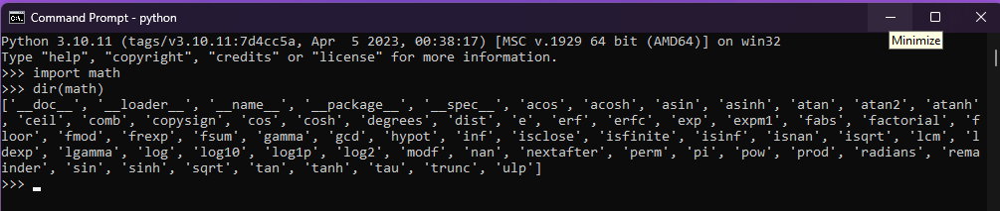
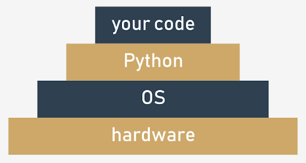

# Standard modules

## Working with standard modules

Before we start going through some standard Python modules, we want to introduce the `dir()` function to you. It has nothing to do with the `dir` command you know from Windows and Unix consoles, as `dir()` doesn't show the contents of a disk directory/folder, but there is no denying that it does something really similar - it is able to reveal all the names provided through a particular module.

There is one condition: the module has to have been previously imported as a whole (i.e., using the `import module` instruction - `from module` is not enough).

The function returns an **alphabetically sorted list** containing all entities' names available in the module identified by a name passed to the function as an argument:
```python
dir(module)
```
> [!NOTE]
> If the module's name has been aliased, you must use the alias, not the original name.

Using the function inside a regular script doesn't make much sense, but it is still possible.

For example, you can run the following code to print the names of all entities within the `math` module:
```python
import math

for name in dir(math):
    print(name, end="\t")
```
The example code should produce the following output:
```python
__doc__     __loader__	    __name__	__package__	    __spec__	acos	acosh	asin
asinh	atan	atan2	atanh	ceil	copysign	cos	cosh	degrees	e	erf	
erfc	exp	expm1	fabs	factorial	floor	fmod	frexp	fsum	gamma	hypot	
isfinite	isinf	isnan	ldexp	lgamma	log	log10	log1p	log2	modf	pi
pow	radians	sin	sinh	sqrt	tan	tanh	trunc
```
Using the `dir()` function inside a code may not seem very useful - usually you want to know a particular module's contents before you write and run the code.

Fortunately, you can execute the function **directly in the Python console** (IDLE), without needing to write and run a separate script.

This is how it can be done:
```python
import math
dir(math)
```
You should see something similar to this:
<p align="center">
    
</p>

### Selected functions from the `math` module
The first group of the `math`'s functions are connected with **trigonometry**:
- `sin(x)` → the sine of x;
- `cos(x)` → the cosine of x;
- `tan(x)` → the tangent of x.

All these functions take one argument (an angle measurement expressed in radians) and return the appropriate result (be careful with `tan()` - not all arguments are accepted).

Of course, there are also their inversed versions:
- `asin(x)` → the arcsine of x;
- `acos(x)` → the arccosine of x;
- `atan(x)` → the arctangent of x.

These functions take one argument (mind the domains) and return a measure of an angle in radians.

To effectively operate on angle measurements, the `math` module provides you with the following entities:
- `pi` → a constant with a value that is an approximation of π;
- `radians(x)` → a function that converts x from degrees to radians;
- `degrees(x)` → acting in the other direction (from radians to degrees)

Apart from the circular functions (listed above) the `math` module also contains a set of their **hyperbolic analogues**:
- `sinh(x)` → the hyperbolic sine;
- `cosh(x)` → the hyperbolic cosine;
- `tanh(x)` → the hyperbolic tangent;
- `asinh(x)` → the hyperbolic arcsine;
- `acosh(x)` → the hyperbolic arccosine;
- `atanh(x)` → the hyperbolic arctangent.

Another group of the `math`'s functions is formed by functions which are connected with **exponentiation**:
- `e` → a constant with a value that is an approximation of Euler's number (e)
- `exp(x)` → finding the value of e<sup>x</sup>;
- `log(x)` → the natural logarithm of x
- `log(x, b)` → the logarithm of x to base b
- `log10(x)` → the decimal logarithm of x (more precise than `log(x, 10)`)
- `log2(x)` → the binary logarithm of x (more precise than `log(x, 2)`)

Note: the `pow()` function:
- `pow(x, y)` → finding the value of x<sup>y</sup> (mind the domains)
- This is a built-in function, and doesn't have to be imported.

The last group consists of some general-purpose functions like:
- `ceil(x)` → the ceiling of x (the smallest integer greater than or equal to x)
- `floor(x)` → the floor of x (the largest integer less than or equal to x)
- `trunc(x)` → the value of x truncated to an integer (be careful - it's not an equivalent either of ceil or floor)
- `factorial(x)` → returns x! (x has to be an integral and not a negative)
- `hypot(x, y)` → returns the length of the hypotenuse of a right-angle triangle with the leg lengths equal to x and y (the same as sqrt(pow(x, 2) + pow(y, 2)) but more precise)
```python
from math import ceil, floor, trunc

x = 1.4
y = 2.6

print(floor(x), floor(y))
print(floor(-x), floor(-y))
print(ceil(x), ceil(y))
print(ceil(-x), ceil(-y))
print(trunc(x), trunc(y))
print(trunc(-x), trunc(-y))
```
It demonstrates the fundamental differences between `ceil()`, `floor()` and `trunc()`.

## Is there real randomness in computers?
Another module worth mentioning is the one named `random`.

It delivers some mechanisms allowing you to operate with **pseudorandom numbers**.

Note the prefix **pseudo** - the numbers generated by the modules may look random in the sense that you cannot predict their subsequent values, but don't forget that they all are calculated using very refined algorithms.

The algorithms aren't random - they are deterministic and predictable. Only those physical processes which run completely out of our control (like the intensity of cosmic radiation) may be used as a source of actual random data. Data produced by deterministic computers cannot be random in any way.

<p align="center">
    
</p>

A random number generator takes a value called a **seed**, treats it as an input value, calculates a "random" number based on it (the method depends on a chosen algorithm) and produces a **new seed value**.

The length of a cycle in which all seed values are unique may be very long, but it isn't infinite - sooner or later the seed values will start repeating, and the generating values will repeat, too. This is normal. It's a feature, not a mistake, or a bug.

The initial seed value, set during the program start, determines the order in which the generated values will appear.

The random factor of the process may be **augmented by setting the seed with a number taken from the current time** - this may ensure that each program launch will start from a different seed value (ergo, it will use different random numbers).

### Selected functions from the `random` module
#### The random function
The most general function named `random()` (not to be confused with the module's name) **produces a float number `x` coming from the range `(0.0, 1.0)`** - in other words: (0.0 <= x < 1.0).

The example program below will produce five pseudorandom values - as their values are determined by the current (rather unpredictable) seed value, you can't guess them:
```python
from random import random

for i in range(5):
    print(random())
```
Run the program. This is what we've got:
```
0.9535768927411208
0.5312710096244534
0.8737691983477731
0.5896799172452125
0.02116716297022092
```
#### The seed function
The `seed()` function is able to directly **set the generator's seed**. We'll show you two of its variants:
- `seed()` - sets the seed with the current time;
- `seed(int_value)` - sets the seed with the integer value `int_value`.
We've modified the previous program - in effect, we've removed any trace of randomness from the code:
```python
from random import random, seed

seed(0)

for i in range(5):
    print(random())
```
Due to the fact that the seed is always set with the same value, the sequence of generated values always looks the same.

Run the program. This is what we've got:
```
0.8444218515250481
0.7579544029403025
0.420571580830845
0.25891675029296335
0.5112747213686085
```
And you?

Note: your values may be slightly different than ours if your system uses more precise or less precise floating-point arithmetic, but the difference will be seen quite far from the decimal point.

#### The randrange and randint functions
If you want integer random values, one of the following functions would fit better:
- `randrange(end)`
- `randrange(beg, end)`
- `randrange(beg, end, step)`
- `randint(left, right)`

The first three invocations will generate an integer taken (pseudorandomly) from the range (respectively):
- range(end)
- range(beg, end)
- range(beg, end, step)

Note the implicit **right-sided exclusion!**

The last function is an equivalent of `randrange(left, right+1)` - it generates the integer value `i`, which falls in the range [left, right] (no exclusion on the right side).

The previous functions have one important disadvantage - they may produce repeating values even if the number of subsequent invocations is not greater than the width of the specified range.

Look at the code below - the program very likely outputs a set of numbers in which some elements are not unique:
```python
from random import randint

for i in range(10):
    print(randint(1, 10), end=',')
```
This is what we got in one of the launches:
```
9,4,5,4,5,8,9,4,8,4,
```
#### The choice and sample functions
As you can see, this is not a good tool for generating numbers in a lottery. Fortunately, there is a better solution than writing your own code to check the uniqueness of the "drawn" numbers.

It's a function named in a very suggestive way - `choice`:
- `choice(sequence)`
- `sample(sequence, elements_to_choose)`

The first variant chooses a "random" element from the input sequence and returns it.

The second one builds a list (a sample) consisting of the `elements_to_choose` element "drawn" from the input sequence.

In other words, the function chooses some of the input elements, returning a list with the choice. The elements in the sample are placed in random order.

> [!WARNING]
> The `elements_to_choose` must not be greater than the length of the input sequence.

Look at the code below:
```python
from random import choice, sample

my_list = [1, 2, 3, 4, 5, 6, 7, 8, 9, 10]

print(choice(my_list))
print(sample(my_list, 5))
print(sample(my_list, 10))
```
Again, the output of the program is not predictable. Our results looked like this:
```
4
[3, 1, 8, 9, 10]
[10, 8, 5, 1, 6, 4, 3, 9, 7, 2]
```

## How to know where you are?
Sometimes, it may be necessary to find out information unrelated to Python. For example, you may need to know the location of your program within the greater environment of the computer.

Imagine your program's environment as a pyramid consisting of a number of layers or platforms.

<p align="center">
    
</p>

This means that some of your (or rather your program's) actions have to travel a long way to be successfully performed – imagine that:
- **your code** wants to create a file, so it invokes one of Python's functions;
- **Python** accepts the order, rearranges it to meet local OS requirements, which is like putting the stamp "approved" on your request, and sends it down (this may remind you of a chain of command)
- the **OS** checks if the request is reasonable and valid (e.g., whether the file name conforms to some syntax rules) and tries to create the file; such an operation, seemingly very simple, isn't atomic – it consists of many minor steps taken by...
- the **hardware**, which is responsible for activating storage devices (hard disk, solid state devices, etc.) to satisfy the OS's needs.

But sometimes you want to know more – for example, the name of the OS which hosts Python, and some characteristics describing the hardware that hosts the OS.

There is a module providing some means to allow you to know where you are and what components work for you. The module is named **platform**. We'll show you some of the functions it provides to you.

#### The platform function
The `platform` module lets you access the underlying platform's data, i.e., hardware, operating system, and interpreter version information.

There is a function that can show you all the underlying layers in one glance, named `platform`, too. It just returns a string describing the environment; thus, its output is rather addressed to humans than to automated processing.

This is how you can invoke it:
```python
platform(aliased = False, terse = False)
```
And now:
- `aliased` → when set to `True` (or any non-zero value) it may cause the function to present the alternative underlying layer names instead of the common ones;
- `terse` → when set to `True` (or any non-zero value) it may convince the function to present a briefer form of the result (if possible)

```python
from platform import platform

print(platform())
print(platform(1))
print(platform(0, 1))
```

**Intel x86 + Windows ® Vista (32 bit):**
```
Windows-Vista-6.0.6002-SP2
Windows-Vista-6.0.6002-SP2
Windows-Vista
```
**Intel x86 + Gentoo Linux (64 bit):**
```
Linux-3.18.62-g6-x86_64-Intel-R-_Core-TM-_i3-2330M_CPU_@_2.20GHz-with-gentoo-2.3
Linux-3.18.62-g6-x86_64-Intel-R-_Core-TM-_i3-2330M_CPU_@_2.20GHz-with-gentoo-2.3
Linux-3.18.62-g6-x86_64-Intel-R-_Core-TM-_i3-2330M_CPU_@_2.20GHz-with-glibc2.3.4
```
**Raspberry PI2 + Raspbian Linux (32 bit):**
```
Linux-4.4.0-1-rpi2-armv7l-with-debian-9.0
Linux-4.4.0-1-rpi2-armv7l-with-debian-9.0
Linux-4.4.0-1-rpi2-armv7l-with-glibc2.9
```

#### The machine function
Sometimes, you may just want to know the generic name of the processor which runs your OS together with Python and your code - a function named `machine()` will tell you that. As previously, the function returns a string.

```python
from platform import machine

print(machine())
```
**Intel x86 + Windows ® Vista (32 bit):**
```
x86
```
**Intel x86 + Gentoo Linux (64 bit):**
```
x86_64
```
**Raspberry PI2 + Raspbian Linux (32 bit):**
```
armv7l
```
#### The processor function
The `processor()` function returns a string filled with the real processor name (if possible).
```python
from platform import processor

print(processor())
```
**Intel x86 + Windows ® Vista (32 bit):**
```
x86
```
**Intel x86 + Gentoo Linux (64 bit):**
```
Intel(R) Core(TM) i3-2330M CPU @ 2.20GHz
```
**Raspberry PI2 + Raspbian Linux (32 bit):**
```
armv7l
```
#### The system function
A function named `system()` returns the generic OS name as a string.
```python
from platform import system

print(system())
```
**Intel x86 + Windows ® Vista (32 bit):**
```
Windows
```
**Intel x86 + Gentoo Linux (64 bit):**
```
Linux
```
**Raspberry PI2 + Raspbian Linux (32 bit):**
```
Linux
```
#### The version function
The OS version is provided as a string by the `version()` function.
```python
from platform import version

print(version())
```
**Intel x86 + Windows ® Vista (32 bit):**
```
6.0.6002
```
**Intel x86 + Gentoo Linux (64 bit):**
```
#1 SMP PREEMPT Fri Jul 21 22:44:37 CEST 2017
```
**Raspberry PI2 + Raspbian Linux (32 bit):**
```
#1 SMP Debian 4.4.6-1+rpi14 (2016-05-05)
```
#### The python_implementation and the python_version_tuple functions
If you need to know what version of Python is running your code, you can check it using a number of dedicated functions - here are two of them:
- `python_implementation()` → returns a string denoting the Python implementation (expect `CPython` here, unless you decide to use any non-canonical Python branch)
- `python_version_tuple()` → returns a three-element tuple filled with:
  - the **major** part of Python's version;
  - the **minor** part;
  - the **patch** level number.

```python
from platform import python_implementation, python_version_tuple

print(python_implementation())

for atr in python_version_tuple():
    print(atr)
```
Our example program produced the following output:
```
CPython
3
10
11
```
