# Packages

## What is a package?
Writing your own modules doesn't differ much from writing ordinary scripts.

There are some specific aspects you must be aware of, but it definitely isn't rocket science. You'll see this soon enough.

<p align="center">
    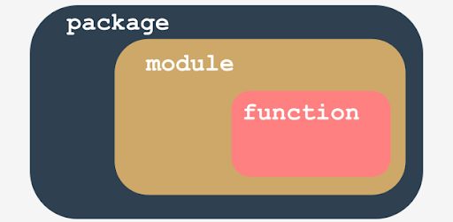
</p>

Let's summarize some important issues:
- a **module is a kind of container filled with functions** - you can pack as many functions as you want into one module and distribute it across the world;
- of course, it's generally a good idea not to mix functions with different application areas within one module (just like in a library - nobody expects scientific works to be put among comic books), so group your functions carefully and name the module containing them in a clear and intuitive way (e.g., don't give the name `arcade_games` to a module containing functions intended to partition and format hard disks)
- making many modules may cause a little mess - sooner or later you'll want to **group your modules** exactly in the same way as you've previously grouped functions - is there a more general container than a module?
- yes, there is - it's a **package**; in the world of modules, a package plays a similar role to a folder/directory in the world of files.

### Your first module
#### Step 1
In this section you're going to be working locally on your machine. Let's start from scratch. Create an empty file, just like this:

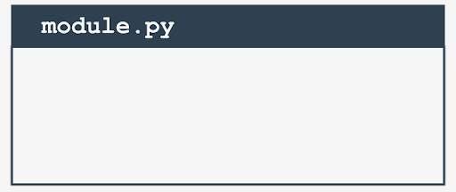

module.py
```python


```
You will need two files to repeat these experiments. The first of them will be the module itself. It's empty now. Don't worry, you're going to fill it with actual code soon.

We've named the file `module.py`. Not very creative, but simple and clear.
#### Step 2
The second file contains the code using the new module. Its name is `main.py`. Its content is very brief so far:

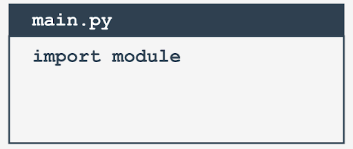

main.py
```python
import module

```

> [!NOTE]
> **Both files have to be located in the same folder**. We strongly encourage you to create an empty, new folder for both files. Some things will be easier then.
 
Launch IDLE (or any other IDE you prefer) and run the `main.py` file. What do you see?

You should see nothing. This means that Python has successfully imported the contents of the `module.py` file.

It doesn't matter that the module is empty for now. The very first step has been done, but before you take the next step, we want you to take a look into the folder in which both files exist.

Do you notice something interesting?

A new subfolder has appeared - can you see it? Its name is `__pycache__`. Take a look inside. What do you see?

There is a file named (more or less) `module.cpython-xy.pyc` where `x` and `y` are digits derived from your version of Python (e.g., they will be 3 and 8 if you use Python 3.8).

The name of the file is the same as your module's name (module here). The part after the first dot says which Python implementation has created the file (`CPython` here) and its version number. The last part (`pyc`) comes from the words _Python_ and _compiled_.

You can look inside the file - the content is completely unreadable to humans. It has to be like that, as the file is intended for Python's use only.

When Python imports a module for the first time, it translates its contents into a somewhat compiled shape.

The file doesn't contain machine code - it's internal Python **semi-compiled code**, ready to be executed by Python's interpreter. As such a file doesn't require lots of the checks needed for a pure source file, the execution starts faster, and runs faster, too.

Thanks to that, every subsequent import will go quicker than interpreting the source text from scratch.

Python is able to check if the module's source file has been modified (in this case, the `pyc` file will be rebuilt) or not (when the `pyc` file may be run at once). As this process is fully automatic and transparent, you don't have to keep it in mind.

#### Step 3
Now we've put a little something into the module file:

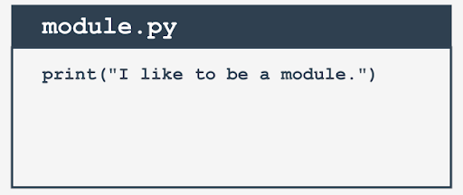

module.py
```python
print("I like to be a module.")

```
Can you notice any differences between a module and an ordinary script? There are none so far.

It's possible to run this file like any other script. Try it for yourself.

What happens? You should see the following line inside your console:
```
I like to be a module.
```

#### Step 4
Let's go back to the `main.py` file:


main.py
```python
import module

```
Run it. What do you see? Hopefully, you see something like this:
```
I like to be a module.
```
What does it actually mean?

When a module is imported, its content is **implicitly executed by Python**. It gives the module the chance to initialize some of its internal aspects (e.g., it may assign some variables with useful values).

> [!NOTE]
> The initialization takes place only once, when the first import occurs, so the assignments done by the module aren't repeated unnecessarily.

Imagine the following context:
- there is a module named `mod1`;
- there is a module named `mod2` which contains the `import mod1` instruction;
- there is a main file containing the `import mod1` and `import mod2` instructions.

At first glance, you may think that `mod1` will be imported twice - fortunately, **only the first import occurs**. Python remembers the imported modules and silently omits all subsequent imports.

#### Step 5
Python can do much more. It also creates a variable called `__name__`.

Moreover, each source file uses its own, separate version of the variable - it isn't shared between modules.

We'll show you how to use it. Modify the module a bit:

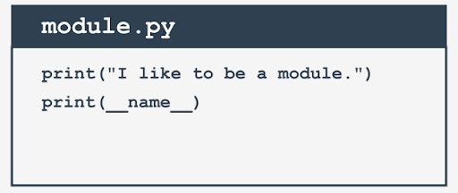

module.py
```python
print("I like to be a module.")
print(__name__)

```
Now run the `module.py` file. You should see the following lines:
```
I like to be a module
__main__
```
Now run the main.py file. And? Do you see the same as us?
```
I like to be a module
module
```
We can say that:
- when you run a file directly, its `__name__` variable is set to `__main__`;
- when a file is imported as a module, its `__name__` variable is set to the file's name (excluding .py)

#### Step 6
This is how you can make use of the `__main__` variable in order to detect the context in which your code has been activated:

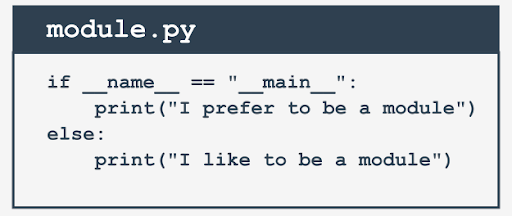

module.py
```python
if __name__ == "__main__":
    print("I prefer to be a module.")
else:
    print("I like to be a module.")
```
There's a cleverer way to utilize the variable, however. If you write a module filled with a number of complex functions, you can use it to place a series of tests to check if the functions work properly.

Each time you modify any of these functions, you can simply run the module to make sure that your amendments didn't spoil the code. These tests will be omitted when the code is imported as a module.

#### Step 7
This module will contain two simple functions, and if you want to know how many times the functions have been invoked, you need a counter initialized to zero when the module is being imported.

You can do it this way:

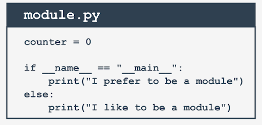

module.py
```python
counter = 0

if __name__ == "__main__":
    print("I prefer to be a module.")
else:
    print("I like to be a module.")

```

#### Step 8
Introducing such a variable is absolutely correct, but may cause important **side effects** that you must be aware of.

Take a look at the modified `main.py` file:

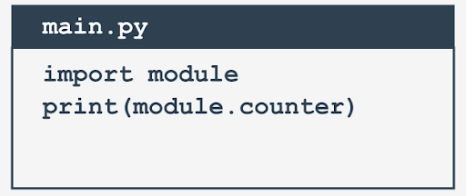

main.py
```python
import module
print(module.counter)

```
As you can see, the main file tries to access the module's counter variable. Is this legal? Yes, it is. Is it usable? It may be very usable. Is it safe?

That depends - if you trust your module's users, there's no problem; however, you may not want the rest of the world to see your **personal/private variable**.

Unlike many other programming languages, Python has no means of allowing you to hide such variables from the eyes of the module's users.

You can only inform your users that this is your variable, that they may read it, but that they should not modify it under any circumstances.

This is done by preceding the variable's name with `_` (one underscore) or `__` (two underscores), but remember, it's only a **convention**. Your module's users may obey it or they may not.

Of course, we'll follow the convention. Now let's put two functions into the module - they'll evaluate the sum and product of the numbers collected in a list.

In addition, let's add some ornaments there and remove any superfluous remnants.

#### Step 9
Okay. Let's write some brand new code in our `module.py` file. The updated module is ready here:
```python
#!/usr/bin/env python3 

""" module.py - an example of a Python module """

__counter = 0


def suml(the_list):
    global __counter
    __counter += 1
    the_sum = 0
    for element in the_list:
        the_sum += element
    return the_sum


def prodl(the_list):
    global __counter    
    __counter += 1
    prod = 1
    for element in the_list:
        prod *= element
    return prod


if __name__ == "__main__":
    print("I prefer to be a module, but I can do some tests for you.")
    my_list = [i+1 for i in range(5)]
    print(suml(my_list) == 15)
    print(prodl(my_list) == 120)

```
A few elements need some explanation, we think:
- the line starting with `#!` has many names - it may be called _shabang, shebang, hashbang, poundbang_ or even _hashpling_ (don't ask us why). The name itself means nothing here - its role is more important. From Python's point of view, it's just a **comment** as it starts with `#`. For Unix and Unix-like OSs (including MacOS) such a line **instructs the OS how to execute the contents of the file** (in other words, what program needs to be launched to interpret the text). In some environments (especially those connected with web servers) the absence of that line will cause trouble;
- a string (maybe a multiline) placed before any module instructions (including imports) is called the **doc-string**, and should briefly explain the purpose and contents of the module;
- the functions defined inside the module (`suml()` and `prodl()`) are available for import;
- we've used the `__name__` variable to detect when the file is run stand-alone, and seized this opportunity to perform some simple tests.

#### Step 10
Now it's possible to use the updated module - this is one way:

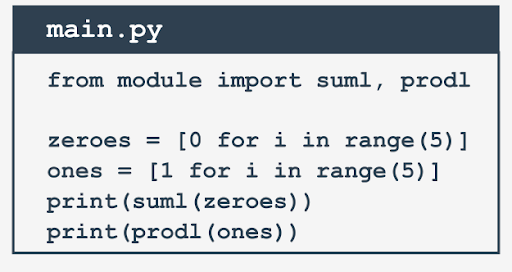

main.py
```python
from module import suml, prodl

zeroes = [0 for i in range(5)]
ones = [1 for i in range(5)]
print(suml(zeroes))
print(prodl(ones))

```

#### Step 11
It's time to make our example more complicated - so far we've assumed that the main Python file is located in the same folder/directory as the module to be imported.

Let's give up this assumption and conduct the following thought experiment:
- we are using Windows ® OS (this assumption is important, as the file name's shape depends on it)
- the main Python script lies in `C:\Users\user\py\progs` and is named `main.py`
- the module to import is located in `C:\Users\user\py\modules`

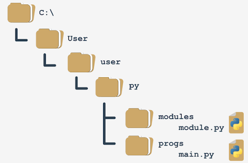

How to deal with it?

To answer this question, we have to talk about how **Python searches for modules**. There's a special variable (actually a list) storing all locations (folders/directories) that are searched in order to find a module which has been requested by the import instruction.

Python browses these folders in the order in which they are listed in the list - if the module cannot be found in any of these directories, the import fails.

Otherwise, the first folder containing a module with the desired name will be taken into consideration (if any of the remaining folders contains a module of that name, it will be ignored).

The variable is named `path`, and it's accessible through the module named `sys`. This is how you can check its regular value:
```python
import sys

for p in sys.path:
    print(p)
```
We've launched the code inside the C:\User\user folder, and this is what we've got:
```
C:\Users\user
C:\Users\user\AppData\Local\Programs\Python\Python36-32\python36.zip
C:\Users\user\AppData\Local\Programs\Python\Python36-32\DLLs
C:\Users\user\AppData\Local\Programs\Python\Python36-32\lib
C:\Users\user\AppData\Local\Programs\Python\Python36-32
C:\Users\user\AppData\Local\Programs\Python\Python36-32\lib\site-packages
```

> [!NOTE]
> The folder in which the execution starts is listed in the **first path's element**.
>
> There is a zip file listed as one of the path's elements - it's not an error. Python is able to treat zip files as ordinary folders - this can save lots of storage.

Can you figure out how we can solve our problem now? We can add a folder containing the module to the path variable (it's fully modifiable).

#### Step 12
One of several possible solutions looks like this:

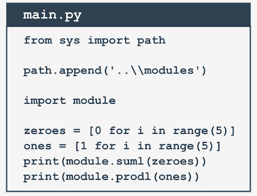

main.py
```python
from sys import path

path.append('..\\modules')

import module

zeroes = [0 for i in range(5)]
ones = [1 for i in range(5)]
print(module.suml(zeroes))
print(module.prodl(ones))

```
Note:
- we've doubled the \ inside folder name - do you know why?
  - Because a backslash is used to escape other characters - if you want to get just a backslash, you have to escape it.
- we've used the relative name of the folder - this will work if you start the `main.py` file directly from its home folder, and won't work if the current directory doesn't fit the relative path; you can always use an absolute path, like this:
  ```python
  path.append('C:\\Users\\user\\py\\modules')
  ```
- we've used the `append()` method - in effect, the new path will occupy the last element in the path list; if you don't like the idea, you can use `insert()` instead.

### Your first package
#### Step 1
Imagine that in the not-so-distant future you and your associates write a large number of Python functions.

Your team decides to group the functions in separate modules, and this is the final result of the ordering:

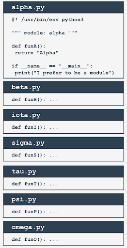

alpha.py
```python
#! /usr/bin/env python3

""" module: alpha """

def funA():
    return "Alpha"

if __name__ == "__main__":
    print("I prefer to be a module.")

```
Note: we've presented the whole content for the `alpha.py` module only - assume that all the modules look similar (they contain one function named `funX`, where X is the first letter of the module's name).

#### Step 2
Suddenly, somebody notices that these modules form their own hierarchy, so putting them all in a flat structure won't be a good idea.

After some discussion, the team comes to the conclusion that the modules have to be grouped. All participants agree that the following tree structure perfectly reflects the mutual relationships between the modules:

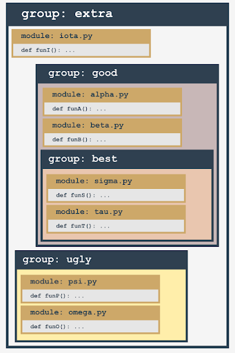

Let's review this from the bottom up:
- the ugly group contains two modules: psi and omega;
- the best group contains two modules: sigma and tau;
- the good group contains two modules (alpha and beta) and one subgroup (best)
- the extra group contains two subgroups (good and bad) and one module (iota)

Does it look bad? Not at all - analyze the structure carefully. It resembles something, doesn't it?

It looks like a **directory structure**.

Let's build a tree reflecting projected dependencies between the modules.

### Step 3
This is how the tree currently looks:

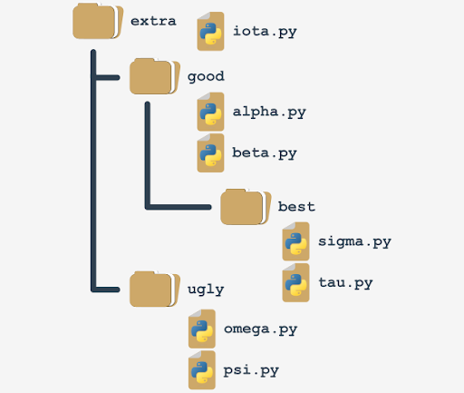

Such a structure is almost a package (in the Python sense). It lacks the fine detail to be both functional and operative. We'll complete it in a moment.

If you assume that extra is the name of a **newly created package** (think of it as the **package's root**), it will impose a naming rule which allows you to clearly name every entity from the tree.

For example:
- the location of a function named `funT()` from the tau package may be described as:
  ```python
  extra.good.best.tau.funT()
  ```
- a function marked as:
  ```python
  extra.ugly.psi.funP()
  ```
  comes from the _psi_ module being stored in the _ugly_ subpackage of the _extra_ package.

#### Step 4
There are two questions to answer:
- **how** do you transform such a tree (actually, a subtree) into a real Python **package** (in other words, how do you convince Python that such a tree is not just a bunch of junk files, but a set of modules)?
- **where** do you put the subtree to make it accessible to Python?

The first question has a surprising answer: packages, **like modules, may require initialization**.

The initialization of a module is done by an _unbound_ code (not a part of any function) located inside the module's file. As a package is not a file, this technique is useless for initializing packages.

You need to use a different trick instead - Python expects that there is a file with a very unique name inside the package's folder: `__init__.py`.

The content of the file is executed when any of the package's modules is **imported**. If you don't want any special initializations, you can leave the file empty, but you mustn't omit it.

#### Step 5
Remember: **the presence of the `__init__.py` file finally makes up the package.**

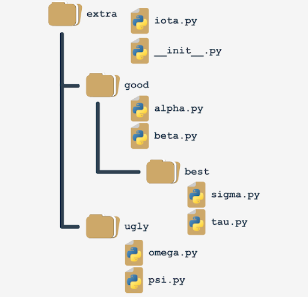

Note: it's not only the root folder that can contain `__init__.py` file - you can put it inside any of its subfolders (subpackages) too. It may be useful if some of the subpackages require individual treatment and special kinds of initialization.

Now it's time to answer the second question - the answer is simple: **anywhere**. You only have to ensure that Python is aware of the package's location. You already know how to do that.

You're ready to make use of your first package.

#### Step 6
Let's assume that the working environment looks as follows:

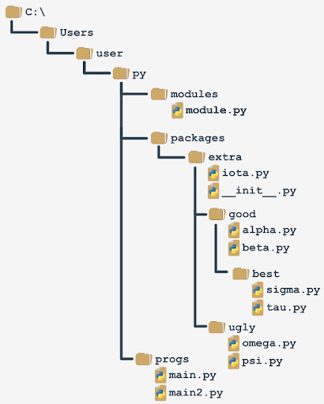

We've prepared a zip file containing all the files from the packages branch. You can download it and use it for your own experiments, but **remember to unpack it in the folder presented in the scheme**, otherwise, it won't be accessible to the code from the main file.

[Modules and Packages ZIP file](https://drive.google.com/file/d/1XFFuIq6o2gxgVzm8A72s309hAPbyU4e8/view?usp=sharing)

You'll be continuing your experiments using the _main2.py_ file.

#### Step 7
We are going to access the `funI()` function from the _iota_ module from the top of the _extra_ package. It forces us to use qualified package names (associate this with naming folders and subfolders - the conventions are very similar).

This is how to do it:

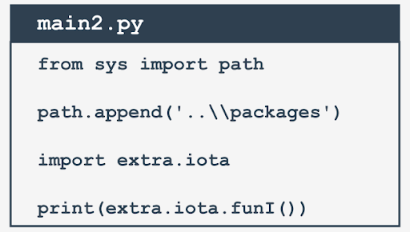

main2.py
```python
from sys import path
path.append('..\\packages')

import extra.iota
print(extra.iota.funI())

```
Note:
- we've modified the `path` variable to make it accessible to Python;
- the `import` doesn't point directly to the module, but specifies the fully qualified path from the top of the package;

> [!WARNING]
> Replacing `import extra.iota` with `import iota` will cause an error.

The following variant is valid too:

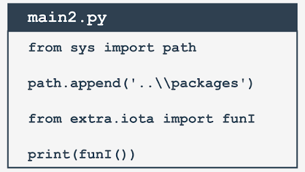

main2.py
```python
from sys import path
path.append('..\\packages')

from extra.iota import funI
print(funI())

```
Note the qualified name of the _iota_ module.

#### Step 8
Now let's reach all the way to the bottom of the tree - this is how to get access to the sigma and tau modules:

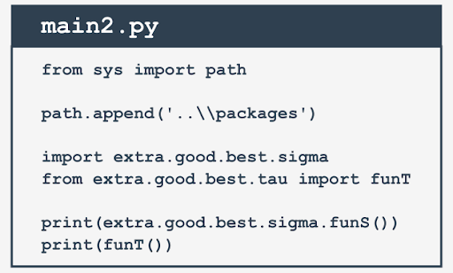

main2.py
```python
from sys import path

path.append('..\\packages')

import extra.good.best.sigma
from extra.good.best.tau import funT

print(extra.good.best.sigma.funS())
print(funT())

```

You can make your life easier by using aliasing:

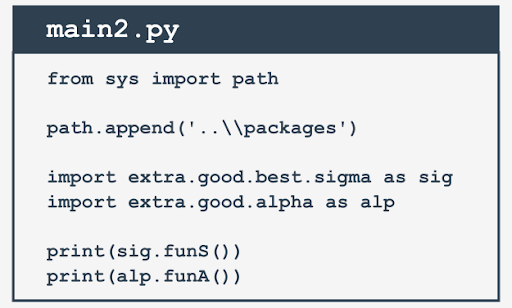

main2.py
```python
from sys import path

path.append('..\\packages')

import extra.good.best.sigma as sig
import extra.good.alpha as alp

print(sig.funS())
print(alp.funA())

```

#### Step 9
Let's assume that we've zipped the whole subdirectory, starting from the _extra_ folder (including it), and let's get a file named _extrapack.zip_. Next, we put the file inside the _packages_ folder.

Now we are able to use the zip file in a role of packages:

main2.py
```python
from sys import path

path.append('..\\packages\\extrapack.zip')

import extra.good.best.sigma as sig
import extra.good.alpha as alp
from extra.iota import funI
from extra.good.beta import funB

print(sig.funS())
print(alp.funA())
print(funI())
print(funB())

```
If you want to conduct your own experiments with the package we've created, you can download it below. We encourage you to do so.

[Extrapack ZIP file](https://drive.google.com/file/d/1tNpDlnD-b8Pfbg3nVoPMZu442-4PyxpD/view?usp=drive_link)

Now you can create modules and combine them into packages. It's time to start a completely different discussion - about errors, failures and crashes.
