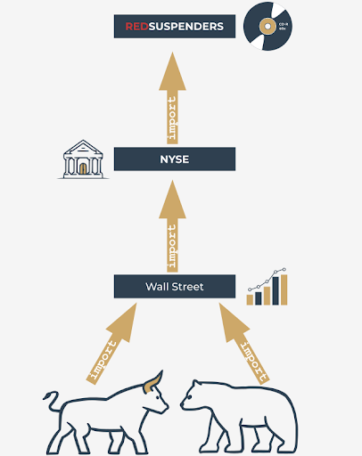
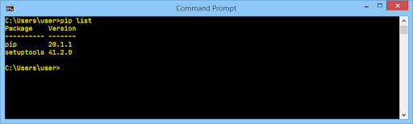
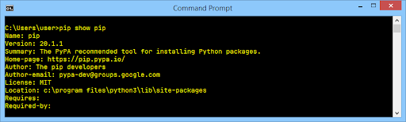

# Python Package Installer (PIP)

### Python packaging ecosystem and how to use it
Python was created as open-source software, and this also works as an invitation for all coders to maintain the whole Python ecosystem as an open, friendly, and free environment. To make the model work and evolve, some additional tools should be provided, tools that help the creators to publish, maintain, and take care of their code.

To make this world go round, two basic entities have to be established and kept in motion: **a centralized repository** of all available software packages; and a tool allowing users to **access the repository**. Both these entities already exist and can be used at any time.

The repository (or _repo_ for short) we mentioned before is named **PyPI** (it's short for Python Package Index) and it's maintained by a workgroup named the Packaging Working Group, a part of the Python Software Foundation, whose main task is to support Python developers in efficient code dissemination.

The PyPI website (administered by PWG) is located at the address:

https://pypi.org/

We must point out that PyPI is not the only existing Python repository. On the contrary, there are lots of them, created for projects and led by many larger and smaller Python communities. It's likely that someday you and your colleagues may want to **create your own repos**.

### The PyPI repo: the Cheese Shop
The PyPI repo is sometimes referred to as the **Cheese Shop**. Really.

PyPI is a very specific shop, not just because it offers all its products for free. It also requires a special tool to make use of it.

Fortunately, this tool is also free, so if you want to make your own digital cheeseburger by using the goods offered by the PyPI Shop, you’ll need a free tool named _pip_.

No, you haven't misheard. Just pip. It's another acronym, of course, but its nature is more complex than the previously mentioned PyPI, as it's an example of a recursive acronym, which means that the acronym refers to itself, which means that explaining it is an infinite process.

Why? Because pip means “pip installs packages”, and the _pip_ inside _“pip installs packages”_ means _“pip installs packages”_ and ...

By the way, there are a few other very famous recursive acronyms. One of them is Linux, which can be interpreted as _“Linux is Not Unix”_.

### Dependencies
Imagine that you've created a brilliant Python application named redsuspenders, able to predict stock exchange rates with 99% accuracy (by the way, if you actually do that, please contact us immediately).

<p align="center">
    
</p>

Of course, you've used some existing code to achieve this goal – e.g., your app imports a package named nyse containing some crucial functions and classes. Moreover, the nyse package imports another package named wallstreet, while the wallstreet package imports other two essential packages named bull and bear.

To make a long story short, we can say that **dependency is a phenomenon that appears every time you're going to use a piece of software that relies on other software**. Note that dependency may include (and generally does include) more than one level of software development.

Does this mean that a potential nyse package user is obliged to trace all dependencies and manually install all the needed packages? That would be horrible, wouldn't it?

Yes, it's definitely horrible, so you shouldn't be surprised that the process of arduously fulfilling all the subsequent requirements has its own name, and it's called _dependency hell_.

How do we deal with that? Is every user doomed to visit hell in order to run the code for the first time?

Fortunately not - pip can do all of this for you. Really. It can discover, identify, and resolve all dependencies. Moreover, it can do it in the cleverest way, avoiding any unnecessary downloads and reinstalls.

### How to use pip
Now we’re ready to ask pip what it can do for us. Let's do it – issue the following command:
```
pip help
```
Don't forget that you may be obliged to replace pip with pip3 if your environment requires this.

The list produced by pip summarizes all the available operations, and the last of them is `help`, which we've just used already.

If you want to know more about any of the listed operations, you can use the following form of _pip_ invocation:
```
pip help operation
```
For example, the line:
```
pip help install
```
will show you detailed information about using and parameterizing the `install` command.

If you want to know what Python packages have been installed so far, you can use the `list` operation – just like this:
```
pip list
```
The output you’ll see is rather unpredictable. Don't be surprised if your screen ends up being filled with completely different content. Ours look as follows:



The pip list isn't very informative, and it may happen that it won't satisfy your curiosity. Fortunately, there’s a command that can tell you more about any of the installed packages (note the word **installed**). The syntax of the command looks as follows:
```
pip show package_name
```
We’re going to use it in a slightly deceptive way – we want to convince pip to confess something about itself. This is how we do it:
```
pip show pip
```
It looks a bit odd, doesn't it? Despite this, it works fine, and _pip_'s self-presentation looks consistent and current:



You may ask where this data comes from? Is pip really so perceptive? Not at all – the information appearing on the screen is taken from inside the package being shown. In other words, the package's creator is obliged to equip it with all the needed data (or to express it more precisely – metadata).

Look at the two lines at the bottom of the output. They show:
- which packages are needed to successfully utilize the package (`Requires:`)
- which packages need the package to be successfully utilized (`Required-by:`)

As you can see, both properties are empty. Feel free to try to use the `show` command in relation to any other installed package.

The power of pip comes from the fact that it’s actually a gateway to the Python software universe. Thanks to that, you can browse and install any of the hundreds of ready-to-use packages gathered in the PyPI repositories. Don't forget that pip is not able to store all PyPI content locally (it’s unnecessary and it would be uneconomical).

In effect, pip uses the Internet to query PyPI and to download the required data. This means that you have to have a network connection working whenever you’re going to ask pip for anything that may involve direct interactions with the PyPI infrastructure.

One of these cases occurs when you want to search through PyPI in order to find a desired package. This kind of search is initiated by the following command:
```
pip search anystring
```
The `anystring` provided by you will be searched in:
- the names of all the packages;
- the summary strings of all the packages.
Be aware of the fact that some searches may generate a real avalanche of data, so try to be as specific as possible. For example, an innocent-looking query like this one:
```
pip search pip
```
produces more than 100 lines of results (try it yourself – don't take our word for it). By the way – the **search is case insensitive**.

If you’re not a fan of console reading, you can use the alternative way of browsing PyPI content offered by a search engine, available at https://pypi.org/search.

Assuming that your search is successful (or you’re determined to install a specific package of an already known name) you can use pip to install the package onto your computer.

Two possible scenarios may be put into action now:
- you want to install a new package for you only – it won't be available for any other user (account) existing on your computer; this procedure is the only one available if you can’t elevate your permissions and act as a system administrator;
- you’ve decided to install a new package system-wide – you have administrative rights and you're not afraid to use them.

To distinguish between these two actions, pip uses a dedicated option named --user (note the double dash). The presence of this option instructs pip to act locally on behalf of your (non-administrative) user.

If you don’t add this, pip assumes that you’re as a system administrator and it’ll do nothing to correct you if you’re not.

If you’re a system administrator, you can install pygame using the following command:
```
pip install pygame
```
If you're not an admin, or you don't want to fatten up your OS by installing pygame system-wide, you can install it for you only:
```
pip install --user pygame
```
The `pip install` has two important additional abilities:
- it is able to **update** a locally installed package – e.g., if you want to make sure that you’re using the latest version of a particular package, you can run the following command:
    ```
    pip install -U package_name
    ```
    where `-U` means update. Note: this form of the command makes use of the `--user` option for the same purpose as presented previously;

- it is able to **install a user-selected version** of a package (pip installs the **newest** available version by default); to achieve this goal you should use the following syntax:
    ```
    pip install package_name==package_version
    ```
    (note the double equals sign) e.g.,
    ```
    pip install pygame==1.9.2
    ```

If any of the currently installed packages are **no longer needed** and you want to get rid of them, pip will be useful, too. Its `uninstall` command will execute all the needed steps.

The required syntax is clear and simple:
```
pip uninstall package_name
```
so if you don't want pygame anymore you can execute the following command:
```
pip uninstall pygame
```
Pip will want to know if you’re sure about the choice you're making – be prepared to give the right answer.

