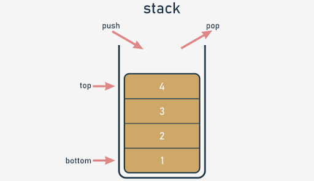

# Stack

## What is a stack?
**A stack is a structure developed to store data in a very specific way.** Imagine a stack of coins. You aren't able to put a coin anywhere else but on the top of the stack.

The alternative name for a stack (but only in IT terminology) is **LIFO**.

It's an abbreviation for a very clear description of the stack's behavior: **Last In - First Out**. The coin that came last onto the stack will leave first.

**A stack is an object** with two elementary operations, conventionally named **push** (when a new element is put on the top) and **pop** (when an existing element is taken away from the top).

<p align="center">
  
</p>

## The stack - the procedural approach
First, you have to decide how to store the values which will arrive onto the stack. We suggest using the simplest of methods, and **employing a list** for this job. Let's assume that the size of the stack is not limited in any way. Let's also assume that the last element of the list stores the top element.

The stack itself is already created:
```python
stack = []
```
We're ready to **define a function that puts a value onto the stack**. Here are the presuppositions for it:
- the name for the function is `push`;
- the function gets one parameter (this is the value to be put onto the stack)
- the function returns nothing;
- the function appends the parameter's value to the end of the stack;

This is how we've done it - take a look:
```python
def push(val):
    stack.append(val)
```
Now it's time for a **function to take a value off the stack**. This is how you can do it:
- the name of the function is `pop`;
- the function doesn't get any parameters;
- the function returns the value taken from the stack
- the function reads the value from the top of the stack and removes it.

The function is here:
```python
def pop():
    val = stack[-1]
    del stack[-1]
    return val
```
Note: the function doesn't check if there is any element in the stack.

Let's assemble all the pieces together to set the stack in motion. The **complete program** pushes three numbers onto the stack, pulls them off, and prints their values on the screen. You can see it in the editor window.
```python
stack = []


def push(val):
    stack.append(val)


def pop():
    val = stack[-1]
    del stack[-1]
    return val


push(3)
push(2)
push(1)

print(pop())
print(pop())
print(pop())
```
The program outputs the following text to the screen:
```
1
2
3
```

### The procedural approach vs. The object-oriented approach
The procedural stack is ready. Of course, there are some weaknesses, and the implementation could be improved in many ways (harnessing exceptions to work is a good idea), but in general the stack is fully implemented, and you can use it if you need to.

But the more often you use it, the more disadvantages you'll encounter. Here are some of them:
- the essential variable (the stack list) is highly **vulnerable**; anyone can modify it in an uncontrollable way, destroying the stack, in effect; this doesn't mean that it's been done maliciously - on the contrary, it may happen as a result of carelessness, e.g., when somebody confuses variable names; imagine that you have accidentally written something like this:
    ```python
    stack[0] = 0
    ```
    The functioning of the stack will be completely disorganized;
- it may also happen that one day you need more than one stack; you'll have to create another list for the stack's storage, and probably other `push` and `pop` functions too;
- it may also happen that you need not only `push` and `pop` functions, but also some other conveniences; you could certainly implement them, but try to imagine what would happen if you had dozens of separately implemented stacks.

The objective approach delivers solutions for each of the above problems. Let's name them first:
- the ability to hide (protect) selected values against unauthorized access is called **encapsulation; the encapsulated values can be neither accessed nor modified if you want to use them exclusively**;
- when you have a class implementing all the needed stack behaviors, you can produce as many stacks as you want; you needn't copy or replicate any part of the code;
- the ability to enrich the stack with new functions comes from inheritance; you can create a new class (a subclass) which inherits all the existing traits from the superclass, and adds some new ones.

## The stack - the object approach
Of course, the main idea remains the same. We'll use a list as the stack's storage. We only have to know how to put the list into the class.

Let's start from the absolute beginning - this is how the objective stack begins:
```python
class Stack:
```
Now, we expect two things from it:
- we want the class to have **one property as the stack's storage** - we have to **"install" a list inside each object of the class** (note: each object has to have its own list - the list mustn't be shared among different stacks)
- then, we want **the list to be hidden** from the class users' sight.

How is this done?

In contrast to other programming languages, Python has no means of allowing you to declare such a property just like that.

Instead, you need to add a specific statement or instruction. The properties have to be added to the class manually.

How do you guarantee that such an activity takes place every time the new stack is created?

There is a simple way to do it - you have to **equip the class with a specific function** - its specificity is dual:
- it has to be named in a strict way;
- it is invoked implicitly, when the new object is created.

Such a function is called a **constructor**, as its general purpose is to **construct a new object**. The constructor should know everything about the object's structure, and must perform all the needed initializations.

Let's add a very simple constructor to the new class. Take a look at the snippet:
```python
class Stack:
    def __init__(self):
        print("Hi!")


stack_object = Stack()
```
And now:
- the constructor's name is always `__init__`;
- it has to have **at least one parameter**; the parameter is used to represent the newly created object - you can use the parameter to manipulate the object, and to enrich it with the needed properties; you'll make use of this soon;
- note: the obligatory parameter is usually named `self` - it's only **a convention, but you should follow it** - it simplifies the process of reading and understanding your code.

The code is in the editor. Run it now.
```python
class Stack:  # Defining the Stack class.
    def __init__(self):  # Defining the constructor function.
        print("Hi!")


stack_object = Stack()  # Instantiating the object.
```
Here is its output:
```
Hi!
```

> [!NOTE]
> There is no trace of invoking the constructor inside the code. It has been invoked implicitly and automatically. Let's make use of that now.

Any change you make inside the constructor that modifies the state of the `self` parameter will be reflected in the newly created object.

This means you can add any property to the object and the property will remain there until the object finishes its life or the property is explicitly removed.

Now let's **add just one property to the new object** – a list for a stack. We'll name it `stack_list`.

Just like here:
```python
class Stack:
    def __init__(self):
        self.stack_list = []


stack_object = Stack()
print(len(stack_object.stack_list))
```
Note:
- we've used **dot notation**, just like when invoking methods; this is the general convention for accessing an object's properties; you need to name the object, put a dot (`.`) after it, and specify the desired property's name; don't use parentheses! You don't want to invoke a method – you want to **access a property**;
- if you set a property's value for the very first time (like in the constructor), you are creating it; from that moment on, the object has got the property and is ready to use its value;
- we've done something more in the code – we've tried to access the `stack_list` property from outside the class immediately after the object has been created; we want to check the current length of the stack – have we succeeded?

Yes, we have – the code produces the following output:
```
0
```
This is not what we want from the stack. We prefer `stack_list` to be **hidden from the outside world**. Is that possible?

Yes, and it's simple, but not very intuitive.

Take a look - we've added two underscores before the `stack_list` name - nothing more:
```python
class Stack:
    def __init__(self):
        self.__stack_list = []

stack_object = Stack()
print(len(stack_object.__stack_list))
```
The change invalidates the program.

Why?

When any class component has a **name starting with two underscores (__), it becomes private** - this means that it can be accessed only from within the class.

You cannot see it from the outside world. This is how Python implements the **encapsulation** concept.

Run the program to test our assumptions - an `AttributeError` exception should be raised.

### The object approach: a stack from scratch
Now it's time for the two functions (methods) implementing the push and pop operations. Python assumes that a function of this kind (a class activity) should be **immersed inside the class body** - just like a constructor.

We want to invoke these functions to `push` and `pop` values. This means that they should both be accessible to every class's user (in contrast to the previously constructed list, which is hidden from the ordinary class's users).

Such a component is called **public**, so you **can't begin its name with two (or more) underscores**. There is one more requirement - **the name must have no more than one trailing underscore**. As no trailing underscores at all fully meets the requirement, you can assume that the name is acceptable.

The functions themselves are simple. Take a look:
```python
class Stack:
    def __init__(self):
        self.__stack_list = []

    def push(self, val):
        self.__stack_list.append(val)

    def pop(self):
        val = self.__stack_list[-1]
        del self.__stack_list[-1]
        return val


stack_object = Stack()

stack_object.push(3)
stack_object.push(2)
stack_object.push(1)

print(stack_object.pop())
print(stack_object.pop())
print(stack_object.pop())
```
However, there's something really strange in the code. The functions look familiar, but they have more parameters than their procedural counterparts.

Here, both functions have a parameter named `self` at the first position of the parameters list.

Is it needed? Yes, it is.

All methods have to have this parameter. It plays the same role as the first constructor parameter.

**It allows the method to access entities (properties and activities/methods) carried out by the actual object.** You cannot omit it. Every time Python invokes a method, it implicitly sends the current object as the first argument.

This means that a **method is obligated to have at least one parameter, which is used by Python itself** - you don't have any influence on it.

If your method needs no parameters at all, this one must be specified anyway. If it's designed to process just one parameter, you have to specify two, and the first one's role is still the same.

There is one more thing that requires explanation - the way in which methods are invoked from within the `__stack_list` variable.

Fortunately, it's much simpler than it looks:
- the first stage delivers the object as a whole → `self`;
- next, you need to get to the `__stack_list` list → `self.__stack_list`;
- with `__stack_list` ready to be used, you can perform the third and last step → `self.__stack_list.append(val)`.

The class declaration is complete, and all its components have been listed. The class is ready for use.

Having such a class opens up some new possibilities. For example, you can now have more than one stack behaving in the same way. Each stack will have its own copy of private data, but will utilize the same set of methods.

This is exactly what we want for this example.

Analyze the code:
```python
class Stack:
    def __init__(self):
        self.__stack_list = []

    def push(self, val):
        self.__stack_list.append(val)

    def pop(self):
        val = self.__stack_list[-1]
        del self.__stack_list[-1]
        return val


stack_object_1 = Stack()
stack_object_2 = Stack()

stack_object_1.push(3)
stack_object_2.push(stack_object_1.pop())

print(stack_object_2.pop())
```
There are **two stacks created from the same base class**. They work **independently**. You can make more of them if you want to.

Now let's go a little further. Let's **add a new class for handling stacks**.

The new class should be able to **evaluate the sum of all the elements currently stored on the stack**.

We don't want to modify the previously defined stack. It's already good enough in its applications, and we don't want it changed in any way. We want a new stack with new capabilities. In other words, we want to construct a subclass of the already existing `Stack` class.

The first step is easy: just **define a new subclass pointing to the class which will be used as the superclass**.

This is what it looks like:
```python
class AddingStack(Stack):
    pass
```
The class doesn't define any new component yet, but that doesn't mean that it's empty. **It gets all the components defined by its superclass** - the name of the superclass is written before the colon directly after the new class name.

This is what we want from the new stack:
- we want the `push` method not only to push the value onto the stack but also to add the value to the `sum` variable;
- we want the `pop` function not only to pop the value off the stack but also to subtract the value from the `sum` variable.

Firstly, let's add a new variable to the class. It'll be a **private variable**, like the stack list. We don't want anybody to manipulate the `sum` value.

As you already know, adding a new property to the class is done by the constructor. You already know how to do that, but there is something really intriguing inside the constructor. Take a look:
```python
class AddingStack(Stack):
    def __init__(self):
        Stack.__init__(self)
        self.__sum = 0
```
The second line of the constructor's body creates a property named `__sum` - it will store the total of all the stack's values.

But the line before it looks different. What does it do? Is it really necessary? Yes, it is.

Contrary to many other languages, Python forces you to **explicitly invoke a superclass's constructor**. Omitting this point will have harmful effects - the object will be deprived of the `__stack_list` list. Such a stack will not function properly.

This is the only time you can invoke any of the available constructors explicitly - it can be done inside the subclass's constructor.

Note the syntax:
- you specify the superclass's name (this is the class whose constructor you want to run)
- you put a dot (`.`)after it;
- you specify the name of the constructor;
- you have to point to the object (the class's instance) which has to be initialized by the constructor - this is why you have to specify the argument and use the `self` variable here; note: **invoking any method (including constructors) from outside the class never requires you to put the `self` argument at the argument's list** - invoking a method from within the class demands explicit usage of the `self` argument, and it has to be put first on the list.

> [!NOTE]
> It's generally a recommended practice to invoke the superclass's constructor before any other initializations you want to perform inside the subclass. This is the rule we have followed in the snippet.

Secondly, let's add two methods. But let us ask you: is it really adding? We have these methods in the superclass already. Can we do something like that?

Yes, we can. It means that we're going to **change the functionality of the methods, not their names**. We can say more precisely that the interface (the way in which the objects are handled) of the class remains the same when changing the implementation at the same time.

Let's start with the implementation of the `push` function. This is what we expect from it:
- to add the value to the `__sum` variable;
- to push the value onto the stack.

**Note**: the second activity has already been implemented inside the superclass - so we can use that. Furthermore, we have to use it, as there's no other way to access the `__stackList` variable.

This is how the `push` method looks in the subclass:
```python
def push(self, val):
    self.__sum += val
    Stack.push(self, val)
```
Note the way we've invoked the previous implementation of the `push` method (the one available in the superclass):
- we have to specify the superclass's name; this is necessary in order to clearly indicate the class containing the method, to avoid confusing it with any other function of the same name;
- we have to specify the target object and to pass it as the first argument (it's not implicitly added to the invocation in this context.)

We say that the `push` method has been **overridden** - the same name as in the superclass now represents a different functionality.

This is the new `pop` function:
```python
def pop(self):
    val = Stack.pop(self)
    self.__sum -= val
    return val
```
So far, we've defined the `__sum` variable, but we haven't provided a method to get its value. It seems to be hidden. How can we reveal it and do it in a way that still protects it from modifications?

We have to define a new method. We'll name it `get_sum`. Its only task will be to **return the `__sum` value**.

Here it is:
```python
def get_sum(self):
    return self.__sum
```
So, let's look at the program in the editor. The complete code of the class is there. We can check its functioning now, and we do it with the help of a very few additional lines of code.
```python
class Stack:
    def __init__(self):
        self.__stack_list = []

    def push(self, val):
        self.__stack_list.append(val)

    def pop(self):
        val = self.__stack_list[-1]
        del self.__stack_list[-1]
        return val


class AddingStack(Stack):
    def __init__(self):
        Stack.__init__(self)
        self.__sum = 0

    def get_sum(self):
        return self.__sum

    def push(self, val):
        self.__sum += val
        Stack.push(self, val)

    def pop(self):
        val = Stack.pop(self)
        self.__sum -= val
        return val


stack_object = AddingStack()

for i in range(5):
    stack_object.push(i)
print(stack_object.get_sum())

for i in range(5):
    print(stack_object.pop())
```
As you can see, we add five subsequent values onto the stack, print their sum, and take them all off the stack.
