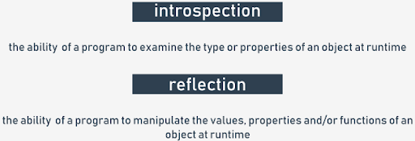

# Methods in detail
Let's summarize all the facts regarding the use of methods in Python classes.

As you already know, a **method is a function embedded inside a class**.

There is one fundamental requirement - a **method is obliged to have at least one parameter** (there are no such thing as parameterless methods - a method may be invoked without an argument, but not declared without parameters).

The first (or only) parameter is usually named `self`. We suggest that you follow the convention - it's commonly used, and you'll cause a few surprises by using other names for it.

The name `self` suggests the parameter's purpose - **it identifies the object for which the method is invoked**.

If you're going to invoke a method, you mustn't pass the argument for the `self` parameter - Python will set it for you.

The example shows the difference.
```python
class Classy:
    def method(self):
        print("method")


obj = Classy()
obj.method()
```
The code outputs:
```
method
```
Note the way we've created the object - we've **treated the class name like a function**, returning a newly instantiated object of the class.

If you want the method to accept parameters other than `self`, you should:
- place them after `self` in the method's definition;
- deliver them during invocation without specifying `self` (as previously)

Just like here:
```python
class Classy:
    def method(self, par):
        print("method:", par)


obj = Classy()
obj.method(1)
obj.method(2)
obj.method(3)
```
The code outputs:
```
method: 1
method: 2
method: 3
```

The `self` parameter is used **to obtain access to the object's instance and class variables**.

The example shows both ways of utilizing self:
```python
class Classy:
    varia = 2
    def method(self):
        print(self.varia, self.var)


obj = Classy()
obj.var = 3
obj.method()
```
The code outputs:
```
2 3
```
The `self` parameter is also used **to invoke other object/class methods from inside the class**.

Just like here:
```python
class Classy:
    def other(self):
        print("other")

    def method(self):
        print("method")
        self.other()


obj = Classy()
obj.method()
```
The code outputs:
```
method
other
```

### Constructor
If you name a method like this: `__init__`, it won't be a regular method - it will be a **constructor**.

If a class has a constructor, it is invoked automatically and implicitly when the object of the class is instantiated.

The constructor:
- is **obliged to have the `self` parameter** (it's set automatically, as usual);
- **may (but doesn't need to) have more parameters** than just `self`; if this happens, the way in which the class name is used to create the object must reflect the `__init__` definition;
- **can be used to set up the object**, i.e., properly initialize its internal state, create instance variables, instantiate any other objects if their existence is needed, etc. 

Look at the code. The example shows a very simple constructor at work.
```python
class Classy:
    def __init__(self, value):
        self.var = value


obj_1 = Classy("object")

print(obj_1.var)
```
Run it. The code outputs:
```
object
```
Note that the constructor:
- **cannot return a value**, as it is designed to return a newly created object and nothing else;
- **cannot be invoked directly either from the object or from inside the class** (you can invoke a constructor from any of the object's subclasses, but we'll discuss this issue later.)

As `__init__` is a method, and a method is a function, you can do the same tricks with constructors/methods as you do with ordinary functions.

The example in the editor shows how to define a constructor with a default argument value. Test it.
```
class Classy:
    def __init__(self, value = None):
        self.var = value


obj_1 = Classy("object")
obj_2 = Classy()

print(obj_1.var)
print(obj_2.var)
```
The code outputs:
```
object
None
```
Everything we've said about **property name mangling** applies to method names, too - a method whose name starts with `__` is (partially) hidden.

The example shows this effect:
```python
class Classy:
    def visible(self):
        print("visible")
    
    def __hidden(self):
        print("hidden")


obj = Classy()
obj.visible()

try:
    obj.__hidden()
except:
    print("failed")

obj._Classy__hidden()
```
The code outputs:
```
visible
failed
hidden
```

### The inner life of classes and objects
Each Python class and each Python object is pre-equipped with a set of useful attributes which can be used to examine its capabilities.

You already know one of these - it's the `__dict__` property.

Let's observe how it deals with methods - look at the code.
```python
class Classy:
    varia = 1
    def __init__(self):
        self.var = 2

    def method(self):
        pass

    def __hidden(self):
        pass


obj = Classy()

print(obj.__dict__)
print(Classy.__dict__)
```
Run it to see what it outputs. Check the output carefully.

Find all the defined methods and attributes. Locate the context in which they exist: inside the object or inside the class.

---

`__dict__` is a dictionary. Another built-in property worth mentioning is `__name__`, which is a string.

The property contains **the name of the class**. It's nothing exciting, just a string.

> [!NOTE]
> The `__name__` attribute is absent from the object - **it exists only inside classes**.

If you want to **find the class of a particular object**, you can use a function named `type()`, which is able (among other things) to find a class which has been used to instantiate any object.

Look at the code, run it, and see for yourself.
```python
class Classy:
    pass


print(Classy.__name__)
obj = Classy()
print(type(obj).__name__)
```
The code outputs:
```
Classy
Classy
```
Note that a statement like this one:
```python
print(obj.__name__)
```
will cause an error.

---

`__module__` is a string, too - it **stores the name of the module which contains the definition of the class**.

Let's check it - run the code in the editor.
```python
class Classy:
    pass


print(Classy.__module__)
obj = Classy()
print(obj.__module__)
```
The code outputs:
```
__main__
__main__
```
As you know, any module named `__main__` is actually not a module, but the **file currently being run**.

---

`__bases__` is a tuple. The **tuple contains classes** (not class names) which are direct superclasses for the class.

The order is the same as that used inside the class definition.

We'll show you only a very basic example, as we want to highlight **how inheritance works**.

Moreover, we're going to show you how to use this attribute when we discuss the objective aspects of exceptions.

> [!NOTE]
> **Only classes have this attribute** - objects don't.

We've defined a function named `printbases()`, designed to present the tuple's contents clearly.
```python
class SuperOne:
    pass


class SuperTwo:
    pass


class Sub(SuperOne, SuperTwo):
    pass


def printBases(cls):
    print('( ', end='')

    for x in cls.__bases__:
        print(x.__name__, end=' ')
    print(')')


printBases(SuperOne)
printBases(SuperTwo)
printBases(Sub)
```
Look at the code. Analyze it and run it. It will output:
```
( object )
( object )
( SuperOne SuperTwo )
```

> [!NOTE]
> **A class without explicit superclasses points to object** (a predefined Python class) as its direct ancestor.

## Reflection and introspection
All these means allow the Python programmer to perform two important activities specific to many objective languages. They are:
- **introspection**, which is the ability of a program to examine the type or properties of an object at runtime;
- **reflection**, which goes a step further, and is the ability of a program to manipulate the values, properties and/or functions of an object at runtime.

In other words, you don't have to know a complete class/object definition to manipulate the object, as the object and/or its class contain the metadata allowing you to recognize its features during program execution.

<p align="center">
  
</p>

### Investigating classes
What can you find out about classes in Python? The answer is simple – everything.

Both reflection and introspection enable a programmer to do anything with any object, no matter where it comes from.

Analyze the code.
```python
class MyClass:
    pass


obj = MyClass()
obj.a = 1
obj.b = 2
obj.i = 3
obj.ireal = 3.5
obj.integer = 4
obj.z = 5


def incIntsI(obj):
    for name in obj.__dict__.keys():
        if name.startswith('i'):
            val = getattr(obj, name)
            if isinstance(val, int):
                setattr(obj, name, val + 1)


print(obj.__dict__)
incIntsI(obj)
print(obj.__dict__)
```
The function named `incIntsI()` gets an object of any class, scans its contents in order to find all integer attributes with names starting with i, and increments them by one.

Impossible? Not at all!

This is how it works:
- line 1: define a very simple class...
- lines 5 through 11: ... and fill it with some attributes;
- line 14: this is our function!
- line 15: scan the `__dict__` attribute, looking for all attribute names;
- line 16: if a name starts with i...
- line 17: ... use the `getattr()` function to get its current value; note: `getattr()` takes two arguments: an object, and its property name (as a string), and returns the current attribute's value;
- line 18: check if the value is of type integer, and use the function isinstance() for this purpose (we'll discuss this later);
- line 19: if the check goes well, increment the property's value by making use of the setattr() function; the function takes three arguments: an object, the property name (as a string), and the property's new value.

The code outputs:
```
{'a': 1, 'integer': 4, 'b': 2, 'i': 3, 'z': 5, 'ireal': 3.5}
{'a': 1, 'integer': 5, 'b': 2, 'i': 4, 'z': 5, 'ireal': 3.5}
```
