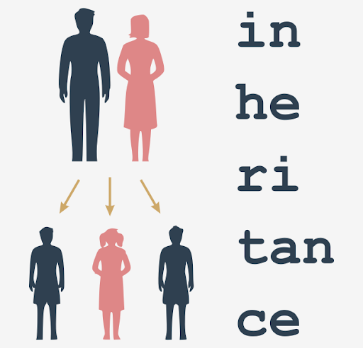
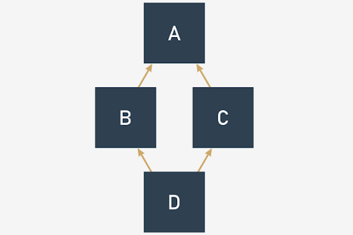

# Inheritance

Before we start talking about inheritance, we want to present a new, handy mechanism utilized by Python's classes and objects - it's **the way in which the object is able to introduce itself**.

Let's start with an example. Look at the code.
```python
class Star:
    def __init__(self, name, galaxy):
        self.name = name
        self.galaxy = galaxy


sun = Star("Sun", "Milky Way")
print(sun)
```
The program prints out just one line of text, which in our case is this:
```
<__main__.Star object at 0x7f1074cc7c50>
```
If you run the same code on your computer, you'll see something very similar, although the hexadecimal number (the substring starting with `0x`) will be different, as it's just an internal object identifier used by Python, and it's unlikely that it would appear the same when the same code is run in a different environment.

As you can see, the printout here isn't really useful, and something more specific, or just prettier, may be more preferable.

Fortunately, Python offers just such a function.

When Python needs any class/object to be presented as a string (putting an object as an argument in the `print()` function invocation fits this condition) it tries to invoke a method named `__str__()` from the object and to use the string it returns.

The default `__str__()` method returns the previous string - ugly and not very informative. You can change it just by **defining your own method of the name**.

We've just done it - look at the code.
```python
class Star:
    def __init__(self, name, galaxy):
        self.name = name
        self.galaxy = galaxy

    def __str__(self):
        return self.name + ' in ' + self.galaxy


sun = Star("Sun", "Milky Way")
print(sun)
```
This new `__str__()` method makes a string consisting of the star's and galaxy's names - nothing special, but the print results look better now, doesn't it?

Can you guess the output? Run the code to check if you were right.
```
Sun in Milky Way
```

### Inheritance - why and how?
The term inheritance is older than computer programming, and it describes the common practice of passing different goods from one person to another upon that person's death. The term, when related to computer programming, has an entirely different meaning.

<p align="center">
  
</p>
Let's define the term for our purposes:

Inheritance is a common practice (in object programming) of **passing attributes and methods from the superclass (defined and existing) to a newly created class, called the subclass**.

In other words, inheritance is **a way of building a new class, not from scratch, but by using an already defined repertoire of traits**. The new class inherits (and this is the key) all the already existing equipment, but is able to add some new ones if needed.

Thanks to that, it's possible to **build more specialized (more concrete) classes** using some sets of predefined general rules and behaviors.

The most important factor of the process is the relation between the superclass and all of its subclasses (note: if B is a subclass of A and C is a subclass of B, this also means that C is a subclass of A, as the relationship is fully transitive).

A very simple example of **two-level inheritance** is presented here:
```python
class Vehicle:
    pass


class LandVehicle(Vehicle):
    pass


class TrackedVehicle(LandVehicle):
    pass
```
All the presented classes are empty for now, as we're going to show you how the mutual relations between the super- and subclasses work. We'll fill them with contents soon.

We can say that:
- The `Vehicle` class is the superclass for both the `LandVehicle` and `TrackedVehicle` classes;
- The `LandVehicle` class is a subclass of `Vehicle` and a superclass of `TrackedVehicle` at the same time;
- The `TrackedVehicle` class is a subclass of both the `Vehicle` and `LandVehicle` classes.

We understand this just by reading the code (in other words, we know it because we can see it).

Does Python know the same? Is it possible to ask Python about it? Yes, it is.

### issubclass()
Python offers a function which is able to **identify a relationship between two classes**, and although its diagnosis isn't complex, it can **check if a particular class is a subclass of any other class**.

This is how it looks:
```python
issubclass(ClassOne, ClassTwo)
```
The function returns `True` if `ClassOne` is a subclass of `ClassTwo`, and `False` otherwise.

Let's see it in action - it may surprise you. Look at the code. Read it carefully.
```python
class Vehicle:
    pass


class LandVehicle(Vehicle):
    pass


class TrackedVehicle(LandVehicle):
    pass


for cls1 in [Vehicle, LandVehicle, TrackedVehicle]:
    for cls2 in [Vehicle, LandVehicle, TrackedVehicle]:
        print(issubclass(cls1, cls2), end="\t")
    print()
```
There are two nested loops. Their purpose is to **check all possible ordered pairs of classes, and to print the results of the check to determine whether the pair matches the subclass-superclass relationship**.

Run the code. The program produces the following output:
```
True	False	False	
True	True	False	
True	True	True	
```
Let's make the result more readable:

| ↓ is a subclass of → | Vehicle | LandVehicle | TrackedVehicle |
|----------------------|---------|-------------|----------------|
| **Vehicle**          | True    | False       | False          |
| **LandVehicle**      | True    | True        | False          |
| **TrackedVehicle**   | True    | True        | True           |

There is one important observation to make: **each class is considered to be a subclass of itself**.

### isinstance()
As you already know, **an object is an incarnation of a class**. This means that the object is like a cake baked using a recipe which is included inside the class.

This can generate some important issues.

Let's assume that you've got a cake (e.g., as an argument passed to your function). You want to know what recipe has been used to make it. Why? Because you want to know what to expect from it, e.g., whether it contains nuts or not, which is crucial information to some people.

Similarly, it can be crucial if the object does have (or doesn't have) certain characteristics. In other words, **whether it is an object of a certain class or not**.

Such a fact could be detected by the function named `isinstance()`:
```python
isinstance(objectName, ClassName)
```
The functions returns `True` if the object is an instance of the class, or `False` otherwise.

**Being an instance of a class means that the object (the cake) has been prepared using a recipe contained in either the class or one of its superclasses.**

Don't forget: if a subclass contains at least the same equipment as any of its superclasses, it means that objects of the subclass can do the same as objects derived from the superclass, ergo, it's an instance of its home class and any of its superclasses.

Let's test it. Analyze the code.
```python
class Vehicle:
    pass


class LandVehicle(Vehicle):
    pass


class TrackedVehicle(LandVehicle):
    pass


my_vehicle = Vehicle()
my_land_vehicle = LandVehicle()
my_tracked_vehicle = TrackedVehicle()

for obj in [my_vehicle, my_land_vehicle, my_tracked_vehicle]:
    for cls in [Vehicle, LandVehicle, TrackedVehicle]:
        print(isinstance(obj, cls), end="\t")
    print()
```
We've created three objects, one for each of the classes. Next, using two nested loops, we check all possible object-class pairs **to find out if the objects are instances of the classes**.

Run the code.

This is what we get:
```
True	False	False	
True	True	False	
True	True	True	
```
Let's make the result more readable once again:

| ↓ is an instance of → | Vehicle | LandVehicle | TrackedVehicle |
|-----------------------|---------|-------------|----------------|
| my_vehicle            | True    | False       | 	False         |
| my_land_vehicle       | 	True   | True        | 	False         |
| my_tracked_vehicle    | 	True   | True        | 	True          |

Does the table confirm our expectations?

### The `is` operator
There is also a Python operator worth mentioning, as it refers directly to objects - here it is:
```python
object_one is object_two
```
**The `is` operator checks whether two variables (`object_one` and `object_two` here) refer to the same object.**

Don't forget that **variables don't store the objects themselves, but only the handles pointing to the internal Python memory**.

Assigning a value of an object variable to another variable doesn't copy the object, but only its handle. This is why an operator like `is` may be very useful in particular circumstances.

Take a look at the code. Let's analyze it:
```python
class SampleClass:
    def __init__(self, val):
        self.val = val


object_1 = SampleClass(0)
object_2 = SampleClass(2)
object_3 = object_1
object_3.val += 1

print(object_1 is object_2)
print(object_2 is object_3)
print(object_3 is object_1)
print(object_1.val, object_2.val, object_3.val)

string_1 = "Mary had a little "
string_2 = "Mary had a little lamb"
string_1 += "lamb"

print(string_1 == string_2, string_1 is string_2)
```
- there is a very simple class equipped with a simple constructor, creating just one property. The class is used to instantiate two objects. The former is then assigned to another variable, and its `val` property is incremented by one.
- afterward, the `is` operator is applied three times to check all possible pairs of objects, and all `val` property values are also printed.
- the last part of the code carries out another experiment. After three assignments, both strings contain the same texts, but **these texts are stored in different objects**.

The code prints:
```
False
False
True
1 2 1
True False
```
The results prove that `object_1` and `object_3` are actually the same objects, while `string_1` and `string_2` aren't, despite their contents being the same.

### How Python finds properties and methods
Now we're going to look at how Python deals with inheriting methods.

Take a look at the example. Let's analyze it:
```python
class Super:
    def __init__(self, name):
        self.name = name

    def __str__(self):
        return "My name is " + self.name + "."


class Sub(Super):
    def __init__(self, name):
        Super.__init__(self, name)


obj = Sub("Andy")

print(obj)
```
- there is a class named `Super`, which defines its own constructor used to assign the object's property, named `name`.
- the class defines the `__str__()` method, too, which makes the class able to present its identity in clear text form.
- the class is next used as a base to create a subclass named `Sub`. The `Sub` class defines its own constructor, which invokes the one from the superclass. Note how we've done it: `Super.__init__(self, name)`.
- we've explicitly named the superclass, and pointed to the method to invoke `__init__()`, providing all needed arguments.
- we've instantiated one object of class `Sub` and printed it. 

The code outputs:
```
My name is Andy.
```

> [!NOTE]
> As there is no `__str__()` method within the `Sub` class, the printed string is to be produced within the `Super` class. This means that the `__str__()` method has been inherited by the `Sub` class.

Look at the code. We've modified it to show you another method of accessing any entity defined inside the superclass.
```python
class Super:
    def __init__(self, name):
        self.name = name

    def __str__(self):
        return "My name is " + self.name + "."


class Sub(Super):
    def __init__(self, name):
        super().__init__(name)


obj = Sub("Andy")

print(obj)
```
In the last example, we explicitly named the superclass. In this example, we make use of the `super()` function, which **accesses the superclass without needing to know its name**:
```python
super().__init__(name)
```
The `super()` function creates a context in which you don't have to (moreover, you mustn't) pass the self argument to the method being invoked - this is why it's possible to activate the superclass constructor using only one argument.

> [!NOTE]
> You can use this mechanism not only to **invoke the superclass constructor, but also to get access to any of the resources available inside the superclass**.

Let's try to do something similar, but with properties (more precisely: with **class variables**).

Take a look at the example.
```python
# Testing properties: class variables.
class Super:
    supVar = 1


class Sub(Super):
    subVar = 2


obj = Sub()

print(obj.subVar)
print(obj.supVar)
```
As you can see, the `Super` class defines one class variable named `supVar`, and the `Sub` class defines a variable named `subVar`.

Both these variables are visible inside the object of class `Sub` - this is why the code outputs:
```
2
1
```

The same effect can be observed with **instance variables** - take a look at the second example.
```python
# Testing properties: instance variables.
class Super:
    def __init__(self):
        self.supVar = 11


class Sub(Super):
    def __init__(self):
        super().__init__()
        self.subVar = 12


obj = Sub()

print(obj.subVar)
print(obj.supVar)
```
The `Sub` class constructor creates an instance variable named `subVar`, while the `Super` constructor does the same with a variable named `supVar`. As previously, both variables are accessible from within the object of class `Sub`.

The program's output is:
```
12
11
```

> [!NOTE]
> The existence of the `supVar` variable is obviously conditioned by the `Super` class constructor invocation. Omitting it would result in the absence of the variable in the created object (try it yourself).

It's now possible to formulate a general statement describing Python's behavior.

When you try to access any object's entity, Python will try to (in this order):
- find it **inside the object** itself;
- find it **in all classes** involved in the object's inheritance line from bottom to top;

If both of the above fail, an **exception (`AttributeError`) is raised**.

The first condition may need some additional attention. As you know, all objects deriving from a particular class may have different sets of attributes, and some of the attributes may be added to the object a long time after the object's creation.

The example in the editor summarizes this in a **three-level inheritance line**. Analyze it carefully.
```python
class Level1:
    variable_1 = 100
    def __init__(self):
        self.var_1 = 101

    def fun_1(self):
        return 102


class Level2(Level1):
    variable_2 = 200
    def __init__(self):
        super().__init__()
        self.var_2 = 201
    
    def fun_2(self):
        return 202


class Level3(Level2):
    variable_3 = 300
    def __init__(self):
        super().__init__()
        self.var_3 = 301

    def fun_3(self):
        return 302


obj = Level3()

print(obj.variable_1, obj.var_1, obj.fun_1())
print(obj.variable_2, obj.var_2, obj.fun_2())
print(obj.variable_3, obj.var_3, obj.fun_3())
```
All the comments we've made so far are related to **single inheritance**, when a subclass has exactly one superclass. This is the most common situation (and the recommended one, too).

### Multiple inheritance
**Multiple inheritance occurs when a class has more than one superclass.** Syntactically, such inheritance is presented as a comma-separated list of superclasses put inside parentheses after the new class name - just like here:
```python
class SuperA:
    var_a = 10
    def fun_a(self):
        return 11


class SuperB:
    var_b = 20
    def fun_b(self):
        return 21


class Sub(SuperA, SuperB):
    pass

obj = Sub()

print(obj.var_a, obj.fun_a())
print(obj.var_b, obj.fun_b())
```
The `Sub` class has two superclasses: `SuperA` and `SuperB`. This means that the `Sub` class **inherits all the goods offered by both `SuperA` and `SuperB`**.

The code prints:
```
10 11
20 21
```
Now it's time to introduce a brand new term - **overriding**.

What do you think will happen if more than one of the superclasses defines an entity of a particular name?

Let's analyze the example.
```python
class Level1:
    var = 100
    def fun(self):
        return 101


class Level2(Level1):
    var = 200
    def fun(self):
        return 201


class Level3(Level2):
    pass


obj = Level3()

print(obj.var, obj.fun())
```
Both, `Level1` and `Level2` classes define a method named `fun()` and a property named `var`. Does this mean that the `Level3` class object will be able to access two copies of each entity? Not at all.

**The entity defined later (in the inheritance sense) overrides the same entity defined earlier**. This is why the code produces the following output:
```
200 201
```
As you can see, the `var` class variable and `fun()` method from the `Level2` class override the entities of the same names derived from the `Level1` class.

This feature can be intentionally used to modify default (or previously defined) class behaviors when any of its classes needs to act in a different way to its ancestor.

We can also say that **Python looks for an entity from bottom to top**, and is fully satisfied with the first entity of the desired name.

How does it work when a class has two ancestors offering the same entity, and they lie on the same level? In other words, what should you expect when a class emerges using multiple inheritance? Let's look at this.

Let's take a look at the example.
```python
class Left:
    var = "L"
    var_left = "LL"
    def fun(self):
        return "Left"


class Right:
    var = "R"
    var_right = "RR"
    def fun(self):
        return "Right"


class Sub(Left, Right):
    pass


obj = Sub()

print(obj.var, obj.var_left, obj.var_right, obj.fun())
```
The `Sub` class inherits goods from two superclasses, `Left` and `Right` (these names are intended to be meaningful).

There is no doubt that the class variable `var_right` comes from the `Right` class, and `var_left` comes from `Left` respectively.

This is clear. But where does `var` come from? Is it possible to guess it? The same problem is encountered with the `fun()` method - will it be invoked from `Left` or from `Right`? Let's run the program - its output is:
```
L LL RR Left
```
This proves that both unclear cases have a solution inside the `Left` class. Is this a sufficient premise to formulate a general rule? Yes, it is.

We can say that **Python looks for object components** in the following order:
- **inside the object** itself;
- **in its superclasses**, from bottom to top;
- if there is more than one class on a particular inheritance path, Python scans them from left to right.

Do you need anything more? Just make a small amendment in the code - replace: `class Sub(Left, Right):` with: `class Sub(Right, Left):`, then run the program again, and see what happens.

What do you see now? We see:
```
R LL RR Right
```

Do you see the same, or something different?

## Polymorphism
### How to build a hierarchy of classes
If you divide a problem among classes and decide which of them should be located at the top and which should be placed at the bottom of the hierarchy, you have to carefully analyze the issue, but before we show you how to do it (and how not to do it), we want to highlight an interesting effect. It's nothing extraordinary (it's just a consequence of the general rules presented earlier), but remembering it may be key to understanding how some codes work, and how the effect may be used to build a flexible set of classes.

Take a look at the code. Let's analyze it:
```python
class One:
    def do_it(self):
        print("do_it from One")

    def doanything(self):
        self.do_it()


class Two(One):
    def do_it(self):
        print("do_it from Two")


one = One()
two = Two()

one.doanything()
two.doanything()
```
- there are two classes, named `One` and `Two`, while `Two` is derived from `One`. Nothing special. However, one thing looks remarkable - the `do_it()` method.
- the `do_it()` method is **defined twice**: originally inside `One` and subsequently inside `Two`. The essence of the example lies in the fact that it is **invoked just once** - inside `One`.

The question is - which of the two methods will be invoked by the last two lines of the code?

The first invocation seems to be simple, and it is simple, actually - invoking `doanything()` from the object named `one` will obviously activate the first of the methods.

The second invocation needs some attention. It's simple, too if you keep in mind how Python finds class components. The second invocation will launch `do_it()` in the form existing inside the `Two` class, regardless of the fact that the invocation takes place within the `One` class.

In effect, the code produces the following output:
```
do_it from One
do_it from Two
```

> [!NOTE]
> The situation in which **the subclass is able to modify its superclass behavior (just like in the example) is called polymorphism**. The word comes from Greek (polys: "many, much" and morphe, "form, shape"), which means that one and the same class can take various forms depending on the redefinitions done by any of its subclasses.

The method, redefined in any of the superclasses, thus changing the behavior of the superclass, is called **virtual**.

In other words, no class is given once and for all. Each class's behavior may be modified at any time by any of its subclasses.

We're going to show you **how to use polymorphism to extend class flexibility**.

Look at the example.
```python
import time

class TrackedVehicle:
    def control_track(left, stop):
        pass

    def turn(left):
        control_track(left, True)
        time.sleep(0.25)
        control_track(left, False)


class WheeledVehicle:
    def turn_front_wheels(left, on):
        pass

    def turn(left):
        turn_front_wheels(left, True)
        time.sleep(0.25)
        turn_front_wheels(left, False)
```
Does it resemble anything? Yes, of course it does. It refers to the example shown at the beginning of the module when we talked about the general concepts of objective programming.

It may look weird, but we didn't use inheritance in any way - just to show you that it doesn't limit us, and we managed to get ours.

We defined two separate classes able to produce two different kinds of land vehicles. The main difference between them is in how they turn. A wheeled vehicle just turns the front wheels (generally). A tracked vehicle has to stop one of the tracks.

Can you follow the code?
- a tracked vehicle performs a turn by stopping and moving on one of its tracks (this is done by the `control_track()` method, which will be implemented later)
- a wheeled vehicle turns when its front wheels turn (this is done by the `turn_front_wheels()` method)
- the `turn()` method uses the method suitable for each particular vehicle.

Can you see **what's wrong with the code?**

The `turn()` methods look too similar to leave them in this form.

Let's rebuild the code - we're going to introduce a superclass to gather all the similar aspects of the driving vehicles, moving all the specifics to the subclasses.

Look at the code again. This is what we've done:
```python
import time

class Vehicle:
    def change_direction(left, on):
        pass

    def turn(left):
        change_direction(left, True)
        time.sleep(0.25)
        change_direction(left, False)


class TrackedVehicle(Vehicle):
    def control_track(left, stop):
        pass

    def change_direction(left, on):
        control_track(left, on)


class WheeledVehicle(Vehicle):
    def turn_front_wheels(left, on):
        pass

    def change_direction(left, on):
        turn_front_wheels(left, on)
```
- we defined a superclass named `Vehicle`, which uses the `turn()` method to implement a general scheme of turning, while the turning itself is done by a method named `change_direction()`; note: the former method is empty, as we are going to put all the details into the subclass (such a method is often called an **abstract method**, as it only demonstrates some possibility which will be instantiated later)
- we defined a subclass named `TrackedVehicle` (note: it's derived from the `Vehicle` class) which instantiated the `change_direction()` method by using the specific (concrete) method named `control_track()`
- respectively, the subclass named `WheeledVehicle` does the same trick, but uses the `turn_front_wheels()` method to force the vehicle to turn.

The most important advantage (omitting readability issues) is that this form of code enables you to implement a brand new turning algorithm just by modifying the `turn()` method, which can be done in just one place, as all the vehicles will obey it.

This is **how polymorphism helps the developer to keep the code clean and consistent**.

### Composition
Inheritance is not the only way of constructing adaptable classes. You can achieve the same goals (not always, but very often) by using a technique named composition.

**Composition is the process of composing an object using other different objects.** The objects used in the composition deliver a set of desired traits (properties and/or methods) so we can say that they act like blocks used to build a more complicated structure.

It can be said that:
- **inheritance extends a class's capabilities** by adding new components and modifying existing ones; in other words, the complete recipe is contained inside the class itself and all its ancestors; the object takes all the class's belongings and makes use of them;
- **composition projects a class as a container** able to store and use other objects (derived from other classes) where each of the objects implements a part of a desired class's behavior.

Let us illustrate the difference by using the previously defined vehicles. The previous approach led us to a hierarchy of classes in which the top-most class was aware of the general rules used in turning the vehicle, but didn't know how to control the appropriate components (wheels or tracks).

The subclasses implemented this ability by introducing specialized mechanisms. Let's do (almost) the same thing, but using composition. The class - like in the previous example - is aware of how to turn the vehicle, but the actual turn is done by a specialized object stored in a property named `controller`. The `controller` is able to control the vehicle by manipulating the relevant vehicle's parts.

Take a look into the editor - this is how it could look.
```python
import time

class Tracks:
    def change_direction(self, left, on):
        print("tracks: ", left, on)


class Wheels:
    def change_direction(self, left, on):
        print("wheels: ", left, on)


class Vehicle:
    def __init__(self, controller):
        self.controller = controller

    def turn(self, left):
        self.controller.change_direction(left, True)
        time.sleep(0.25)
        self.controller.change_direction(left, False)


wheeled = Vehicle(Wheels())
tracked = Vehicle(Tracks())

wheeled.turn(True)
tracked.turn(False)
```
There are two classes named `Tracks` and `Wheels` - they know how to control the vehicle's direction. There is also a class named `Vehicle` which can use any of the available controllers (the two already defined, or any other defined in the future) - the `controller` itself is passed to the class during initialization.

In this way, the vehicle's ability to turn is composed using an external object, not implemented inside the `Vehicle` class.

In other words, we have a universal vehicle and can install either tracks or wheels onto it.

The code produces the following output:
```
wheels:  True True
wheels:  True False
tracks:  False True
tracks:  False False
```

## Single inheritance vs. multiple inheritance
As you already know, there are no obstacles to using multiple inheritance in Python. You can derive any new class from more than one previously defined classes.

There is only one "but". The fact that you can do it does not mean you have to.

Don't forget that:
- a single inheritance class is always simpler, safer, and easier to understand and maintain;
- multiple inheritance is always risky, as you have many more opportunities to make a mistake in identifying these parts of the superclasses which will effectively influence the new class;
- multiple inheritance may make overriding extremely tricky; moreover, using the `super()` function becomes ambiguous;
- multiple inheritance violates the **single responsibility principle** (more details here: https://en.wikipedia.org/wiki/Single_responsibility_principle) as it makes a new class of two (or more) classes that know nothing about each other;
- we strongly suggest multiple inheritance as the last of all possible solutions - if you really need the many different functionalities offered by different classes, composition may be a better alternative.

## What is Method Resolution Order (MRO) and why is it that not all inheritances make sense?
MRO, in general, is a way (you can call it a **strategy**) in which a particular programming language scans through the upper part of a class’s hierarchy in order to find the method it currently needs. It's worth emphasizing that different languages use slightly (or even completely) different MROs. Python is a unique creature in this respect, however, and its customs are a bit specific.

We're going to show you how Python's MRO works in two peculiar cases that are clear-cut examples of problems which may occur when you try to use multiple inheritance too recklessly. Let's start with a snippet that initially may look simple. Look at what we've prepared for you in the editor.
```python
class Top:
    def m_top(self):
        print("top")


class Middle(Top):
    def m_middle(self):
        print("middle")


class Bottom(Middle):
    def m_bottom(self):
        print("bottom")


object = Bottom()
object.m_bottom()
object.m_middle()
object.m_top()
```
We're sure that if you analyze the snippet yourself, you won't see any anomalies in it. Yes, you're perfectly right - it looks clear and simple, and raises no concerns. If you run the code, it will produce the following, predictable output:
```
bottom
middle
top
```
No surprises so far. Let's make a tiny change to this code. Have a look:
```python
class Top:
    def m_top(self):
        print("top")


class Middle(Top):
    def m_middle(self):
        print("middle")


class Bottom(Middle, Top):
    def m_bottom(self):
        print("bottom")


object = Bottom()
object.m_bottom()
object.m_middle()
object.m_top()
```
Can you see the difference? It's hidden in this line:
```python
class Bottom(Middle, Top):
```

In this exotic way, we've turned a very simple code with a clear single-inheritance path into a mysterious multiple-inheritance riddle. “Is it valid?” you may ask. Yes, it is. “How is that possible?” you should ask now, and we hope that you really feel the need to ask this question.

As you can see, the order in which the two superclasses have been listed between parenthesis is compliant with the code's structure: the `Middle` class precedes the `Top` class, just like in the real inheritance path.

Despite its oddity, the sample is correct and works as expected, but it has to be stated that this notation doesn’t bring any new functionality or additional meaning.

Let's modify the code once again - now we'll swap both superclass names in the `Bottom` class definition. This is what the snippet looks like now:
```python
class Top:
    def m_top(self):
        print("top")


class Middle(Top):
    def m_middle(self):
        print("middle")


class Bottom(Top, Middle):
    def m_bottom(self):
        print("bottom")


object = Bottom()
object.m_bottom()
object.m_middle()
object.m_top()
```
To anticipate your question, we’ll say that this amendment has spoiled the code, and it won't run anymore. What a pity. The order we tried to force (Top, Middle) is incompatible with the inheritance path which is derived from the code's structure. Python won't like it. This is what we'll see:
```
TypeError: Cannot create a consistent method resolution order (MRO) for bases Top, Middle
```
We think that the message speaks for itself. Python's MRO cannot be bent or violated, not just because that's the way Python works, but also because it’s a rule you have to obey.

## The diamond problem
The second example of the spectrum of issues that can possibly arise from multiple inheritance is illustrated by a classic problem named the **diamond problem**. The name reflects the shape of the inheritance diagram – take a look at the picture:

<p align="center">
  
</p>

The diamond problem concept
- there is the top-most superclass named A;
- there are two subclasses derived from A: B and C;
- and there is also the bottom-most subclass named D, derived from B and C (or C and B, as these two variants mean different things in Python)

Can you see the diamond there?

Have a look at the code in the editor. The same structure, but expressed in Python.
```python
class A:
    pass


class B(A):
    pass


class C(A):
    pass


class D(B, C):
    pass


d = D()
```
Some programming languages don't allow multiple inheritance at all, and as a consequence, they won't let you build a diamond – this is the route that Java and C# have chosen to follow since their origins.

Python, however, has chosen a different route – it allows multiple inheritance, and it doesn't mind if you write and run code like the one in the editor. But don't forget about MRO – it's always in charge.

Let's rebuild our example from the previous page to make it more diamond-like, just like below:
```python
class Top:
    def m_top(self):
        print("top")


class Middle_Left(Top):
    def m_middle(self):
        print("middle_left")


class Middle_Right(Top):
    def m_middle(self):
        print("middle_right")


class Bottom(Middle_Left, Middle_Right):
    def m_bottom(self):
        print("bottom")


object = Bottom()
object.m_bottom()
object.m_middle()
object.m_top()
```
**Note**: both `Middle` classes define **a method of the same name**: `m_middle()`.

It introduces a small uncertainty to our sample, although we're absolutely sure that you can answer the following key question: which of the two `m_middle()` methods will actually be invoked when the following line is executed?
```python
Object.m_middle()
```
In other words, what will you see on the screen: `middle_left` or `middle_right`?

You don't need to hurry – think twice and keep Python's MRO in mind!

Are you ready?
```
bottom
middle_left
top
```
Yes, you're right. The invocation will activate the `m_middle()` method, which comes from the `Middle_Left` class. The explanation is simple: the class is listed before `Middle_Right` on the `Bottom` class's inheritance list. If you want to make sure that there’s no doubt about it, try to swap these two classes on the list and check the results.

If you want to experience some more profound impressions about multiple inheritance and precious gemstones, try to modify our snippet and equip the `Top` class with another specimen of the `m_middle()` method, and investigate its behavior carefully.

As you can see, diamonds may bring some problems into your life – both the real ones and those offered by Python.
