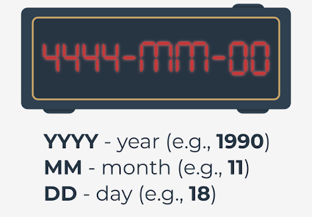

# Introduction to the datetime module
In this section, you'll learn about a Python module called _datetime_.

As you can guess, it provides **classes for working with date and time**. If you think you don't need to delve into this topic, let's talk about examples of using date and time in programming.

Date and time have countless uses and it's probably hard to find a production application that doesn't use them. Here are some examples:
- **event logging** — thanks to the knowledge of date and time, we are able to determine when exactly a critical error occurs in our application. When creating logs, you can specify the date and time format;
- **tracking changes in the database** — sometimes it's necessary to store information about when a record was created or modified. The _datetime_ module will be perfect for this case;
- **data validation** — you'll soon learn how to read the current date and time in Python. Knowing the current date and time, we're able to validate various types of data, e.g., whether a discount coupon entered by a user in our application is still valid;
- **storing important information** — can you imagine bank transfers without storing the information of when they were made? The date and time of certain actions must be preserved, and we must deal with it.

### Getting the current local date and creating date objects
One of the classes provided by the `datetime` module is a class called `date`. Objects of this class represent a date consisting of the year, month, and day. Look at the code in the editor to see what it looks like in practice and get the current local date using the `today` method.
```python
from datetime import date

today = date.today()

print("Today:", today)
print("Year:", today.year)
print("Month:", today.month)
print("Day:", today.day)
```
Run the code to see what happens.

The `today` method returns a `date` object representing the current local date. Note that the `date` object has three attributes: _year_, _month_, and _day_.

Be careful, because these attributes are read-only. To create a `date` object, you must pass the _year_, _month_, and _day_ parameters as follows:
```python
from datetime import date

my_date = date(2019, 11, 4)
print(my_date)
```
Run the example to see what happens.

When creating a `date` object, keep the following restrictions in mind:

| Parameter | Restrictions                                                                                                                  |
|-----------|-------------------------------------------------------------------------------------------------------------------------------|
| `year`    | The _year_ parameter must be greater than or equal to 1 (MINYEAR constant) and less than or equal to 9999 (MAXYEAR constant). |
| `month`   | The _month_ parameter must be greater than or equal to 1 and less than or equal to 12.                                        |
| `day`     | The _day_ parameter must be greater than or equal to 1 and less than or equal to the last day of the given month and year.    |

### Creating a date object from a timestamp
The `date` class gives us the ability to create a _date_ object from a _timestamp_.

In Unix, the timestamp expresses the number of seconds since January 1, 1970, 00:00:00 (UTC). This date is called the **Unix epoch**, because this is when the counting of time began on Unix systems.

The timestamp is actually the difference between a particular date (including time) and January 1, 1970, 00:00:00 (UTC), expressed in seconds.

To create a date object from a timestamp, we must pass a Unix timestamp to the `fromtimestamp` method.

For this purpose, we can use the `time` module, which provides time-related functions. One of them is a function called `time()` that returns the number of seconds from January 1, 1970 to the current moment in the form of a float number. Take a look at the example in the editor.
```python
from datetime import date
import time

timestamp = time.time()
print("Timestamp:", timestamp)

d = date.fromtimestamp(timestamp)
print("Date:", d)
```
Run the code to see the output.

If you run the sample code several times, you'll be able to see how the timestamp increments itself. It's worth adding that the result of the `time` function depends on the platform, because **in Unix and Windows systems, leap seconds aren't counted**.

### Creating a date object using the ISO format
The `datetime` module provides several methods to create a `date` object. One of them is the `fromisoformat` method, which takes a date in the **YYYY-MM-DD** format compliant with the ISO 8601 standard.

The ISO 8601 standard defines how the date and time are represented. It's often used, so it's worth taking a moment to familiarize yourself with it. Take a look at the picture describing the values required by the format:

<p align="center">
  
</p>

Now look at the code and run it.
```python
from datetime import date

d = date.fromisoformat('2019-11-04')
print(d)
```
In our example, YYYY is 2019, MM is 11 (November), and DD is 04 (fourth day of November).

When substituting the date, be sure to add 0 before a month or a day that is expressed by a number less than 10.

> [!IMPORTANT]
> The fromisoformat method has been available in Python since version 3.7.

### The `replace()` method
Sometimes you may need to replace the year, month, or day with a different value. You can’t do this with the year, month, and day attributes because they're read-only. In this case, you can use the method named `replace`.

Run the code in the editor.
```python
from datetime import date

d = date(1991, 2, 5)
print(d)

d = d.replace(year=1992, month=1, day=16)
print(d)
```
Result:
```
1991-02-05
1992-01-16
```
The _year, month_, and _day_ parameters are optional. You can pass only one parameter to the `replace` method, e.g., year, or all three as in the example.

The `replace` method returns a changed _date_ object, so you must remember to assign it to some variable.

### What day of the week is it?
One of the more helpful methods that makes working with dates easier is the method called `weekday`. It returns the day of the week as an integer, where 0 is Monday and 6 is Sunday. Run the code in the editor.
```python
from datetime import date

d = date(2019, 11, 4)
print(d.weekday())
```
Result:
```
0
```
The `date` class has a similar method called `isoweekday`, which also returns the day of the week as an integer, but 1 is Monday, and 7 is Sunday:
```python
from datetime import date

d = date(2019, 11, 4)
print(d.isoweekday())
```
Result:
```
1
```
As you can see, for the same date we get a different integer, but expressing the same day of the week. The integer returned by the `isodayweek` method follows the ISO 85601 specification.

### Creating time objects
You already know how to present a date using the `date` object. The `datetime` module also has a class that allows you to present time. Can you guess its name? Yes, it's called `time`:
```python
time(hour, minute, second, microsecond, tzinfo, fold)
```

The `time` class constructor accepts the following optional parameters:

| Parameter     | 	Restrictions                                                                       |
|---------------|-------------------------------------------------------------------------------------|
| `hour`        | The hour parameter must be greater than or equal to 0 and less than 23.             |
| `minute`      | The minute parameter must be greater than or equal to 0 and less than 59.           |
| `second`      | The second parameter must be greater than or equal to 0 and less than 59.           |
| `microsecond` | The microsecond parameter must be greater than or equal to 0 and less than 1000000. |
| `tzinfo`      | The _tzinfo_ parameter must be a `tzinfo` subclass object or `None` (default).      |
| `fold`        | The fold parameter must be 0 or 1 (default 0 ).                                     |

The _tzinfo_ parameter is associated with time zones, while _fold_ with wall times. We won't use them during this course, but we encourage you to familiarize yourself with them.

Let's look at how to create a time object in practice. Run the code.
```python
from datetime import time

t = time(14, 53, 20, 1)

print("Time:", t)
print("Hour:", t.hour)
print("Minute:", t.minute)
print("Second:", t.second)
print("Microsecond:", t.microsecond)
```
Result:
```
Time: 14:53:20.000001
Hour: 14
Minute: 53
Second: 20
Microsecond: 1
```
In the example, we passed four parameters to the class constructor: _hour, minute, second,_ and _microsecond_. Each of them can be accessed using the class attributes.

### The time module
In addition to the `time` class, the Python standard library offers a module called `time`, which provides a time-related function. You already had the opportunity to learn the function called `time` when discussing the `date` class. Now we'll look at another useful function available in this module.

You must spend many hours in front of a computer while doing this course. Sometimes you may feel the need to take a nap. Why not? Let's write a program that simulates a student's short nap. Have a look at the code.
```python
import time

class Student:
    def take_nap(self, seconds):
        print("I'm very tired. I have to take a nap. See you later.")
        time.sleep(seconds)
        print("I slept well! I feel great!")

student = Student()
student.take_nap(5)
```
Result:
```
I'm very tired. I have to take a nap. See you later.
I slept well! I feel great!
```
The most important part of the sample code is the use of the `sleep` function (yes, you may remember it from one of the previous labs earlier in the course), which suspends program execution for the given number of seconds.

In our example it's 5 seconds. You're right, it's a very short nap.

Extend the student's sleep by changing the number of seconds. Note that the `sleep` function accepts only an integer or a floating point number.

### The `ctime()` function
The `time` module provides a function called `ctime`, which **converts the time in seconds since January 1, 1970 (Unix epoch) to a string**.

Do you remember the result of the `time` function? That's what you need to pass to `ctime`. Take a look at the example.
```python
import time

timestamp = 1572879180
print(time.ctime(timestamp))
```
Result:
```
Mon Nov  4 14:53:00 2019
```
The `ctime` function returns a string for the passed timestamp. In our example, the timestamp expresses November 4, 2019 at 14:53:00.

It's also possible to call the `ctime` function without specifying the time in seconds. In this case, the current time will be returned:
```python
import time
print(time.ctime())
```

### The `gmtime()` and `localtime()` functions
Some of the functions available in the `time` module require knowledge of the _struct_time_ class, but before we get to know them, let's see what the class looks like:
```
time.struct_time:
    tm_year   # specifies the year
    tm_mon    # specifies the month (value from 1 to 12)
    tm_mday   # specifies the day of the month (value from 1 to 31)
    tm_hour   # specifies the hour (value from 0 to 23)
    tm_min    # specifies the minute (value from 0 to 59)
    tm_sec    # specifies the second (value from 0 to 61 )
    tm_wday   # specifies the weekday (value from 0 to 6)
    tm_yday   # specifies the year day (value from 1 to 366)
    tm_isdst  # specifies whether daylight saving time applies (1 – yes, 0 – no, -1 – it isn't known)
    tm_zone   # specifies the timezone name (value in an abbreviated form)
    tm_gmtoff # specifies the offset east of UTC (value in seconds)
```
The _struct_time_ class also allows access to values using indexes. Index `0` returns the value in _tm_year_, while `8` returns the value in _tm_isdst_.

The exceptions are _tm_zone_ and _tm_gmoff_, which cannot be accessed using indexes. Let's look at how to use the _struct_time_ class in practice. Run the code.
```python
import time

timestamp = 1572879180
print(time.gmtime(timestamp))
print(time.localtime(timestamp))
```
Result:
```
time.struct_time(tm_year=2019, tm_mon=11, tm_mday=4, tm_hour=14, tm_min=53, tm_sec=0, tm_wday=0, tm_yday=308, tm_isdst=0)
time.struct_time(tm_year=2019, tm_mon=11, tm_mday=4, tm_hour=14, tm_min=53, tm_sec=0, tm_wday=0, tm_yday=308, tm_isdst=0)
```

The example shows two functions that convert the elapsed time from the Unix epoch to the struct_time object. The difference between them is that the `gmtime` function returns the _struct_time_ object in **UTC**, while the `localtime` function returns local time. For the `gmtime` function, the _tm_isdst_ attribute is always `0`.

### The `asctime()` and `mktime()` functions
The `time` module has functions that expect a _struct_time_ object or a tuple that stores values according to the indexes presented when discussing the _struct_time_ class. Run the example.
```python
import time

timestamp = 1572879180
st = time.gmtime(timestamp)

print(time.asctime(st))
print(time.mktime((2019, 11, 4, 14, 53, 0, 0, 308, 0)))
```
Result:
```
Mon Nov  4 14:53:00 2019
1572879180.0
```
The first of the functions, called `asctime`, converts a _struct_time_ object or a tuple to a string. Note that the familiar `gmtime` function is used to get the _struct_time_ object. If you don't provide an argument to the `asctime` function, the time returned by the `localtime` function will be used.

The second function called `mktime` converts a _struct_time_ object or a tuple that expresses the local time to the number of seconds since the Unix epoch. In our example, we passed a tuple to it, which consists of the following values:
```
2019 => tm_year
11 => tm_mon
4 => tm_mday
14 => tm_hour
53 => tm_min
0 => tm_sec
0 => tm_wday
308 => tm_yday
0 => tm_isdst
```

### Creating datetime objects
In the `datetime` module, date and time can be represented as separate objects or as one. The class that combines date and time is called `datetime`.
```python
datetime(year, month, day, hour, minute, second, microsecond, tzinfo, fold)
```

Its constructor accepts the following parameters:

| Parameter     | 	Restrictions                                                                                                               |
|---------------|-----------------------------------------------------------------------------------------------------------------------------|
| `year`        | The year parameter must be greater than or equal to 1 (MINYEAR constant) and less than or equal to 9999 (MAXYEAR constant). |
| `month`       | The month parameter must be greater than or equal to 1 and less than or equal to 12.                                        |
| `day`         | The day parameter must be greater than or equal to 1 and less than or equal to the last day of the given month and year.    |
| `hour`        | The hour parameter must be greater than or equal to 0 and less than 23.                                                     |
| `minute`      | The minute parameter must be greater than or equal to 0 and less than 59.                                                   |
| `second`      | The second parameter must be greater than or equal to 0 and less than 59.                                                   |
| `microsecond` | The microsecond parameter must be greater than or equal to 0 and less than 1000000.                                         |
| `tzinfo`      | The _tzinfo_ parameter must be a `tzinfo` subclass object or `None` (default).                                              |
| `fold`        | The fold parameter must be 0 or 1 (default 0).                                                                              |
Now let's have a look at the code in the editor to see how we create a datetime object.
```python
from datetime import datetime

dt = datetime(2019, 11, 4, 14, 53)

print("Datetime:", dt)
print("Date:", dt.date())
print("Time:", dt.time())
```
Result:
```
Datetime: 2019-11-04 14:53:00
Date: 2019-11-04
Time: 14:53:00
```
The example creates a `datetime` object representing November 4, 2019 at 14:53:00. All parameters passed to the constructor go to read-only class attributes. They're _year, month, day, hour, minute, second, microsecond, tzinfo_, and _fold_.

The example shows two methods that return two different objects. The method called `date` returns the date object with the given year, month, and day, while the method called `time` returns the time object with the given hour and minute.

### Methods that return the current date and time
The `datetime` class has several methods that return the current date and time. These methods are:
- `today()` — returns the current local date and time with the _tzinfo_ attribute set to `None`;
- `now()` — returns the current local date and time the same as the today method, unless we pass the optional argument `tz` to it. The argument of this method must be an object of the `tzinfo` subclass;
- `utcnow()` — returns the current **UTC** date and time with the _tzinfo_ attribute set to `None`.

Run the code in the editor to see them all in practice. What can you say about the output?
```python
from datetime import datetime

print("today:", datetime.today())
print("now:", datetime.now())
print("utcnow:", datetime.utcnow())
```
As you can see, the result of all the three methods is the same. The small differences are caused by the time elapsed between subsequent calls.

### Getting a timestamp
There are many converters available on the Internet that can calculate a timestamp based on a given date and time, but how can we do it in the `datetime` module?

This is possible thanks to the `timestamp` method provided by the `datetime` class. Look at the code in the editor.
```python
from datetime import datetime

dt = datetime(2020, 10, 4, 14, 55)
print("Timestamp:", dt.timestamp())
```
Result:
```
Timestamp: 1601823300.0
```
The `timestamp` method returns a float value expressing the number of seconds elapsed between the date and time indicated by the datetime object and January 1, 1970, 00:00:00 (UTC).

### Date and time formatting (part 1)
All `datetime` module classes presented so far have a method called `strftime`. This is a very important method, because it allows us to return the date and time in the format we specify.

The `strftime` method takes only one argument in the form of a string specifying the format that can consist of directives.

A directive is a string consisting of the character `%` (percent) and a lowercase or uppercase letter, e.g., the directive `%Y` means the year with the century as a decimal number. Let's see it in an example. Run the code in the editor.
```python
from datetime import date

d = date(2020, 1, 4)
print(d.strftime('%Y/%m/%d'))
```
Result:
```
2020/01/04
```
In the example, we passed a format consisting of three directives separated by `/` (slash) to the `strftime` method. Of course, the separator character can be replaced by another character, or even by a string.

You can put any characters in the format, but only recognizable directives will be replaced with the appropriate values. In our format we've used the following directives:
- `%Y` – returns the year with the century as a decimal number. In our example, this is 2020.
- `%m` – returns the month as a zero-padded decimal number. In our example, it's 01.
- `%d` – returns the day as a zero-padded decimal number. In our example, it's 04.

**Note**: You can find all available directives [here](https://docs.python.org/3/library/datetime.html#strftime-and-strptime-format-codes).

### Date and time formatting (part 2)
Time formatting works in the same way as date formatting, but requires the use of appropriate directives. Let's take a closer look at a few of them in the editor.
```python
from datetime import time
from datetime import datetime

t = time(14, 53)
print(t.strftime("%H:%M:%S"))

dt = datetime(2020, 11, 4, 14, 53)
print(dt.strftime("%y/%B/%d %H:%M:%S"))
```
Result:
```
14:53:00
20/November/04 14:53:00
```
The first of the formats used concerns only time. As you can guess, `%H` returns the hour as a zero-padded decimal number, `%M` returns the minute as a zero-padded decimal number, while `%S` returns the second as a zero-padded decimal number. In our example, `%H` is replaced by 14, `%M` by 53, and `%S` by 00.

The second format used combines date and time directives. There are two new directives, `%Y` and `%B`. The directive `%Y` returns the year without a century as a zero-padded decimal number (in our example it's 20). The `%B` directive returns the month as the locale’s full name (in our example, it's November).

In general, you've got a lot of freedom in creating formats, but you must remember to use the directives properly. As an exercise, you can check what happens if, for example, you try to use the `%Y` directive in the format passed to the `time` object's `strftime` method. Try to find out why you got this result yourself. Good luck!

### The `strftime()` function in the `time` module
You probably won't be surprised to learn that the `strftime` function is available in the `time` module. It differs slightly from the `strftime` methods in the classes provided by the `datetime` module because, in addition to the format argument, it can also take (optionally) a tuple or _struct_time_ object.

If you don't pass a tuple or _struct_time_ object, the formatting will be done using the current local time. Take a look at the example in the editor.
```python
import time

timestamp = 1572879180
st = time.gmtime(timestamp)

print(time.strftime("%Y/%m/%d %H:%M:%S", st))
print(time.strftime("%Y/%m/%d %H:%M:%S"))
```
Our result looks as follows:
```
2019/11/04 14:53:00
2020/10/12 12:19:40
```
Creating a format looks the same as for the `strftime` methods in the `datetime` module. In our example, we use the `%Y`, `%m`, `%d`, `%H`, `%M`, and `%S` directives that you already know.

In the first function call, we format the _struct_time_ object, while in the second call (without the optional argument), we format the local time. You can find all available directives in the `time` module [here](https://docs.python.org/3/library/time.html#time.strftime).

### The `strptime()` method
Knowing how to create a format can be helpful when using a method called `strptime` in the `datetime` class. Unlike the `strftime` method, it creates a `datetime` object from a string representing a date and time.

The `strptime` method requires you to specify the format in which you saved the date and time. Let's see it in an example. Take a look at the code in the editor.
```python
from datetime import datetime
print(datetime.strptime("2019/11/04 14:53:00", "%Y/%m/%d %H:%M:%S"))
```
Result:
```
2019-11-04 14:53:00
```
In the example, we've specified two required arguments. The first is a date and time as a string: `"2019/11/04 14:53:00"`, while the second is a format that facilitates parsing to a `datetime` object. Be careful, because if the format you specify doesn't match the date and time in the string, it'll raise a `ValueError`.


**Note**: In the `time` module, you can find a function called `strptime`, which parses a string representing a time to a _struct_time_ object. Its use is analogous to the `strptime` method in the `datetime` class:
```python
import time
print(time.strptime("2019/11/04 14:53:00", "%Y/%m/%d %H:%M:%S"))
```
Its result will be as follows:
```
time.struct_time(tm_year=2019, tm_mon=11, tm_mday=4, tm_hour=14, tm_min=53, tm_sec=0, tm_wday=0, tm_yday=308, tm_isdst=-1)
```

### Date and time operations
Sooner or later you'll have to perform some calculations on the date and time. Fortunately, there's a class called `timedelta` in the `datetime` module that was created for just such a purpose.

To create a `timedelta` object, just do subtraction on the `date` or `datetime` objects, just like we did in the example in the editor. Run it.
```python
from datetime import date
from datetime import datetime

d1 = date(2020, 11, 4)
d2 = date(2019, 11, 4)

print(d1 - d2)

dt1 = datetime(2020, 11, 4, 0, 0, 0)
dt2 = datetime(2019, 11, 4, 14, 53, 0)

print(dt1 - dt2)
```
Result:
```
366 days, 0:00:00
365 days, 9:07:00
```
The example shows subtraction for both the `date` and `datetime` objects. In the first case, we receive the difference in days, which is 366 days. Note that the difference in hours, minutes, and seconds is also displayed. In the second case, we receive a different result, because we specified the time that was included in the calculations. As a result, we receive 365 days, 9 hours, and 7 minutes.

### Creating timedelta objects
You've already learned that a `timedelta` object can be returned as a result of subtracting two `date` or `datetime` objects.

Of course, you can also create an object yourself. For this purpose, let's get acquainted with the arguments accepted by the class constructor, which are: `days`, `seconds`, `microseconds`, `milliseconds`, `minutes`, `hours`, and `weeks`. Each of them is optional and defaults to `0`.

The arguments should be integers or floating point numbers, and can be either positive or negative. Let's look at a simple example in the editor.
```python
from datetime import timedelta

delta = timedelta(weeks=2, days=2, hours=3)
print(delta)
```
Result:
```
16 days, 3:00:00
```
The result of 16 days is obtained by converting the `weeks` argument to days (2 weeks = 14 days) and adding the `days` argument (2 days). This is normal behavior, because the `timedelta` object only stores days, seconds, and microseconds internally. Similarly, the `hour` argument is converted to minutes. Take a look at the example below:
```python
from datetime import timedelta

delta = timedelta(weeks=2, days=2, hours=3)
print("Days:", delta.days)
print("Seconds:", delta.seconds)
print("Microseconds:", delta.microseconds)
```
Result:
```
Days: 16
Seconds: 10800
Microseconds: 0
```
The result of 10800 is obtained by converting 3 hours into seconds. In this way the `timedelta` object stores the arguments passed during its creation. Weeks are converted to days, hours and minutes to seconds, and milliseconds to microseconds.

You already know how the `timedelta` object stores the passed arguments internally. It's time to see how it can be used in practice.

Let's look at some operations supported by the `datetime` module classes. Run the code we've provided in the editor.
```python
from datetime import timedelta
from datetime import date
from datetime import datetime

delta = timedelta(weeks=2, days=2, hours=2)
print(delta)

delta2 = delta * 2
print(delta2)

d = date(2019, 10, 4) + delta2
print(d)

dt = datetime(2019, 10, 4, 14, 53) + delta2
print(dt)
```
Result:
```
16 days, 2:00:00
32 days, 4:00:00
2019-11-05
2019-11-05 18:53:00
```
The `timedelta` object can be multiplied by an integer. In our example, we multiply the object representing 16 days and 2 hours by 2. As a result, we receive a `timedelta` object representing 32 days and 4 hours.

Note that both days and hours have been multiplied by 2. Another interesting operation using the `timedelta` object is adding. In the example, we've added the `timedelta` object to the _date_ and `datetime` objects.

As a result of these operations, we receive `date` and `datetime` objects increased by days and hours stored in the `timedelta` object.

The presented multiplication operation allows you to quickly increase the value of the `timedelta` object, while multiplication can also help you get a date from the future.

Of course, the `timedelta`, `date`, and `datetime` classes support many more operations. We encourage you to familiarize yourself with them in the documentation.


