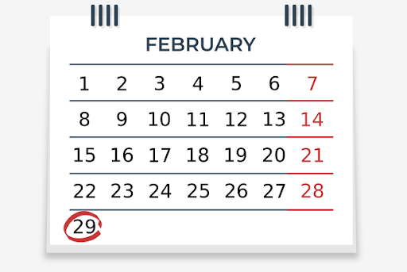
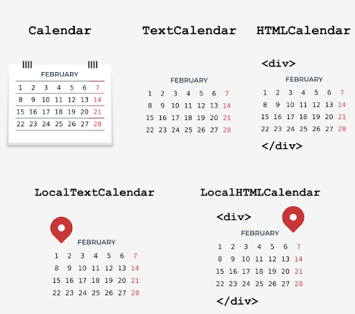

# Introduction to the calendar module
In addition to the `datetime` and time `modules`, the Python standard library provides a module called `calendar` which, as the name suggests, offers **calendar-related functions**.

One of them is of course displaying the calendar. It's important that the days of the week are displayed from Monday to Sunday, and each day of the week has its representation in the form of an integer:

| Day of the week | Integer value | Constant             |
|-----------------|---------------|----------------------|
| Monday          | 0             | `calendar.MONDAY`    |
| Tuesday         | 1             | `calendar.TUESDAY`   |
| Wednesday       | 2             | `calendar.WEDNESDAY` |
| Thursday        | 3             | `calendar.THURSDAY`  |
| Friday          | 4             | `calendar.FRIDAY`    |
| Saturday        | 5             | `calendar.SATURDAY`  |
| Sunday          | 6             | `calendar.SUNDAY`    |

The table above shows the representation of the days of the week in the `calendar` module. The first day of the week (Monday) is represented by the value 0 and the `calendar.MONDAY` constant, while the last day of the week (Sunday) is represented by the value 6 and the `calendar.SUNDAY` constant.

For months, integer values are indexed from 1, i.e., January is represented by 1, and December by 12. Unfortunately, there aren't constants that express the months.

## Your first calendar
You will start your adventure with the `calendar` module with a simple function called `calendar`, which allows you to **display the calendar for the whole year**. Let's look at how to use it to display the calendar for 2020. Run the code in the editor and see what happens.
```python
import calendar
print(calendar.calendar(2020))
```
The result displayed is similar to the result of the _cal_ command available in Unix. If you want to change the default calendar formatting, you can use the following parameters:
- `w` – date column width (default 2)
- `l` – number of lines per week (default 1)
- `c` – number of spaces between month columns (default 6)
- `m` – number of columns (default 3)

The calendar function requires you to specify the year, while the other parameters responsible for formatting are optional. We encourage you to try these parameters yourself.

A good alternative to the above function is the function called `prcal`, which also takes the same parameters as the `calendar` function, but doesn't require the use of the `print` function to display the calendar. Its use looks like this:
```python
import calendar
calendar.prcal(2020)
```

### Calendar for a specific month
The `calendar` module has a function called `month`, which allows you to display a calendar for a specific month. Its use is really simple, you just need to specify the year and month - check out the code in the editor.
```python
import calendar
print(calendar.month(2020, 11))
```
The example displays the calendar for November 2020. As in the `calendar` function, you can change the default formatting using the following parameters:
- `w` – date column width (default 2)
- `l` – number of lines per week (default 1)

> [!NOTE]
> You can also use the `prmonth` function, which has the same parameters as the `month` function, but doesn't require you to use the `print` function to display the calendar.

### The `setfirstweekday()` function
As you already know, by default in the `calendar` module, the first day of the week is Monday. However, you can change this behavior using a function called `setfirstweekday`.

Do you remember the table showing the days of the week and their representation in the form of integer values? It's time to use it, because the `setfirstweekday` method requires a parameter expressing the day of the week in the form of an integer value. Take a look at the example in the editor.
```python
import calendar

calendar.setfirstweekday(calendar.SUNDAY)
calendar.prmonth(2020, 12)
```
The example uses the `calendar.SUNDAY` constant, which contains a value of 6. Of course, you could pass this value directly to the `setfirstweekday` function, but the version with a constant is more elegant.

As a result, we get a calendar showing the month of December 2020, in which the first day of all the weeks is Sunday.

### The `weekday()` function
Another useful function provided by the `calendar` module is the function called `weekday`, which returns the day of the week as an integer value for the given year, month, and day. Let's see it in practice.

Run the code in the editor to check the day of the week that falls on December 24, 2020.
```python
import calendar
print(calendar.weekday(2020, 12, 24))
```
Result:
```
3
```
The `weekday` function returns 3, which means that December 24, 2020 is a Thursday.

### The `weekheader()` function
You've probably noticed that the calendar contains weekly headers in a shortened form. If needed, you can get short weekday names using the `weekheader` method.

The `weekheader` method requires you to specify the width in characters for one day of the week. If the width you provide is greater than 3, you'll still get the abbreviated weekday names consisting of three characters.

So let's look at how to get a smaller header. Run the code in the editor.
```python
import calendar
print(calendar.weekheader(2))
```
Result:
```
Mo Tu We Th Fr Sa Su
```

> [!NOTE]
> If you change the first day of the week, e.g., using the `setfirstweekday` function, it'll affect the result of the `weekheader` function.

### How do we check if a year is a leap year?
The `calendar` module provides two useful functions to check whether years are leap years.

<p align="center">
  
</p>

The first one, called `isleap`, returns `True` if the passed year is leap, or `False` otherwise. The second one, called `leapdays`, returns the number of leap years in the given range of years.

Run the code in the editor.
```python
import calendar

print(calendar.isleap(2020))
print(calendar.leapdays(2010, 2021))  # Up to but not including 2021.
```
Result:
```
True
3
```
In the example, we obtain the result 3, because in the period from 2010 to 2020 there are only three leap years (note: 2021 is not included). They are the years 2012, 2016, and 2020.

## Classes for creating calendars
The presented functions aren't everything the `calendar` module offers. In addition to them, we can use the following classes:
- `calendar.Calendar` – provides methods to prepare calendar data for formatting;
- `calendar.TextCalendar` – is used to create regular text calendars;
- `calendar.HTMLCalendar` – is used to create HTML calendars;
- `calendar.LocalTextCalendar` – is a subclass of the `calendar.TextCalendar` class. The constructor of this class takes the locale parameter, which is used to return the appropriate months and weekday names.
- `calendar.LocalHTMLCalendar` – is a subclass of the `calendar.HTMLCalendar` class. The constructor of this class takes the locale parameter, which is used to return the appropriate months and weekday names.

<p align="center">
  
</p>

Time to try something new. Let's take a closer look at the methods of the calendar class.

### Creating a Calendar object
The `Calendar` class constructor takes one optional parameter named `firstweekday`, by default equal to 0 (Monday).

The `firstweekday` parameter must be an integer between 0-6. For this purpose, we can use the already-known constants - look at the code in the editor.
```python
import calendar  

c = calendar.Calendar(calendar.SUNDAY)

for weekday in c.iterweekdays():
    print(weekday, end=" ")
```
The program will output the following result:
```
6 0 1 2 3 4 5
```
The code example uses the `Calendar` class method named `iterweekdays`, which returns an iterator for week day numbers.

The first value returned is always equal to the value of the `firstweekday` property. Because in our example the first value returned is 6, it means that the week starts on a Sunday.

### The `itermonthdates()` method
The `Calendar` class has several methods that return an iterator. One of them is the `itermonthdates` method, which requires specifying the year and month.

As a result, all days in the specified month and year are returned, as well as all days before the beginning of the month or the end of the month that are necessary to get a complete week.

Each day is represented by a `datetime.date` object. Take a look at the example in the editor.
```python
import calendar  

c = calendar.Calendar()

for date in c.itermonthdates(2019, 11):
    print(date, end=" ")
```
The code displays all days in November 2019. Because the first day of November 2019 was a Friday, the following days are also returned to get the complete week: 10/28/2019 (Monday) 10/29/2019 (Tuesday) 10/30/2019 (Wednesday) 10/31/2019 (Thursday).

The last day of November 2019 was a Saturday, so in order to keep the complete week, one more day is returned 12/01/2019 (Sunday).

### Other methods that return iterators
Another useful method in the `Calendar` class is the method called `itermonthdays`, which takes year and month as parameters, and then returns the iterator to the days of the week represented by numbers.

Take a look at the example.
```python
import calendar  

c = calendar.Calendar()

for iter in c.itermonthdays(2019, 11):
    print(iter, end=" ")
```
You’ll have certainly noticed the large number of `0`s returned as a result of the example code. These are days outside the specified month range that are added to keep the complete week.

The first four zeros represent 10/28/2019 (Monday) 10/29/2019 (Tuesday) 10/30/2019 (Wednesday) 10/31/2019 (Thursday). The remaining numbers are days in the month, except the last value of 0, which replaces the date 12/01/2019 (Sunday).

There are four other similar methods in the `Calendar` class that differ in data returned:
- `itermonthdays2` – returns days in the form of tuples consisting of a day of the month number and a week day number;
- `itermonthdays3` – returns days in the form of tuples consisting of a year, a month, and a day of the month numbers. This method has been available since version 3.7;
- `itermonthdays4` – returns days in the form of tuples consisting of a year, a month, a day of the month, and a day of the week numbers. This method has been available since Python version 3.7.

For testing purposes, use the example above and see how the return values of the described methods look in practice.

### The `monthdays2calendar()` method
The `Calendar` class has several other useful methods that you can learn more about in the documentation (https://docs.python.org/3/library/calendar.html).

One of them is the `monthdays2calendar` method, which takes the year and month, and then returns a list of weeks in a specific month. Each week is a tuple consisting of day numbers and weekday numbers. Look at the code in the editor.
```python
import calendar  

c = calendar.Calendar()

for data in c.monthdays2calendar(2020, 12):
    print(data)
```
Note that the days numbers outside the month are represented by 0, while the weekday numbers are a number from 0-6, where 0 is Monday and 6 is Sunday.
