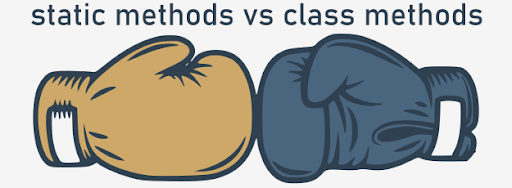

# Different faces of Python methods
Until now, we’ve been implementing methods that have performed operations on the instances (objects), and in particular the attributes of the instance, so we’ve called them **instance methods**.

The instance methods, as the first parameter, take the `self` parameter, which is their hallmark. It’s worth emphasizing and remembering that `self` allows you to refer to the instance. Of course, it follows that in order to successfully use the instance method, the instance must have previously existed.

The code in the editor demonstrates the idea presented above.
```python
class Example:
    def __init__(self, value):
        self.__internal = value

    def get_internal(self):
        return self.__internal

example1 = Example(10)
example2 = Example(99)
print(example1.get_internal())
print(example2.get_internal())
```
Each of the `Example` class objects has its own copy of the instance variable `__internal`, and the `get_internal()` method allows you to read the instance variable specific to the indicated instance. This is possible thanks to using `self`.

The name of the parameter `self` was chosen arbitrarily and you can use a different word, but you must do it consistently in your code. It follows from the convention that `self` literally means a reference to the instance.

## The static and class methods
Two other types of method can also be used in the Object Oriented Approach (OOP):
- class methods;
- static methods.

These alternative types of method should be understood as tool methods, extending our ability to use classes, not necessarily requiring the creation of class instances to use them.

As a result, our perception of the Python class concept is extended by two types of specialized methods.

### Class methods
Class methods are methods that, like class variables, work on the class itself, and not on the class objects that are instantiated. You can say that they are methods bound to the class, not to the object.

When can this be useful?

There are several possibilities, here are the two most popular:
1. we control access to class variables, e.g., to a class variable containing information about the number of created instances or the serial number given to the last produced object, or we modify the state of the class variables;
2. we need to create a class instance in an alternative way, so the class method can be implemented by an alternative constructor.

Convention
- To be able to distinguish a class method from an instance method, the programmer signals it with the `@classmethod` decorator preceding the class method definition.
- Additionally, the first parameter of the class method is `cls`, which is used to refer to the class methods and class attributes.

> [!NOTE]
> As with `self`, `cls` was chosen arbitrarily (i.e., you can use a different name, but you must do it consistently).

You can find an example of a class method implementation in the editor.
```python
class Example:
    __internal_counter = 0

    def __init__(self, value):
        Example.__internal_counter +=1

    @classmethod
    def get_internal(cls):
        return '# of objects created: {}'.format(cls.__internal_counter)

print(Example.get_internal())

example1 = Example(10)
print(Example.get_internal())

example2 = Example(99)
print(Example.get_internal())
```
The result of the code:
```
# of objects created: 0
# of objects created: 1
# of objects created: 2
```

The `get_internal()` method is a class method. This has been signaled to the Python interpreter by using an appropriate decorator. Additionally, the method uses the `cls` parameter to access the class variable appropriate for the Example class.

Of course, you can use the reference to `Example.__internal_counter`, but this will be inconsistent with the convention and the code loses its effectiveness in communicating its own meaning.

An exception is the `__init__()` method, which by definition is an instance method, so it can’t use `cls`, and as a result it references the class variable by the `Example` prefix.

The code presented in the editor shows how to use the class method as an alternative constructor, allowing you to handle an additional argument.
```python
class Car:
    def __init__(self, vin):
        print('Ordinary __init__ was called for', vin)
        self.vin = vin
        self.brand = ''

    @classmethod
    def including_brand(cls, vin, brand):
        print('Class method was called')
        _car = cls(vin)
        _car.brand = brand
        return _car

car1 = Car('ABCD1234')
car2 = Car.including_brand('DEF567', 'NewBrand')

print(car1.vin, car1.brand)
print(car2.vin, car2.brand)
```
The `including_brand` method is a class method, and expects a call with two parameters ('vin' and 'brand'). The first parameter is used to create an object using the standard `__init__` method.

In accordance with the convention, the creation of a class object (i.e., calling the `__init__` method, among other things) is done using `cls(vin)`.

Then the class method performs an additional task – in this case, it supplements the `brand` instance variable and finally returns the newly created object.

The result of the presented code:
```
Ordinary __init__ was called for ABCD1234
Class method was called
Ordinary __init__ was called for DEF567
ABCD1234 
DEF567 NewBrand
```
As you can see, for the car with `vin=ABCD1234`, the `__init__` method has been called by default.

For the car with `vin=DEF567`, the class method has been called, which calls the `__init__` method and then performs additional actions and returns the object.

### Static methods
Static methods are methods that do not require (and do not expect!) a parameter indicating the class object or the class itself in order to execute their code.

When can it be useful?
1. When you need a utility method that comes in a class because it is semantically related, but does not require an object of that class to execute its code;
2. consequently, when the static method does not need to know the state of the objects or classes.

Convention
- To be able to distinguish a static method from a class method or instance method, the programmer signals it with the `@staticmethod` decorator preceding the class method definition.
- Static methods do not have the ability to modify the state of objects or classes, because they lack the parameters that would allow this.

#### An example of using the static method
Imagine a class that represents a bank account, that is, a class that provides methods to operate on bank accounts. This may include a method that validates the correctness of the account number recorded in accordance with the IBAN standard.

This is a great place to introduce a static method, which, provided by the bank account class, will be used to validate the character string and will answer the question: can a given character string be an account number before the object is created?

To shorten the size of the sample code, the static method responsible for validation checks only the length of the string, and only those numbers whose length is 20 characters are treated as valid.

Note that for the purpose of validating three different character strings, it isn’t necessary to create class objects.
```python
class Bank_Account:
    def __init__(self, iban):
        print('__init__ called')
        self.iban = iban
            
    @staticmethod
    def validate(iban):
        if len(iban) == 20:
            return True
        else:
            return False


account_numbers = ['8' * 20, '7' * 4, '2222']

for element in account_numbers:
    if Bank_Account.validate(element):
        print('We can use', element, ' to create a bank account')
    else:
        print('The account number', element, 'is invalid')
```
The result of the code presented:
```
We can use 88888888888888888888  to create a bank account
The account number 7777 is invalid
The account number 2222 is invalid
```

## Using static and class methods - comparison
The time has come to compare the use of class and static methods:
- a class method requires `cls` as the first parameter and a static method does not;
- a class method has the ability to access the state or methods of the class, and a static method does not;
- a class method is decorated by `@classmethod` and a static method by `@staticmethod`;
- a class method can be used as an alternative way to create objects, and a static method is only a utility method.

<p align="center">
  
</p>
