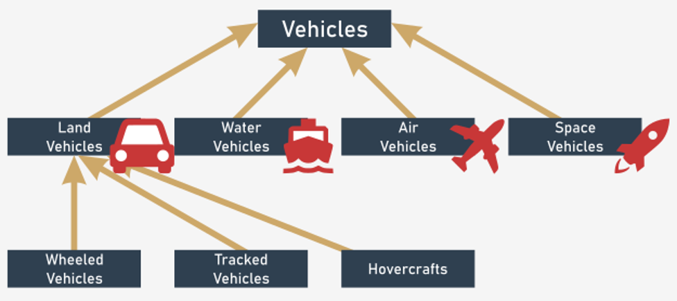

# Composition vs Inheritance

## Two ways to the same destination: Inheritance
So far we've been using and following the inheritance concept when modeling our classes to represent real-life issues. Inheritance is a great concept, one of the most important foundations of object-oriented programming that models a tight relation between two classes: the base class and the derived class, called a subclass.

The result of this relation is a subclass class that inherits **all** methods and **all** properties of the base class, and allows a subclass to extend everything that has been inherited. By extending a base class, you are creating a more specialized class. Moreover, we say that these classes are **tightly** coupled.

**Inheritance** models what is called an **is a** relation.

Examples:
- a Laptop **is a** (specialized form of) Computer;
- a Square **is a** (specialized form of) Figure;
- a Hovercraft **is a** Vehicle.

The primary use of inheritance is to reuse the code. If two classes perform similar tasks, we can create a common base class for them, to which we transfer identical methods and properties. This will facilitate testing and potentially increase application reliability in case of changes. In case of any problems, it will also be easier to find the cause of the error.

As a result, your inheriting classes could form a tree.

<p align="center">
  
</p>

Note: the hierarchy grows from top to bottom, like tree roots, not branches. The most general, and the widest, class is always at the top (the superclass) while its descendants are located below (the subclasses).

What could be inherited in this “Vehicles” structure?

All classes derived from Vehicles own properties and methods responsible for informing the user of its mileage, starting and stopping the vehicle, fueling, etc. Once you inherit a “mileage” property from the base class, then it is present in all subclasses.

The same principle should apply to the `tank()` method responsible for fueling every vehicle object, so the polymorphism, another pillar of the OOP allowing you to call the `tank()` method on every “vehicle” object, is easily achieved.

The inheritance concept is a powerful one, but you should remember that with great power comes great responsibility. When you are reckless, then with the inheritance (especially multiple inheritances) you can create a huge, complex, and hierarchical structure of classes.

This hierarchy would be hard to understand, debug, and extend. This phenomenon is known as the **class explosion problem**, and is one of the antipatterns of programming.

### Two ways to the same destination: Composition
Inheritance is not the only way of constructing adaptable objects. You can achieve similar goals by using a concept named **composition**.

This concept models another kind of relation between objects; it models what is called a **has a** relation.

Examples:
- a Laptop **has a** network card;
- a Hovercraft **has a** specific engine.

Composition is the process of composing an object using other different objects. The objects used in the composition deliver a set of desired traits (properties and/or methods) so we can say that they act like blocks used to build a more complicated structure.

It can be said that:
- inheritance extends a class's capabilities by adding new components and modifying existing ones; in other words, the complete recipe is contained inside the class itself and all its ancestors; the object takes all the class's belongings and makes use of them;
- composition projects a class as a container (called a composite) able to store and use other objects (derived from other classes) where each of the objects implements a part of a desired class's behavior. It’s worth mentioning that blocks are loosely coupled with the composite, and those blocks could be exchanged any time, even during program runtime.

Let's try to write some code to see how composition works.

Look at the simple code presented in the editor pane.
```python
class Car:
    def __init__(self, engine):
        self.engine = engine


class GasEngine:
    def __init__(self, horse_power):
        self.hp = horse_power

    def start(self):
        print('Starting {}hp gas engine'.format(self.hp))


class DieselEngine:
    def __init__(self, horse_power):
        self.hp = horse_power

    def start(self):
        print('Starting {}hp diesel engine'.format(self.hp))


my_car = Car(GasEngine(4))
my_car.engine.start()
my_car.engine = DieselEngine(2)
my_car.engine.start()
```
The `Car` class is loosely coupled with the `engine` component. It’s a composite object.

The main advantages are:
- whenever a change is applied to the engine object, it does not influence the “Car” class object structure;
- you can decide what your car should be equipped with.

Our `Car` could be equipped with two different kinds of engine – a gas one or a diesel one. The developer's responsibility is to provide methods for both engine classes, named in the same way (here is the `start()` method) to make it work in a polymorphic manner.

To favor composition over inheritance is a design principle that gives the design higher flexibility, as you can choose which domain-specific objects should be incorporated into your ultimate object. It's like arming your base machine with tooling, dedicated to running a specific task, but not building a wide hierarchy structure of classes covering all possible hardware combinations.

In fact, with the composition approach you can more easily respond to the requirement changes regarding classes, as it does not require deep dependency investigations which you would spot while implementing code with the inheritance approach.


On the other hand, there is a clear drawback: composition transfers additional responsibilities to the developer. The developer should assure that all component classes that are used to build the composite should implement the methods named in the same manner to provide a common interface.

In the case of inheritance, if the developer forgets to implement a specific method, the inherited method with the same name will be called. Additionally, in the case of inheritance, the developer has to re-implement only the specific methods, not all of them, to gain a common interface.

Which way should you choose?

Before we answer the question, let's mention a few more things:
- inheritance and composition are not mutually exclusive. Real-life problems are hardly every pure “is a” or “has a” cases;
- treat both inheritance and composition as supplementary means for solving problems;
- there is nothing wrong with composing objects of ... classes that were built using inheritance. The next example code should shed some light on this case.

You should always examine the problem your code is about to solve before you start coding. If the problem can be modeled using an “is a” relation, then the inheritance approach should be implemented.

Otherwise, if the problem can be modeled using a “has a” relation, then the choice is clear – composition is the solution.

Don't hesitate to experiment and re-implement your solution.
```python
class Base_Computer:
    def __init__(self, serial_number):
        self.serial_number = serial_number


class Personal_Computer(Base_Computer):
    def __init__(self, sn, connection):
        super().__init__(sn)
        self.connection = connection
        print('The computer costs $1000')


class Connection:
    def __init__(self, speed):
        self.speed = speed

    def download(self):
        print('Downloading at {}'.format(self.speed))


class DialUp(Connection):
    def __init__(self):
        super().__init__('9600bit/s')

    def download(self):
        print('Dialling the access number ... '.ljust(40), end='')
        super().download()


class ADSL(Connection):
    def __init__(self):
        super().__init__('2Mbit/s')

    def download(self):
        print('Waking up modem  ... '.ljust(40), end='')
        super().download()


class Ethernet(Connection):
    def __init__(self):
        super().__init__('10Mbit/s')

    def download(self):
        print('Constantly connected... '.ljust(40), end='')
        super().download()

# I started my IT adventure with an old-school dial up connection
my_computer = Personal_Computer('1995', DialUp())
my_computer.connection.download()

# then it came year 1999 with ADSL
my_computer.connection = ADSL()
my_computer.connection.download()

# finally I upgraded to Ethernet
my_computer.connection = Ethernet()
my_computer.connection.download()
```
Look at the code presented in the editor pane.
- There is a “Base_Computer” class that represents a generic computer. A generic computer has only a serial number;
- there is a “Personal_Computer” class that is built upon the “Base_Computer” class and represents a computer that is able to connect to the internet;
- there is a generic “Connection” class that holds information about the connection speed and handles the `download()` method. This class is independent of any computer class;
- there are the “Connection” subclasses, more specialized than the “Connection” class:
  - “Dialup”
  - “ADSL”
  - “Ethernet”
  
When we start with our personal computer, we set the serial number to 1995 and equip it with a dialup connection. This an example of composition.

- It is possible to download some data using a slow dialup connection;
- later, we equip our personal computer with a more advanced connection device. There is no need to recreate the computer object – we just arm it with a new component;
- the last steps are about arming our old computer with a fast connection and downloading some data.

When you run the code, you should see the following:
```
The computer costs $1000
Dialling the access number ...          Downloading at 9600bit/s
Waking up modem  ...                    Downloading at 2Mbit/s
Constantly connected...                 Downloading at 10Mbit/s
```
