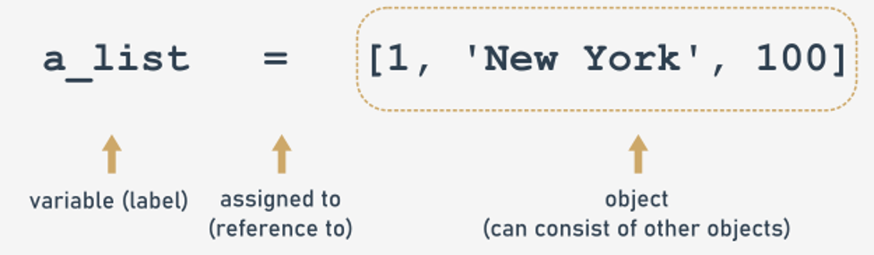
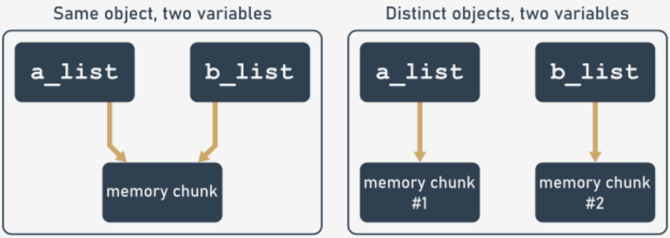
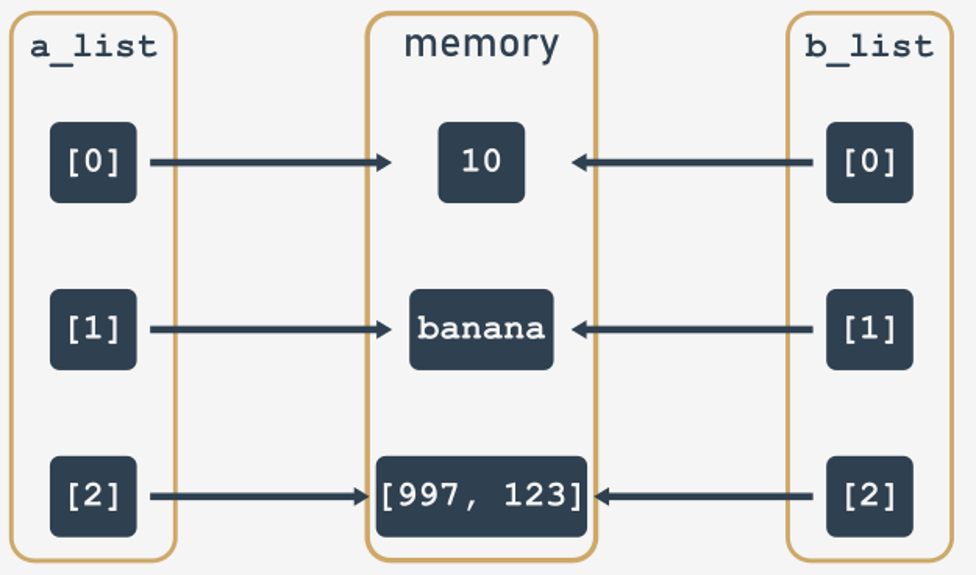
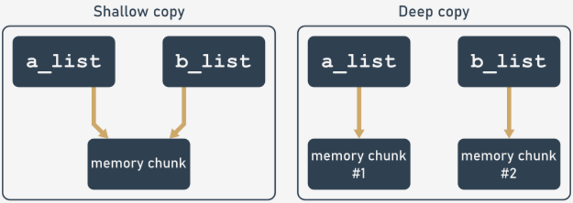
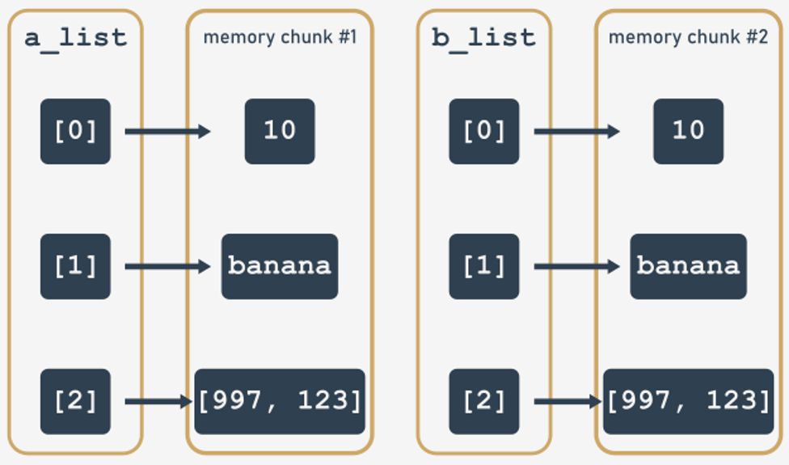

# Shallow and deep copy operations
In this module, you’ll learn how to copy Python objects. Specifically, you'll learn about:
- object: label vs. identity vs. value;
- the id() function and the is operand;
- shallow and deep copies of the objects.

## Copying objects using shallow and deep operations
It’s hard to imagine writing a piece of Python code that performs any kind of data processing without making use of variables. As variables are fundamental elements that allow us to cope with objects, let's talk in detail about variables and objects, and possible ways of copying them.

When you spot the following clause:
```python
a_list = [ 1, 'New York', 100]
```
you should understand it in the following way:

<p align="center">
  
</p>

(Note that an assignment statement is being used, so evaluation of the right side of the clause takes precedence over the left side.)
- At first, an object (a list in this example) is created in the computer's memory. Now the object has its identity;
- then the object is populated with other objects. Now our object has a value;
- finally a variable, which you should treat as a label or name binding, is created, and this label refers to a distinct place in the computer memory.

### The `id()` function
What is that object 'identity'? Why are the object value and label not enough?

The built-in `id()` function returns the 'identity' of an object. This is an integer which is guaranteed to be unique and constant for this object during its lifetime. Two objects with non-overlapping lifetimes may have the same `id()` value.

CPython implementation detail: This is the address of the object in the memory. Don’t treat it as an absolute memory address.

Run the code presented in the right pane to see how the strings are located in the memory.
```python
a_string = '10 days to departure'
b_string = '20 days to departure'

print('a_string identity:', id(a_string))
print('b_string identity:', id(b_string))
```
Remember that the memory addresses are different:
```
a_string identity: 139903223730544
b_string identity: 139903223730624
```
This function is rarely used in applications. More often you’ll use it to debug the code or to experiment while copying objects. The side effect of this infrequent use is that some developers forget about its existence and create their own variables titled `id` to store some kind of identity or identifier.

As a result, a variable called `id` shadows the genuine function and makes it unreachable in the scope in which the variable has been defined. You should remember to avoid such situations!

When you have two variables referring to the same object, the return values of the `id()` function must be the same.
```python
a_string = '10 days to departure'
b_string = a_string

print('a_string identity:', id(a_string))
print('b_string identity:', id(b_string))
```
Run the code presented above to confirm our speculations:
```
a_string identity: 8466704
b_string identity: 8466704
```
In this example, we haven’t created a new list, but just created a new label that references the already created list.

This interesting behavior will be examined on the following pages.

What is the difference between the `==` and `is` operators?

What should you do to compare two objects?

In order to compare two objects, you should start with the `==` operator as usual. This operator compares the values of both operands and checks for value equality. So here we witness a values comparison.

In fact, two distinct objects holding the same values could be compared, and the result would be `True`. Moreover, when you compare two variables referencing the same object, the result would be also `True`.

To check whether both operands refer to the same object or not, you should use the `is` operator. In other words, it responds to the question: “Are both variables referring to the same identity?”

Run the code presented in the editor.
```python
a_string = ['10', 'days', 'to', 'departure']
b_string = a_string

print('a_string identity:', id(a_string))
print('b_string identity:', id(b_string))
print('The result of the value comparison:', a_string == b_string)
print('The result of the identity comparison:', a_string is b_string)

print()

a_string = ['10', 'days', 'to', 'departure']
b_string = ['10', 'days', 'to', 'departure']

print('a_string identity:', id(a_string))
print('b_string identity:', id(b_string))
print('The result of the value comparison:', a_string == b_string)
print('The result of the identity comparison:', a_string is b_string)
```
The output is:
```
a_string identity: 3687888
b_string identity: 3687888
The result of the value comparison: True
The result of the identity comparison: True

a_string identity: 3689048
b_string identity: 9418632
The result of the value comparison: True
The result of the identity comparison: False
```
This could be depicted as follows:

<p align="center">
  
</p>

When you process the data, you’ll come to the point where you may want to have distinct copies of objects that you can modify without automatically modifying the original at the same time.

Let's have a look at the following code. Its intention is to:
- make a real, independent copy of `a_list`, (not just a copy reference). Using `[:]`, which is an array slice syntax, we get a fresh copy of the `a_list` object;
- modify the original object;
- see the contents of both objects.

Pay attention to the code presented below, of which `a_list` is a compound object (an object that contains other objects, like lists, dictionaries, or class instances).
```python
print("Part 1")
print("Let's make a copy")
a_list = [10, "banana", [997, 123]]
b_list = a_list[:]
print("a_list contents:", a_list)
print("b_list contents:", b_list)
print("Is it the same object?", a_list is b_list)

print()
print("Part 2")
print("Let's modify b_list[2]")
b_list[2][0] = 112
print("a_list contents:", a_list)
print("b_list contents:", b_list)
print("Is it the same object?", a_list is b_list)
```
When you run the code, you get the following output:
```
Part 1
Let's make a copy
a_list contents: [10, 'banana', [997, 123]]
b_list contents: [10, 'banana', [997, 123]]
Is it the same object? False

Part 2
Let's modify b_list[2]
a_list contents: [10, 'banana', [112, 123]]
b_list contents: [10, 'banana', [112, 123]]
Is it the same object? False
```
So, despite the fact that `b_list` is a copy of `a_list`, modifying `b_list` results in a modification of the `a_list` object.

The explanation of the behavior presented on the previous page is:
- the `a_list` object is a compound object;
- we’ve run a **shallow copy** that constructs a new compound object, `b_list` in our example, and then populated it with references to the objects found in the original;
- as you can see, a shallow copy is only one level deep. The copying process does not recurse and therefore does not create copies of the child objects, but instead populates `b_list` with references to the already existing objects.

<p align="center">
  
</p>

If you want to make an independent copy of a compound object (list, dictionary, custom class instance) you should make use of deep copy, which:
- constructs a new compound object and then, recursively, inserts copies into it of the objects found in the original;
- takes more time to complete, as there are many more operations to be performed;
- is implemented by the `deepcopy()` function, delivered by the python `copy` module

The general idea should be depicted like this:

<p align="center">
  
</p>

A code creating an independent copy of the a_list object should look like the code presented in the right pane.

The graphical representation should look like the following:

<p align="center">
  
</p>

The 'copy' module contains a function for shallow copying: copy(). Of course, you could say that for copying lists there is already the [:] notation, or a_list=list(b_list), and for dictionaries you could use a_dict = dict(b_dict).

But think about making use of polymorphism when you need a universal function to copy any type object, so that in that case using a copy() function is the smart way to accomplish the task.
