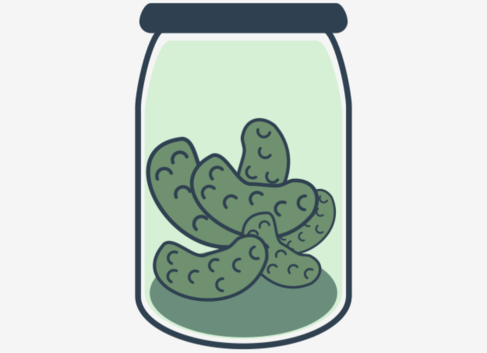
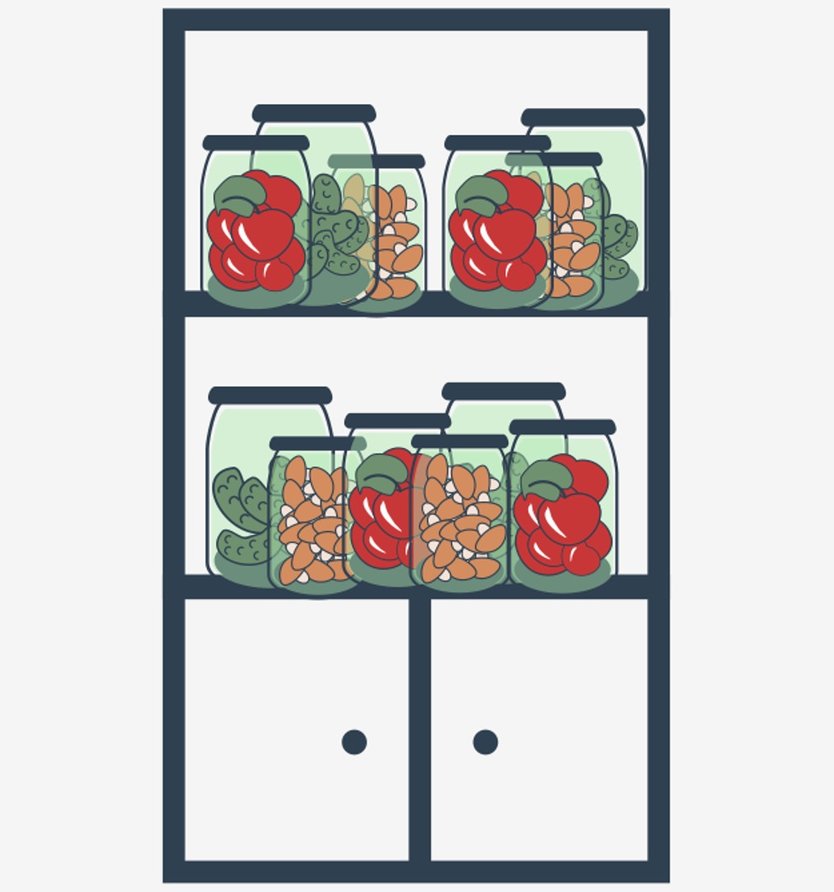

# Serialization of Python objects using the `pickle` module
In this section, you will learn how to persist Python objects for later use.

**Pickling** is the process of preserving or extending the lifespan of food. The resulting food is called a pickle, and to prevent ambiguity, prefaced with the 'pickled' adjective.

<p align="center">
  
</p>

Have you ever considered saving the output of your data processing for later use?

The simplest way to persist outcomes is to generate a flat text file and to write your outcomes. It’s a very simple thing to do way which is not suitable for persisting sets of different types of objects or nested structures.

### Serialization of Python objects
In Python, object **serialization** is the process of converting an object structure into a stream of bytes to store the object in a file or database, or to transmit it via a network. This byte stream contains all the information necessary to reconstruct the object in another Python script.

This reverse process is called **deserialization**.

Python objects can also be serialized using a module called `pickle`, and using this module, you can 'pickle' your Python objects for later use.

The `pickle` module is a very popular and convinient module for data serialization in the world of Pythonistas.

So, what can be pickled and then unpickled?

The following types can be pickled:
- `None`, booleans;
- integers, floating-point numbers, complex numbers;
- strings, bytes, bytearrays;
- tuples, lists, sets, and dictionaries containing pickleable objects;
- objects, including objects with references to other objects (remember to avoid cycles!)
- references to functions and classes, but not their definitions.


Let's pickle our first set of data consisting of:
- a nested dictionary carrying some information about currencies;
- a list containing a string, an integer, and a list.

When you run the code presented below, a new file should be created. Remember to run the code locally.
```python
import pickle

a_dict = dict()
a_dict['EUR'] = {'code':'Euro', 'symbol': '€'}
a_dict['GBP'] = {'code':'Pounds sterling', 'symbol': '£'}
a_dict['USD'] = {'code':'US dollar', 'symbol': '$'}
a_dict['JPY'] = {'code':'Japanese yen', 'symbol': '¥'}

a_list = ['a', 123, [10, 100, 1000]]

with open('multidata.pckl', 'wb') as file_out:
    pickle.dump(a_dict, file_out)
    pickle.dump(a_list, file_out)
```
The code starts with the import statement responsible for loading the pickle module:
```python
import pickle
```
Later you can see that the file handle `file_out` is associated with the file opened for writing in binary mode. It’s important to open the file in binary mode as we are dumping data as a stream of bytes.
```python
with open('multidata.pckl', 'wb') as file_out:
```
Now it’s time to persist the first object with the `dump()` function. This function expects an object to be persisted and a file handle.
```python
pickle.dump(a_dict, file_out)
```
And the second object is persisted in the same way:
```python
pickle.dump(a_list, file_out)
```
In this result, we have created a file that retains the pickled objects.

Now it’s time to unpickle the contents of the file.
```python
import pickle

with open('multidata.pckl', 'rb') as file_in:
    data1 = pickle.load(file_in)
    data2 = pickle.load(file_in)

print(type(data1))
print(data1)
print(type(data2))
print(data2)
```
The presented code is quite simple:
- we’re importing a `pickle` module;
- the file is opened in binary mode and the file handle is associated with the file;
- we consecutively read some portions of data and deserialize it with the `load()` function;
- finally, we examine the type and contents of the objects.

Pay attention to the fact that with the `pickle` module, you have to remember the order in which the objects were persisted and the deserialization code should follow the same order.

At the beginning of the serialization module, we mentioned that serialized objects could be persisted in a database or sent via a network. This implies another two functions corresponding to the `pickle.dumps()` and `pickle.loads()` functions:
- `pickle.dumps(object_to_be_pickled)` – expects an initial object, returns a byte object. This byte object should be passed to a database or network driver to persist the data;
- `pickle.loads(bytes_object)` – expects the bytes object, returns the initial object.

An example of in situ serialization and deserialization is presented below.
```python
import pickle

a_list = ['a', 123, [10, 100, 1000]]
bytes = pickle.dumps(a_list)
print('Intermediate object type, used to preserve data:', type(bytes))

# now pass 'bytes' to appropriate driver

# therefore when you receive a bytes object from an appropriate driver you can deserialize it
b_list = pickle.loads(bytes)
print('A type of deserialized object:', type(b_list))
print('Contents:', b_list)
```

Remember that attempts to pickle non-pickleable objects will raise the `PicklingError` exception.

Trying to pickle a highly recursive data structure (mind the cycles) may exceed the maximum recursion depth, and a `RecursionError` exception will be raised in such cases.

Note that functions (both built-in and user-defined) are pickled by their name reference, not by any value. This means that only the function name is pickled; neither the function’s code, nor any of its function attributes, are pickled.

Similarly, classes are pickled by named reference, so the same restrictions in the unpickling environment apply. Note that none of the class’s code or data are pickled.


This is done on purpose, so you can fix bugs in a class or add methods to the class, and still load objects that were created with an earlier version of the class.

Hence, your role is to ensure that the environment where the class or function is unpickled is able to import the class or function definition. In other words, the function or class must be available in the namespace of your code reading the pickle file.

Otherwise, an `AtrributeError` exception will be raised.

The following code demonstrates the situation for function definition pickling:
```python
import pickle

def f1():
    print('Hello from the jar!')

with open('function.pckl', 'wb') as file_out:
    pickle.dump(f1, file_out)
```
We see no errors, so we might conclude that `f1()` was pickled successfully, and now we can retrieve it from the file.

Run the code in the editor and see what happens.
```python
import pickle

with open('function.pckl', 'rb') as file_in:
    data = pickle.load(file_in)

print(type(data))
print(data)
data()
```
Unfortunately, the result proves that no code was persisted:
```
Traceback (most recent call last):
  File "main.py", line 4, in <module>
    data = pickle.load(file_in)
AttributeError: Can't get attribute 'f1' on <module '__main__' from 'main.py'>
```

Here’s the same example regarding class definition and object pickling:
```python
import pickle

class Cucumber:
    def __init__(self):
        self.size = 'small'

    def get_size(self):
        return self.size

cucu = Cucumber()

with open('cucumber.pckl', 'wb') as file_out:
    pickle.dump(cucu, file_out)
```
We see no errors, so we might conclude that the `Cucumber` class and object were pickled successfully, and now we can retrieve them from the file. In fact, only the object is persisted but not its definition allowing us to determine the attribute layout:
```python
import pickle

with open('cucumber.pckl', 'rb') as file_in:
    data = pickle.load(file_in)

print(type(data))
print(data)
print(data.size)
print(data.get_size())
```
If you run the code, you receive:
```
Traceback (most recent call last):
  File "main.py", line 4, in <module>
    data = pickle.load(file_in)
AttributeError: Can't get attribute 'Cucumber' on <module '__main__' from 'main.py'>
```

The remedy for the above problems is: the code that calls the `load()` or `loads()` functions of `pickle` should already know the function/class definition.

### Summary
A few additional words about the pickle module:
- it’s a Python implementation of the serialization process, so the pickled data cannot be exchanged with programs written in other languages like Java or C++. In such cases, you should think about the JSON or XML formats, which could be less convenient than pickling, but when assimilated are more powerful than pickling;
- the pickle module is constantly evolving, so the binary format may differ between different versions of Python. Pay attention that both serializing and deserializing parties are making use of the same pickle versions;
- the pickle module is not secured against erroneous or maliciously constructed data. Never unpickle data received from an untrusted or unauthenticated source.

# Serialization of Python objects using the `shelve` module
As you remember, the `pickle` module is used for serializing objects as a single byte stream. Both serializing and deserializing parties must abide by the order of all the elements placed into a file or database, or sent via a network.

There is another handy module, called `shelve`, that is built on top of `pickle`, and implements a **serialization dictionary** where objects are pickled and associated with a key. The keys must be ordinary strings, because the underlying database (dbm) requires strings.

Therefore, you can open your shelved data file and access your pickled objects via the keys the way you do when you access Python dictionaries. This could be more convenient for you when you’re serializing many objects.

Sound familiar? An analogy to the rack with shelves in the pantry is a correct one. Looks delicious, doesn’t it?

<p align="center">
  
</p>

Using shelve is quite easy and intuitive.

First, let's import the appropriate module and create an object representing a file-based database:
```python
import shelve
my_shelve = shelve.open('first_shelve.shlv', flag='w')
```
The meaning of the optional flag parameter:

| Value | Meaning                                                                                          |
|-------|--------------------------------------------------------------------------------------------------|
| `r`   | Open existing database for reading only                                                          |
| `w`   | Open existing database for reading and writing                                                   |
| `c`   | Open database for reading and writing, creating it if it doesn’t exist (this is a default value) |
| `n`   | Always create a new, empty database, open for reading and writing                                |

Now our shelve object is ready for action, so let's insert a few items and close the shelve object.
```python
my_shelve['USD'] = {'code':'US dollar', 'symbol': '$'}
my_shelve['JPY'] = {'code':'Japanese yen', 'symbol': '¥'}
my_shelve.close()
```
Now let's open the shelve file to demonstrate direct access to the elements (contrary to the sequential access to items when we use pickles).
```python
new_shelve = shelve.open(shelve_name)
print(new_shelve['USD'])
new_shelve.close()
```
The final code is presented below.
```python
import shelve

shelve_name = 'first_shelve.shlv'

my_shelve = shelve.open(shelve_name, flag='c')
my_shelve['EUR'] = {'code':'Euro', 'symbol': '€'}
my_shelve['GBP'] = {'code':'Pounds sterling', 'symbol': '£'}
my_shelve['USD'] = {'code':'US dollar', 'symbol': '$'}
my_shelve['JPY'] = {'code':'Japanese yen', 'symbol': '¥'}
my_shelve.close()

new_shelve = shelve.open(shelve_name)
print(new_shelve['USD'])
new_shelve.close()
```

You should treat a shelve object as a Python dictionary, with a few additional notes:
- the keys must be strings;
- Python puts the changes in a buffer which is periodically flushed to the disk. To enforce an immediate flush, call the `sync()` method on your shelve object;
- when you call the `close()` method on an shelve object, it also flushes the buffers.

When you treat a shelve object like a Python dictionary, you can make use of the dictionary utilities:
- the `len()` function;
- the `in` operator;
- the `keys()` and `items()` methods;
- the `update` operation, which works the same as when applied to a Python dictionary;
- the `del` instruction, used to delete a key-value pair.

After running the code, you'll notice additionally that some files are created to support the database. Don’t try to alter those files with external utilities, because your shelve may become inconsistent, resulting in read/write errors.

The use of shelve is really easy and effective. Moreover, you should know that you could simulate the shelve by pickling the whole dictionary, but the shelve module uses the memory more efficiently, so whenever you need access to pickled objects, employ a shelve.

And the final remark is:
- because the `shelve` module is backed by `pickle`, it isn’t safe to load a `shelve` from an untrusted source. As with `pickle`, loading a `shelve` can execute arbitrary code.
