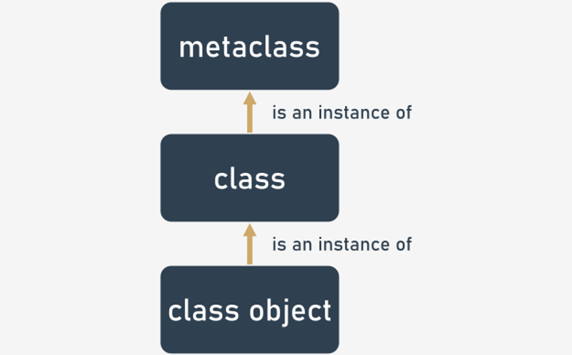

# Metaprogramming

## Introduction to metaclasses
Metaprogramming is a programming technique in which computer programs have the ability to modify their own or other programs’ codes. It may sound like an idea from a science fiction story, but the idea was born and implemented in the early 1960s.

For Python, code modifications can occure while the code is being executed, and you might have already experienced it while implementing decorators, overriding operators, or even implementing the properties protocol.

It may look like syntactic sugar, because in many cases metaprogramming allows programmers to minimize the number of lines of code to express a solution, in turn reducing development time.

But the truth is that this technique could be used for tool preparation; those tools could be applied to your code to make it follow specific programming patterns, or to help you create a coherent API (Application Programming Interface).

Another example of metaprogramming is the **metaclass** concept, which is one of the most advanced concepts presented in this course.

[Tim Peters](https://en.wikipedia.org/wiki/Tim_Peters_(software_engineer)), the Python guru who authored the **Zen of Python**, expressed his feelings about metaclasses in the **comp.lang.python** newsgroup on 12/22/2002:
- **Metaclasses** are deeper magic than 99% of users should ever worry about. If you wonder whether you need them, you don't (the people who actually need them know with certainty that they need them, and don't need an explanation about why).

Don’t worry, we'll touch on the “deeper magic” in a benign way. Understanding Python metaclasses is worthwhile, because it leads to a better understanding of what is happening under Python's hood when classes are created.

In Python, a metaclass is a class whose instances are classes. Just as an ordinary class defines the behavior of certain objects, a metaclass allows for the customization of class instantiation.

The functionality of the metaclass partly coincides with that of class decorators, but metaclasses act in a different way than decorators:
- decorators bind the names of decorated functions or classes to new callable objects. Class decorators are applied when classes are instantiated;
- metaclasses redirect class instantiations to dedicated logic, contained in metaclasses. Metaclasses are applied when class definitions are read to create classes, well before classes are instantiated.

Metaclasses usually enter the game when we program advanced modules or frameworks, where a lot of precise automation must be provided.

The typical use cases for metaclasses:
- logging;
- registering classes at creation time;
- interface checking;
- automatically adding new methods;
- automatically adding new variables.

In Python's approach, everything is an object, and every object has some type associated with it. To get the type of any object, make use of the `type()` function.
```python
class Dog:
    pass


age = 10
codes = [33, 92]
dog = Dog()

print(type(age))
print(type(codes))
print(type(dog))
print(type(Dog))
```
Run the above code to see the `type()` function in action.
```
<class 'int'>
<class 'list'>
<class '__main__.Dog'>
<class 'type'>
```
We can see that objects in Python are defined by their inherent classes.

The example also shows that we can create our own classes, and those classes will be instances of the **type** special class, which is the default **metaclass** responsible for creating classes.

Let's perform one more experiment that will respond to the question: what type of objects are built-in classes and the metaclass `type`?
```python
for t in (int, list, type):
    print(type(t))
```
The results are quite interesting:
```
<class 'type'>
<class 'type'>
<class 'type'>
```
These observations lead us to the following conclusions:
- metaclasses are used to create classes;
- classes are used to create objects;
- the type of the metaclass `type` is `type` – no, that is not a typo.

<p align="center">
  
</p>

To extend the above observations, it’s important to add:
- `type` is a class that generates classes defined by a programmer;
- metaclasses are subclasses of the `type` class.

Before we start creating our own metaclasses, it’s important to understand some more details regarding classes and the process of creating them.

We should get familiar with some special attributes:
- `__name__` – inherent for classes; contains the name of the class;
- `__class__` – inherent for both classes and instances; contains information about the class to which a class instance belongs;
- `__bases__` – inherent for classes; it’s a tuple and contains information about the base classes of a class;
- `__dict__` – inherent for both classes and instances; contains a dictionary (or other type mapping object) of the object's attributes.

```python
class Dog:
    pass

dog = Dog()
print('"dog" is an object of class named:', Dog.__name__)
print()
print('class "Dog" is an instance of:', Dog.__class__)
print('instance "dog" is an instance of:', dog.__class__)
print()
print('class "Dog" is  ', Dog.__bases__)
print()
print('class "Dog" attributes:', Dog.__dict__)
print('object "dog" attributes:', dog.__dict__)
```
The output of the code :
```
"dog" is an object of class named: Dog

class "Dog" is an instance of: <class 'type'>
instance "dog" is an instance of: <class '__main__.Dog'>

class "Dog" is   (<class 'object'>,)

class "Dog" attributes: {'__module__': '__main__', '__dict__': <attribute '__dict__' of 'Dog' objects>, '__weakref__': <attribute '__weakref__' of 'Dog' objects>, '__doc__': None}

object "dog" attributes: {}
```

The same information stored in `__class__` could be retrieved by calling a `type()` function with **one argument**:
```python
for element in (1, 'a', True):
    print(element, 'is', element.__class__, type(element))
```
The results are:
```
1 is <class 'int'> <class 'int'>
a is <class 'str'> <class 'str'>
True is <class 'bool'> <class 'bool'>
```

When the `type()` function is called with **three arguments**, then it dynamically creates a new class.

For the invocation of `type(, , )`:
- the argument specifies the class name; this value becomes the `__name__` attribute of the class;
- the argument specifies a **tuple of the base classes** from which the newly created class is inherited; this argument becomes the `__bases__` attribute of the class;
- the argument specifies a **dictionary containing method definitions and variables** for the class body; the elements of this argument become the `__dict__` attribute of the class and state the class namespace.

A very simple example, when both `bases` and `dictionary` are empty, is presented below.
```python
Dog = type('Dog', (), {})

print('The class name is:', Dog.__name__)
print('The class is an instance of:', Dog.__class__)
print('The class is based on:', Dog.__bases__)
print('The class attributes are:', Dog.__dict__)
```
As a result, we have created the simple class `Dog`.

The more complex example that dynamically creates a fully functional class is presented below.
```python
def bark(self):
    print('Woof, woof')

class Animal:
    def feed(self):
        print('It is feeding time!')

Dog = type('Dog', (Animal, ), {'age':0, 'bark':bark})

print('The class name is:', Dog.__name__)
print('The class is an instance of:', Dog.__class__)
print('The class is based on:', Dog.__bases__)
print('The class attributes are:', Dog.__dict__)

doggy = Dog()
doggy.feed()
doggy.bark()
```
As you can see, the `Dog` class is now equipped with two methods (`feed()` and `bark()`) and the instance attribute `age`.
```
The class name is: Dog
The class is an instance of: <class 'type'>
The class is based on: (<class '__main__.Animal'>,)
The class attributes are: {'age': 0, 'bark': <function bark at 0x00000180C43E4E58>, '__module__': '__main__', '__doc__': None}
It is feeding time!
Woof, woof
```
This way of creating classes, using the type function, is substantial for Python's way of creating classes using the `class` instruction:
- after the `class` instruction has been identified and the class body has been executed, the `class = type(, , )` code is executed;
- the `type` is responsible for calling the `__call__` method upon class instance creation; this method calls two other methods:
  - `__new__()`, responsible for creating the class instance in the computer memory; this method is run before `__init__()`;
  - `__init__()`, responsible for object initialization.

Metaclasses usually implement these two methods (`__init__`, `__new__`), taking control of the procedure of creating and initializing a new class instance. Classes receive a new layer of logic.

Now that we know what’s happening under Python's hood, it’s time to implement our own metaclass.

It’s important to remember that metaclasses are classes that are instantiated to get classes.

The first step is to define a metaclass that derives from the `type` type and arms the class with a 'custom_attribute', as follows:
```python
class My_Meta(type):
    def __new__(mcs, name, bases, dictionary):
        obj = super().__new__(mcs, name, bases, dictionary)
        obj.custom_attribute = 'Added by My_Meta'
        return obj
```
Pay attention to the fact that:
- the class `My_Meta` is derived from `type`. This makes our class a metaclass;
- our own `__new__` method has been defined. Its role is to call the `__new__` method of the parent class to create a new class;
- `__new__` uses `mcs` to refer to the class – it’s just a convention;
- a class attribute is created additionally;
- the class is returned.

Let's make use of the metaclass to create our own, domain-specific class, and check if it’s armed with the custom attribute:
```python
class My_Object(metaclass=My_Meta):
    pass

print(My_Object.__dict__)
```
Pay attention to the fact that:
- a new class has been defined in a way where a custom metaclass is listed in the class definition as a metaclass. This is a way to tell Python to use `My_Meta` as a metaclass, not as an ordinary superclass;
- we are printing the contents of the class `__dict__` attribute to check if the custom attribute is present.
```
{'__module__': '__main__', '__dict__': <attribute '__dict__' of 'My_Object' objects>, '__weakref__': <attribute '__weakref__' of 'My_Object' objects>, '__doc__': None, 'custom_attribute': 'Added by My_Meta'}
```
Indeed, the class attribute has been created.

Congratulations! You have just examined you first metaclass!

### Metaprogramming – another metaclass
Let's run a more serious experiment: try to build a metaclass responsible for completing classes with a method (if missing) to ensure that all your classes are equipped with a method named `greetings`.
```python
def greetings(self):
    print('Just a greeting function, but it could be something more serious like a check sum')

class My_Meta(type):
    def __new__(mcs, name, bases, dictionary):
        if 'greetings' not in dictionary:
            dictionary['greetings'] = greetings
        obj = super().__new__(mcs, name, bases, dictionary)
        return obj

class My_Class1(metaclass=My_Meta):
    pass

class My_Class2(metaclass=My_Meta):
    def greetings(self):
        print('We are ready to greet you!')

myobj1 = My_Class1()
myobj1.greetings()
myobj2 = My_Class2()
myobj2.greetings()
```
As you can see, there is a `greetings()` function defined that greets everyone who interacts with it. In a real-life scenario, it could be a function that is obligatory for every class and is responsible for the consistency of object attributes; it could be a function returning a checksum for some of an attribute's values.

In `My_Class1`, by design, there is no `greetings` function, so when the class is constructed, it is equipped with a default function by the metaclass.

In contrast, in `My_Class2` the `greetings` function is present from the very beginning.

Both classes rely on the same metaclass.

When you run the code, you'll see that both class instances are equipped with `greetings()` methods. For the “poorer” class, it is completed by the metaclass.
```
Just a greeting function, but it could be something more serious like a check sum
We are ready to greet you!
```
This is how metaclasses become very useful – they can control the process of class instantiation, and adjust created classes to conform with selected rules.

### Summary
The concept of metaclasses looks hard at first glance, but if you’re responsible for API design or development, metaclasses are the magic that could help you in your work.

When you want to change your classes automatically, but decorators are not efficient, then metaclasses should help you.

In all other cases, you should agree with Tim Peters that you shouldn’t worry about metaclasses, because many problems can be solved in a simpler way than by using metaclasses.

But still, it’s beneficial to understand metaclasses in order to know when to employ them to solve a class type problem.
