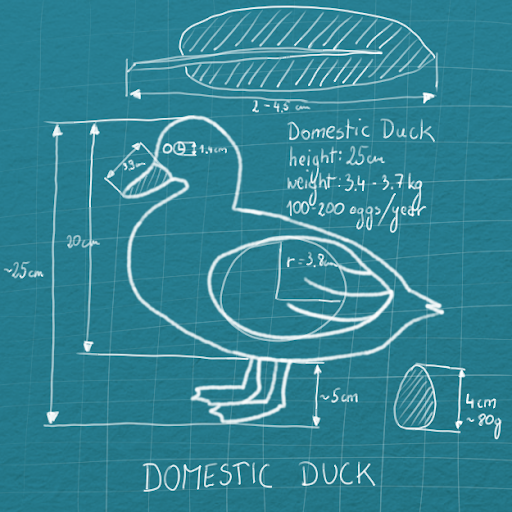

## Introduction to Object-Oriented Programming
This module addresses the advanced Object Oriented Programming (OOP) issues that are at the heart of Python programming.

The object-oriented approach is an evolution of good design practices that go back to the very beginning of computer programming.

This very important approach is present in most computer applications because it allows programmers to model entities representing real-life objects. Moreover, OOP allows programmers to model interactions between objects in order to solve real-life problems in an efficient, comfortable, extendable, and well-structured manner.

This chapter assumes that you are familiar with the basics of OOP, so to establish an understanding of common terms, we should agree on the following definitions:
- **class** — an idea, blueprint, or recipe for an instance;
- **instance** — an instantiation of the class; very often used interchangeably with the term 'object';
- **object** — Python's representation of data and methods; objects could be aggregates of instances;
- **attribute** — any object or class trait; could be a variable or method;
- **method** — a function built into a class that is executed on behalf of the class or object; some say that it’s a 'callable attribute';
- **type** — refers to the class that was used to instantiate the object.

Now that we’re starting to discuss more advanced OOP topics, it’s important to remember that in Python everything is an object (functions, modules, lists, etc.). In the very last section of this module, you'll see that even classes are instances.

Why is everything in Python organized as objects?

Because an object is a very useful culmination of all the terms described above:
- it is an independent instance of class, and it contains and aggregates some specific and valuable data in attributes relevant to individual objects;
- it owns and shares methods used to perform actions.

The following issues will be addressed during this and the next module:
- creation and use of decorators;
- implementation of core syntax;
- class and static methods;
- abstract methods;
- comparison of inheritance and composition;
- attribute encapsulation;
- exception chaining;
- object persistence;
- metaprogramming.

### Class
A **class** expresses an idea; it’s a blueprint or recipe for an instance. The class is something virtual, it can contain lots of different details, and there is always one class of any given type. Think of a class as a building blueprint that represents the architect’s ideas, and class instances as the actual buildings.

Classes describe attributes and functionalities together to represent an idea as accurately as possible.

You can build a class from scratch or, something that is more interesting and useful, employ inheritance to get a more specialized class based on another class.

Additionally, your classes could be used as superclasses for newly derived classes (subclasses).

Python’s class mechanism adds classes with a minimum of new syntax and semantics:
```python
class Duck:
    def __init__(self, height, weight, sex):
        self.height = height
        self.weight = weight
        self.sex = sex

    def walk(self):
        pass

    def quack(self):
        return print('Quack')
```
In the code above, we have defined a class named **Duck**, consisting of some functionalities and attributes.

<p align="center">
  
</p>

A **class** is a place which binds data with the code.

If you run the code, there are no visible effects. The class has been defined, but there is no code making use of it — that’s why you see no effects.

### Instance and Object
An **instance** is one particular physical instantiation of a class that occupies memory and has data elements. This is what `self` refers to when we deal with class instances.

An **object** is everything in Python that you can operate on, like a class, instance, list, or dictionary.

The term **instance** is very often used interchangeably with the term **object**, because **object** refers to a particular instance of a class. It’s a bit of a simplification, because the term **object** is more general than **instance**.

The relation between instances and classes is quite simple: we have one class of a given type and an unlimited number of instances of a given class.

Each instance has its own, individual state (expressed as variables, so objects again) and shares its behavior (expressed as methods, so objects again).

To create instances, we have to instantiate the class:
```python
duckling = Duck(height=10, weight=3.4, sex="male")
drake = Duck(height=25, weight=3.7, sex="male")
hen = Duck(height=20, weight=3.4, sex="female")
```
In the example presented above, we have created three different instances based on the `Duck` class: **duckling**, **drake** and **hen**. We haven't called any object attributes.

### Attribute
An **attribute** is a capacious term that can refer to two major kinds of class traits:
- variables, containing information about the class itself or a class instance; classes and class instances can own many variables;
- methods, formulated as Python functions; they represent a behavior that could be applied to the object.

Each Python object has its own individual set of attributes. We can extend that set by adding new attributes to existing objects, change (reassign) them or control access to those attributes.

It is said that methods are the 'callable attributes' of Python objects. By 'callable' we should understand anything that can be called; such objects allow you to use round parentheses () and eventually pass some parameters, just like functions.

This is a very important fact to remember: methods are called on behalf of an object and are usually executed on object data.

Class attributes are most often addressed with 'dot' notation, i.e., <class>**dot**<attribute>. The other way to access attributes (variables) it to use the `getattr()` and `setattr()` functions.

In our 'duckish' example, there are the following attributes:
- **variables**: `self.height`, `self.weight`, `self.sex` — containing different values for each object;
- **methods**: `__init__`, `walk`, `quack` — common to all objects so far.

**Examples**:
- To call a method, issue: `drake.quack()`;
- To access an attribute, issue: `print(duckling.height)`.

```python
class Duck:
    def __init__(self, height, weight, sex):
        self.height = height
        self.weight = weight
        self.sex = sex

    def walk(self):
        pass

    def quack(self):
        return print('Quack')

duckling = Duck(height=10, weight=3.4, sex="male")
drake = Duck(height=25, weight=3.7, sex="male")
hen = Duck(height=20, weight=3.4, sex="female")

drake.quack()
print(duckling.height)
```
If you run the code, you'll get the following example:
```
Quack
10
```

### Type
A **type** is one of the most fundamental and abstract terms of Python:
- it is the foremost type that any class can be inherited from;
- as a result, if you’re looking for the type of class, then `type` is returned;
- in all other cases, it refers to the class that was used to instantiate the object; it’s a general term describing the type/kind of any object;
- it’s the name of a very handy Python function that returns the class information about the objects passed as arguments to that function;
- it returns a new type object when `type()` is called with three arguments; we'll talk about this in the 'metaclass' section.

Python comes with a number of built-in types, like numbers, strings, lists, etc., that are used to build more complex types. Creating a new class creates a new type of object, allowing new instances of that type to be made.

Information about an object’s class is contained in `__class__`.
```python
class Duck:
    def __init__(self, height, weight, sex):
        self.height = height
        self.weight = weight
        self.sex = sex

    def walk(self):
        pass

    def quack(self):
        return print('Quack')

duckling = Duck(height=10, weight=3.4, sex="male")
drake = Duck(height=25, weight=3.7, sex="male")
hen = Duck(height=20, weight=3.4, sex="female")

print(Duck.__class__)
print(duckling.__class__)
print(duckling.sex.__class__)
print(duckling.quack.__class__)
```
If you run the code presented in the right pane, you'll get the type details of different objects.
```
<class 'type'>
<class '__main__.Duck'>
<class 'str'>
<class 'method'>
```
As we predicted:
- the `Duck` class is of the 'type' type;
- the `duckling` object is an instance type built on the basis of the `Duck` class, and residing in the `__main__` scope;
- the `duckling.sex` is an attribute of the 'str' type;
- `duckling.quack` is an attribute of the 'method' type.

Python allows for variables to be used at the instance level or the class level. Those used at the instance level are referred to as **instance variables**, whereas variables used at the class level are referred to as **class variables**.
### Instance variables
This kind of variable exists when and only when it is explicitly created and added to an object. This can be done during the object's initialization, performed by the `__init__` method, or later at any moment of the object's life. Furthermore, any existing property can be removed at any time.

Each object carries its own set of variables – they don't interfere with one another in any way. The word _instance_ suggests that they are closely connected to the objects (which are class instances), not to the classes themselves. To get access to the instance variable, you should address the variable in the following way: `object`**dot**`variable_name`.

Let's look at how the instance variable is created and accessed in the code presented below.
```python
class Demo:
    def __init__(self, value):
        self.instance_var = value

d1 = Demo(100)
d2 = Demo(200)

print("d1's instance variable is equal to:", d1.instance_var)
print("d2's instance variable is equal to:", d2.instance_var)
```
- `__init__` creates an `instance_var` variable for the instance. The keyword `self` is used to indicate that this variable is created coherently and individually for the instance to make it independent from other instances of the same class;
- we instantiate the class twice, each time passing a different value to be stored inside the object;
- the print instructions prove the fact that instance variable values are kept independently, because the printed values differ.

Another snippet shows that instance variables can be created during any moment of an object's life. Moreover, it lists the contents of each object, using the built-in `__dict__` property that is present for every Python object.
```python
class Demo:
    def __init__(self, value):
        self.instance_var = value

d1 = Demo(100)
d2 = Demo(200)

d1.another_var = 'another variable in the object'

print('contents of d1:', d1.__dict__)
print('contents of d2:', d2.__dict__)
```
This example shows that modifying the instance variable of any object has no impact on all the remaining objects. Instance variables are completely isolated from each other.
```
contents of d1: {'instance_var': 100, 'another_var': 'another variable in the object'}
contents of d2: {'instance_var': 200}
```

### Class variables
Class variables are defined within the class construction, so these variables are available before any class instance is created. To get access to a class variable, simply access it using the class name, and then provide the variable name.
```python
class Demo:
    class_var = 'shared variable'

print(Demo.class_var)
print(Demo.__dict__)
```
Similarly to instance variables, class variables are shown in the class's __dict__ dictionary.
```
shared variable
{'__module__': '__main__', 'class_var': 'shared variable', '__dict__': , '__weakref__': , '__doc__': None}
```

As a class variable is present before any instance of the class is created, it can be used to store some meta data relevant to the class, rather than to the instances:
- fixed information like description, configuration, or identification values;
- mutable information like the number of instances created (if we add a code to increment the value of a designated variable every time we create a class instance)

A class variable is a class property that exists in just one copy, and it is stored outside any class instance. Because it is owned by the class itself, all class variables are shared by all instances of the class. They will therefore generally have the same value for every instance; **but** as the class variable is defined outside the object, it is not listed in the object's `__dict__`.
```python
class Demo:
    class_var = 'shared variable'

d1 = Demo()
d2 = Demo()

print(Demo.class_var)
print(d1.class_var)
print(d2.class_var)

print('contents of d1:', d1.__dict__)
```
Output:
```
shared variable
shared variable
shared variable
contents of d1: {}
```
**Conclusion**: when you want to read the class variable value, you can use a class or class instance to access it.

When you want to set or change a value of the class variable, you should access it via the class, but not the class instance, as you can do for reading.

When you try to set a value for the class variable using the object (a variable referring to the object or `self` keyword) but not the class, you are creating an instance variable that holds the same name as the class variable. The following snippet shows such a case – remember this in order to avoid wasting time hunting for bugs!
```python
class Demo:
    class_var = 'shared variable'

d1 = Demo()
d2 = Demo()

# both instances allow access to the class variable
print(d1.class_var)
print(d2.class_var)
print('.' * 20)

# d1 object has no instance variable
print('contents of d1:', d1.__dict__)
print('.' * 20)

# d1 object receives an instance variable named 'class_var'
d1.class_var = "I'm messing with the class variable"

# d1 object owns the variable named 'class_var' which holds a different value than the class variable named in the same way
print('contents of d1:', d1.__dict__)
print(d1.class_var)
print('.' * 20)

# d2 object variables were not influenced
print('contents of d2:', d2.__dict__)

# d2 object variables were not influenced
print('contents of class variable accessed via d2:', d2.class_var)
```
The snippet contains additional comments for direct explanations.
```
shared variable
shared variable
....................
contents of d1: {}
....................
contents of d1: {'class_var': "I'm messing with the class variable"}
I'm messing with the class variable
....................
contents of d2: {}
contents of class variable accessed via d2: shared variable
```

Class variables and instance variables are often utilized at the same time, but for different purposes. As mentioned before, class variables can refer to some meta information or common information shared amongst instances of the same class.

The example below demonstrates both topics: each class owns a counter variable that holds the number of class instances created. Moreover, each class owns information that helps identify the class instance origins. Similar functionality could be achieved with the `isinstance()` function, but we want to check if class variables can be helpful in this domain.

Both the `Duck` and `Chicken` classes own a class variable named species, which holds a value unique to each class. When we iterate over all objects, we can examine the value of this variable to take appropriate action.
```python
class Duck:
    counter = 0
    species = 'duck'

    def __init__(self, height, weight, sex):
        self.height = height
        self.weight = weight
        self.sex = sex
        Duck.counter +=1

    def walk(self):
        pass

    def quack(self):
        print('quacks')

class Chicken:
    species = 'chicken'

    def walk(self):
        pass

    def cluck(self):
        print('clucks')

duckling = Duck(height=10, weight=3.4, sex="male")
drake = Duck(height=25, weight=3.7, sex="male")
hen = Duck(height=20, weight=3.4, sex="female")

chicken = Chicken()

print('So many ducks were born:', Duck.counter)

for poultry in duckling, drake, hen, chicken:
    print(poultry.species, end=' ')
    if poultry.species == 'duck':
        poultry.quack()
    elif poultry.species == 'chicken':
        poultry.cluck()
```
Output:
```
So many ducks were born: 3
duck quacks
duck quacks
duck quacks
chicken clucks
```

Another example shows that a class variable of a super class can be used to count the number of all objects created from the descendant classes (subclasses). We'll achieve this by calling the superclass `__init__` method.

Another class variable is used to keep track of the serial numbers (which in fact are also counters) of particular subclass instances. In this example, we are also storing instance data (phone numbers) in instance variables.

The class `Phone` is a class representing a blueprint of generic devices used for calling. This class definition delivers the `call` method, which displays the object’s variable, which holds the phone number. This class also holds a class variable that is used to count the number of instances created by its subclasses.

Subclasses make use of the superclass `__init__` method, then instances are created. This gives us the possibility to increment the superclass variable.
```python
class Phone:
    counter = 0

    def __init__(self, number):
        self.number = number
        Phone.counter += 1

    def call(self, number):
        message = 'Calling {} using own number {}'.format(number, self.number)
        return message


class FixedPhone(Phone):
    last_SN = 0

    def __init__(self, number):
        super().__init__(number)
        FixedPhone.last_SN += 1
        self.SN = 'FP-{}'.format(FixedPhone.last_SN)


class MobilePhone(Phone):
    last_SN = 0

    def __init__(self, number):
        super().__init__(number)
        MobilePhone.last_SN += 1
        self.SN = 'MP-{}'.format(MobilePhone.last_SN)


print('Total number of phone devices created:', Phone.counter)
print('Creating 2 devices')
fphone = FixedPhone('555-2368')
mphone = MobilePhone('01632-960004')

print('Total number of phone devices created:', Phone.counter)
print('Total number of mobile phones created:', MobilePhone.last_SN)

print(fphone.call('01632-960004'))
print('Fixed phone received "{}" serial number'.format(fphone.SN))
print('Mobile phone received "{}" serial number'.format(mphone.SN))
```
