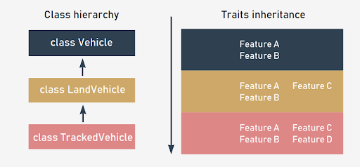
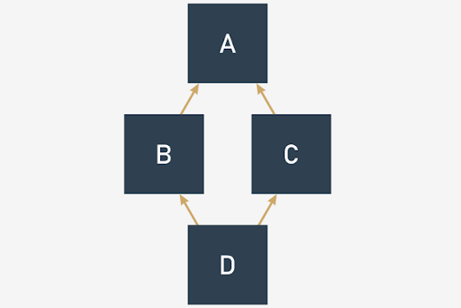
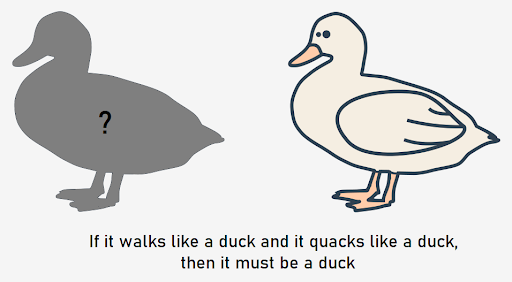

## OOP Advanced

## Python core syntax
So far we have been using Python core operations that allow us to operate on strings, lists, integers, and floats. It’s natural for us to formulate expressions using algebraic symbols representing operators, or to get a number of elements in a sequence or dictionary.

We are able to add two or more strings together, which results in the strings’ concatenation; we are able to add integers and we know what the result should be, all done by using the “+” operator, but on respective data types.

Now, we'll use the same function `len()` to get a number of elements of a tuple, list, dictionary, or characters in a string.

This is Python core syntax – an ability to perform specific operations **on different** data types, when operations are formulated using **the same** operators or instructions, or even functions.

Python core syntax covers:
- operators like `+`, `-`, `*`, `/`, `%` and many others;
- operators like `==`, `<`, `>`, `<=`, `in` and many others;
- indexing, slicing, subscripting;
- built-in functions like `str()`, `len()`
- reflexion – `isinstance()`, `issubclass()`

and a few more elements.

Python allows us to employ operators when applied to our objects, so we can use core operators on our objects.

Let's imagine the following situation:
- you've created a class that represents a person;
- each instance of the class owns a set of attributes describing a person: age, salary, weight, etc.

What does it mean to add two objects of the Person class? Well, it depends on the domain of your application.

If you’re developing an application for an elevator, then you should remember that every elevator has safety limits regarding the total weight it can lift.

<p align="center">
  
</p>

In this case, the `+` operator, when applied to two objects, should mean: add the weight attribute values and return the corresponding result.

If the total sum of the weights of the Person class objects does not exceed the safety limit, your elevator should allow them to be lifted.

### Magic methods
When called, functions and operators that state the core syntax are translated into **magic methods** delivered by specific classes.

So Python knows what to do when the interpreter spots the `+` operator between two strings or two integers, or even two Person class objects – **it looks for the magic method responsible for the called function or operator in order to apply it to the operands (objects)**.

Of course, the `+` operator is just a handy example, and later on we'll discuss other operators.

In Python, these **magic methods are sometimes called special purpose methods**, because these methods are designated by design to handle specific operations.

The name of each magic method is **surrounded by double underscores** (Pythonistas would say **“dunder”** for double underscores, as it’s a shorter and more convenient phrase). Dunders indicate that such methods are not called directly, but called in a process of expression evaluation, according to Python core syntax rules.

The `+` operator is in fact converted to the `__add__()` method and the `len()` function is converted to the `__len__()` method. These methods must be delivered by a class (now it’s clear why we treat classes as blueprints) to perform the appropriate action.

Look at the following simple code:
```python
number = 10
print(number + 20)
```
It is in fact translated to:
```python
number = 10
print(number.__add__(20))
```
Try running these snippets on your own to compare the results for floats and strings.

What Python does is it executes the magic method `__add__()` on the left operand (“number” object in the example) of the expression, and the right operand (number 20) is passed as a method argument.

Let's get back to our elevator example and try out a way to become compliant with Python core syntax.

First, create a Person class without the magic method responsible for addition:
```python
class Person:
    def __init__(self, weight, age, salary):
        self.weight = weight
        self.age = age
        self.salary = salary
p1 = Person(30, 40, 50)
p2 = Person(35, 45, 55)

print(p1 + p2)
```
The result of running the code is clear – Python doesn’t know how to perform addition on the two Person class objects.
```
Traceback (most recent call last):
  File "core#010.py", line 11, in 
    print(p1 + p2)
TypeError: unsupported operand type(s) for +: 'Person' and 'Person'
```
However, there’s a handy special purpose method, `__add__()`, which will fix the problem.

Run the code to check our prediction.
```python
class Person:
    def __init__(self, weight, age, salary):
        self.weight = weight
        self.age = age
        self.salary = salary

    def __add__(self, other):
        return self.weight + other.weight


p1 = Person(30, 40, 50)
p2 = Person(35, 45, 55)

print(p1 + p2)
```

Pay attention to the fact that the `__add__()` method does not change any object attribute values – it just returns a value that is the result of adding the appropriate attribute values.

And in fact, the string class has its own implementation for the `+` operator, which is inherent to strings, different than implementations inherent to integers or floats.

When you design and implement your own classes and you want to make use of Python core syntax to operate on those class objects, you can easily achieve this by implementing the appropriate magic methods.

### How to know what magic method is responsible for a specific operation?

The answer could be: start with the `dir()` and `help()` functions.

The `dir()` function gives you a quick glance at an object’s capabilities and returns a list of the attributes and methods of the object. When you call `dir()` on integer `10`, you'll get:
```
>>> dir(10)
['__abs__', '__add__', '__and__', '__bool__', '__ceil__', '__class__', '__delattr__', '__dir__', '__divmod__', '__doc__', '__eq__', '__float__', '__floor__', '__floordiv__', '__format__', '__ge__', '__getattribute__', '__getnewargs__', '__gt__', '__hash__', '__index__', '__init__', '__init_subclass__', '__int__', '__invert__', '__le__', '__lshift__', '__lt__', '__mod__', '__mul__', '__ne__', '__neg__', '__new__', '__or__', '__pos__', '__pow__', '__radd__', '__rand__', '__rdivmod__', '__reduce__', '__reduce_ex__', '__repr__', '__rfloordiv__', '__rlshift__', '__rmod__', '__rmul__', '__ror__', '__round__', '__rpow__', '__rrshift__', '__rshift__', '__rsub__', '__rtruediv__', '__rxor__', '__setattr__', '__sizeof__',
 '__str__', '__sub__', '__subclasshook__', '__truediv__', '__trunc__', '__xor__', 'bit_length', 'conjugate', 'denominator', 'from_bytes', 'imag', 'numerator', 'real', 'to_bytes']
```
The names listed above look somehow familiar, so let's see the details delivered by Python itself.

To get more help on each attribute and method, issue the `help()` function on an object, as below:
```
>>> help(10)
Help on int object:

class int(object)
 |  int([x]) -> integer
 |  int(x, base=10) -> integer
 |
 |  Convert a number or string to an integer, or return 0 if no arguments
 |  are given.  If x is a number, return x.__int__().  For floating point
 |  numbers, this truncates towards zero.
 |
 |  If x is not a number or if base is given, then x must be a string,
 |  bytes, or bytearray instance representing an integer literal in the
 |  given base.  The literal can be preceded by '+' or '-' and be surrounded
 |  by whitespace.  The base defaults to 10.  Valid bases are 0 and 2-36.
 |  Base 0 means to interpret the base from the string as an integer literal.
 |  >>> int('0b100', base=0)
 |  4
 |
 |  Methods defined here:
 |
 |  __abs__(self, /)
 |      abs(self)
 |
 |  __add__(self, value, /)
 |      Return self+value.
(...)
```
The Python `help()` function is used to display the documentation (if delivered!) of modules, functions, classes, and keywords. In our example, we have displayed the documentation for the built-in integer type. Look at the last lines of the output – it contains information about the `__abs__` and `__add__` special methods.

Now it’s time to get familiar with Python core syntax expressions and their corresponding magic methods. The following tables will help you in situations where you'd like to implement a custom method for a Python core operation, as the tables enumerate the most popular operators and functions that own magic method counterparts. Treat it as a list from a universal map, unrelated to any special data type.

## Comparison methods
| Function or operator | Magic method           | Implementation meaning or purpose |
|----------------------|------------------------|-----------------------------------|
| `==`                 | `__eq__(self, other)`  | equality operator                 |
| `!=`                 | `__ne__(self, other)`  | inequality operator               |
| `<`                  | `__lt__(self, other)`  | less-than operator                |
| `>`                  | `__gt__(self, other)`  | greater-than operator             |
| `<=`                 | `__le__(self, other)`  | less-than-or-equal-to operator    |
| `>=`                 | `__ge__(self, other)`  | greater-than-or-equal-to operator |

## Numeric methods
### Unary operators and functions
| Function or operator | Magic method          | Implementation meaning or purpose |
|----------------------|-----------------------|-----------------------------------|
| `+`                  | `__pos__(self)`       | **unary** positive, like `a = +b` |
| `-`                  | `__neg__(self)`       | **unary** negative, like `a = -b` |
| `abs()`              | `__abs__(self)`       | behavior for `abs()` function     |
| `round(a, b)`        | `__round__(self, b)`  | behavior for `round()` function   |

### Common, binary operators and functions
| Function or operator | Magic method                | Implementation meaning or purpose |
|----------------------|-----------------------------|-----------------------------------|
| `+`                  | `__add__(self, other)`      | addition operator                 |
| `-`                  | `__sub__(self, other)`      | subtraction operator              |
| `*`                  | `__mul__(self, other)`      | multiplication operator           |
| `//`                 | `__floordiv__(self, other)` | integer division operator         |
| `/`                  | `__div__(self, other)`      | division operator                 |
| `%`                  | `__mod__(self, other)`      | modulo operator                   |
| `**`                 | `__pow__(self, other)`      | exponential (power) operator      |

### Augumented operators and functions
By augumented assignment we should understand a sequence of unary operators and assignments like `a += 20`

| Function or operator | Magic method                 | Implementation meaning or purpose            |
|----------------------|------------------------------|----------------------------------------------|
| `+=`                 | `__iadd__(self, other)`      | addition and assignment operator             |
| `-=`                 | `__isub__(self, other)`      | subtraction and assignment operator          |
| `*=`                 | `__imul__(self, other)`      | multiplication and assignment operator       |
| `//=`                | `__ifloordiv__(self, other)` | integer division and assignment operator     |
| `/=`                 | `__idiv__(self, other)`      | division and assignment operator             |
| `%=`                 | `__imod__(self, other)`      | modulo and assignment operator               |
| `**=`                | `__ipow__(self, other)`      | exponential (power) and assignment operator  |

## Type conversion methods
Python offers a set of methods responsible for the conversion of built-in data types.

| Function  | Magic method      | Implementation meaning or purpose                             |
|-----------|-------------------|---------------------------------------------------------------|
| `int()`   | `__int__(self)`   | conversion to integer type                                    |
| `float()` | `__float__(self)` | conversion to float type                                      |
| `oct()`   | `__oct__(self)`   | conversion to string, containing an octal representation      |
| `hex()`   | `__hex__(self)`   | conversion to string, containing a hexadecimal representation |

## Object introspection
Python offers a set of methods responsible for representing object details using ordinary strings.

| Function   | Magic method                  | Implementation meaning or purpose                               |
|------------|-------------------------------|-----------------------------------------------------------------|
| `str()`    | `__str__(self)`               | responsible for handling str() function calls                   |
| `repr()`   | `__repr__(self)`              | responsible for handling repr() function calls                  |
| `format()` | `__format__(self, formatstr)` | called when new-style string formatting is applied to an object |
| `hash()`   | `__hash__(self)`              | responsible for handling hash() function calls                  |
| `dir()`    | `__dir__(self)`               | responsible for handling dir() function calls                   |
| `bool()`   | `__nonzero__(self)`           | responsible for handling bool() function calls                  |

## Object retrospection
Following the topic of object introspection, there are methods responsible for object reflection.

| Function                      | Magic method                        | Implementation meaning or purpose                     |
|-------------------------------|-------------------------------------|-------------------------------------------------------|
| `isinstance(object, class)`   | `__instancecheck__(self, object)`   | responsible for handling isinstance() function calls  |
| `issubclass(subclass, class)` | `__subclasscheck__(self, subclass)` | responsible for handling issubclass() function calls  |

## Object attribute access
Access to object attributes can be controlled via the following magic methods

| Expression example         | Magic method                          | Implementation meaning or purpose                            |
|----------------------------|---------------------------------------|--------------------------------------------------------------|
| `object.attribute`         | `__getattr__(self, attribute)`        | responsible for handling access to a non-existing attribute  |
| `object.attribute`         | `__getattribute__(self, attribute)`   | responsible for handling access to an existing attribute     |
| `object.attribute = value` | `__setattr__(self, attribute, value)` | responsible for setting an attribute value                   |
| `del object.attribute`     | `__delattr__(self, attribute)`        | responsible for deleting an attribute                        |

## Methods allowing access to containers
Containers are any object that holds an arbitrary number of other objects; containers provide a way to access the contained objects and to iterate over them. Container examples: list, dictionary, tuple, and set.

| Expression example         | Magic method                    | Implementation meaning or purpose                                              |
|----------------------------|---------------------------------|--------------------------------------------------------------------------------|
| `len(container)`           | `__len__(self)`                 | returns the length (number of elements) of the container                       |
| `container[key]`           | `__getitem__(self, key)`        | responsible for accessing (fetching) an element identified by the key argument |
| `container[key] = value`   | `__setitem__(self, key, value)` | responsible for setting a value to an element identified by the key argument   |
| `del container[key]`       | `__delitem__(self, key)`        | responsible for deleting an element identified by the key argument             |
| `for element in container` | `__iter__(self)`                | returns an iterator for the container                                          |
| `item in container`        | `__contains__(self, item)`      | responds to the question: does the container contain the selected item?        |

The list of special methods built-in in Python contains more entities. For more information, refer to https://docs.python.org/3/reference/datamodel.html#special-method-names.

What are some real life cases which could be implemented using special methods?

Think of any complex problems that we solve every day like:
- adding time intervals, like: add 21 hours 58 minutes 50 seconds to 1hr 45 minutes 22 seconds;
- adding length measurements expressed in the imperial measurement system, like: add 2 feet 8 inches to 1 yard 1 foot 4 inches.

With classes equipped with custom special methods, the tasks may start to look simpler.

Of course, don’t forget to check the type of the objects passed as arguments to special methods. If someone uses your classes, they might use them incorrectly, so a good `__add__` method should check whether it’s possible to perform the addition before doing it, or else raise an exception.

## Inheritance and 
### Inheritance is a pillar of OOP
Inheritance is one of the fundamental concepts of object oriented programming, and expresses the fundamental relationships between classes: superclasses (parents) and their subclasses (descendants). Inheritance creates a class hierarchy. Any object bound to a specific level of class hierarchy inherits all the traits (methods and attributes) defined inside any of the superclasses.

This means that inheritance is a way of building a new class, not from scratch, but by using an already defined repertoire of traits. The new class inherits (and this is the key) all the already existing equipment, but is able to add some new features if needed.

Each subclass is more specialized (or more specific) than its superclass. Conversely, each superclass is more general (more abstract) than any of its subclasses. Note that we've presumed that a class may only have one superclass — this is not always true, but we'll discuss this issue more a bit later.

<p align="center">
  
</p>

A very simple example of two-level inheritance is presented here:
```python
class Vehicle:
    pass

class LandVehicle(Vehicle):
    pass

class TrackedVehicle(LandVehicle):
    pass
```
All the presented classes are empty for now, as we're going to show you how the mutual relations between the super- and subclasses work.

We can say that:
- the `Vehicle` class is the superclass for both the `LandVehicle` and `TrackedVehicle` classes;
- the `LandVehicle` class is a subclass of `Vehicle` and a superclass of `TrackedVehicle` at the same time;
- the `TrackedVehicle` class is a subclass of both the `Vehicle` and `LandVehicle` classes.

### Single inheritance vs. multiple inheritance
There are no obstacles to using multiple inheritance in Python. You can derive any new class from **more than one** previously defined class.

But multiple inheritance should be used with more prudence than single inheritance because:
- a single inheritance class is always simpler, safer, and easier to understand and maintain;
- multiple inheritance may make method overriding somewhat tricky; moreover, using the `super()` function can lead to ambiguity;
- it is highly probable that by implementing multiple inheritance you are violating the single responsibility principle;

If your solution tends to require multiple inheritance, it might be a good idea to think about implementing **composition**.

### MRO — Method Resolution Order
The spectrum of issues possibly coming from multiple inheritance is illustrated by a classical problem named the **diamond problem**, or even the **deadly diamond of death**. The name reflects the shape of the inheritance diagram — take a look at the picture.

<p align="center">
  
</p>

- There is the top-most superclass named `A`;
- there are two subclasses derived from `A` — `B` and `C`;
- and there is also the bottom-most subclass named `D`, derived from `B` and `C` (or `C` and `B`, as these two variants mean different things in Python)

The ambiguity that arises here is caused by the fact that `class B` and `class C` are inherited from superclass A, and `class D` is inherited from both classes B and C. If you want to call the method `info()`, which part of the code would be executed then?

Python lets you implement such a class hierarchy. Can you guess the output of the code?
```python
class A:
    def info(self):
        print('Class A')

class B(A):
    def info(self):
        print('Class B')

class C(A):
    def info(self):
        print('Class C')

class D(B, C):
    pass

D().info()
```
In the multiple inheritance scenario, any specified attribute is searched for first in the current class. If it is not found, the search continues into the direct parent classes in depth-first level (the first level above), from the left to the right, according to the class definition. This is the result of the MRO algorithm.

In our case:
- `class D` does not define the method `info()`, so Python has to look for it in the class hierarchy;
- `class D` is constructed in this order:
  - the definition of `class B` is fetched;
  - the definition of `class C` is fetched;
- Python finds the requested method in the `class B` definition and stops searching;
- Python executes the method.

### Possible pitfalls — MRO inconsistency
**MRO** can report definition inconsistencies when a subtle change in the `class D` definition is introduced, which is possible when you work with complex class hierarchies.

Imagine that you have changed the `class D` definition from:
```python
class D(B, C):
    pass
```
to:
```python
class D(A, C):
    pass
```
Now when you run the code (the code is presented in the right pane, implement the change), you get:
```
Traceback (most recent call last):
  File "diamond.py", line 13, in 
    class D(A, C):
TypeError: Cannot create a consistent method resolution order (MRO) for bases A, C
```
This message informs us that the MRO algorithm had problems determining which method (originating from the A or C classes) should be called.

Due to MRO, you should knowingly list the superclasses in the subclass definition. In the following example, `class D` is based on classes B and C, whereas `class E` is based on classes C and B (the order matters!).
```python
class D(B, C):
    pass

class E(C, B):
    pass
```
As a result, those classes can behave totally differently, because the order of the superclasses is different.

## Polymorphism
In Python, polymorphism is the provision of a single interface to objects of different types. In other words, it is the ability to create abstract methods from specific types in order to treat those types in a uniform way.

Imagine that you have to print a string or an integer — it is more convenient when a function is called simply `print`, not `print_string` or `print_integer`.

However, the string must be handled differently than the integer, so there will be two implementations of the function that lead to printing, but naming them with a common name creates a convenient abstract interface independent of the type of value to be printed.

The same rule applies to the operation of addition. We know that addition is expressed with the `+` operator, and we can apply that operator when we add two integers or concatenate two strings or two lists.

Let's see what methods are present for both built-in types (string and integer) responsible for handling the `+` operator. Once again, we'll use the `dir(object)` function, which returns a list of object attributes.
```
>>> dir(1)
['__abs__', '__add__', '__and__', '__bool__', '__ceil__', '__class__', '__delattr__', '__dir__', '__divmod__', '__doc__', '__eq__', '__float__', '__floor__', '__floordiv__', '__format__', '__ge__', '__getattribute__', '__getnewargs__', '__gt__', '__hash__', '__index__', '__init__', '__init_subclass__', '__int__', '__invert__', '__le__', '__lshift__', '__lt__', '__mod__', '__mul__', '__ne__', '__neg__', '__new__', '__or__', '__pos__', '__pow__', '__radd__', '__rand__', '__rdivmod__', '__reduce__', '__reduce_ex__', '__repr__', '__rfloordiv__', '__rlshift__', '__rmod__', '__rmul__', '__ror__', '__round__', '__rpow__', '__rrshift__', '__rshift__', '__rsub__', '__rtruediv__', '__rxor__', '__setattr__', '__sizeof__', '__str__', '__sub__', '__subclasshook__', '__truediv__', '__trunc__', '__xor__', 'bit_length', 'conjugate', 'denominator', 'from_bytes', 'imag', 'numerator', 'real', 'to_bytes']
>>> dir('a')
['__add__', '__class__', '__contains__', '__delattr__', '__dir__', '__doc__', '__eq__', '__format__', '__ge__', '__getattribute__', '__getitem__', '__getnewargs__', '__gt__', '__hash__', '__init__', '__init_subclass__', '__iter__', '__le__', '__len__', '__lt__', '__mod__', '__mul__', '__ne__', '__new__', '__reduce__', '__reduce_ex__', '__repr__', '__rmod__', '__rmul__', '__setattr__', '__sizeof__', '__str__', '__subclasshook__', 'capitalize', 'casefold', 'center', 'count', 'encode', 'endswith', 'expandtabs', 'find', 'format', 'format_map', 'index', 'isalnum', 'isalpha', 'isdecimal', 'isdigit', 'isidentifier', 'islower', 'isnumeric', 'isprintable', 'isspace', 'istitle', 'isupper', 'join', 'ljust', 'lower', 'lstrip', 'maketrans', 'partition', 'replace', 'rfind', 'rindex', 'rjust', 'rpartition', 'rsplit', 'rstrip', 'split', 'splitlines', 'startswith', 'strip', 'swapcase', 'title', 'translate', 'upper', 'zfill']
```
As you can see, there are many attributes available for the string and integer types, many of them carrying the same names. The first name common to both lists is `__add__`, which is a special method responsible for handling addition, as you may remember from the previous slides.

To briefly demonstrate polymorphism on integers and strings, execute the following code in the Python interpreter:
```python
a = 10
print(a.__add__(20))
b = 'abc'
print(b.__add__('def'))
```
The result:
```
30
abcdef
```
By the way, if you look for a method that is used when you print a value associated with an object, the `__str__` method is called to prepare a string that is used in turn for printing.

**One way to carry out polymorphism is inheritance**, when subclasses make use of base class methods, or override them. By combining both approaches, the programmer is given a very convenient way of creating applications, as:
- most of the code could be reused and only specific methods are implemented, which saves a lot of development time and improves code quality;
- the code is clearly structured;
- there is a uniform way of calling methods responsible for the same operations, implemented accordingly for the types.

#### Remember
You can use inheritance to create polymorphic behavior, and usually that's what you do, but that's not what polymorphism is about.
```python
class Device:
    def turn_on(self):
        print('The device was turned on')

class Radio(Device):
    pass

class PortableRadio(Device):
    def turn_on(self):
        print('PortableRadio type object was turned on')

class TvSet(Device):
    def turn_on(self):
        print('TvSet type object was turned on')

device = Device()
radio = Radio()
portableRadio = PortableRadio()
tvset = TvSet()

for element in (device, radio, portableRadio, tvset):
    element.turn_on()
```
The above code implementing both inheritance and polymorphism:
- **inheritance**: class `Radio` inherits the `turn_on()` method from its superclass — that is why we see `The device was turned on` string twice. Other subclasses override that method and as a result we see different lines being printed;
- **polymorphism**: all class instances allow the calling of the `turn_on()` method, even when you refer to the objects using the arbitrary variable `element`.
```
The device was turned on
The device was turned on
PortableRadio type object was turned on
TvSet type object was turned on
```

Duck typing is a fancy name for the term describing an application of the duck test: "If it walks like a duck and it quacks like a duck, then it must be a duck", which determines whether an object can be used for a particular purpose. An object's suitability is determined by the presence of certain attributes, rather than by the type of the object itself.

<p align="center">
  
</p>

Duck typing is another way of achieving polymorphism, and represents a more general approach than polymorphism achieved by inheritance. When we talk about inheritance, all subclasses are equipped with methods named the same way as the methods present in the superclass.

In duck typing, we believe that objects own the methods that are called. If they do not own them, then we should be prepared to handle exceptions.

Let's talk about two things that share conceptually similar methods, but represent totally different things, like cheese and wax. Both can melt, and we use the melted forms for different purposes.
```python
class Wax:
    def melt(self):
        print("Wax can be used to form a tool")

class Cheese:
    def melt(self):
        print("Cheese can be eaten")

class Wood:
    def fire(self):
        print("A fire has been started!")

for element in Wax(), Cheese(), Wood():
    try:
        element.melt()
    except AttributeError:
        print('No melt() method')
```
When you run the code you should receive the following output:
```
Wax can be used to form a tool
Cheese can be eaten
No melt() method
```
Both the Wax and Cheese classes own `melt()` methods, but there is no relation between the two. Thanks to duck typing, we can call the `melt()` method. Unfortunatelly, the Wood class is not equipped with this method, so an `AttributeError` exception occurs.

Summary:
- polymorphism is used when different class objects share conceptually similar methods (but are not always inherited)
- polymorphism leverages clarity and expressiveness of the application design and development;
- when polymorphism is assumed, it is wise to handle exceptions that could pop up.