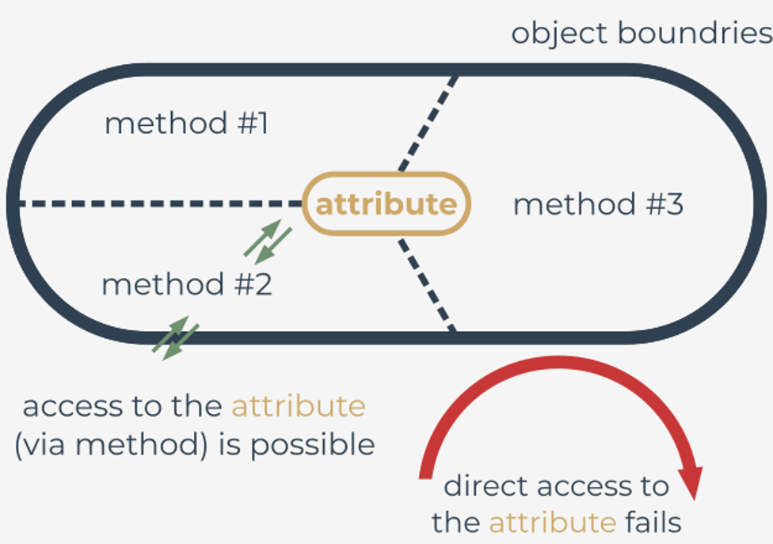
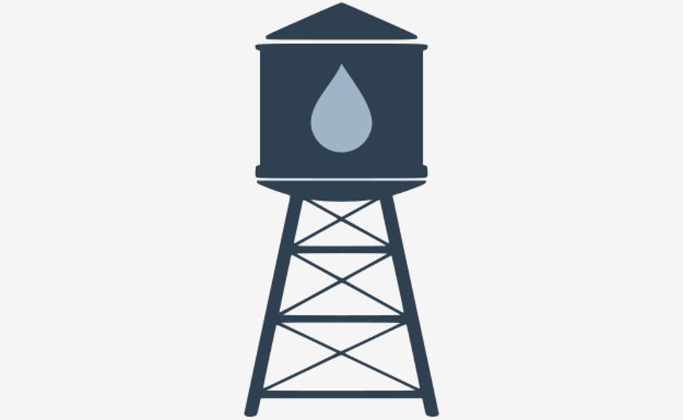

# Encapsulation

## Attribute encapsulation
Encapsulation is one of the fundamental concepts in object-oriented programming (amongst inheritance, polymorphism, and abstraction). It describes the idea of bundling attributes and methods that work on those attributes within a class.

Encapsulation is used to hide the **attributes** inside a class like in a **capsule**, preventing unauthorized parties' direct access to them. **Publicly accessible methods** are provided in the class **to access** the values, and other objects call those methods to retrieve and modify the values within the object. This can be a way to enforce a certain amount of privacy for the attributes.

<p align="center">
  
</p>

This picture presents the idea: direct access to the object attribute should not be possible, but you can always invoke methods, acting like proxies, to perform some actions on the attributes.

Python introduces the concept of **properties** that act like proxies to encapsulated attributes.

This concept has some interesting features:
- the code calling the proxy methods might not realize if it is "talking" to the real attributes or to the methods controlling access to the attributes;
- in Python, you can change your class implementation from a class that allows simple and direct access to attributes to a class that fully controls access to the attributes, and what is most important –consumer implementation does not have to be changed; by consumer we understand someone or something (it could be a legacy code) that makes use of your objects.

Let's start with a few analogies from real life:

<p align="center">
  
</p>

Imagine a washing machine door ( **object** ) that protects access to your laundry ( **attribute values** ) while your appliance is washing it ( **processing** ). You have a set of controls ( **methods** ) that allow you to manage your laundry, or even see it (many wash machines are equipped with a transparent window).

So, while the washing machine is processing your laundry, you are not able to directly access the laundry. This is how attribute encapsulation works.

<p align="center">
  
</p>

Another good example is a money bank; this time it’s a more IT-related example:

When your money ( **attribute value** ) is deposited in the bank account ( **object** ), you **cannot** access it directly and without some checks or security. This is a basic countermeasure to protect your account from withdrawals exceeding certain limits or the account balance. But you can always make use of some dedicated interfaces (methods like a mobile application or a web application) to spend money up to an appropriate amount.

Attribute encapsulation can be also used to limit unauthorized access: reading and modifying the account balance. Remember that this is not full access control, the programmer can still get access to your attributes **intentionally** as Python does not deliver true privacy.

Why?

Guido Van Rossum, best known as the author of Python, once said: _"We're all consenting adults here"_ justifying the absence of such access restrictions.

So, if your code does intentionally access the attributes marked as private (prefixed with a double underscore) in a direct way, then remember that this behavior is **unpythonic**.

<p align="center">
  
</p>

The last example could be presented with the behavior of a class representing a water or fuel tank:

It would not be wise to pour any amount of liquid **directly** into the tank ( **object** ) exceeding the total tank capacity, or request setting the liquid level to a negative value.

Python allows you to control access to attributes with the built-in `property()` function and corresponding decorator **@property**.

This decorator plays a very important role:
- it designates a method which will be called automatically when another object wants to read the encapsulated attribute value;
- the name of the designated method will be used as the name of the instance attribute corresponding to the encapsulated attribute;
- it should be defined before the method responsible for setting the value of the encapsulated attribute, and before the method responsible for deleting the encapsulated attribute.

Let's have look at the code in the editor.
```python
class TankError(Exception):
    pass


class Tank:
    def __init__(self, capacity):
        self.capacity = capacity
        self.__level = 0

    @property
    def level(self):
        return self.__level

    @level.setter
    def level(self, amount):
        if amount > 0:
            # fueling
            if amount <= self.capacity:
                self.__level = amount
            else:
                raise TankError('Too much liquid in the tank')
        elif amount < 0:
            raise TankError('Not possible to set negative liquid level')

    @level.deleter
    def level(self):
        if self.__level > 0:
            print('It is good to remember to sanitize the remains from the tank!')
        self.__level = None
```
We see that every **Tank** class object has a `__level` attribute, and the class delivers the methods responsible for handling access to that attribute.

The `@property` decorated method is a method to be called when some other code wants to read the level of liquid in our tank. We call such a read method **getter**.

Pay attention to the fact that the method following the decorator gives the name (tank) to the attribute visible outside of the class. Moreover, we see that two other methods are named the same way, but as we are using specially crafted decorators to distinguish them, this won’t cause any problems:
- `@tank.setter()` – designates the method called for setting the encapsulated attribute value;
- `@tank.deleter()` – designates the method called when other code wants to delete the encapsulated attribute.

As those attribute name repetitions could be misleading, let's explain the naming convention:
- the getter method is decorated with `@property`. It designates the name of the attribute to be used by the external code;
- the setter method is decorated with `@name.setter`. The method name should be the attribute name;
- the deleter method is decorated with `@name.deleter`. The method name should should be the attribute name.

Let's instantiate the class and perform some operations on the object's attribute:

As you can see, access to the `__level` attribute is handled by the designated methods by allowing the other code accessing the 'level' attribute. We can also react to operations when someone wants to break some constraints associated with the tank capacity.

The other code can make use of the 'level' attribute in a convenient way, without even knowing about the logic hidden behind it. So, whenever you'd like to control access to an attribute, you should prepare dedicated properties, because properties control only designated attributes.

It’s worth mentioning another useful and interesting feature of properties: properties are inherited, so you can call setters as if they were attributes.

Examine the code and run it to see if it follows your expectations.
```python
class TankError(Exception):
    pass


class Tank:
    def __init__(self, capacity):
        self.capacity = capacity
        self.__level = 0

    @property
    def level(self):
        return self.__level

    @level.setter
    def level(self, amount):
        if amount > 0:
            # fueling
            if amount <= self.capacity:
                self.__level = amount
            else:
                raise TankError('Too much liquid in the tank')
        elif amount < 0:
            raise TankError('Not possible to set negative liquid level')

    @level.deleter
    def level(self):
        if self.__level > 0:
            print('It is good to remember to sanitize the remains from the tank!')
        self.__level = None

# our_tank object has a capacity of 20 units
our_tank = Tank(20)

# our_tank's current liquid level is set to 10 units
our_tank.level = 10
print('Current liquid level:', our_tank.level)

# adding additional 3 units (setting liquid level to 13)
our_tank.level += 3
print('Current liquid level:', our_tank.level)

# let's try to set the current level to 21 units
# this should be rejected as the tank's capacity is 20 units
try:
    our_tank.level = 21
except TankError as e:
    print('Trying to set liquid level to 21 units, result:', e)

# similar example - let's try to add an additional 15 units
# this should be rejected as the total capacity is 20 units
try:
    our_tank.level += 15
except TankError as e:
    print('Trying to add an additional 15 units, result:', e)

# let's try to set the liquid level to a negative amount
# this should be rejected as it is senseless
try:
    our_tank.level = -3
except TankError as e:
    print('Trying to set liquid level to -3 units, result:', e)

print('Current liquid level:', our_tank.level)

del our_tank.level
```