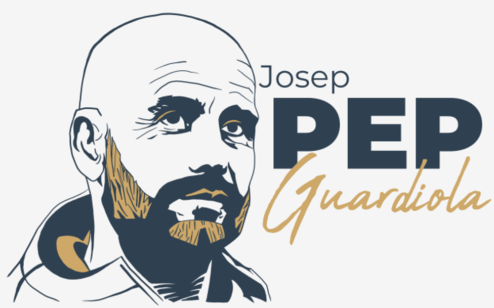

# Best Practices and Standardization (Python Enhancement Proposals)
In this course, you will learn about:
- PEP 20 (The Zen of Python)
- PEP 8 (Style Guide for Python Code)
- PEP 257 (Docstring conventions)
- how to avoid common errors and mistakes when writing code;
- how to write elegant and effective code.

## What is PEP?
PEP may refer to several things:

  

- football (soccer) fans will definitely associate it with the famous ex-footballer and football manager, Josep Guardiola, whose nickname is (guess what) Pep;
- those who have medical jobs will surely think of post-exposure prophylaxis, which in turn has to do with taking preventive medical measures after contact with pathogens;
- physicians will think of the proton-proton chain reaction;
- some older (?) gamers will visualize the image of Pep, the dog, a funny character from a popular children’s Atari computer game of the early nineties;
- while Python programmers will immediately point to an online document, which outlines **the language standards and provides information about many changes and processes related to Python**.

In this module, as you may expect, we’re going to focus on the last of the many PEPs.

### In the jungle of PEPs
There are many PEPs, hundreds of them. See PEP 0 -- Index of Python Enhancement Proposals (PEPs) to find out for yourself that they’re no idle words.

It would be remarkable, but unfortunately quite a challenge, to cover them all in this course. For this reason, we’ve picked four of them that deserve a closer analysis, and should be considered must-reads. These are:
- **PEP 1 – PEP Purpose and Guidelines**, which provides information about the purpose of PEPs, their types, and introduces general guidelines;
- **PEP 8 – Style Guide for Python Code**, which gives conventions and presents best practices for Python coding;
- **PEP 20 – The Zen of Python**, which presents a list of principles for Python’s design;
- **PEP 257 – Docstring Conventions**, which provides guidelines for conventions and semantics associated with Python docstrings.

We encourage you to dive into PEPs on your own. We’re sure you‘ll become more and more curious about them as your programming experience and awareness grow.

### PEP 1 – PEP Purpose and Guidelines
PEP is an acronym that stands for **Python Enhancement Proposals**, which, in fact, is **a collection of guidelines, best practices, descriptions of (new) features and implementations, as well as processes, mechanisms and important information** surrounding Python.

Simply speaking, if a new feature is planned to be added to Python, it will be detailed in a PEP along with the technical specifications and the rationale for its implementation.

That’s what, among other things, PEP is for.

There are three different types of PEPs:
- **Standards Track** PEPs, which describe new language features and implementations;
- **Informational** PEPs, which describe Python design issues, as well as provide guidelines and information to the Python community;
- **Process** PEPs, which describe various processes that revolve around Python (e.g., propose changes, provide recommendations, specify certain procedures).

PEPs are primarily addressed to Python developers and members of the Python community. They are maintained as text files in a repository, and can be accessed online at https://www.python.org/dev/peps/.

But did you know that you can propose your own PEP, too? If you have a new (brilliant) idea for Python, you are more than welcome to become your PEP’s **champion**, i.e., the one who writes a PEP proposal, puts it up for discussion in subject-related forums, and tries to reach a community consensus over it.

PEP formats, templates, and the submission process (including reporting bugs and submitting updates) as well as the subsequent stages: review, resolution, and maintenance, are all described in detail within [PEP 1 – PEP Purpose and Guidelines](https://peps.python.org/pep-0001/#start-with-an-idea-for-python). Feel free to quickly browse through it – you never know when you’re going to need it!

Last but not least, PEP 1 defines:

Python’s Steering Council, i.e., a five-person committee and the final authorities who accept or reject PEPs;
Python’s Core Developers, i.e., the group of volunteers who manage Python, and;
Python’s BDFL, i.e., Guido van Rossum, the original creator of Python, who served as the project’s Benevolent Dictator For Life until 2018, when he resigned from the decision-making process.
