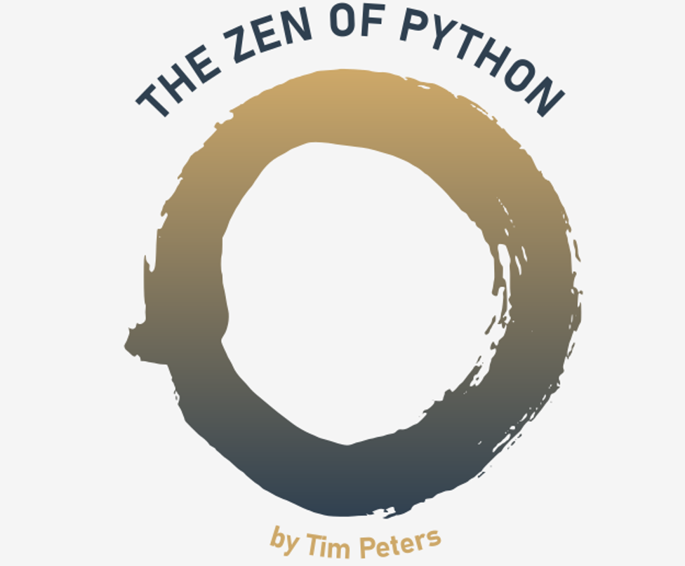
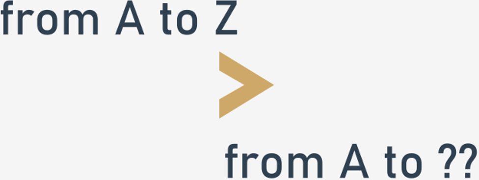
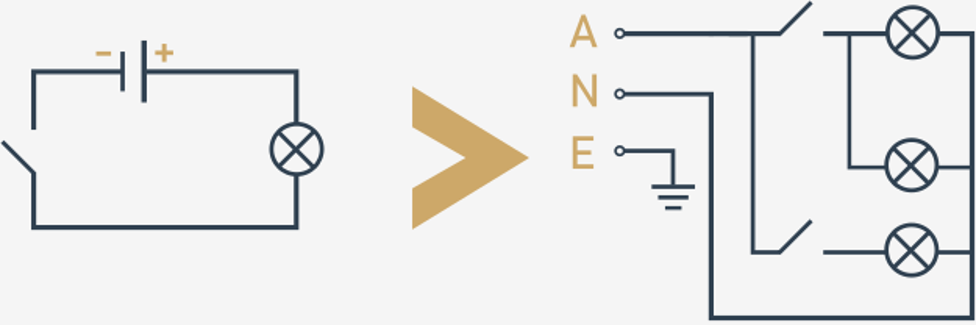
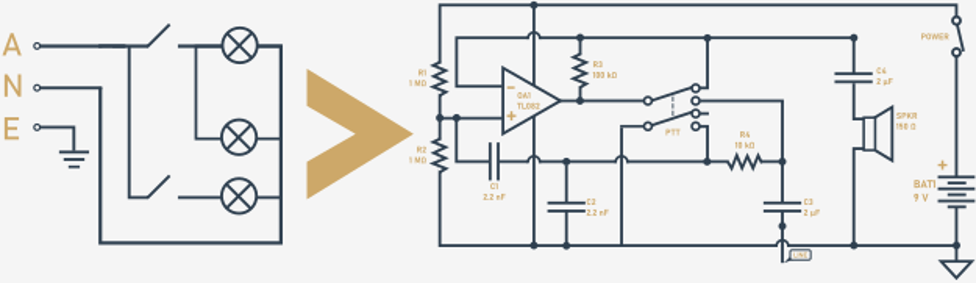
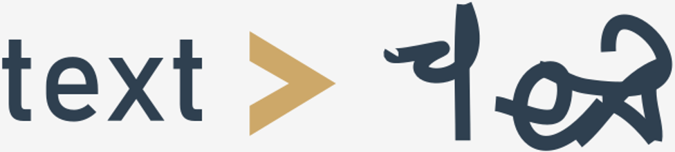
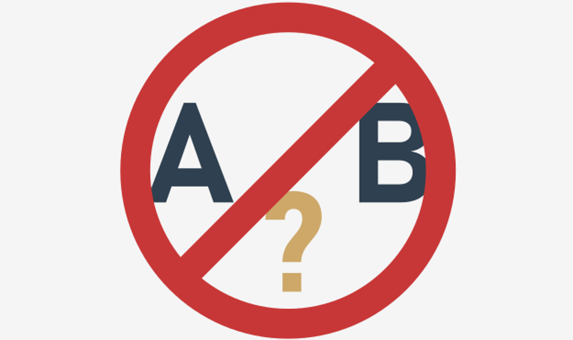
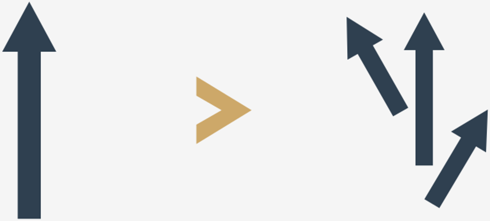
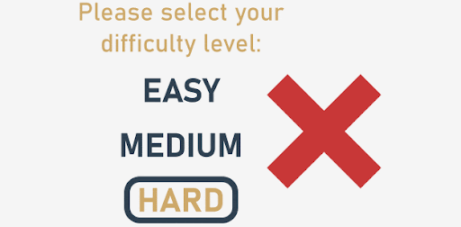
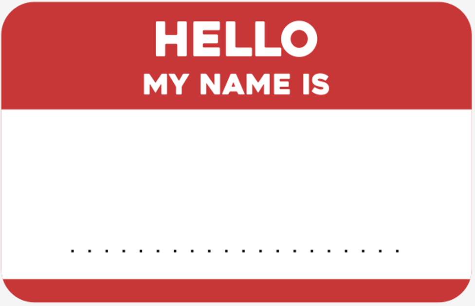
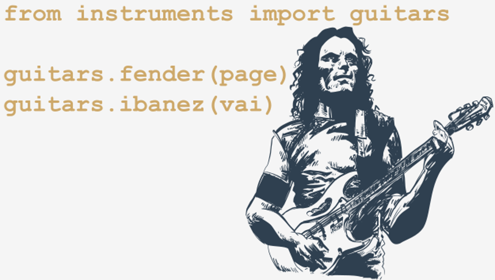

# PEP 20 – The Zen of Python
The **Zen of Python** is a collection of 19 aphorisms, which reflect the philosophy behind Python, its guiding principles, and design.

Tim Peters, a long time major contributor to the Python programming language and Python community, wrote this 19-line poem on the Python mailing list in 1999, and it became [entry #20](https://peps.python.org/pep-0020/) in the Python Enhancement Proposals in 2004.

It’s one of the _Easter eggs_ (i.e., hidden, secret messages or features) included in the Python interpreter.

Now let’s see the magic. Go to the editor window, type in `import this`, run the code, and voilà! Can you see what happens?

<p align="center">
  
</p>

What you see is a collection of some general truths for Python design rules and decision making. Even though the "poem" seems to be imbued with contradictions and allusions, we assure you that the aphorisms are extremely practical and common sense, and you’re encouraged to accept them and implement in your code.

These, of course, should be looked upon holistically, rather than individually, but, still, let’s try to meditate on each of them.

### Beautiful is better than ugly
Beauty is a rather subjective experience. But, as Immanuel Kant said, the very **esthetic experience of beauty is a judgement of human truth**.

And even though the computer doesn’t care about beauty or esthetics, people do, and we must remember that a nicely-written program is not only more enjoyable to read, but also more **readable**.

Python has certain **style rules** that programmers are recommended to follow. These are, among other things: a 79-character maximum line length, variable naming conventions, placing statements on separate lines, and many others.

<p align="center">
  
</p>

Example: Write a program that calculates the hypotenuse of a right-angled triangle.

:x:
```python
from math import sqrt
sidea = float(input("The length of the 'a' side:"))
sideb = float(input("The length of the 'b' side:"))
sidec = sqrt(a**2+b**2)
print("The length of the hypotenuse is", sidec )
```

:heavy_check_mark:
```python
from math import sqrt

side_a = float(input("The length of the 'a' side: "))
side_b = float(input("The length of the 'b' side: "))
hypotenuse = sqrt(a**2 + b**2)

print("The length of the hypotenuse is", hypotenuse)
```

### Explicit is better than implicit
The code you write should be **explicit and readable**.

Whenever you want to use an implicit feature of the language, ask yourself whether you really need it. Maybe there’s a better way to implement the functionality. If not, think about leaving a comment in code to explain what’s going on so that other programmers find it easier to understand your code.

In Python, it’s preferred to use not only the simplest way to express a programming idea, but also the most explicit, concrete, specific one.

<p align="center">
  
</p>

Therefore, it’s sometimes a good idea to add more verbosity to your code as it all counts towards readability. Giving self-explanatory variable and function names, or adding more explicitness to imports or function arguments may be good practice.

Example: Import `apples` and `bananas` from the `fruit.py` module.

:x:
```python
from fruit import *

apples(2, 3.45)
```

:heavy_check_mark:
```python
from fruit import apples, bananas

apples(quantity=2, price=3.45)
```

### Simple is better than complex
Simplicity is the key to success.

A **simpler solution** is usually preferred over a complex one, and generally, the minimalistic approach wins. Remember: use appropriate **tools adjusted to the specificity** of your project.

Using a plane to transport yourself to a nearby shop could be okay (assuming you’re slightly eccentric), but usually it’d be enough to walk or drive. Similarly, you wouldn’t normally walk the distance if you wanted to travel from the UK to the USA. Taking a plane would be a more sensible idea here.

Consider not adopting an object-oriented approach when it’s not needed. Use fewer lines of code if that’s possible.

<p align="center">
  
</p>

If you need to implement a more complex solution, **divide problems into smaller, simpler parts**.

Example: Sort the numbers list in ascending order.

:x:
```python
import heapq

numbers = [-1, 12, -5, 0, 7, 21, 15, 1]
heapq.heapify(numbers)

sorted_numbers = []

while numbers:
    sorted_numbers.append(heapq.heappop(numbers))

print(sorted_numbers)
```

:heavy_check_mark:
```python
numbers = [-1, 12, -5, 0, 7, 21, 15, 1]
numbers.sort()

print(numbers)
```

### Complex is better than complicated
When simple solutions are not possible, be aware of the **limitations carried by simplicity**, and use complex solutions instead.

Distinguishing between complex as consisting of many elements and complicated, meaning difficult to understand, is yet another thing to consider when writing code.

In other words, there are times when a complex solution may be preferred over a simple one, especially in the case of the latter causing misunderstanding, doubt, or misinterpretation. You should avoid those.

On the other hand, complex is always preferred to complicated. When your code gets big and too difficult to understand and grasp, **divide it into well-separated parts**, so that it’s easier to manage and handle.

<p align="center">
  
</p>

**Avoid misunderstanding, lack of clarity, and miscomprehension.**

Example: Perform five additions of two numbers.

:x:
```python
first_number = int(input("Enter the first number: "))
second_number = int(input("Enter the second number: "))
addition_result = first_number + second_number
print(first_number, "+", second_number, "=", addition_result)
first_number = int(input("Enter the first number: "))
second_number = int(input("Enter the second number: "))
addition_result = first_number + second_number
print(first_number, "+", second_number, "=", addition_result)
first_number = int(input("Enter the first number: "))
second_number = int(input("Enter the second number: "))
addition_result = first_number + second_number
print(first_number, "+", second_number, "=", addition_result)
first_number = int(input("Enter the first number: "))
second_number = int(input("Enter the second number: "))
addition_result = first_number + second_number
print(first_number, "+", second_number, "=", addition_result)
first_number = int(input("Enter the first number: "))
second_number = int(input("Enter the second number: "))
addition_result = first_number + second_number
print(first_number, "+", second_number, "=", addition_result)
```

:heavy_check_mark:
```python
def addition(x, y):
    print(x, "+", y, "=", x+y)

for i in range(5):
    first_number = int(input("Enter the first number: "))
    second_number = int(input("Enter the second number: "))
    addition(first_number, second_number)
```

### Flat is better than nested
**Nesting code makes it more difficult to follow and understand**. Nesting two or three levels deep may still be good, but anything beyond that becomes confusing and unreadable.

Even though you can actually have any level of nested loops or if statements in Python, **anything above three** should be a clear signal that it’s maybe a good time to start refactoring your code.

<p align="center">
  
</p>

Flat code is more user-friendly, and becomes much **easier to maintain**. Remember this.

Example: Display a message whether or not x is within the range from 4 to 6.

:x:
```python
x = float(input("Enter a number: "))

if x > 0:
    if x > 1:
        if x > 2:
            if x > 3:
                if x >= 4:
                    if x <= 6:
                        print("x is a number between 4 and 6.")
else:
    print("x is not a number between 4 and 6.")
```

:heavy_check_mark:
```python
x = float(input("Enter a number: "))

if x >= 4 and x <=6:
    print("x is a number between 4 and 6.")
else:
    print("x is not a number between 4 and 6.")
```

### Sparse is better than dense
Don’t write too much code in one line, don’t fit too much information into a small amount of code, don’t write lines of code that are too long, use whitespaces responsibly – this all affects the readability and understanding of your program.

The easiest and most common way to introduce sparsity to your code is to introduce nesting. That’s probably why this aphorism comes right after the one which tells us to prefer flat code over nested code. The key to readability is to strike a balance between the two: **reduce nesting**, then try to **reduce density**.

<p align="center">
  
</p>

Example: Print the message “Hello, World!” if the value passed to the x variable equals 1.

:x:
```python
x = 1
if x == 1 : print("Hello, World!")
```

:heavy_check_mark:
```python
x = 1
if x == 1:
    print("Hello, World!")
```

### Readability counts
Your code is not only read by computers, it’s also (or most of all) read by humans. In fact, it’s **the essence of the Python philosophy**, and the whole of Python design and culture actually revolves around the very statement that **“code is read more often than it is written”** (Guido Van Rossum).

All the previous aphorisms (and the subsequent ones) pave the way to readability, to a lesser or greater extent, as one of the most crucial factors that should be kept in mind while creating code. Whenever you feel tempted to give up on readability, the reason be it saving time by having to think up meaningful names, the effort taken to format your code, or any other reason – reject the temptation. Don’t underestimate the power of readability, especially when you have to return to your code after some time, or leave the code for others to develop in the future.

Giving **meaningful names** to variables, functions, modules, and classes; properly **styling blocks of code; using comments** where necessary; keeping your code neat and elegant – these all contribute to how readable and user-friendly your code is.

<p align="center">
  
</p>

Remember: the readability of your code reflects how responsible a programmer you are. It not only reflects well on the quality of the code, it reflects well on its author.

Example: Write a program that calculates a product’s gross price.

:x:
```python
def f(i):
    l = i + (0.08 * i)
    return l
```

:heavy_check_mark:
```python
# Calculates the gross price of products in Wonderland.

def calculate_gross_price(net_price):
    gross_price = net_price + (0.08 * net_price)
    return gross_price
```

### Special cases aren't special enough to break the rules...
**Discipline, consistency, and compliance with standards and conventions** are all important elements in professional and responsible code development. There should be no exceptions that allow us to break the principles governing best coding practices.

No special cases such as time pressure or complexity of a given problem should be an excuse for writing code that does not follow the guidelines.

It’s not only about readability, though it should be one of the first things you think about, but it’s also about sticking to the design and development-related decisions you’ve made, be it consistency which can **ensure backward compatibility**, keeping naming conventions unchanged, or anything else.

<p align="center">
  
</p>

Example: Write a function that multiplies two numbers and a function that adds two numbers.

:x:
```python
def multiply_two_numbers(first_number, second_number):
    return first_number * second_number

print(multiply_two_numbers(7, 9))


def addingTwoNumbers(firstNumber, secondNumber):
    return firstNumber + secondNumber

print(addingTwoNumbers(7, 9))
```

:heavy_check_mark:
```python
def multiply_two_numbers(first_number, second_number):
    return first_number * second_number

print(multiply_two_numbers(7, 9))


def add_two_numbers(first_number, second_number):
    return first_number + second_number

print(add_two_numbers(7, 9))
```

### ...Although, practicality beats purity
Okay… what’s going on here? The previous aphorism encouraged us to never break the rules, while this one says there might be some exceptions to this. Why?

<p align="center">
  
</p>

Well, we must remember that the ultimate goal is to solve real problems and write code that performs some particular (expected) task. If your code is elegant, readable, and complies with all the important styling conventions, but does not function the way it should, then it doesn’t make much sense, does it?

If the possible benefits (e.g., better performance) are larger than the possible negative effects (e.g., affected maintainability), the real-world coding problems may find an excuse for making an exception to the rules. Practicality then becomes more important than purity.

If you need to write an 85-character long line of code because splitting it into two separate lines affects readability, do it. If you need to keep compatibility with previously written code and use CamelCase instead of snake_case, do it. Rules sometimes have to be broken, exceptions have to be made.

### Errors should never pass silently...
_"...Unless explicitly silenced."_

Analyze a potentially dangerous situation below:
```python
number = input("Enter a number: ")
multiply_number_by_two = number * 2

print("Your number multiplied by two is:", multiply_number_by_two)
```
Let’s assume that the programmer has forgotten to convert the value assigned to the `number` variable to int or float. The program will not crash. On the contrary, it will run without any problems and output a fine result. Although, far from expected.

If the snippet constitutes just a tiny part of the whole code, the programmer might have difficulty finding the source of an error and debugging the program as no explicit error message is displayed in the console.

Let’s make some changes and improve the snippet a bit:
```python
number = int(input("Enter a number: "))
multiply_number_by_two = number * 2

print("Your number multiplied by two is:", multiply_number_by_two)
```
What happens when the user enters `3.5` or `two` as the input? Well, Python will of course loudly inform you that there’s been something wrong: it will raise the `ValueError` exception.

The Python language provides a very good mechanism for error handling, with a number of built-in exceptions, and a great toolset for creating user-defined exception handling systems.

<p align="center">
  
</p>

The Zen of Python gently reminds us that if a block of code is unable to perform its function and work in the way that is expected by the programmer, it should terminate the program and/or loudly announce that something has gone wrong (i.e., raise an exception) rather than continue running without interruption.

A program that crashes is **easier to debug** than a program that silences an error. Raising an exception **draws your attention to the issue and provides important information** about what happened and why. Errors which pass silently may infect the program and change its operation so that it becomes unpredictable, unexpected, and undesired.

One of the most difficult jobs a programmer needs to do is to think of all the possible contexts (or at least as many of them as possible) in which an exception may occur. Serving these exceptions and providing a remedy for expected (and well-handled) errors is an important challenge, but at the same time a crucial responsibility of a good, professional programmer.

Example: An explicitly silenced error (using the `except` keyword). However, the exception is too broadly handled:

:x:
```python
try:
    print(1/0)
except Exception as e:
    pass
```
An improved version, handling a specific kind of an error:

:heavy_check_mark:
```python
try:
    print(1/0)
except ZeroDivisionError:
    print("Don't divide by zero!")
```
Well, naturally there may be situations where you don’t want to shout “Hey! There’s an error!” but rather handle it in a subtle way and not necessarily make a fuss about it.

Analyze the code below in which we handle an exception by adding a default value:

:heavy_check_mark:
```python
try:
    number = int(input("Enter an integer number: "))
except:
    number = 0
```

### In the face of ambiguity, refuse the temptation to guess.
Guesses will surely work in many cases, but in many others they may bitterly disappoint you. This guideline conveys a twofold message: on the one hand, it tells you to have **limited trust** in the code you’re writing, while on the other hand, it implies that you should have limited trust in the code you’re reading. But what does that mean?

The first thing to remember is to always **test your code** before releasing it to production and deploying it to customers. Sounds obvious and reasonable? Well, yes, but many times programmers neglect or forget about this simple habit, be it because they trust their coding skills to the extent they, for example, reject any possibility of making typos, or because they work under great time pressure and feel they have no time for testing.

An important thing to keep in mind is: **testing your code allows you to save time**, not waste it. If you find a bug at an early stage, it will cost you less time and money to fix it. If you don’t test your code and it turns out there’s a bug at an advanced stage of development, corrections may be a pretty expensive and time-consuming enterprise.

Another thing is that you should **avoid writing ambiguous code**, which means you should leave no room for guessing. Give your variables **self-commenting names**, and **leave comments** where necessary. If you’re importing a module, make the import an explicit one. If a particular snippet is complex or complicated, explain its functioning. Never leave comments or use names that are wrong, confusing or misleading!

<p align="center">
  
</p>

By the same token, if you suspect there’s something wrong in the code you’re reading, or feel there’s something unclear in it, do not guess its operation – test it!

Let’s analyze the following example:
```python
fun(1, 2, 3)
fun(a=1, b=2, c=3)
```
The two function invocations may be the same, but not necessarily. It’s not possible to know without seeing the function definition. If the function definition is like the one below, the results could differ:
```python
def fun(x=0, y=0, z=0, a=1, b=2, c=3):
    pass
```
Let’s take a look at one more example:
```python
print("A" > "a")
print(1.0 == 1)
print("1" == 1)
print(True == "1")
print(True == 1)
print(True == 1.0)
print("1" + "1")
print(1 + 1)
print(1 + "1")
```
Do you know the result of the above snippet? Are you certain, or are you guessing? Would the above comparisons and expressions provide the same results across different programming languages? Well, not necessarily...

If you’re working on a program that accepts data from the user, don’t rely on your guesses, because **what you assume to be the most common may turn out to be the least common** when faced with real-life data.

For example, if you’re writing an app that accepts text from the user, specify what encoding you expect from them, and accept only this particular encoding, handling all the cases the expected encoding is not providing. If you need to perform a conversion, use specialized, valid tools for that to avoid character garbling or program crashes.

Always remember to look for the contexts in which your program might crash, and serve them. Don’t rely on your guesses or conviction that the user will strictly follow your instructions. Analyze the fragment of a simple interactive Python session we’ve provided below. Can you see what went wrong?
```
>>> integer_number = int(input("Enter an integer number: "))
Enter an integer number: 15.6
Traceback (most recent call last):
  File "<pyshell#4>", line 1, in <module>
    integer_number = int(input("Enter an integer number: "))
ValueError: invalid literal for int() with base 10: '15.6'
```

### There should be one – and preferably only one – obvious way to do it
_“Although that way may not be obvious at first unless you're Dutch.”_

There may be multiple ways of achieving the same goal. For example, if you want to take the user’s first name and last name, and display them on the screen, you can do it in one of the following ways:
```python
first_name = input("Enter your first name: ")
last_name = input("Enter your last name: ")

print("Your name is:", first_name, last_name)
print("Your name is:" + " " + first_name + " " + last_name)
print("Your name is: {} {}".format(first_name, last_name))
```
Which one of them is the preferred one? It depends on what you want to achieve, how you want to format the outputted text, what past conventions were used, etc.

<p align="center">
  
</p>


It seems there’s nothing wrong with having multiple ways to do a certain thing, as long as we’re ready for confrontation, and are able to **agree on the best way to achieve a particular goal**.

The guideline also reminds us that it’s a good idea to **follow the language use standards and conventions**. For example, if you’ve been using snake_case to name your variables in your code so far, it may be a bad idea to start using CamelCase for the rest of your code within one and the same program. Well, unless you do this for a specific purpose, and the advantages of such an approach are bigger than the disadvantages.

Finally, the aphorism works as a gentle indication of yet another important piece of advice: where possible, it’s good to remember that **each function, each class, each method – each entity – should have a single cohesive responsibility**. Why? Because such an approach helps you gain more clarity and produce cleaner code, makes it easier and cheaper to maintain it, and less vulnerable to bugs.

When it comes to the second part of the aphorism, on the one hand it is meant to be a joke: the Dutch surely have a different way of thinking, different worldview, and different way of getting down to doing things (you certainly remember that Guido van Rossum is Dutch, too).

On the other hand, however, it indicates that working out how to obtain the best solution can be a long and challenging process: one obvious way to do something may not necessarily be obvious at first. Finding a relevant and preferred solution may require time, effort, and changing certain habits.

Python itself is a good example of this – it’s still evolving, its features and the ideas around it are changing, and Python programmers may still perceive relatively similar things differently.

What’s the best way to access values in a dictionary: using the `get()` method, or the syntax `my_dict['key']`, or some other way? What’s the best way to read a file: block by block, line by line? What’s the best way to print the user’s first and last names on the screen…?

### Now is better than never
_“Although never is often better than right now.”_

You should not put off till tomorrow what you can do today. It’s a well-known proverb. Why? Well, because there’s never a good time for anything – there are always some “buts” and “ifs” which tell you to wait longer and delay things. Before you actually get down to doing these things – writing your code – you may have forgotten the ideas or information you need to do it well.

Python lets you quickly translate your ideas into working code. Whenever you experience the eureka effect or have your moment of inspiration, write down your thoughts and encode them in Python (or at least use some form of pseudocode) – even if your code is far from perfect. You can later refine, develop, or redesign it very easily.

<p align="center">
  
</p>

Another thing to remember is that there is no such thing as a perfect thing. You can work hard to move closer to perfection, refine your code, refactor it several times, but it will never be perfect. No single thing can, and you must be aware of that. If you give in to temptation to complete a program and release it only when it’s perfect, it’s highly probable you will never do it.

Your program has the expected functioning? It passes all the tests? Maybe it’s ready for the world to see it?

On the other hand, the aphorism tells us not to forget about the proper balance. Just as perfect is the enemy of good, it often turns out that faster is the enemy of slower. There are cases when things should not be rushed.

Your function’s not working as expected and you cannot fix it today? Mark it as deprecated so that you don’t forget about it:
```python
def deprecated_function():
    raise DeprecationWarning
```
Your project needs to go through the testing stage? Do you need to collect feedback from the users? The marketing campaign is not ready yet? Take the time to get everything right and release the product when it’s really ready, not when it looks ready.

### If the implementation is hard to explain, it's a bad idea
_“If the implementation is easy to explain, it may be a good idea.”_

Everything and anything that can be **explained in words** can be **translated into code**, and eventually turned into a well-operating computer program.

<p align="center">
  
</p>

If you can explain what you expect from a program, what you want it to do – such a program can be designed. If you find it difficult to explain its features and functionality, it may be a signal that maybe your idea should be thought over again and digested.

Simplicity and minimalism are the keys again (though such ones that don’t kill readability). Simple is better than complex, but complex is better than complicated – if you’ve already forgotten, here’s a subtle reminder. **Keep things simple**; the simpler, the better.

However, even though something’s easy to explain, it doesn’t mean it’s good. It’s just **easier to judge** whether it is or not. When you’re in doubt, have your implementation reviewed by your peers and see how much effort it takes them to grasp the idea and understand the whole concept. Another pair of eyes can cast new light on your project and help you see it in a new way.

### Namespaces are one honking great idea – let's do more of those!
Python provides a good, well-organized namespace mechanism to manage the availability of identifiers that you want to use and **avoid conflicts with already existing names** across different scopes.

What is a namespace? Generally speaking, it’s “a mapping from names to objects” (https://docs.python.org/3/tutorial/classes.html) implemented in Python in the form of a dictionary.

What does it mean? Simply speaking, it means that whenever you define a variable, Python “remembers” two things: the variable’s identifier, and the value you pass to it.

<p align="center">
  
</p>

How does it happen? Python implicitly adds them to an internal dictionary which resides within a particular scope, i.e., the region of a Python program where namespaces are accessible. If you want to access that variable, Python looks up its name in the dictionary and returns the value passed to it. If the variable doesn’t exist and, hence, isn’t found, then it raises the NameError exception.

Functions, classes, objects, modules, packages… they’re all namespaces. This fact results in the following: a more specific namespace cannot be altered by a less specific namespace, as they reside within two different scopes (e.g., a local variable inside a function doesn’t influence a global variable*). However, a more specific namespace has access to a less specific namespace (e.g., a global variable can be accessed from within a function).

*Using the `global` keyword before a global variable inside the function is a mechanism that allows you to alter that variable, even though it resides in a different scope (bad practice).

<p align="center">
  
</p>

Use the namespaces to make your code clearer and more readable. For example, do this:

:heavy_check_mark:
```python
from instruments import guitars

guitars.fender(page)
guitars.ibanez(vai)
```
Instead of this:

:x:
```python
from instruments.guitars import fender, ibanez

fender(page)
ibanez(vai)
```
Why? Because the first example will clearly show that `fender` and `ibanez` come from a different module, not from within the local scope.
