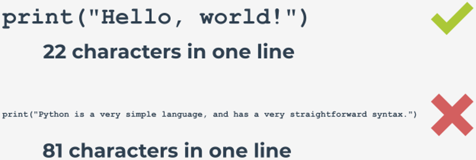

# PEP 8 – Best Practices and Conventions

## Introduction to PEP 8
As mentioned earlier, PEP 8 is a document that provides **coding conventions** (code style guide) for Python code.

PEP 8 is considered one of the most important PEPs and a must-read for every professional Python programmer, as it helps to make the code more consistent, more readable, and more efficient.

Even though some programming projects may adopt their own style guidelines (in which case such project-specific guidelines may be favored over the conventions provided for by PEP 8, especially in the case of any conflicts, or backwards-compatibility issues), the PEP 8 best practices are still highly recommended reading, as they help you to better understand the philosophy behind Python and become a more aware and proficient programmer.

PEP 8 is **still evolving** as new, additional conventions are being identified and included in it, and at the same time some old conventions are being identified as obsolete and discouraged from being followed.

### The Hobgoblin of Little Minds
_”A foolish consistency is the hobgoblin of little minds.”_ This is a quote from Ralph Waldo Emerson’s essay “Self-Reliance” where Emerson urges readers to be consistent in their beliefs and practices. In our case, it means we must not forget about one simple but important observation: **our code will be read much more often than it will be written**.

On the one hand, consistency is a crucial factor that determines code readability. On the other hand, inconsistency with PEP 8 may at times be a better option. If the style guides are not applicable to your project, it may be better to ignore them and decide for yourself what is best. As PEP 8 says:

_A style guide is about consistency. Consistency with this style guide is important. Consistency within a project is more important. Consistency within one module or function is the most important. [...] However, know when to be inconsistent [...]. When in doubt, use your best judgement._

When should you **ignore** some specific PEP 8 guidelines (or at least consider doing so)?
- If following them will mean that you break backwards compatibility.
- If following them will have a negative effect on code readability.
- If following them will cause inconsistency with the rest of the code. (However, this may be a good opportunity to rewrite the code and make it PEP 8 compliant.)
- If there is no good reason for making the code PEP 8 compliant, or the code predates PEP 8.

PEP 8 is intended to improve code readability and “make it consistent across the wide spectrum of Python code.” Keeping your Python code compliant with PEP 8 is, therefore, a good idea, but you should never blindly adhere to these recommendations. You should always use your best judgement.

### PEP 8 compliant checkers
There are many useful tools that can help you validate your code style and check it against PEP 8 style conventions. These tools can be installed and run locally, or accessed online. We want to show you just two of them, but we encourage you to explore further on your own:
- **pycodestyle** (formerly called _pep8_, but the name was changed to avoid confusion) - Python style guide checker; it lets you check your Python code for conformance with the style conventions in PEP 8. You can install the tool with the following command in the terminal:
    ```
    $ pip install pycodestyle
    ```
    You can run it on a file or files to obtain information about non-conformance (and indicate errors in the source code and their frequency).
  - More information: https://github.com/PyCQA/pycodestyle
  - Documentation: https://pycodestyle.pycqa.org/en/latest/
- You can also install **autopep8** to automatically format your Python code to conform to the PEP 8 guidelines. To be able to use it, you need the _pycodestyle_ installation on your machine in order to indicate those parts of the code which require formatting fixes.
  - More information: https://pypi.org/project/autopep8/
- PEP 8 online is an online PEP 8 checker created by Valentin Bryukhanov which lets you paste your code or upload a file, and validate it against the PEP 8 style guidelines. The online tool is built using Flask, Twitter Bootstrap, and the PEP8 module (the very same module we’ve just described).
  - More information: http://pep8online.com/about

## Recommendations for Code Layout
PEP 8 is supposed to make your coding experience better and your life a whole lot easier. As stated before, the way you write your code has a big impact on its readability. However, you should not forget it can determine its syntactic legality, too.

In this section, we’ll focus on style recommendations related to such things as:
- indentation, using tabs and spaces;
- line length, line breaks, and blank lines;
- source file encoding and module imports.

### Indentation
The indentation level, understood as the leading whitespace (i.e., spaces and tabs) at the beginning of each logical line, is used to group statements.

<p align="center">
  
</p>

When writing code in Python, you should remember to follow these two simple rules:
- Use **four spaces per indentation level**, and;
- Use **spaces rather than tabs**.

However, you can use tabs when you wish to **keep consistency with code** that has already been indented with tabs (if it’s not possible or efficient to make it PEP 8 compliant).

> [!WARNING]
> **Mixing tabs and spaces for indentation is not allowed** in Python 3. This will raise a `TabError` exception: `TabError: inconsistent use of tabs and spaces in indentation`.

Examples:

:x:
```python
# Bad:

def my_fun_one(x, y):
    return x * y

def my_fun_two(a, b):
  return a + b
```

:heavy_check_mark:
```python
# Good:

def my_function(x, y):
    return x * y
```

### Continuation lines
**Continuation lines** (i.e., logical lines of code that you want to split because they’re too long or because you want to improve readability) are allowed if using parentheses/brackets/braces:

:x:
```python
# Bad:

my_list_one = [1, 2, 3,
    4, 5, 6
]

a = my_function_name(a, b, c,
    d, e, f)
```

:heavy_check_mark:
````python
# Good:

my_list_one = [
    1, 2, 3,
    4, 5, 6,
    ]

a = my_function_name(a, b, c,
                       d, e, f)
````

:heavy_check_mark:
```python
# Good:

my_list_two = [
    1, 2, 3,
    4, 5, 6,
]


def my_fun(
        a, b, c,
        d, e, f):
    return (a + b + c) * (d + e + f)
```
You can read more about indentation in the context of continuation lines at https://www.python.org/dev/peps/pep-0008/#indentation.

### Maximum Line Length and Line Breaks
If possible, you should **limit all lines to a maximum of 79 characters** as this will help you avoid wrapping several lines of code. If line wrapping is inevitable, use Python’s implied line continuation from the previous page.

In the case of docstrings and comments, the line length should not exceed 72 characters.

<p align="center">
  
</p>

For convenience, if agreed by a team (or teams) working on a given project, according to PEP 8, it’s possible to increase the line length to 99 characters (this does not relate to docstrings/comments, whose line length should still remain limited to 72 characters).

Still, the Python Standard Library is conservative in this matter, and requires you to use no more than 79 characters per line (72 for comments/docstrings).

### Line breaks and operators
Even though in Python you’re allowed to break code lines before or after binary operators (providing you do so consistently and that this convention has been used in your code before), it is recommended that you follow Donald Knuth’s style suggestions and **break before binary operators** as this results in a more readable, eye-friendly code.

Example:

:heavy_check_mark:
```python
# Recommended

total_fruits = (apples
                + pears
                + grapes
                - (black currants - red currants)
                - bananas
                + oranges)
```

### Blank Lines
Blank lines, called _vertical whitespaces_, improve the readability of your code.

They allow the person reading your code to see the division of the code into sections, help them better understand the relation between the sections, and grasp the logic of given blocks of code more easily.

In the same fashion, using too many blank lines in your code will make it look sparse and more difficult to follow, which is why you must always be careful not to overuse them.

PEP 8 recommends that you should use:

– **two blank lines** to surround top-level function and class definitions:

:heavy_check_mark:
```python
class ClassOne:
    pass


Class ClassTwo:
    pass


def my_top_level_function():
    return None
```
– a **single blank line** to surround method definitions inside a class:

:heavy_check_mark:
```python
class MyClass:
    def method_one(self):
        return None

    def method_two(self):
        return None
```
– **blank lines in functions in order to indicate logical sections** (sparingly). For example:

:heavy_check_mark:
```python
def calculate_average():
    how_many_numbers = int(input("How many numbers? "))
    
    if how_many_numbers > 0:
        sum_numbers = 0
        for i in range(0, how_many_numbers):
            number = float(input("Enter a number: "))
            sum_numbers += number

        average = 0
        average = sum_numbers / how_many_numbers

        return average
    else:
        return "Nothing happens."
```

### Default encodings
It is recommended that you **use Python’s default encodings (Python 3 -- UTF-8, Python 2 -- ASCII)**. Non-default encodings are discouraged and should only be used for test purposes or in situations where your comments or docstrings use a name (e.g., an author’s name) that contains a non-ASCII character.

PEP 8 states that “all identifiers in the Python standard library **MUST use ASCII-only identifiers, and SHOULD use English words whenever feasible"**.

Note: See [PEP 3131](https://peps.python.org/pep-3131/#rationale) (Supporting Non-ASCII Identifiers) for more information about the rationale as well as the pros and cons of using non-ASCII identifiers.

### Imports
You should always **put imports at the beginning of your script**, between module comments/docstrings and module globals and constants, respecting the following order:
1. Standard library imports;
2. Related third-party imports;
3. Local application/library specific imports.

Make sure you insert a blank line to separate each of the above groups of imports.

PEP 8 recommends that your imports be **on separate lines**, rather than squeezed onto one line:

:x:
```python
# Bad:

import sys, os
```

:heavy_check_mark:
```python
# Good:

import os
import sys
```
Still, it’s correct to make a one-line import using the `from … import …` syntax:

:heavy_check_mark:
```python
from subprocess import Popen, PIPE
```
If possible, use **absolute imports** (i.e., imports that use absolute paths separated by full stops). For example:

:heavy_check_mark:
```python
import animals.mammals.dogs.puppies
```
Such imports are preferred in Python, especially when your application is not overgrown or extremely complex.

You shouldn’t (and actually you cannot) use implicit relative imports, as these are no longer present in Python 3. You should also **avoid using wildcard imports**, for example:

:x:
```python
from animals import *
```
as they inhibit code readability and may interfere with some of the names already present in the namespace.

## Recommendations for string quotes, whitespace, and trailing commas
In this section, we’ll focus on style recommendations related to such things as:
- string quotes;
- whitespace in expressions and statements, and the use of trailing commas.

### String quotes
Python allows us to use single-quoted (e.g., `'a string'`) and double-quoted (e.g., `"a string"`) strings. They’re the same, and there’s no special recommendation in PEP telling you which style you should adopt in your code writing. Again, the most important rule is: be consistent with your choice.

However, to improve readability, PEP 8 recommends that you should try to **avoid using backslashes** (escape characters) in strings. This means that:
- if your string contains single-quote characters, it’s recommended that you use double-quoted strings;
- if your string contains double-quote characters, it’s recommended that you use single-quoted strings.

In the case of triple-quoted strings, PEP 8 recommends that you always use double-quote characters to maintain consistency with the docstring convention detailed in [PEP 257](https://peps.python.org/pep-0257/) (we’re going to tell you more about this soon).

### Whitespace in expressions and statements
PEP 8 contains a long section that shows examples of correct and incorrect uses of whitespace in code. Generally, you should **avoid using too much whitespace**, as it makes your code difficult to follow.

So, for example, do **not** use excessive whitespace **immediately inside parentheses/brackets/braces**, or **immediately before a comma/semicolon/colon:**

:x:
```python
# Bad:

my_list = ( dog[ 2 ] , 5 , { "year": 1980 } , "string" )
if 5 in my_list : print( "Hello!" ) ; print( "Goodbye!" )
```

:heavy_check_mark:
```python
# Good:

my_list = (dog[2], 5, {"year": 1980}, "string")
if 5 in my_list: print("Hello!"); print("Goodbye!")
```
In the case of a slice, the colon should have equal amounts of space on both sides (it should act like a binary operator) unless a slice parameter is omitted, in which case the space should be omitted, too.

Examples:

:x:
```python
# Bad:

bread[0 : 3], roll[1: 3 :5], bun[3: 5:], donut[ 1: :5 ]
```

:heavy_check_mark:
```python
# Good:

bread[0:3], roll[1:3:5], bun[3:5:], donut[1::5]
```

### Trailing commas
Again, **do not use excessive whitespace**:
- after a trailing comma followed by a closing parenthesis, or
- immediately before an opening parenthesis that marks the beginning of the argument list of a function invocation, or
- immediately before an opening parenthesis that marks the beginning of indexing/slicing.

Examples:

:x:
```python
# Bad:

my_tuple = (0, 1, 2, )
my_function (5)
my_dictionary ['key'] = my_list [index]
```

:heavy_check_mark:
```python
# Good:

my_tuple = (0, 1, 2,)
my_function(5)
my_dictionary['key'] = my_list[index]
```
Don’t use more than one space before and after operators, e.g.:

:x:
```python
# Bad:

a         = 1
b         = a        + 2
my_string = 'string' * 2
```

:heavy_check_mark:
```python
# Good:

a = 1
b = a + 2
my_string = 'string' * 2
```
Surround binary operators with a single space on both sides. However, if in your code there are operators that have different priorities, you may wish to consider adding spacing around the low(est) priority operators only, e.g.:

:x:
```python
# Bad:

x=x+3
x -=1

x = x * 2 - 1
x = (x - 1) * (x + 2)
```

:heavy_check_mark:
```python
# Good:

x = x + 3
x -= 1

x = x*2 - 1  # Use your own judgement.
x = (x-1) * (x+2)  # Use your own judgement.
```
Don’t surround the `=` operator with spaces if it’s used to indicate a keyword argument/default value, e.g.:

:x:
```python
# Bad:

def my_function(x, y = 2):
    return x * y
```

:heavy_check_mark:
```python
# Good:

def my_function(x, y=2):
    return x * y
```

### Recommendations for using comments
Comments are meant to improve the readability of the code without affecting the output of the program. Good programmers document their code and explain the more complex code snippets, so that the person reading the code properly understands what’s going on in the program. You should use comments wisely, and whenever possible write code that will self-comment (e.g., give your variables, functions, and code elements proper names).

There are a few rules you should follow when leaving comments in code:
- Write comments that will not contradict the code or mislead the reader. They’re much worse than no comment at all.
- Update your comments when your program gets updated.
- Write comments as **complete sentences** (capitalize the first word if it’s not an identifier, and end your sentence with a full stop). For example:
  ```python
  # Program that calculates body mass index (BMI).
  
  height = float(input("Your height (in meters): "))
  weight = float(input("Your weight (in kilograms): "))
  bmi = round(weight / (height*height), 2)
  
  print("Your BMI: {}".format(bmi))
  ```
- When writing block comments with multi-sentence comments, use two spaces after each full stop ending a sentence, except after the final sentence.
- Write comments in English (unless you are 100% sure that the code will never be read by people who don’t speak your language.)
- Comments should consist of no more than 72 characters per line (but you know that already).

### Block comments
Block comments are usually longer, and you should use them to **explain sections of code** rather than particular lines. They let you leave information for the reader in multiple lines (and multiple sentences). Generally, block comments:
- should refer to the code that follows them;
- should be indented to the same level as the code they describe.

When writing block comments, start each line with `#` followed by a single space, and separate paragraphs by a line that contains the `#` symbol only. For example:
```python
def calculate_product():
    # Calculate the average of three numbers obtained from the user. Then 
    # multiply the result by 4.17, and assign it to the product variable.
    #
    # Return the value passed to the product variable and use it
    # for the subsequent x to y calculations to speed up the process.
    sum_numbers = 0
    
    for number in range(0, 3):
        number = float(input("Enter a number: "))
        sum_numbers += number
    
    average = (sum_numbers / 3) * 4.17
    product = average
    return product

x = product * 1.73
y = x ** 2
x_to_y = (x*y) / 1.05
```

### Inline comments
Inline comments are comments that are **written on the same line as your statements**. They should address or provide **further explanation to a single line of code or a single statement**. You should not overuse them.

Generally, inline comments should be:
- separated by two (or more) spaces from the statement they address;
- used sparingly.

They can quickly help you remember what a particular line of code does, or be useful when read by someone unfamiliar with your code. For example:

:heavy_check_mark:
```python
counter = 0     # Initialize the counter.
```
However, don’t use inline comments (or any other comments!) to explain obvious or unnecessary things. For example:

:x:
```python
a += 1     # Increment a.
```
Always try making your code self-commenting rather than adding comments, even if they seem sensible or necessary, e.g.:

:x:
```python
# Bad:

a = 'Adam'  # User's first name.
```

:heavy_check_mark:
```python
# Good:

user_first_name = 'Adam'
```

### Documentation strings
Documentation strings, or **docstrings** as they’re often called, let you provide **descriptions and explanations for all public modules, files, functions, classes, and methods** you use in your code. You should use them in this context.

We’re going to deal with docstrings when we talk about **PEP 257** later in the course. For the time being, you just need to remember that they’re a type of comment that begins and ends with three double quotes: `"""`.

Examples:
```python

# A multi-line docstring:

def fun(x, y):
    """Convert x and y to strings,
    and return a list of strings.
    """
    ...


# A single-line docstring:

def fun(x):
    """Return the square root of x."""
    ...
```

## Naming conventions – Introduction
When programming, you often have to name identifiers and other entities in your code. Giving suitable names and avoiding inappropriate ones will definitely increase your code readability and save you (and other programmers reading your code) a lot of time and effort.

You most certainly already follow some conventions for giving names to variables, functions, and classes in your code; some of them may come from your former programming experience in other languages, others may be a purely practical choice, while still others may be determined by the project requirements or practices adopted by your company or team.

Python naming conventions are, unfortunately, not fully consistent throughout the Python library. However, it is recommended that new modules and packages be written in compliance with the PEP 8 naming recommendations (unless an existing library follows a different style, in which case internal consistency is the preferred solution).

### Naming styles
There are many different naming styles used in programming, for example:
- `a` – single lowercase letter
- `A` – single uppercase letter

  Generally, you should avoid using single-letter names like `l` (the lowercase letter el), `I` (the uppercase letter eye), and `O` (the uppercase letter oh), because they can easily be mistaken for the numbers `1` and `0`, and make your code much less readable.
- `mysamplename` – lowercase
- `my_sample_name` – lowercase with underscores (snake_case)
- `MYSAMPLENAME` – uppercase
- `MY_SAMPLE_NAME` – uppercase with underscores (SNAKE_CASE)
- `MySampleName` – CamelCase (also known as capitalized words, StudlyCaps, or CapWords)

  A short note: when you use acronyms, you should capitalize all the letters that make up the acronym, e.g., `HTTPServerError`
- `mySampleName` – mixed case, which actually differs from CamelCase only by having an initial lowercase character
- `My_Sample_Name` – capitalized words with underscores (considered ugly by PEP 8)
- `_my_sample_name` – a name that starts with a single leading underscore indicates a weak "internal use", e.g., the instruction from `SAMPLE import *` will not import objects whose names start with an underscore.
- `my_sample_name_` -– a single trailing underscore is used by convention in order to avoid any conflicts with Python keywords, e.g., `class_`
- `__my_sample_name` – a name that starts with a double leading underscore is used for class attributes where it invokes name mangling, e.g., inside the class `MySampleClass`, `__room` will become `_MySampleClass__room`
- `__my_sample_name__` – a name that starts and ends with a double underscore is used for "magic" objects and attributes that reside in user-controlled namespaces, e.g., `__init__`, `__import__`, or `__file__`. You shouldn't create such names, but only use them as documented.

### Naming conventions – recommendations
PEP 8 provides for a specific naming convention with regard to a specific identifier.

When giving a name to a **variable**, you should use a lowercase letter or word(s), and separate words by underscores, e.g., `x`, `var`, `my_variable`. The same convention applies to global variables.

Functions follow the same rules as variables, i.e., when giving a name to a **function**, you should use a lowercase letter or word(s) separated by underscores, e.g., `fun`, `my_function`.

When giving a name to a **class**, you should adopt the CamelCase style, e.g., `MySampleClass`, or if there's only one word, start it with a capital letter, e.g., `Sample`.

When giving a name to a **method**, you should use a lowercase word or words separated by underscores, e.g., `method`, `my_class_method`. You should always use `self` for the first argument to instance methods, and `cls` for the first argument to class methods.

When giving a name to a **constant**, you should use uppercase letters and separate words by underscores, e.g., `TOTAL`, `MY_CONSTANT`.

When giving a name to a **module**, you should use a lowercase word or words, preferably short, and separate them with underscores, e.g., `samples.py`, `my_samples.py`.

When giving a name to a **package**, you should use a lowercase word or words, preferably short ones. You shouldn't separate words, e.g., `package`, `mypackage`.

**Type variable** names should follow the CamelCase convention and be short, e.g., `AnyStr`, or `Num`.

When giving a name to an **exception**, you should follow the same convention as with classes (bear in mind that exceptions should actually be classes), i.e., use the CamelCase style.

Note: You can use a different style, e.g., mixed case (`mySample`) for functions and variables, but only if this helps to retain backwards compatibility, and if that's the prevailing style.

For more detailed information about PEP 8 naming conventions, go to the PEP 8 official page: https://www.python.org/dev/peps/pep-0008/#prescriptive-naming-conventions.

## Programming recommendations
There are often multiple ways of writing code that will perform the same action in Python, however PEP 8, again, imposes certain conventions and provides tips as to how you should follow the best programming practices to avoid ambiguity, keep consistency with your previous code and Python libraries, and achieve better code performance/efficiency.

Here they are:

– make comparisons to the `None` object with the use of `is` or `is not`, not with the (in)equality operators (`==` and `!=`), e.g.:

:x:
```python
# Bad:

if x == None:
    print("A")
```

:heavy_check_mark:
```python
# Good:

if x is None:
    print("A")
```
– do **not** use the (in)equality operators when comparing Boolean values to `True` or `False`. Again, use `is` or `is not` instead:

:x:
```python
# Bad:

my_boolean_value = 2 > 1
if my_boolean_value == True:
    print("A")
else:
    print("B")
```

:heavy_check_mark:
```python
# Good:

my_boolean_value = 2 > 1
if my_boolean_value is True:
    print("A")
else:
    print("B")
```

:heavy_check_mark: :heavy_check_mark:
```python
# Better:

my_boolean_value = 2 > 1
if my_boolean_value:
    print("A")
else:
    print("B")
```

– for readability purposes, use the `is not` operator instead of `not … is`:

:x:
```python
# Bad:

if not x is None:
    print("It exists")
```

:heavy_check_mark:
```python
# Good:

if x is not None:
    print("It exists")
```
Note: avoid using `if x:` to express `if x is not None:` when you want to check if a given variable or argument set to `None` by default has been assigned a different value.

– when you want to “catch" an exception, refer to specific exceptions rather than use the bare `except:` clause only:

:heavy_check_mark:
```python
try:
    import my_module
except ImportError:
    my_module = None
```

– when checking for prefixes or suffixes, use the `''.startswith()` and `''.endswith()` string methods, as they’re cleaner and less error prone. Generally, it’s better to use string methods over importing the `string` module.

:x:
```python
# Bad:

if name[:4] == 'Adam':
    # do something
```

:heavy_check_mark:
```python
# Good:

if name.startswith('Adam'):
    # do something
```

For more suggestions about how to write better code and what practices you should avoid, see the official PEP 8 [Programming Recommendations page](https://peps.python.org/pep-0008/#programming-recommendations).
