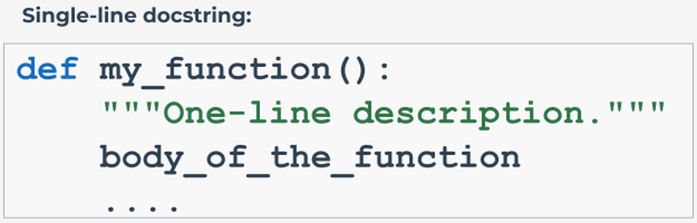
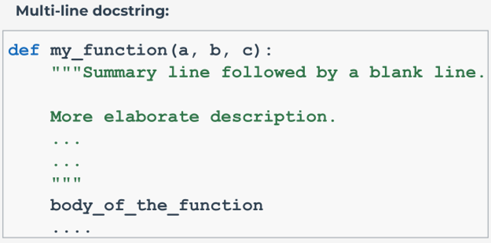

# PEP 257 – Docstring Conventions, Documentation, Type Hinting, and Linters

## What is PEP 257?
[PEP 257](https://peps.python.org/pep-0257/) is a document created as part of the Python Developer's Guide, which makes an attempt to standardize the high-level structure of docstrings. It outlines the **conventions**, best practices, and semantics (not laws or regulations!) associated with documenting Python code using docstrings. In short, it tries to answer the following two questions:
- **What** should Python docstrings contain?
- **How** should Python docstrings be used?

## What are docstrings?
A docstring is "a string literal that occurs as the first statement in a module, function, class, or method definition. Such a docstring becomes the `__doc__` special attribute of that object." (PEP 257)

In other words, docstrings are Python **documentation strings** that are used in the class, module, function, and method definition in order to provide information about the functionality of a larger piece of code in a **prescriptive** way.

They help programmers (including you) to remember and understand the purpose, operation, and capabilities of particular code blocks or sections.

### Docstring vs. comments
Before we move on, we need to understand this essential distinction (as their names suggest): comments are used for **commenting** your code, while docstrings are used for **documenting** your code. So, what is the difference between comments and docstrings, and eventually between commenting and documenting code?

Look at the table below, where we want to show you some of the differences between comments and docstrings in Python:

| Comments                                                                                                                                                                                                                                                                                                                                    | Docstrings                                                                                                                                                                     |
|---------------------------------------------------------------------------------------------------------------------------------------------------------------------------------------------------------------------------------------------------------------------------------------------------------------------------------------------|--------------------------------------------------------------------------------------------------------------------------------------------------------------------------------|
| Comments are non-executable statements in Python, which means that they are ignored by the Python interpreter; they are not stored in the memory, and cannot be accessed during program execution (i.e. they can be accessed by looking at the source code).                                                                                | Docstrings can be accessed by reading the source code, and by using the `__doc__` attribute or the `help()` function.                                                          |
| The main purpose of comments is increasing the readability and understandability of the code, and explaining the code to the user in a meaningful way. The user here means both other programmers and you (e.g. when you go back to your code after some time) – somebody who will want to or need to modify, extend, or maintain the code. | The main purpose of docstrings is documenting your code – describing its use, functionality, and capabilities to users who do not necessarily need to know how it works.       |
| Comments cannot be turned into documentation; their purpose is to simplify the code, provide precise information, and help to understand the intention of a particular snippet/line.                                                                                                                                                        | Docstrings can be easily turned into actual documentation, which describes a module's or function's behavior, the meaning of parameters, or the purpose of a specific package. |

Of course, as you'll see in the next pages, there's much more that we want to tell you about docstrings: how to use them, why use them, and where; and – as you expect – the difference between comments and docstrings will become even more evident.

### Why comment? Why document?
Before we delve into the topic of docstrings, let's try to answer the question: why is commenting and documenting code important?

Essentially, we must not forget this simple rule by Guido van Rossum: **"Code is more often read than written"**, which basically means that the code we write today will most likely be read in the future – either by you, or by another programmer, or even teams of programmers.

It is therefore crucial that we develop such programming and code writing habits that will allow the developers and other users to understand the code's whys and hows, as this will make the reusing of and contributing to code much easier.

So, we should agree that documenting code helps to maintain a cleaner, more readable, and more sustainable code, which means it's one of the best practices a good, responsible developer should adopt as part of their daily programming workshop toolset.

### A quick recap of comments
We hope that you remember that comments in Python are created using the hash sign (`#`). They should be rather brief (no more than 72 characters per line), begin with a capital letter, and end with a full stop.

If you need to include a longer comment in your code, you can use a multiple-line comment, in which case you should use the hash sign at the beginning of each line of comment.

Generally, you should insert comments **close to the code** you're describing in order to make it clear for the reader which part of the code you're referring to. You should be precise – don't include irrelevant or reduntant information; and most of all – try to design and write your code in such a way that it easily and comprehensibly comments itself (e.g. give self-commenting names to variables).

### When use comments?
Apart from the most obvious cases, such as **code and algorithm descriptions**, comments may serve a few other useful purposes. For example:
- they can help you **tag** those sections of code that are to be done in the future, or are left for further improvement, e.g.:
    ```python
    # TODO: Add a function that takes the val and prc arguments.
    ```
- they can help you comment (and uncomment) those sections of code that you want to test, e.g.:
    ```python
    def fun(val):
        return val * 2
    
    user_value = int(input("Enter the value: "))
    # fun(user_value)
    # user_value = user_value + "foo"
    
    print(fun(user_value))
    ```
- they can help you plan your work and outline certain sections of code that you will be designing, e.g.:
    ```python
    # Step 1: Ask the user for the value.
    # Step 2: Change the value to an int and handle possible exceptions.
    # Step 3: Print the value multiplied by 0.7.
    ```

### A few words on type hints: PEP 484
Before we move on from talking about comments to elaborating on docstrings, there is one more Python feature that we want to briefly tell you about – **type hinting**.

Type hinting is a mechanism introduced with Python 3.5 and desecribed in [PEP 484](https://peps.python.org/pep-0484/#type-definition-syntax) that allows you to equip your code with additional information without using comments. It's an optional, but more formalized, feature that makes it possible for you to use the Python built-in `typing` module to **provide type hint information** in your code in order to leave certain suggestions, mark certain possible problems that may come up in the development process, and label specific names with _type_ information.

In a nutshell, type hinting allows you to **statically indicate** the type information related to Python objects, which means that you can, for example, add type information to a function – indicate the type of an argument the function accepts, or the type of the value it will return. Look at the following examples:
```python
# No type information added:
def hello(name):
    return "Hello, " + name


# Type information added to a function:
def hello(name: str) -> str:
    return "Hello, " + name
```
Type hinting is **optional**, which means PEP 484 does not obligate you to leave any static typing-related information in your code. The first example is free from any type hints.

In the second example, the `str` annotation, which indicates that the `name` argument passed to the `hello()` function should be of type `str` helps us minimize the risk of certain (un)expected situations – it reduces the risk of passing a wrong type of value to the function. The `->` str annotation indicates, too, that the `hello()` function will return a value of type `str`, which of course is a string.

What does it all mean for you, and how can you take advantage of type hinting in Python?
- First of all, type hinting can help you **document your code**. Instead of leaving argument- and response-related information in docstrings, you can use the language itself to serve this purpose. This may be an elegant and useful way to highlight some of the more important code information, especially when publishing code in a project, sharing it with other developers, or leaving hints for yourself when you have to come back to the source code in the future. In some of the bigger software development projects, type hinting is a recommended practice that helps teams better understand the ways that types run through the code.
- Type hinting allows you to **notice certain kinds of errors more effectively** and write a more beautiful and, most of all, **cleaner code**. When using type hints, you more carefully think about types in your code, which helps to prevent or detect some of the errors that may result from the dynamic nature of Python. (However, we're not advocates for making Python require static typing.)
- You must remember that type hinting in Python is **not used at runtime**, which means all the type information you leave in the code in the form of annotations is erased when the program is executed. In other words, type hinting does not have any effect on the operation of your code. On the other hand, when used along with some type checking system or lint-like tools that you can plug in to your editor or IDE, it can support your code-writing by autocompleting your typing and spotting and highlighting errors before your code is executed.
- Since type hints have no effect on the source code, this means that they have no impact on performance times (characters are ignored by Python at runtime, which has no influence on interpretation/compilation speedups).

In this short section we've only touched on the most fundamental questions related to the subject of type hinting in Python. For more information about the topic, we encourage you to have a closer look at [PEP 483](https://peps.python.org/pep-0483/) – The theory of type hints, [PEP 484](https://peps.python.org/pep-0484/) – Type hints (information about the syntax for type annotations, static analysis and refactoring, type checking), and [PEP 3107](https://peps.python.org/pep-3107/) – Function Annotations (information about the syntax for adding metadata annotations to Python functions).

Now it's time to move on to docstrings.

## Docstrings – where and how?
We've already said that docstrings can be used in classes, modules, functions, and method definitions. Now we want to elaborate on this: there are cases where they not only can be included, but should be included. To be more precise – all public modules, functions, classes, and methods that are exported by a given module **should have docstrings**.

Non-public methods do not need to contain docstrings. However, it is recommended that you leave a comment right after the `def` line describing what the method actually does. In the case of **packages**, these should be documented too, and you can write package docstrings in the module docstring of the `__init__.py` file in the package folder.

As we've said before, docstrings are string literals that occur as **the first statement** in a module, function, class, or method. However, it is important (and fair) to add that string literals can also occur in many other places in Python code, and still serve as documentation. And even though they may no longer be accessible as runtime object attributes, they can still be extracted by some specific software tools (for more information about these, consult [PEP 256](https://peps.python.org/pep-0258/), which provides information about `Docutils`, a Python Dosctring Processing System).

And now, without going into too many details, it's enough to tell you that we distinguish two kinds of such "extra dosctrings" – these are:
- **attribute docstrings**, which are located immediately after an assignment statement at the top level of a module (module attributes), class (class attributes), or the `__init__` method definition of a class (instance attributes). These are interpreted by the extraction tools, such as Docutils, as "the docstrings of the target of the assignment statement." (If you are interested in learning more about attribute docstrings, you are more than welcome to dive into [PEP 224](https://peps.python.org/pep-0224/) yourself. At this point, we just want you to be aware of these.)
- **additional dosctrings**, which are located immediately after another docstring. (The original idea for additional docstrings was taken from PEP 216, which in turn was later superseded by [PEP 287](https://peps.python.org/pep-0287/) – again, you're more than welcome to take a look at those PEPs.)

### How to create docstrings
- Docstrings should be surrounded by **triple double quotes** (`"""triple double quotes"""`). For example:
    ```python
    def my_function():
        """I am a docstring."""
        ...
    ```
- If you need to use any backslashes in your docstrings, then you should follow the `r"""raw triple double quotes"""` format.
- If you need to use Unicode docstrings, then follow the `u"""Unicode triple-quote strings"""` format.

### One-line vs. multi-line docstrings
There are two forms of docstrings. And even though each of them serves the same purpose (i.e. is supposed to provide documentation), which one you're going to use will depend on certain conditions like how much information it is necessary to provide. These are:

- **one-line docstrings** – they are used for simple and short descriptions, and should fit on one line;
<p align="center">
  
</p>

- **multi-line docstrings** – they are used for more difficult cases, and should consist of a summary line followed by one blank line and a more elaborate description.
<p align="center">
  
</p>

Let's talk a bit more about each of them.

### One-line docstrings
**One-line docstrings** should be used for rather simple, obvious, and short descriptions. They should take up one line only, and be surrounded by triple double quotes (the closing quotes should be on the same line as the opening quotes as this helps to keep the code clean and elegant).

Important notes:
- a docstring should begin with an upper-case letter (unless an identifier begins the sentence) and end with a period;
- a docstring should **prescribe** the code segment's effect, **not describe** it. In other words, it should take the form of an imperative (e.g. "Do this", "Return that", "Compute this", "Convert that", etc.), not a description (e.g. "Does this", "Returns that", "Forms this", "Extends that", etc.). For example:
  ```python
  def greeting(name):
      """Take a name and return its replicated form."""
      return name * 2
  ```
- a docstring **should not** just simply repeat the function or method parameters. For example:

  :x: Don't do this:
  ```python
  def my_function(x, y):
      """my_function(x, y) -> list"""
  ...
  ```

  :heavy_check_mark: Instead, try to do something like this:
  ```python
  def my_function(x, y):
      """Compute the angles and return a list of coordinates."""
  ...
  ```
- Do not use a blank line above or under a one-line docstring unless you're documenting a class, in which case you should put a blank line after all the docstrings that document it:

  :x:
  ```python
  def calculate_tax(x, y):
  
      """I am a one-line docstring."""
      
      return (x+y) * 0.25
  ```

  :heavy_check_mark:
  ```python
  def calculate_tax(x, y):
      """I am a one-line docstring."""
      return (x+y) * 0.25
  ```

### Multi-line docstrings
**Multi-line docstrings** should be used for non-obvious cases and more detailed descriptions of code segments. They should have a summary line, similar to what a one-line docstring looks like, **followed by a blank line** and a more elaborate **description**. The summary line may be located on the same line as the open triple double quotes, or put on the next line. The end quotes should be put on a separate line.

Important notes:
- a multi-line docstring should be indented to the same level as the open quotes, for example:
  ```python
  def king_creator(name="Greg", ordinal="I", country="Neverland"):
      """Create a king following the article title naming convention.
      
      Keyword arguments:
      :arg name: the king's name (default: Greg)
      :type name: str
      :arg ordinal: Roman ordinal number (default: I)
      :type ordinal: str
      :arg country: the country ruled (default: Neverland)
      :type country: str
      """
      if name == "Voldemort":
          return "Voldemort is a reserved name."
      ...
  ```
- you should insert a blank line after all the multi-line docstrings that are documenting a class;
- script docstrings (in the sense of stand-alone programs/single file executables) should document the script's function, command line syntax, environment variables, and files. The description should be balanced in a way that it helps new users understand the script's usage, as well as provide a quick reference to all the program's features for the more experienced user;
- module docstrings should list the classes, exceptions, and functions exported by the module;
- package docstrings (understood as the docstring of the package's `__init__.py` module) should list the modules and subpackages exported by the package;
- docstrings for functions and class methods should summarize their behavior and provide information about the arguments (including optional arguments), values, exceptions, restrictions, etc.
- class docstrings should also summarize its behavior as well as document the public methods and instance variables. For example:
  ```python
  class Vehicle:
      """A class to represent a Vehicle.
      
      Attributes:
      -----------
      vehicle_type: str
          The type of the vehicle, e.g. a car.
      id_number: int
          The vehicle identification number.
      is_autonomous: bool
          self-driving -> True, not self-driving -> False
  
      
      Methods:
      --------
      report_location(lon=45.00, lat=90.00)
          Print the vehicle id number and its current location.
          (default longitude=45.00, default latitude=90.00)
      """
      
      def __init__(self, vehicle_type, id_number, is_autonomous=True):
          """
          Parameters:
          -----------
          vehicle_type: str
              The type of the vehicle, e.g. a car.
          id_number: int
              The vehicle identification number.
          is_autonomous: bool, optional
              self-driving -> True (default), not self-driving -> False
          """
          
          self.vehicle_type = vehicle_type
          self.id_number = id_number
          self.is_autonomous = is_autonomous
      
      def report_location(self, id_number, lon=45.00, lat=90.00):
          """
          Print the vehicle id number and its current location.
          
          Parameters:
          -----------
          id_number: int
              The vehicle identification number.
          lon: float, optional
              The vehicle's current longitude (default is 45.00)
          lat: float, optional
              The vehicle's current latitude (default is 90.00)
          """
  
      ...
      ...
      ...
  ```

### Docstring formatting types
You may have noticed that we have used two different docstring formats for documenting the `king_creator()` function and the `Vehicle` class. The first type of formatting is called **reStructuredText**, and it's the official Python documentation standard explained and described in [PEP 287](https://peps.python.org/pep-0287/). The second example uses the **NumPy/SciPy docstrings** format (for details, click [here](https://numpydoc.readthedocs.io/en/latest/format.html), which is a combination of the [Google docstrings](https://google.github.io/styleguide/pyguide.html#38-comments-and-docstrings) format and the reStructuredText format.

Both formatting types are good for the purposes of creating formal documentation, and both of them are supported by [Sphinx](https://www.sphinx-doc.org/en/master/usage/extensions/example_google.html), one of the most popular Python documentation generators.

Sphinx is a great tool for creating documentation for software development projects. It uses reStructuredText as its markup language, and has a lot of useful features, such as supporting the HTML output format, automatic testing of code snippets, extensive cross-references, and a hierarchical structure, which lets you define a document tree. Check it out.

### How to document a project
When documenting a Python project, depending on the nature of the project (i.e. private, shared, public, open source/public domain), you should first and foremost define its users and think about their needs. Creating a **user persona** may come in handy here as it will help you identify the ways the users will use your project.

This means you can easily improve their experience by thinking about how they're going to utilize your code and trying to predict the most common issues they may come across when doing so.

Generally, a project should contain the following documentation elements:
- a **readme**, which provides a brief summary of the project, its purpose, and possibly some installation guidelines;
- an **examples.py** file, which is a script that demonstrates a few examples of how to utilize the project;
- a **license** in the form of a txt file (particularly important for Open Source and Public Domain projects)
- a **how to contribute** file which provides information about the possible ways of contributing to the project (shared, open source, and public domain projects).

Because documenting your code can be a rather exhausting and time-consuming activity, you are definitely encouraged to use some of the tools that could help you auto-generate documentation in the desired format, and deal with documentation updates and versioning in an effective and efficient way.

There are many documentation tools and resources available, such as `Sphinx`, which we've already mentioned, or the highly popular `pdoc`, and many more. We encourage you to follow this path.

### Linters and fixers
How do you maintain the good quality of your code? Well, you already know that you can follow the style guides such as PEP 8 or PEP 257, and write your code in a readable and consistent way. You can (and possibly should) adopt the Zen of Python philosophy, with all its good advice for writing an elegant and maintainable code, and use the type hinting mechanism. You can observe how others write code and document it as part of their projects (Look at the Python Standard Library or the [Requests](https://docs.python-requests.org/en/latest/)) library), and learn from them. Finally, you can use _linters_.

Right. But what is a **linter**? Well, it's a tool that helps you write your code, because it **analyzes it for any stylistic anomalies and programming errors against a set of pre-defined rules**. In other words, it's a program that analyzes your code and reports such issues as structural and syntax errors, consistency breakups, and a lack of compatibility with best practices or code style guidelines such as PEP 8. The most popular linters are: [Flake8](https://flake8.pycqa.org/en/latest/), Pylint, Pyflakes, Pychecker, Mypy, and [Pycodestyle](https://github.com/PyCQA/pycodestyle) (formerly Pep8) – the official linter tool to check Python code against PEP 8 conventions.

A **fixer**, on the other hand, is a program that helps you fix these issues and format your code to be consistent with the adopted standards. The most popular fixers are: [Black](https://pypi.org/project/black/), YAPF, and autopep8.

Most editors and IDEs (e.g. PyCharm, Spyder, Atom, Sublime Text, Visual Studio, Eclipse + PyDev, VIM, or Thonny) support linters, which means you can run them in the background as you write code. This makes it possible to detect, highlight, and identify many problem areas in your code, such as typos, wrong tabbing and indentation issues, function calls with the wrong number of arguments, stylistic inconsistencies, dangerous code patterns, and many more, and automatically format your code to a pre-defined specification.

That being said, we encourage you to explore the territory of linters and fixers yourself, and start using them to maintain high-quality Python code, and simply make your life easier.

### How to access docstrings
We've nearly made it to the end of our journey with PEP 257 and docstrings. The last question that still remains to be fully answered is: how can we actually access docstrings?

We do it by using the Python `__doc__` attribute – if any string literals are present after the definition of a function/module/class/method, then they are associated with the object as its `__doc__` attribute, and this attribute provides the documentation of that object.
```python
def my_fun(a, b):
    """The summary line goes here.

    A more elaborate description of the function.

    Parameters:
    a: int (description)
    b: int (description)

    Returns:
    int: Description of the return value.
    """
    return a*b

print(my_fun.__doc__)
```
Run the code in the editor to see what happens. Your output should be like this:
```
The summary line goes here.
	
	A more elaborate description of the function.
	
	Parameters:
	a: int (description)
	b: int (description)
	
	Returns:
	int: Description of the return value.
```
But there's also another way to access the documentation strings – you can use the help() function. Make a small amendment in your code: replace the print function invocation with the following line:
```python
help(my_fun)
```
Run the code and see what happens. What are your conclusions?

As you can see, the output is lengthier and more descriptive:
```
Help on function my_fun in module __main__:

my_fun(a, b)
    The summary line goes here.
    
    A more elaborate description of the function.
    
    Parameters:
    a: int (description)
    b: int (description)
    
    Returns:
    int: Description of the return value.
```
Now try to access the docstrings of any of the Python built-in functions (e.g. `print()`). Then import a module and access the module documentation. Experiment with the `__doc__` method and the `help()` function. See what outputs you get and how they differ from each other. Use them to learn more information about the Python built-in objects.
