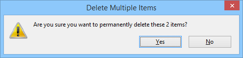
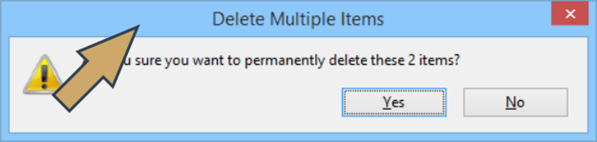
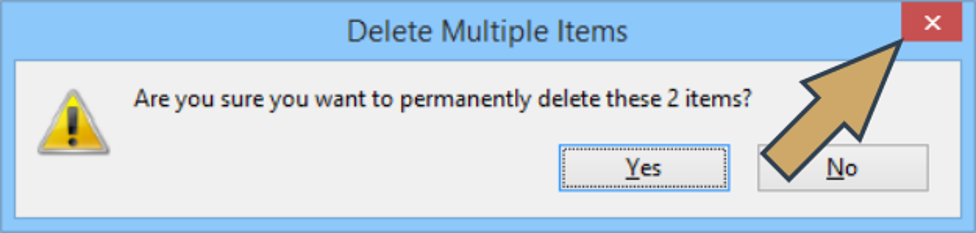
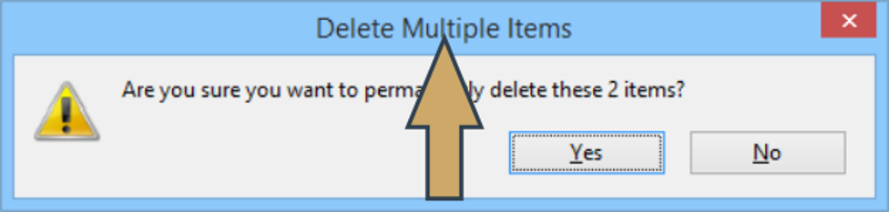
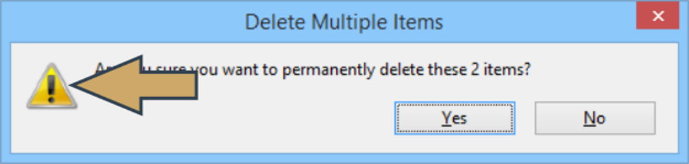
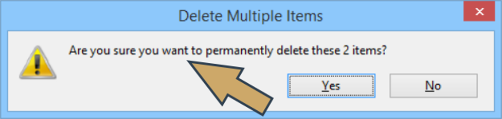
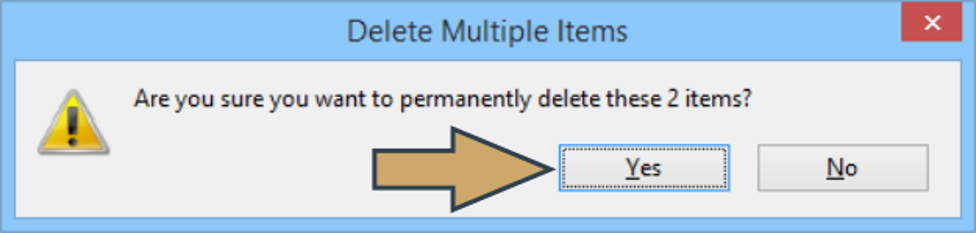
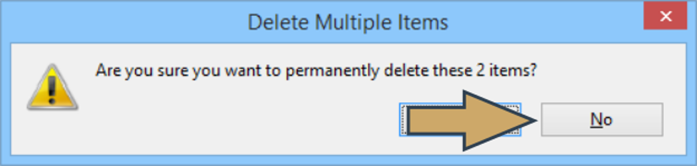

# Introduction to GUI Programming in Python: tkinter
After completing this course you will know:
- what GUI is and where it came from;
- how to construct a GUI using basic blocks and conventions;
- how event-driven programming works;
- some popular and commonly used GUI environments and toolkits;
- what tkinter is and how to build a GUI with its help;
- how to use widgets, windows, and events, and how to create basic applications based on tkinter's application life cycle.

## What is GUI?
GUI stands for **Graphical User Interface**. In this three-word acronym, the User seems to be the most obvious part. The word Interface needs some more reflection, but in fact, it is clear too – it’s a tool used by the user to command a device and to receive its responses.

But what does it mean that the interface is graphical?

We have to do a little time traveling to understand that. Don’t worry, it won’t take long. We’re going to travel not more than fifty years back. Are you ready? Okay, let’s go!

### Terminals
For a very long time (about 30 years or even longer) displays weren’t treated as a part of computers. A computer (sometimes called a **mainframe**) was a very big box (much, much bigger than the biggest refrigerator you ever had in your home) with thousands of colored lights, blinking all the time, and hundreds of switches (also colored).

To control the computer, you needed to have a specialized and completely separate device called a **terminal**. The terminal needed to be wired to a computer (don’t forget that the Internet had not been invented yet) and was rarely placed in the same room. It could be placed in a different building, a different city or even on a different continent.

But the most intriguing part of the story was that the terminal:
- was monochrome (it could display either grey, amber, or green dots on a black or nearly black background);
- wasn’t able to display anything but letters, digits, and a few other characters.

Think about it. Try to imagine what it was like to work with a computer without not being able to see a picture, not saying a word about movies or animations.

No photographs, no selfies, no avatars, no animated banners and finally, no colors.

How do you like it?

There are more disadvantages than just a lack of colors and a low resolution.

Terminals had no pointing devices. No mice, no trackballs, no touch screens. They had keyboards (very different from contemporary keyboards installed inside laptops) and nothing more.

Some of the terminals (very expensive and very rare models) could be equipped with a **light pen**.

Don't be misled by this term – the pen's role wasn't to paint or draw anything. It was used to point to different screen areas and acted in a way very similar to a mouse.

But believe us – you don't want to replace your mouse with this. Moreover, you don't want to replace your finger with the pen – it was heavy and the cable connected to it was usually thick and stiff. It's not surprising that the light pen didn't conquer the market.

The most important aspect of the case is a question: how do we organize computer–user interaction with such limited options?

The answer is exactly the same as the terminals of the time – in a strictly textual way.

It was just text – usually elegantly formatted, sometimes colorized (but still only text). The most commonly used terminals were able to display 80 columns and 25 lines. so there was not much space to utilize. The user's answer was given by pressing a set of allowed keys. Simple? Simple. From our present-day developer's perspective, too simple. From a user's point of view, difficult and inconvenient.

This is why both developers and users wanted something new – something more flexible, more intuitive, and just nicer. Much nicer. The GUI was the answer, which is still widely used today. Let's go back to the present time.

### Visual programming
Creating applications able to utilize GUI features is sometimes called **visual programming**.

The term stresses the fact that an application's look is as important as its functionality, but it's not just a matter of what you see on the screen, but also what you can do to change its state, and how you force the application to submit to your will.

The GUI created completely new possibilities unknown to users in previous eras: clicks and taps replaced keystrokes.

We're going to show you that such programming demands a completely different approach, and a completely different understanding of application activities.

Let's summarize some important aspects of visual programming.

A working GUI application externalizes its existence by creating a window (or windows) visible on the screen.

In some environments (e.g., on mobile devices) the window can occupy the whole screen, so not more than one application can be visible on screen at once.

<p align="center">
  
</p>

The application's window is usually equipped with certain decorations: a title bar, a frame, buttons, icons, etc. As you probably know, the style in which the decorations are visualized and placed within the window may be treated as an operating system's birthmark. We're sure that you can distinguish different MS Windows versions just by looking at the colors and shapes visible on the screen.

Some operating environments completely disable a user's effect on the way in which the OS decorates application windows. Others don't – the user can define their own style and colors of virtually all the GUI elements.

Some operating systems devote the whole screen to one application, so the decorations are extremely minimalistic or completely absent.

Fortunately, it has very little effect on the developer's work.

### Widgets
The user interacts with the GUI by using gestures: a mouse's movements, clicks targeting selected GUI elements, or by dragging other elements. Touch screens may offer something more: tapping (single or double or even more complex), swiping, and pinching.

The GUI elements designed to receive such gestures are called **controls** or **widgets**.

Note that the whole GUI idea was inspired by electrical control panels – devices full of switches, gauges, and colored warning lights. You'll find some traces of these inspirations in widget names. Don't be surprised.

Now let's take a look at a very simple window.

Let's try to identify all visible window components. This is a very important distinction, as the window hides some of its secrets from the user. We can even say that each window comprises very complicated machinery driving all the window's behaviors. But we're not interested in that yet.

First of all, the window has a **title bar**. It's one of the typical window decorations.

<p align="center">
  
</p>

Inside the title bar there is (or can be) a set of control buttons. Our sample window contains only one: the **closing button**. Note that the location of these buttons is OS-dependent.

<p align="center">
  
</p>

Inside the **title** bar (as the name suggests) there is a window title. Of course, some of the windows may also be untitled.

<p align="center">
  
</p>

The window's interior is equipped with a set of widgets responsible for implementing the window's functionalities. Some of them are active (they can receive a user's clicks or, in other words, they are clickable) while others aren't.

One of these non-clickables is an **icon** – a small picture that usually helps the user to quickly identify the issue.

<p align="center">
  
</p>

Another non-clickable member of the window's team is a **label** – a piece of text inside a window which literally explains the window's purpose.

<p align="center">
  
</p>

As our sample window performs a very specific task (it asks a question and forces the user to reply), it needs two buttons assigned to the user's possible answers.

The first of them is titled Yes and – look carefully! – it's currently focused!

<p align="center">
  
</p>

Can you guess how we know that?

Yes, it's shown by the thin dotted line drawn around the button. If you press the space bar now, it will be taken as an affirmative answer.

The second of the buttons is not focused yet.

What can we do to move the focus to the button?

Yes, we can press the _Tab_ key.

<p align="center">
  
</p>

Note: the underlined letters within the buttons' title show the shortcuts. Pressing these keys has the same effect as clicking one of the buttons.

And what does all this mean?

This means something very important to us. You may not want to believe us at the moment, but the traditional programming paradigm in which the programmer is responsible for responding to literally all the user's actions is completely useless in visual programming.

Why?

Because the number of all possible user moves is so substantial that continuous checking of the window's state changes, along with controlling all widget behavior, making the coding extremely heavy, and the code becomes badly bloated.

In a slightly more suggestive way, you could also say that widgets aren't introverts. They are not in the habit of concealing their emotions, and like very much to influence other widgets (e.g., moving the focus always engages two widgets: the one that loses the focus and the one that gains it). This means that the programmer is obliged not only to control each of the widgets separately, but also their pair, triple, and so on.

Let's try to imagine it. Look at the pseudo-code below:
```python
while True:
    wait_for_user_action()
    if user_pressed_button_yes():
    :
    elif user_pressed_button_no():
    :
    elif user_move_mouse_coursor_over_button_yes():
    :
    elif user_move_mouse_coursor_over_button_no():
    :
    elif user_pressed_Tab_key():
        if isfocused(button_yes):
        :
        elif isfocused(button_no):
       :
    :
    :
```
Note: The pseudo-code is deprived of all details. Moreover, it's not complete. It covers less than about 10 % of all possible events, and should be heavily developed to behave in a reasonable way.

Believe us: you don't want to write a code like this one. Fortunately, you don't need to.

Visual programming demands a completely different philosophy, or (expressing this thought in a more fashionable way) it needs a different paradigm.

This paradigm exists, and is widely applied to create GUI applications.

It's called **event-driven programming**.

## Classical vs. event-driven paradigm
What is EDP like? Or rather, what is EDP unlike?

First of all, detecting, registering and classifying all of a user's actions is beyond the programmer's control – there is a dedicated component called the event controller which takes care of this. It's automatic and completely opaque. You don't need to do anything (or almost anything) to make the machinery run, but you are obliged to do something else.

You have to inform the event controller what you want to perform when a particular event (e.g., a mouse click). This is done by writing specialized functions called event handlers. You write these handlers only for the events you want to serve – all other events will activate default behaviors (e.g., focus moving and window closing).

Of course, just implementing an event handler is not enough – you also have to make the event controller aware of it.

Let's imagine that we have a function named `DoSomething()` which... does something. We want the function to be invoked when a user clicks a button called `DO IT!`.

In the classical paradigm we would have to:
- discover the click and check if it happened over our button;
- redraw the button to reflect the click (e.g., to show that it is actually pressed)
- invoke the function.

In the event-driven paradigm our duties look completely different:
- the event controller detects the clicks on its own;
- it identifies the target of the click on its own;
- it invokes the desired function on its own;
- all these actions take place behind the scenes! Really!

Sounds good? Oh, yes, it does!

### Events
Have you noticed? We silently introduced a new word into our discussion. It’s the **event**.

What it is? Or rather, what could it be?

There are lots of events which an event manager is committed to recognizing, discovering, and serving. Here are some of them:
- pressing the mouse button;
- releasing the mouse button (actually, an ordinary mouse click consists of these two subsequent events)
- moving the mouse cursor;
- dragging something under the mouse cursor;
- pressing and releasing a key;
- tapping a screen;
- tracking the passage of time;
- monitoring a widget’s state change;
- and many, many more...
