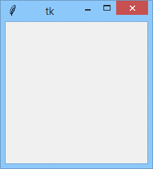
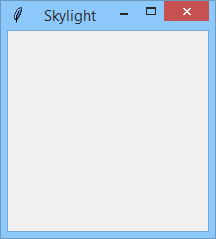
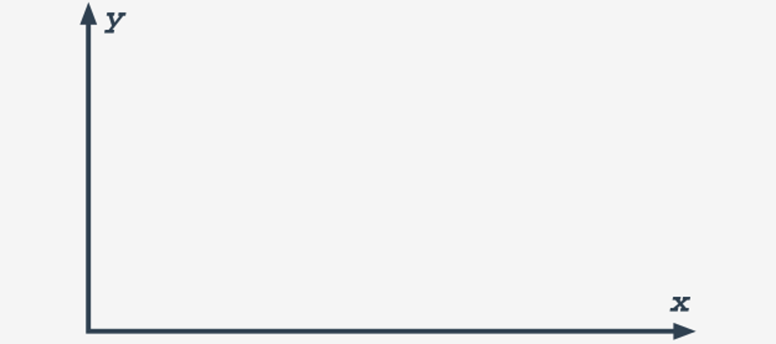
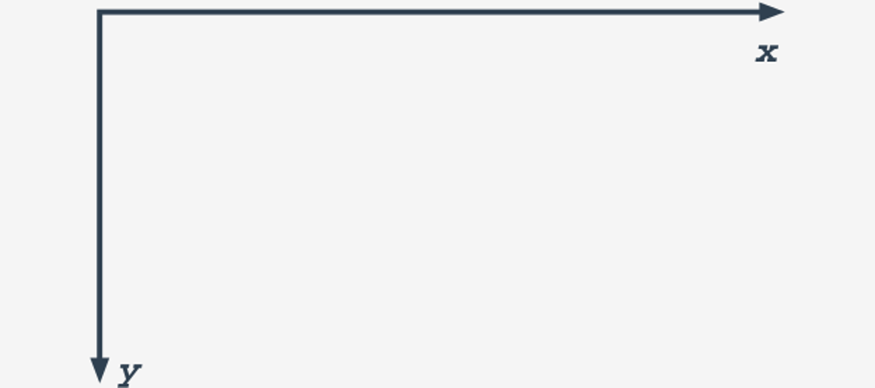
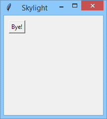
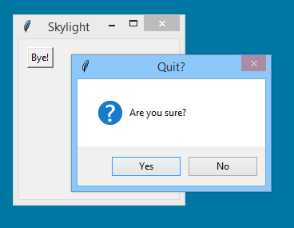

# TkInter
Unfortunately, each operating system delivers its own set of services designed to operate with its native GUI. Moreover, some of them (e.g., Linux) may define more than one standard for visual programming (two of the most widespread in the U*x world are named GTK and Qt).

This means that if we want to build portable GUI applications (i.e., apps able to work under different operating environments that always look the same) we need something more – we need an adapter. A set of uniform facilities enables us, the programmers, to write one code and not worry about portability.

Such an adapter is called a **widget toolkit**, a **GUI toolkit**, or a **UX library**.

One of these toolkits, which is very attractive to us, is **Tk**.

Here are some of its features:
- it’s free and open (we don’t need to pay for anything)
- it has been developed since 1991 (which means it’s stable and mature)
- it defines and serves more than thirty different universal widgets (which is enough even for quite complex applications)
- its implementation is available for many programming languages (of course, for Python too)

The module that brings Tk to the Python world is named _TkInter_, which is short for **Tk Interface**. It’s free and open, too.

You may have some trouble believing that you’ve been using TkInter for a long time, actually since your very first encounter with programming in Python.

Yes, it’s true – IDLE, the very first Python IDE, is written using TkInter.

We think this is the best recommendation – don’t you?

## Importing TkInter
As you already know, from Python's point of view TkInter is a package named `tkinter`. The package contains a bunch of functions, constants, classes, objects, and modules used to build GUI applications.

The GUI application itself consists of four essential elements:
- **importing** the needed `tkinter` components;
- **creating** an application’s main window;
- adding a set of necessary **widgets** to the window;
- **launching** the event controller.

That’s all. Really. Looks too good to be true? Let us show how it works. We’ll do it step-by-step. Ready?

The simplest (and at the same time the less controllable) way of importing `tkinter` facilities is to import the package as a whole:
```python
import tkinter
```
Note: it won’t allow you to access some modules built-in within the package and you will still have to import them separately. As you already now, such an import will force you to use the qualified names of `tkinter`’s components.

If you don’t like to write long package names each time you make use of their contents, you can perform an import which **renames** the package (precisely: which creates an **alias** of its original name) at the time of import.

tk looks shorter than tkinter, doesn’t it?
```python
import tkinter as tk
```
Okay, we know there’s no accounting for taste, but it’s definitely worth accounting for code readability. The choice is entirely up to you.

If you like to have full control over all your source code, you can make the import process **extremely itemized** by importing each of the facilities separately – just like this:
```python
from tkinter import Button
```
If you're an enthusiast of living life on the edge, you can simplify your import (but not the rest of your work) by using the star as a component name:
```python
from tkinter import *
```
It's handy when you write it, but it can bring some cumbersome troubles when names from the package's namespace cross with some of your private names.

Don't think we're going to discourage you from using this form. It's only a warning. Or rather a piece of friendly advice.

Now we're ready to create our first application. The application will be completely **mute**, **deaf** to the same extent as it is mute, and thus completely indifferent to any input. Don't worry, we'll breathe some life into it soon – it's only a very first step.

Look at the code in the editor.
```python
import tkinter

skylight = tkinter.Tk()
skylight.mainloop()
```
The main application window (which is often the only window being used by the application) is created by the `tkinter` method named `Tk()`. In its most commonly used form, it needs no arguments. The object returned by the method is **complete**, but at the same time, completely **invisible**. Moreover, it won't be visible until the event controller starts.

To start the controller, you have to invoke the main window's method, named `mainloop()`.

The name is significant because – as you can see – there is nothing more you can do in your code. Entering the controller's main loop **deprives you** of the possibility of direct control over the code's execution. Now you're fully at the mercy of the controller. Exiting the main loop is equivalent to finishing the application, as without the controller's companion there is nothing more you can do.

Let's run the code now.

Did you get the same window as ours?

<p align="center">
  
</p>

There are some issues with the window, and the most important is how to close it while also causing the application to quit. Currently, there is no other way than to make use of some of the OS's default behaviors, e.g., clicking the **closing button** (ours is red – and yours?) or using a dedicated **keyboard shortcut** like MS Windows®' Alt-F4.

A preferable way of coping with that is to equip the window with a **dedicated button**, but now we're going to make a little cosmetic change. We don't like the window's title. We'll change it now. How?

Each window (including the main one) has a method named – of course – `title()`. The method can be invoked more than once in any moment of the window's life. We'll activate it before the window is shown, just like the way we do it in the editor window.
```python
import tkinter

skylight = tkinter.Tk()
skylight.title("Skylight")
skylight.mainloop()
```
Can you see it? The title has changed now!

<p align="center">
  
</p>

Now it's the turn of the button.

A button visible on the screen is, in fact, a reflection of an object of the Button class. To bring a button to life, you have to:
- create a `Button` class object (it'll be done by the class's constructor)
- place the button inside the main window (it'll be done by one of the window's methods)

Note the distinction: it can be said that the button creates itself, but to make it visible, **you need the window's (not the button's!) method**.
```python
import tkinter

skylight = tkinter.Tk()
skylight.title("Skylight")
button = tkinter.Button(skylight, text="Bye!")
button.place(x=10, y=10)
skylight.mainloop()
```
Take a look at the code in the editor window.

To create a `Button` class object, we make use of its constructor. Its first argument (which is a reference to the target window) is obligatory. All others are optional.

The one named `text` sets the initial button's title (note: the title can be changed at any time).

The object saved inside the button variable is now created, but still invisible. Moreover, the main window doesn't know where to put it within its interior. Let's fix that.


The act of placing the widget somewhere inside the window is done with a method named `place()`. As you can see, we use the method in a way in which the button's two coordinates are given: x and y. There are three important remarks that must be written here:
- the widget's coordinates refer defaultly to the pixel occupied by the **upper-left corner**;
- the widget's size is **defaultly determined** by the constructor in order to fit the widget's content (the title's length and height in this case)
- the widget's location is **measured in pixels**, but there is one important issue which distinguishes the screen coordinates from the ones used by the geometry; look: this is what the Cartesian two-dimensional coordinates system looks like:

    <p align="center">
      
    </p>
    
    while the screen coordinates look as follows:
    
    <p align="center">
      
    </p>

- This means that a pixel described as **(x=10,y=10)** is located near the **top-left window corner**. Be aware of this!

Now we're fully prepared to run the code.

Hi, Button! Nice to see you!

<p align="center">
  
</p>

Can we click you? Of course we can. Does it change anything? No, it doesn't. Of course, the view of the button changes, simulating a real button's behaviors, but no other reactions can be seen. We don't like this.

And this is the moment when we should hire a new member onto our team – an **event handler**.

### Event handler
An event handler is a piece of code responsible for **responding to all clicks addressed to our button**.

The event handler we need has a simple assignment – we want it to just terminate our application. This crucial operation is done with a main window method called – don't be afraid – `destroy()`. It's a parameterless method, as destroying needs (in contrast to creation) no arguments at all.

How do we write the event handler?

It's a **function**. Just a simple function. The handler used by the button has to be a parameterless function of any name. Don't forget that the function will be invoked, not by us, but **only by the controller**.

Furthermore, invoking your own handler is strictly prohibited, as it can completely confuse the event controller.

We don't want the controller to be confused. It may end badly. Therefore, the simplest handler may look like this:
```python
def Click():
    skylight.destroy()
```
Note: a function designed to be invoked by someone/something else (not us!) is often called a **callback**. We'll use the names _handler_ and _callback_ interchangeably.

Okay, we have a handler, but how do we couple it with the rest of the window's machinery?

Look carefully at the Button's constructor invocation - we've provided the code in the editor.
```python
import tkinter

def Click():
    skylight.destroy();
    
skylight = tkinter.Tk()
skylight.title("Skylight")
button = tkinter.Button(skylight, text="Bye!", command=Click)
button.place(x=10, y=10)
skylight.mainloop()
```
A new argument has appeared there. Its name is `command`, and it's set with the name of a callback that **will be invoked when the button is clicked**. Note: there are **no parentheses**, as we don't want to invoke the callback here – we need its name to be passed to the `Button` object.

Now we can run the code and check if our button is functional. We hope it is.

Two remarks should be made here:
- binding the callback with the widget by using the `command` constructor's parameter is not the only way offered by `tkinter` for this purpose; moreover, **callbacks can be replaced** during program execution – we'll tell you more about that soon;
- the one and same **callback can be bound with more than one widget** – it's a very useful solution in some cases.

Of course, closing the window without asking the user if they are really sure that this is exactly what they want to do isn't a good way to build up a relationship with them.

We definitely want to ask the user before we permanently remove their window from sight.

Fortunately, `tkinter` is very helpful with this issue. There is a module named `messagebox` (the name speaks for itself) which is your great companion in this and similar matters.

`messagebox` is able to create **dialog boxes** intended to ask questions, display messages, and to receive a user's reply.

The dialog box is an example of a **modal window** – a window which **grabs the whole of the application's focus**. It means that all other application widgets become deaf as long as the modal window is present.

We've provided the amended code in the editor window.
```python
import tkinter
from tkinter import messagebox


def Click():
    replay = messagebox.askquestion("Quit?", "Are you sure?")
    if replay == 'yes':
        skylight.destroy();


skylight = tkinter.Tk()
skylight.title("Skylight")
button = tkinter.Button(skylight, text="Bye!", command=Click)
button.place(x=10, y=10)
skylight.mainloop()
```
Let's dive into our new code.
- we've had to add a second import directive – as `messagebox` is a module located inside the `tkinter` package, we need to use the `from` variant of the import;
- the essence of our modification is hidden inside the callback:
  - we invoke the `askquestion()` function by passing two arguments to it: the first will be used as a **dialog window title**, the second will be **displayed inside the window** to make the user aware of the incoming issue;
  - the `askquestion()` function returns a string which is equal to `yes` if the user has clicked the confirming button (note: the text on the button depends of the OS international settings, and will be set to the word yes or its local analog)

As you can see, the mechanism is easy and handy. Let's run the code and check its results. We hope that you see something like this:

<p align="center">
  
</p>

Of course, our code is very disappointing. For example, the window can be closed instantly, without any question, when the user clicks the closing button. This is not very elegant; you'll probably agree with that.

We ask you for forgiveness – this is only an example, obviously too simple to be utilized in regular conditions, but it gives us a good starting point from which to continue the journey into more complex tkinter facilities.

Stay tuned!