# Settling widgets in the window's interior

## Settling widgets
A familiarity with the `Button` widget allows us to show you some ways of putting the widgets (not only the buttons) inside windows. There are more of them than just `place()`, which you learned about in the previous section. To be precise, there are **three different methods**.

These methods are implemented by **geometry managers**.

`Place` is the most detailed one. It forces you to **precisely declare a widget's location**, pixel by pixel. It won't, however, protect you from some common mistakes causing the widgets to overlap each other or to place some of them, partially or fully, outside the window.

If you don't want to deploy the widgets manually and worry about possible conflicts and failures, you may entrust the whole problem to `tkinter`. It'll try to guess your intentions and to **find the best location** for each widget. Unfortunately, its assumptions may not live up to your expectations, and the final result can be really disappointing. This method of settling widgets is implemented by the `pack` geometry manager.

The `grid` geometry manager is in the middle, in between the other two geometry managers. It gives you a chance to express your **general wishes** and tries to deploy the widgets according to them. Note the word general – they aren't as precise as the ones used by `place`, but are far more detailed than those utilized by `pack`.

There is one very important aspect of the issue that must be mentioned here: **these managers cannot be mixed**. Only one of them can be used in one application, unless you want to turn your window into a big mess.

We're talking seriously about it. Don't take it as a joke.

### The `place()` method
The place geometry manager demands the usage of the `place()` method. Note: the method is invoked **from within the widget's object**, not the window, as the widget is always aware of the window it belongs to (it gets the information from the constructor's very first argument).

The most usable `place()` method parameters are as follows (all of them are passed as keyword arguments):
- `height=h` – the widget's desired **height** measured in pixels; if the parameter is omitted, the widget's height will be determined automatically;
- `width=w` – the widget's desired **width** measured in pixels; if the parameter is omitted, the widget's width will be determined automatically;
- `x=x` – the widget's top-left pixel's **horizontal coordinate** measured relative to the home window's top-left corner;
- `y=y` – the widget's top-left pixel's **vertical coordinate** measured relative to the home window's top-left corner.

Let's see them all in action.
```python
import tkinter as tk

window = tk.Tk()
button_1 = tk.Button(window, text="Button #1")
button_2 = tk.Button(window, text="Button #2")
button_3 = tk.Button(window, text="Button #3")
button_1.place(x=10, y=10)
button_2.place(x=20, y=40)
button_3.place(x=30, y=70)
window.mainloop()
```
The snippet we've prepared for you shows how the `place()` method works. Look at the code in the editor.

It places three buttons in a **cascade-like order**. Try to guess what these buttons will look like inside the window. Yes, this is what we expected, isn't it?

<p align="center">
  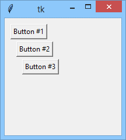
</p>

Now let's play with `width` and `height` for a moment.
```python
import tkinter as tk

window = tk.Tk()
button_1 = tk.Button(window, text="Button #1")
button_2 = tk.Button(window, text="Button #2")
button_3 = tk.Button(window, text="Button #3")
button_1.place(x=10, y=10, width=150)
button_2.place(x=20, y=40)
button_3.place(x=30, y=70, height=50)
window.mainloop(
```
Look, we've added some arguments to the previous snippet. Two buttons (`b1` and `b3`) should look different now – can we be sure of it?

Yes, we can!

<p align="center">
  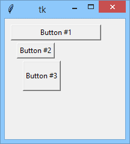
</p>

As you can see, using `place()` gives you full control over the window's image. There is only one important but — full control means full responsibility. Sometimes it's better to share the responsibility among two parts – e.g., you and the `grid()` geometry controller.

### The `grid()` method
`grid()` sees the window's area as a... grid. This means that the whole of the window's interior is divided into a number of **columns** of equal width and a number of **rows** of equal height.

The **grid itself is not visible** – the distribution is modeled inside the manager and you are only able to know its effects i.e., the widget's final arrangement.

You're not obliged to declare the number of rows and columns in advance – `grid()` finds the proper numbers for you. Let's try it.

The most commonly used `grid()` method parameters are gathered below (as, previously, all of them are passed as keyword arguments):
- `column=c` – deploys the widget in the **column** number `c`; note: the columns' numbers start from zero, and if you omit this argument, the manager will assume `0` (the left-most column)
- `row=r` – deploys the widget in the **row** number `r`; if you omit this argument, the manager will assume the first free row starting from the top;
- `columnspan=cs` – determines how many **neighboring columns** the widget occupies; the parameter defaults to `1` (the widget won't cross a single grid's cell)
- `rowspan=rs` – works as `columnspan` but refers to **rows**.

Let's see them all in action.

Analyze the snippet in the editor and determine the resulting number of columns and rows. That's essential if you want to imagine the resulting window's appearance.
```python
import tkinter as tk

window = tk.Tk()
button_1 = tk.Button(window, text="Button #1")
button_2 = tk.Button(window, text="Button #2")
button_3 = tk.Button(window, text="Button #3")
button_1.grid(row=0, column=0)
button_2.grid(row=1, column=1)
button_3.grid(row=2, column=2)
window.mainloop()
```
Are you ready to solve the puzzle? Did you imagine the window that way?

<p align="center">
  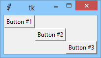
</p>

We're sure you did. Look. The window is divided into **nine cells**: three rows and three columns. The buttons are settled on the **grid's diagonal**.

Now we’re going to affect the buttons’ relation to the cells’ boundaries.

Can you see what we changed in the code?
```python
import tkinter as tk

window = tk.Tk()
button_1 = tk.Button(window, text="Button #1")
button_2 = tk.Button(window, text="Button #2")
button_3 = tk.Button(window, text="Button #3")
button_1.grid(row=0, column=0)
button_2.grid(row=1, column=1)
button_3.grid(row=2, column=0, columnspan=2)
window.mainloop()
```
Yes, we modified the third `grid()` invocation a bit. We wanted to deploy the button inside the cell located in the third (actually, the lowest) row and the first (the left-most) column, but we also did something else – we wanted the widget to span across two horizontally neighboring cells.

We admit that this puzzle is somewhat harder than the previous ones. Don't rush through this – think it over carefully.

Here's the solution.

<p align="center">
  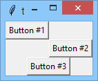
</p>

Note: the manager noticed that the total number of columns is actually two, not three as in the previous code. This is why the window looks different.

### The `pack()` method
The third, fully automatic geometry manager is named `pack()` as it **packs subsequent widgets** into the window's interior. This means that the **order** in which the widgets are packed **matters** – in contrast to `grid()` and `place()`.

Let's take a look at it.

The default pack's operation tends to deploy all subsequent widgets in one column, one below the other. You can change this behavior to a limited extent by using the following parameters:
- `side=s` – forces the manager to pack the widgets in a specified **direction**, where s can be specified as:
  - `TOP` – the widget is packed toward the window's **top** (it's manager's default behavior)
  - `BOTTOM` – the widget is packed toward the window's **bottom**;
  - `LEFT` – toward the window's **left** boundary;
  - `RIGHT` – toward the window's **right** boundary;
- `fill=f` – suggests to the manager how to expand the widget if you want it to occupy more space than the default, while `f` should be specified as:
  - `NONE` – do not expand the widget (default behavior)
  - `X` – expand it in the **horizontal** direction;
  - `Y` – expand it in the **vertical** direction;
  - `BOTH` – expand it in **both** directions;

We want to warn you that the results produced by `pack()` can be extremely surprising, and you should spend some time on your own experimenting with all its vices.

We suggest you use it only as a temporary solution to help you get a working application quickly, but if you want your application to look nice and to be legible and clear (of course, you would want that!) you'd better forget about `pack()` and use either `grid()` (in simpler cases) or `place()`.

Let `pack()` show us what it can do for us. Look at the code in the editor.
```python
import tkinter as tk


window = tk.Tk()
button_1 = tk.Button(window, text="Button #1")
button_2 = tk.Button(window, text="Button #2")
button_3 = tk.Button(window, text="Button #3")
button_1.pack()
button_2.pack()
button_3.pack()
window.mainloop()
```
As you can see, using `pack()` simplifies the code – you don't need to specify any coordinates – but that doesn't mean this will simplify the developer's life. You may expect that `pack()` will know how to handle your widgets, but sometimes it's work results are like a lottery.

Let's look at the window we get. The window looks different.

<p align="center">
  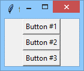
</p>

Very different. For example, the window fits its size to the area occupied by the widgets. The buttons are located one after the other, from top to bottom.

Let's play a little game with `pack`'s arguments.

We've ordered `pack()` to push the `button_1` button to the right window's boundary.
```python
import tkinter as tk

window = tk.Tk()
button_1 = tk.Button(window, text="Button #1")
button_2 = tk.Button(window, text="Button #2")
button_3 = tk.Button(window, text="Button #3")
button_1.pack(side=tk.RIGHT)
button_2.pack()
button_3.pack()
window.mainloop()
```
Can you predict the window's appearance? We admit that it may be difficult.

Is this what you expected?

<p align="center">
  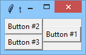
</p>

No? Are you surprised? You have the right to be. `Pack` is the **least intuitive** geometry manager for sure, and you really need to spend some time testing its whims.

We have one more experiment left to carry out.

Note: we want the `button_1` button to be `filled (expanded)` in the **vertical** direction:

This puzzle is a bit easier than the previous one. Think for a moment.
```python
import tkinter as tk

window = tk.Tk()
button_1 = tk.Button(window, text="Button #1")
button_2 = tk.Button(window, text="Button #2")
button_3 = tk.Button(window, text="Button #3")
button_1.pack(side=tk.RIGHT, fill=tk.Y)
button_2.pack()
button_3.pack()
window.mainloop()
```
Yes, you're right – this is the expected answer.

<p align="center">
  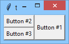
</p>

We think that there is one intriguing question that can be asked here and now: do these buttons have to be **gray**? It's boring. Very boring.

We're going to clear up this issue soon.

## Adding colors
Nearly everything you put inside your windows may be **colored**. Most widgets have dedicated properties to handle their colors and we will tell you about them while discussing the widgets themselves. Currently, the most important thing is getting to know how the colors are described in `tkinter`, in other words, what means can you use to order the button to be red or blue.

There are at least three methods designed to meet your needs. We will tell you about them on the example of `Button` but don't forget that these ways are universal and can be used virtually everywhere.

Let's check if tkinter understands **English** – look at the code in the editor, our test is there.
```python
import tkinter as tk

window = tk.Tk()
button = tk.Button(window, text="Button #1", bg="red", fg="yellow")
button.pack()
window.mainloop()
```
Note the two new arguments we use in the constructor invocation: `bg` (what is a short form of _“background-color”_) and `fg` (_“foreground-color”_). We went along the line of least resistance here – we've just made use of regular English names of colors and packed them inside strings.

Does it work? Let's check.

Yes, it definitely does:

<p align="center">
  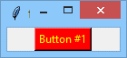
</p>

We encourage to you make some **clicks** on the button – it will unveil its little secret.

Can you see? The colors of the lowered (pressed) button are **gray** still. Why?

Because `fb` and `bg` refer to **raised** buttons only. There two additional parameters describing the second set of colors named `activeforeground` and `activebackground` respectively used by the event controller when the button is **pressed**. Do you want to check how they work? Do it boldly!

We can summarize the test's result saying that any of commonly used English color name can be used with `tkinter`. Don't bother if you want some of your widgets to be simply **white**, **black**, **green**, **gray** or even **grey**. It's easy and handy although not very precise.

Tkinter can do something more for you.

Tkinter recognizes over **750 predefined color names** – all of them can be found here.

Feel free to use them – we've showed our try in the editor.
```python
import tkinter as tk


window = tk.Tk()
button = tk.Button(window, text="Button #1",
                   bg="MediumPurple",
                   fg="LightSalmon",
                   activeforeground="LavenderBlush",
                   activebackground="HotPink")
button.pack()
window.mainloop()
```
This is what we get:

<p align="center">
  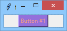
</p>

Yes, it definitely does:

The third method you can use is based on the fact that each color can be obtained by **mixing** (adding) **three primary colors**: **red** (R), **green** (G) and **blue** (B). The phenomenon is utilized by the so-called **RGB color model** which is one of the additive color models and it's widely used in many application, e.g. in color displays of different kinds.

One of the RGB model implementations allows you to set the **saturation** of every of primary colors in the range <0..255> what gives **256 different saturation levels**, from color's absence (saturation 0) to full color's presence (saturation 255).

Do you think it's not too much? Maybe, but don't forget that you mix three different colors (so-called **color components**) so the full spectrum consists of 256*256*256 = **16,777,216** colors. An average human can distinguish about 7 million colors, consequently, the model should work well and it really does.

Let's take a closer look at this.

When all the components are set to **zero** (absence of the colors), we get **black** as a result.

When all the components are set to **255** (full presence of the colors), we get **white** as a result.

<p align="center">
  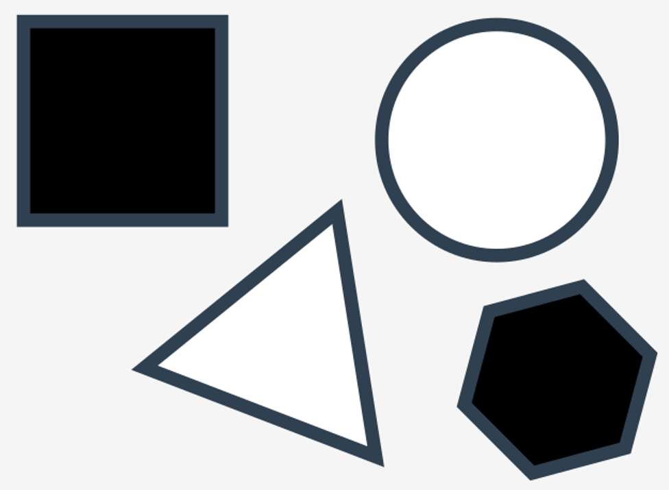
</p>

When one of the components is set to 255 while others are set to 0, we get one of the **primary colors** – red, green or blue.

<p align="center">
  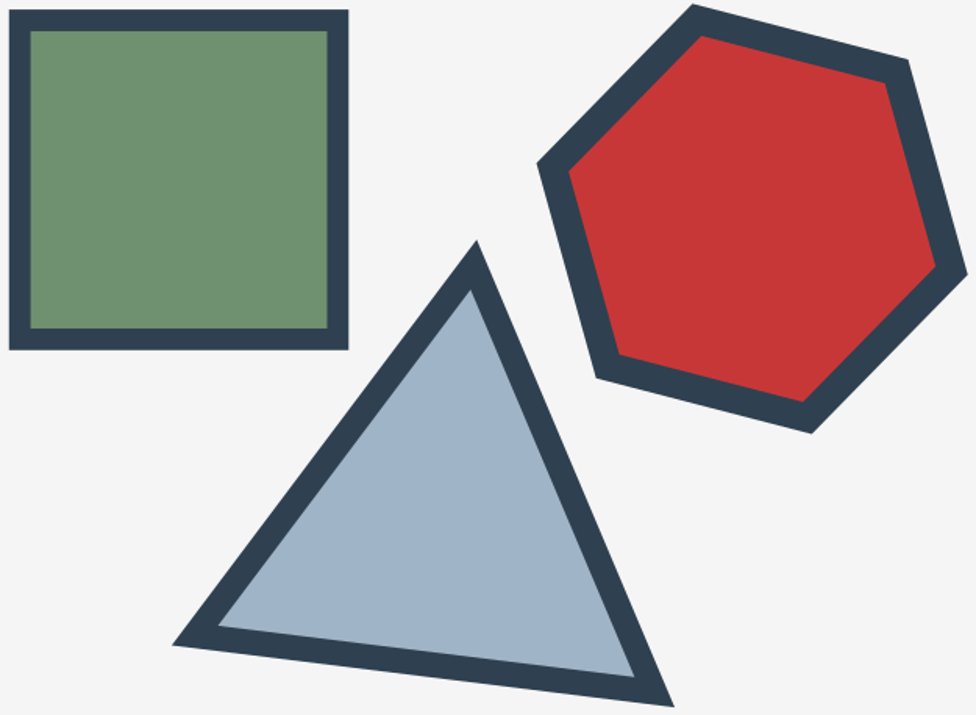
</p>

Setting non-zero values for more than one component produces **intermediate colors**, e.g. red and blue set to 255 with green set to 0 gives the **violet**.

It seems clear, doesn't it?

OK, but how to specify all these (more than 16 million) mixes in a comprehensive way?

It's is done by a trick used extensively in web pages – as a **string** starting with a **hash** (`#`) followed by **6 hexadecimal digits**. Each **pair of the digits** forms the value from range **0x00..0xFF** (0..255) what determines the specific component level.

This is how it works:

#RRGGBB

All three pairs (RR, GG and GG) are **two-digit hexadecimal number** so:
- `#000000` is **black**
- `#FFFFFF` is **white**
- `#FF0000` is **red**
- `#00FF00` is **green**
- `#0000FF` is **blue**
- `#00FFFF` is **turquoise**
- `#FF00FF` is **violet**
- ...

Please, forgive us that we made that list so short. To tell the truth, we have no idea how to name each of these 16 million colors – do you?

Note: when all the components are set to the **same value**, equal neither to zero nor to 0xFF (e.g. `#0F0F0F0`), you will get **254 shades of gray**.

Look at the code in the editor. We want to show you you a little test showing how the RGB works:
```python
import tkinter as tk

window = tk.Tk()
button = tk.Button(window, text="Button #1",
                   bg="#9370DB",
                   fg="#FFA07A",
                   activeforeground="#FFF0F5",
                   activebackground="#FF69B4")
button.pack()
window.mainloop()
```
Do the colors look the same as in the previous code?

They should look the same as we used RGB equivalents of the previously used `tkinter` color names.

Now try to find RGB codes for all your favorite colors. There are so many choices – don't feel lost!

<p align="center">
  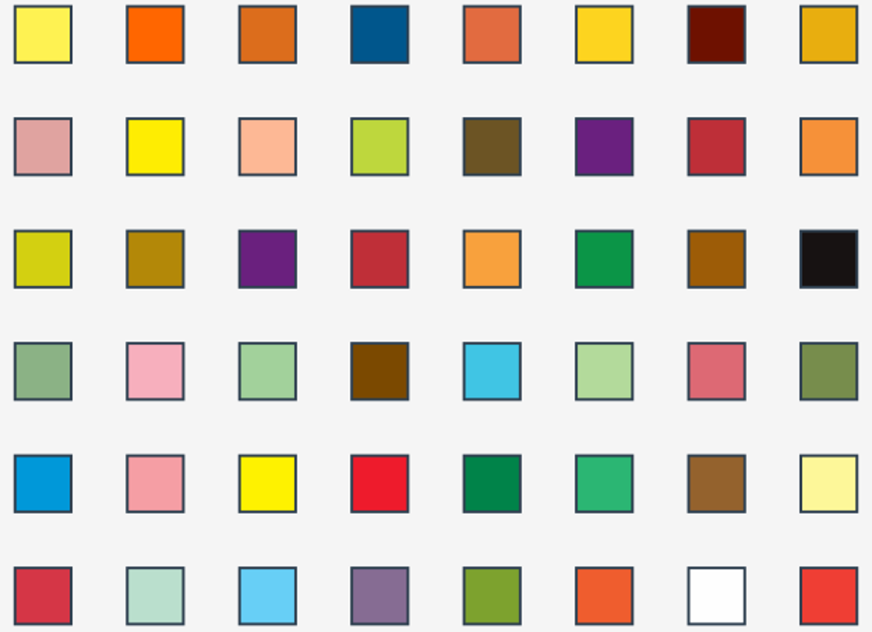
</p>
