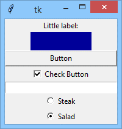
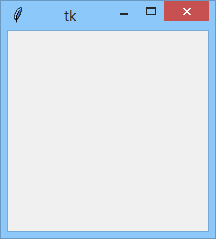
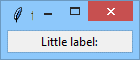
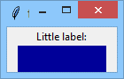
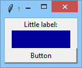
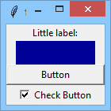
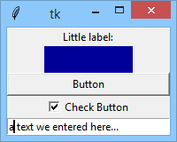
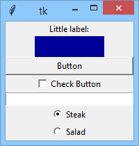

# A simple GUI application

## Building a GUI application from scratch
Now we're going to build a very simple and rather useless GUI application. Does that sound weird? Maybe, but the application, when ready, will make you more accustomed to some `tkinter` **habits** and **conventions**.

Our fabulous goal will look like the vision presented below:

<p align="center">
  
</p>

Are you ready? Let's start.

As everyone knows, Rome wasn't built in a day, and our application isn't an exception. We'll start with something absolutely **obvious** – we'll construct a window and launch an event controller – look at the code in the editor to see how to do it.
```python
import tkinter as tk

window = tk.Tk()
window.mainloop()
```
Our window looks like this one for now:

<p align="center">
  
</p>

There's nothing surprising yet. Let's add something to this dull gray area.

Our new friend is called `Label` – a non-clickable widget able to **present short textual information**, passed to the widget's constructor using a `text` argument. The text can later be changed at any moment of the widget's life.

As you can see, we're using the `pack()` geometry manager to compose the window.
```python
import tkinter as tk

window = tk.Tk()

label = tk.Label(window, text = "Little label:")
label.pack()

window.mainloop()
```
Let's welcome `Label` into our window:

<p align="center">
  
</p>

Note: `pack()` resizes the window to a size large enough to fit all the packed widgets. This is its default behavior. Don't worry, the window will grow soon.

Our next companion will be `Frame`.

A `Frame` is another non-clickable component used to **group widgets** and to separate them (visually) from other window components. Our `Frame` plays a less important role – it just occupies a rectangle and fills it with its own color. We expect nothing more for now.

Let's check it out.
```python
import tkinter as tk

window = tk.Tk()

label = tk.Label(window, text="Little label:")
label.pack()

frame = tk.Frame(window, height=30, width=100, bg="#000099")
frame.pack()

window.mainloop()
```
This is how the `Frame` manifests its presence:

<p align="center">
  
</p>

Make our window great again.

Now we invite a `Button` to join our team.

Our `Button` will be completely **mute**, as we haven’t bound anything to its command property. You can change that if you want.
```python
import tkinter as tk

window = tk.Tk()

label = tk.Label(window, text="Little label:")
label.pack()

frame = tk.Frame(window, height=30, width=100, bg="#000099")
frame.pack()

button = tk.Button(window, text="Button")
button.pack(fill=tk.X)

window.mainloop()
```
This is what our window looks like now:

<p align="center">
  
</p>

Our next component is completely **invisible**. You won't find it in the window area.

It's the switch variable. Can't you see it? It's set to hold an object of the `IntVar` class. This object is designed to store **integer** values. "Okay," you may say, "can't we use a regular variable instead?"

**No, we can't**. Objects of the `IntVar` class are used by `tkinter` to **organize internal communication between different widgets**. A regular variable can't play such a role.

If you want such an object to store an integer value, you can't use the assignment operator. The class offers a dedicated method for that purpose, and the method is named `set()`.

Note: we've used the method to store a value of `1` inside the object.
```python
import tkinter as tk

window = tk.Tk()

label = tk.Label(window, text="Little label:")
label.pack()

frame = tk.Frame(window, height=30, width=100, bg="#000099")
frame.pack()

button = tk.Button(window, text="Button")
button.pack(fill=tk.X)

switch = tk.IntVar()
switch.set(1)

window.mainloop()
```
As the window's view hasn't changed, we can go directly to the next step.

The next step adds a brand new widget to our window – it’s a `Checkbutton`.

It’s a **small square** which can be filled with a **tick mark**, or which can be empty.

The `Checkbutton` is primarily used to represent **two-state selections**. In other words, it can be in one of two possible states:
- the **ON** state when the `Checkbutton` is checked/ticked (which can be equated with an **affirmative answer** to some question)
- the **OFF** state when the `Checkbutton` is cleared (you can think of it as a kind of negative answer)

Take a look at the `Checkbutton` constructor – there’s something completely new. Can you see it?
```python
import tkinter as tk

win = tk.Tk()

label = tk.Label(win, text="Little label:")
label.pack()

frame = tk.Frame(win, height=30, width=100, bg="#000099")
frame.pack()

button = tk.Button(win, text="Button")
button.pack(fill=tk.X)

switch = tk.IntVar()
switch.set(1)

checkbutton = tk.Checkbutton(win, text="Check Button", variable=switch)
checkbutton.pack()

win.mainloop()
```
Yes, it’s a `variable` argument. Note – it’s set to the previously created `switch` object. The assignment creates a **bidirectional link** between the object and the widget. How does it work?
- If you check or uncheck the `Checkbutton`, the switch object will **immediately change its state** – it will keep `0` if the widget is unchecked, and `1` otherwise.
- If you change the state of the `switch` object, the `Checkbutton` will **immediately reflect the change** – it means that you don’t need to access the `Checkbutton` itself to check/uncheck it, as you can modify the `switch` value instead.

Look, the `switch` is initially set to `1`. this means that the `Checkbutton` will be checked when it appears on the screen.

Let's check it.

This is what our window looks like now:

<p align="center">
  
</p>

Okay, it definitely looks as expected, but how can we be sure that the `switch` object changes its state according to our clicks addressed to the `Checkbutton`?

Now we add a very important, and internally an extremely complicated, widget, named `Entry`. Look at the code in the editor.
```python
import tkinter as tk

window = tk.Tk()

label = tk.Label(window, text="Little label:")
label.pack()

frame = tk.Frame(window, height=30, width=100, bg="#000099")
frame.pack()

button = tk.Button(window, text="Button")
button.pack(fill=tk.X)

switch = tk.IntVar()
switch.set(1)

checkbutton = tk.Checkbutton(window, text="Check Button", variable=switch)
checkbutton.pack()

entry = tk.Entry(window, width=30)
entry.pack()

window.mainloop()
```
`Entry` is designed to let the user enter simple, one-line data, like single numbers, names, addresses, etc.

We’ve added one to our window. It creates an **input field** 30 characters wide. You can play with it if you want, but it’s completely inoperative as far. We only want to show you what it looks like.

Isn’t our window lovely?

<p align="center">
  
</p>

Okay, let’s provide some serious work to our `switch` object.

We’ve added two widgets at once – look!
```python
>import tkinter as tk

window = tk.Tk()

label = tk.Label(window, text="Little label:")
label.pack()

frame = tk.Frame(window, height=30, width=100, bg="#000099")
frame.pack()

button = tk.Button(window, text ="Button")
button.pack(fill=tk.X)

switch = tk.IntVar()
switch.set(1)

checkbutton = tk.Checkbutton(window, text="Check Button", variable=switch)
checkbutton.pack()

entry = tk.Entry(window, width=30)
entry.pack()

radiobutton_1 = tk.Radiobutton(window, text="Steak", variable=switch, value=0)
radiobutton_1.pack()
radiobutton_2 = tk.Radiobutton(window, text="Salad", variable=switch, value=1)
radiobutton_2.pack()

window.mainloop()
```
These are the `Radiobuttons`, **small circles filled with a dot, or not**. The most important difference between `Check-` and `Radiobuttons` lies in the fact that `Checkbuttons` are **solitary** (they work individually) while `Radiobuttons` always work in groups and – note it! – only one of the widgets inside the group can be **checked**. Clicking an unchecked member of the group will cause the currently checked `Radiobutton` to change its state.

How do we achieve such an effect? The switch object will help us with it.

Our two `Radiobutton` constructors use **two additional arguments**. What roles do they play?
- The `variable` argument binds a `switch` object to both of the widgets, and this is the clue – the fact that both `Radiobuttons` are bound to the same object creates the group. Don’t forget that!
- The `value` argument distinguishes the `Radiobuttons` inside the group, and thus each of the `Radiobuttons` has to use a **different** value (we’ve used `0` and `1`)

The communication through the `switch` object should work as follows:
- selecting one of the `Radiobuttons` affects the `switch` object, which changes its value to **one of the possible values** specified in the `Radiobuttons`’ constructor; note: the mechanism works in the same way if there are more `Radiobuttons` in the group;
- simultaneously, changing the `switch` object’s state affects the `Radiobutton` group.

As the `switch` is initially set to `1`, we expect the second `Radiobutton` (named `Salad`) to be selected when the application starts.

Do you want to check it? Go ahead!

We hope we’ve lived up to your expectations:

<p align="center">
  
</p>

There is something more you should note. As the `Checkbutton` and `Radiobutton` groups are coupled together by the switch object, their changes are **synchronized**.

Check this carefully!

<p align="center">
  
</p>

If you check/uncheck the `Checkbutton`, the `Radiobutton` group will follow the change immediately and vice versa, while switching the active `Radiobutton` inside the group will automatically check/uncheck the `Checkbutton`.

Now you’re ready to dive deeper into `tkinter`.

Let’s dive together.