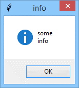
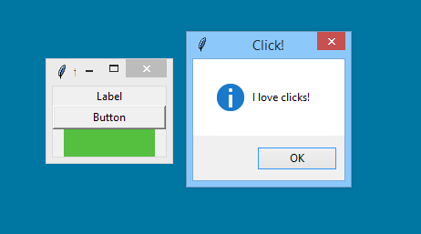
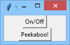
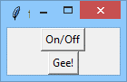

# Events and how to handle them

## Event handling
As you already know, events are the fuel which propel the application’s movements. All events come **to the event manager**, which is responsible for dispatching them to all the application components. This also means that some of the events may launch some of your callbacks, which makes you responsible for preparing the proper reactions to the user’s actions.

Now it’s time to show you some details of the events’ lives and anatomy. We’ll also show you how the events are able to influence a widget’s state, and how you control the event manager’s behavior.

For now, however, we want you to focus your attention on a very helpful method we’ll use to arrange communication between you and your application.

Of course, you can use the regular `print()` function to show messages and present a debug trace. The output will appear in the standard Python console, without affecting the application window. It’s okay if used in the early stages of development, but it’s very inelegant if you want the application to behave in a mature way.


The function we’ll use for our experiments is named `showinfo()`, it comes from the `messagebox` module, and it needs **two arguments** which are strings:
```python
messagebox.showinfo(title, info)
```
- the **first** string will be used by the function to **title the message box** which will appear on the screen; you can use an **empty** string, and the box will be **untitled** then;
- the **second** string is a message to display inside the box; the string can be of **any length** (but remember, the screen isn’t elastic and won’t stretch if you’re going to display a whole encyclopedia volume); note: you can use the `\n` digraph to visually break the info into separate lines.

We’ll ask the `showinfo()` function to show us its possibilities.

In the editor we've provided a very simple code demonstrating how `showinfo()` works:
```python
import tkinter
from tkinter import messagebox


def clicked():
    messagebox.showinfo("info", "some\ninfo")


window = tkinter.Tk()
button_1 = tkinter.Button(window, text="Show info", command=clicked)
button_1.pack()
button_2 = tkinter.Button(window, text="Quit", command=window.destroy)
button_2.pack()
window.mainloop()
```
Note the `\n` embedded inside the info string.

And this is what the final message box looks like:

<p align="center">
  
</p>

If your widget is a **clickable** one, you can connect a callback to it using its `command` property, while the property can be initially set by the constructor invocation.

We’ve already practiced this, so the snippet in the editor won’t be a surprise to you.
```python
import tkinter as tk
from tkinter import messagebox


def click():
    tk.messagebox.showinfo("Click!","I love clicks!")


window = tk.Tk()
label = tk.Label(window, text="Label")
label.pack()

button = tk.Button(window, text="Button", command=click)
button.pack(fill=tk.X)

frame = tk.Frame(window, height=30, width=100, bg="#55BF40")
frame.pack();

window.mainloop()
```
Note – there are three widgets in all, but only one of them (the `Button`) is clickable by nature. Such a widget’s constructor is equipped with the `command` parameter, which is used to bind a callback.

The window along with its message box looks like this:

<p align="center">
  
</p>

Some of the widgets (especially those that are not clickable by nature) **have neither a `command` property nor a constructor parameter of that name**.

Fortunately, you’re still able to bind a callback to any of the events it may receive (including clicks, of course) and this is done with a method named – it couldn’t be anything else – `bind()`:
```python
widget.bind(event, callback)
```
The `bind()` method needs two arguments:
- the `event` you want to launch your callback with;
- the `callback` itself.

Looks clear, doesn’t it?

Of course, there are two questions that should be answered immediately:
- **Q**: What is an event from the event controller’s point of view?

  **A**: It’s an **object** carrying some useful info about what actually happens when the event has been induced (by the user or by another factor).
- **Q**: How are the events identified?

  **A**: By **unique names** – each event has its own name and the name is just a unified string.

## Useful events
We’ve gathered some of the most usable event names – don’t try to learn them by heart.

| Event name           | Event role                                                                                                                                                                                                                                         |
|----------------------|----------------------------------------------------------------------------------------------------------------------------------------------------------------------------------------------------------------------------------------------------|
| `<Button-1>`         | Single left-click (if your mouse is configured for a right-handed user)                                                                                                                                                                            |
| `<Button-2>`         | Single middle-click                                                                                                                                                                                                                                |
| `<Button-3>`         | Single right-click                                                                                                                                                                                                                                 |
| `<ButtonRelease-1>`  | Left mouse button release</br>Note: there are also events named `<ButtonRelease-2>` and `<ButtonRelease-3>`                                                                                                                                        |
| `<DoubleButton-1>`   | Double left-click</br>Note: there are also events named `<DoubleButton-2>` and `<DoubleButton-3>`</br>Note again: the `<Button-1>` event is a part of `<DoubleButton-1>` too; if you assign a callback to `<Button-1>`, it will be launched, too!  |

| Event name    | Event role                            |
|---------------|---------------------------------------|
| `<Enter>`     | Mouse cursor appears over the widget  |
| `<Leave>`     | Mouse cursor leaves the widget area   |
| `<Focus-In>`  | The widget gains the focus            |
| `<Focus-Out>` | The widget loses the focus            |
| `<Return>`    | The user presses the Enter/Return key |
| `<Key>`       | The user presses **any** key          |

| Event name    | Event role                                                                                            |
|---------------|-------------------------------------------------------------------------------------------------------|
| `x`           | The user presses x key (x can be neither a space nor the < key)                                       |
| `<space>`     | The user presses the _spacebar_                                                                       |
| `<less>`      | The user presses the < key                                                                            |
| `<Cancel>`    | The user presses the key/keys used by the current OS to stop the program (e.g., Ctrl-C or Ctrl-Break) |
| `<BackSpace>` | The user presses the _Backspace_ key                                                                  |
| `<Tab>`       | The user presses _Tab_ key                                                                            |

| Event name    | Event role                                 |
|---------------|--------------------------------------------|
| `<Shift_L>`   | The user presses one of the _Shift_ keys   |
| `<Control_L>` | The user presses one of the _Control_ keys |
| `<Alt_L>`     | The user presses one of the _Alt_ keys     |
| `<Pause>`     | The user presses the _Pause_ key           |
| `<Caps_Lock>` | The user presses the _Caps Lock_ key       |
| `<Esc>`       | The user presses the _Escape_ keys         |

| Event name                                     | Event role                                                                           |
|------------------------------------------------|--------------------------------------------------------------------------------------|
| `<Prior>`                                      | The _Page Up_ key                                                                    |
| `<Next>`                                       | The _Page Down_ key                                                                  |
| `<End>`                                        | The _End_ key                                                                        |
| `<Home>`                                       | The _Home_ key                                                                       |
| `<Left>`</br>`<Right>`</br>`<Up>`</br>`<Down>` | Cursor (arrows) keys                                                                 |
| `<Num_Lock>`</br>`<Scroll_Lock>`               | The two **Lock** keys                                                                |
| `<Shift-x>`</br>`<Alt-x>`</br>`<Control-x>`    | The `x` key has been pressed along with any of the _Shift_, _Alt_, or _Control_ keys |

Don’t be afraid if some of the events look a bit suspicious. You’ll get used to them soon.

Note:
- a callback designed for usage with the command property/parameter is a **parameterless** function;
- a callback intended to cooperate with the `bind()` method is a **one-parameter function** (the callback’s argument carries some info about the captured event)
- fortunately, it doesn’t mean that you have to define two different callbacks for those two applications, and this is how we’ll cope with the above requirements:
  ```python
  def callback(ev=None):
      :
      :
  ```
- the callback will work flawlessly in both of these contexts, and moreover, it’ll give you the chance to identify which one of the two possible styles of launch has just occurred.

We’re going to change our previous example a bit by making it sensitive to more than just one click.

We've provided the newer version of our code in the editor.
```python
import tkinter as tk
from tkinter import messagebox


def click(event=None):
    tk.messagebox.showinfo("Click!", "I love clicks!")


window = tk.Tk()
label = tk.Label(window, text="Label")
label.bind("<Button-1>", click)   # Line I
label.pack()

button = tk.Button(window, text="Button", command=click)
button.pack(fill=tk.X)

frame = tk.Frame(window, height=30, width=100, bg="#55BF40")
frame.bind("<Button-1>", click)   # Line II
frame.pack()

window.mainloop()
```
Pay attention to `Line I` and `Line II` in the above code. They show the way in which you can bind your callback to any of non-clickable widgets. The bind remains active to the end of the application’s work, but you can also manually unbind the event at any moment (and bind it again when you wish).

We encourage you to play with the code – test the behavior of some of the other events. It’ll be fun... we think.

We’ve said previously that an event is actually an object. Let’s shed some light on that.

An event object is an instantiation of the `Event` class. Actually, it’s a container filled with some more or less helpful data. The data describe all the circumstances which are accompanied within the event, and it is dispatched to a number of the object’s properties.
```python
class Event:
    :
    :
```
Note: not all properties have meaning for every event. If the event is related to some of the mouse actions, the object’s parts referring to the keyboard remain uninitialized, and vice versa.

Let us show you some of the properties.

| Property name             | Property role                                                                                                                                                        |
|---------------------------|----------------------------------------------------------------------------------------------------------------------------------------------------------------------|
| widget                    | The widget’s **object** (not the widget’s name!) to which the event is addressed                                                                                     |
| `<x>`</br>`<y>`           | The mouse cursor’s **coordinates** at the moment of the event’s occurrence (both coordinates are counted relative to the target widget)                              |
| `<x_root>`</br>`<y_root>` | As above, but relative to the **screen**                                                                                                                             |
| `<char>`                  | The pressed key **character code** (only for keyboard events)                                                                                                        |
| `<keysym>`                | The pressed key symbol (only for keyboard events)</br>The full list of all recognized key symbols is presented here: https://www.tcl.tk/man/tcl8.4/TkCmd/keysyms.htm |
| `<keycode>`               | The pressed key **numerical** code (only for keyboard events)</br>Don’t confuse this with `char`, which is the ASCII/UNICODE code of the character bound to the key  |
| `<num>`                   | The number of the clicked mouse **button** (only for mouse events)                                                                                                   |
| `<type>`                  | The event’s type                                                                                                                                                     |

Let’s modify our code again. We want it to unveil some info coming in with the event object. Look at the code in the editor.
```python
import tkinter as tk
from tkinter import messagebox


def click(event=None):
    if event is None:
        tk.messagebox.showinfo("Click!", "I love clicks!")
    else:
        string = "x=" + str(event.x) + ",y=" + str(event.y) + \
                 ",num=" + str(event.num) + ",type=" + event.type
        tk.messagebox.showinfo("Click!", string)        


window = tk.Tk()
label = tk.Label(window, text="Label")
label.bind("<Button-1>", click)
label.pack()

button = tk.Button(window, text="Button", command=click)
button.pack(fill=tk.X)

frame = tk.Frame(window, height=30, width=100, bg="#55BF40")
frame.bind("<Button-1>", click)
frame.pack()

window.mainloop()
```
We encourage you again to carry out some experiments with this code. Use it to discover the event’s anatomy in detail.

A callback bound to a certain event may be **unbound** at any moment.

Let’s analyze the process in relation to clickable widgets i.e., those having the `command` property and using the command constructor’s parameter.

If you unbind a callback from an event, the widget **stops reacting** to the event. If you want to reverse this action, you must **bind the callback again**.

We haven’t said a word on modifying a widget’s properties, and we’re going to discuss it thoroughly in the next section, so please forgive us for only doing it briefly now.

If you want to modify a property named `prop`, existing within a widget named `wid`, and you’re going set its value to `val`, you can use the `config()` method, just like here:
```python
wid.config(prop=val)
```
This means that if you want to unbind your current callback from a `Button` named `b1`, you would use an invocation like this one:
```python
b1.config(command=lambda:None)
```
This binds an empty (i.e., doing absolutely nothing) function to the widget’s callback.

Let’s test it.

Our application creates a window with two buttons in it. The first one works as an on/off switch, while the switch changes the behavior of the second button. When the switch is ON, clicking the second button activates a message box. When the switch if OFF, clicking the second button has no effect. Moreover, the second button’s title changes according to the switch’s state.
```python
import tkinter as tk
from tkinter import messagebox


def on_off():
    global switch
    if switch:
        button_2.config(command=lambda: None)
        button_2.config(text="Gee!")
    else:
        button_2.config(command=peekaboo)
        button_2.config(text="Peekaboo!")
    switch = not switch


def peekaboo():
    messagebox.showinfo("", "PEEKABOO!")


def do_nothing():
    pass


switch = True
window = tk.Tk()
buton_1 = tk.Button(window, text="On/Off", command=on_off)
buton_1.pack()
button_2 = tk.Button(window, text="Peekaboo!", command=peekaboo)
button_2.pack()
window.mainloop()
```
Note the method we use to change the button’s title.

The two faces of our window look like this:

<p align="center">
  
</p>

<p align="center">
  
</p>

Now we’ll do the same trick again, but this time with the non-clickable widget.

To unbind a callback previously bound with the `bind()` method invocation, you need to use the `unbind()` method:
```python
widget.unbind(event)
```
The method requires one argument identifying the event being unbound.

Note: the information about a previously used callback is **lost**. You cannot retrieve it automatically and you must repeat the `bind()` invocation.

Let’s jump into the code.
```python
import tkinter as tk


def on_off():
    global switch
    if switch:
        label.unbind("<Button-1>")
    else:
        label.bind("<Button-1>", rhyme)
    switch = not switch


def rhyme(dummy):
    global word_no, words
    word_no += 1
    label.config(text=words[word_no % len(words)])


switch = True
words = ["Old", "McDonald", "Had", "A", "Farm"]
word_no = 0
window = tk.Tk()
button = tk.Button(window, text="On/Off", command=on_off)
button.pack()
label = tk.Label(window, text=words[0])
label.bind("<Button-1>", rhyme)
label.pack()
window.mainloop()
```
The application contains two widgets: one `Button` (clickable) and one `Label` (non-clickable).

We bind a callback to the `Label`, causing it to display (in a loop) the first five words of this old but good rhyme (please dive into the `rhyme()` function to check out how we’ve done it).

This functionality can be turned off and on by clicking the button. As you can see, the `on_off()` callback binds and unbinds the label’s callback.

Try to modify the code to use a few other events to trigger the switch.

The main tkinter window has a method named `bind_all()` which binds a callback to all currently existing widgets.

There is also a method named `unbind_all()` which reverts the first method’s effects.
```python
window.bind_all(event, callback)
window.unbind_all(event)
```
We used the `bind_all()` method to bind the one and the same callback to all three widgets, whether clickable or not. Look at the code we've provided in the editor.
```python
import tkinter as tk
from tkinter import messagebox


def hello(dummy):
    messagebox.showinfo("", "Hello!")


window = tk.Tk()
button = tk.Button(window, text="On/Off")
button.pack()
label = tk.Label(window, text="Label")
label.pack()
frame = tk.Frame(window, bg="yellow", width=100, height=20)
frame.pack()
window.bind_all("<Button-1>", hello)
window.mainloop()
```
Play with the code. Don’t worry, it’s safe.

Now we’re going to take you on a trip to Widget land. It’ll be an exciting journey, we promise.
