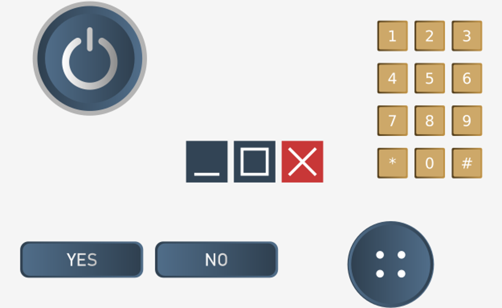
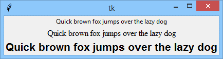
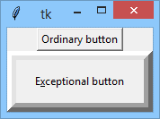
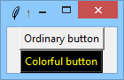
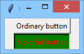
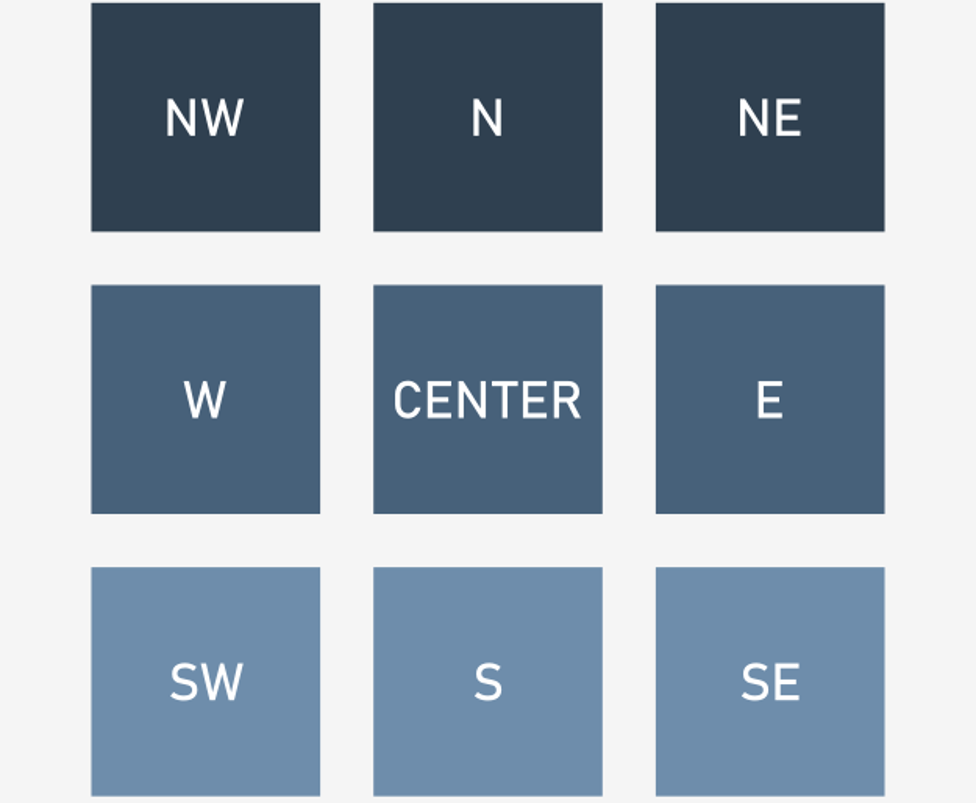
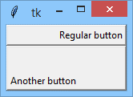

# Visiting widgets’ properties and methods

## Widget properties
As you already know, every widget has a set of properties, and the widget’s user is able to change them by modifying the widget’s appearance and behavior. We’ll show you how to manipulate properties and present a basic set of the most usable widget properties.

A widget's property is not just an object property. Although every widget is actually an object, you can access its properties by using the dot notation. You have to use one of two possible ways of reading and setting widget properties’ values.

<p align="center">
  
</p>

The first method is based on using a **dictionary** which exists inside every widget. Assuming that a widget named `Widget` has a property named `prop` and you want to read its value and then set it with a new value, you can do this in the following way:
```python
old_val = Widget["prop"]

Widget["prop"] = new_val
```
Let’s see it in action. Look at the example we've provided in the editor.
```python
import tkinter as tk


def on_off():
    global button
    state = button["text"]
    if state == "ON":
        state = "OFF"
    else:
        state = "ON"
    button["text"] = state


window = tk.Tk()
button = tk.Button(window, text="OFF", command=on_off)
button.place(x=50, y=100, width=100)
window.mainloop()
```
Note: we use the `text` property to:
- **diagnose** the current button’s state;
- **change** the button’s state to the contrary one;
- **update** the button’s title.

Run the code and observe its behavior.

The second method relies on two specialized widget methods, the first named `cget()` designed to **read** the property’s value, and the second named `config()`, which allows you to **set** a new value to the property.

This is what they look like:
```python
old_val = Widget.cget("prop")

Widget.config(prop=new_val)
```
Let’s rewrite our code to use this way of communicating with the widget’s properties.

Look at the code in the editor.
```python
import tkinter as tk


def on_off():
    global button
    state = button.cget("text")
    if state == "ON":
        state = "OFF"
    else:
        state = "ON"
    button.config(text=state)


window = tk.Tk()
button = tk.Button(window, text="OFF", command=on_off)
button.place(x=50, y=100, width=100)
window.mainloop()
```
Check carefully if it behaves the same way as the previous snippet.

One of the properties we want to tell you about is `font`. Every widget presenting a piece of text (e.g., `Button` and `Label` but not `Frame`) can be made to use a font **different from the default**.

Tkinter represents fonts as **tuples**. Surprised? Don’t be, it’s very simple.

Any font can be described as two- or three-element tuples:
```
("font_family_name", "font_size")

("font_family_name", "font_size", "font_style")
```
- the two-element tuple contains two strings: the first containing the **font’s family name**, and the second carrying the **font’s size** measured in points; note: the second element has to be a string, although it specifies strictly numerical information;
- the three-element tuple uses the third string to specify the font’s style, which can be expressed using the following strings:
  - `"bold"`
  - `"italic"`
  - `"underline"`
  - `"overstrike"`

Do you want to see it in action? Of course you do!

The property responsible for storing font information is – obviously – named `font`.

We’ve used the `Label` widget to demonstrate three different fonts. Look at the code in the editor.
```python
import tkinter as tk


window = tk.Tk()
label_1 = tk.Label(window, text="Quick brown fox jumps over the lazy dog")
label_1.grid(column=0, row=0)
label_2 = tk.Label(window, text="Quick brown fox jumps over the lazy dog", font=("Times", "12"))
label_2.grid(column=0, row=1)
label_3 = tk.Label(window, text="Quick brown fox jumps over the lazy dog", font=("Arial", "16", "bold"))
label_3.grid(column=0, row=2)
window.mainloop()
```
Expand it to display some more fonts, including your favorite ones.

Our fonts look like this:

<p align="center">
  
</p>

What about yours?

Every **widget occupies a part of the window’s area**, thus it’s obvious the widgets must have **sizes**. Interestingly, widgets have properties describing many more sizes than just `width` (usually specified in pixels) and `height` (which can be specified in **rows of text** if the widget is able to present textual information).

The list of widget sizes is gathered in the table:

| Widget property name | Property role                                                                                                                                                                                                                                       |
|----------------------|-----------------------------------------------------------------------------------------------------------------------------------------------------------------------------------------------------------------------------------------------------|
| `borderwidth`        | The width of the **3D-frame** surrounding some widgets (e.g., `Button`)                                                                                                                                                                             |
| `highlightthickness` | The width of the additional frame drawn around the widget when it gains the focus                                                                                                                                                                   |
| `padx`</br>`pady`    | The width/height of an additional empty space/margin around the widget                                                                                                                                                                              |
| `wraplength`         | If the text filling the widget becomes longer than this property’s value, it will be wrapped (possibly more than once)                                                                                                                              |
| `height`             | The height of the widget                                                                                                                                                                                                                            |
| `underline`          | The index of the character inside the widget’s text, which should be presented as underlined or `-1` otherwise (the underlined letter/digit can be used as a shortcut key, but it needs a specialized callback to work – no automation here, sorry) |
| `width`              | The width of the widget                                                                                                                                                                                                                             |

The example in the editor shows how some of the sizes work.
```python
import tkinter as tk


window = tk.Tk()
button_1 = tk.Button(window, text="Ordinary button");
button_1.pack()
button_2 = tk.Button(window, text="Exceptional button")
button_2.pack()
button_2["borderwidth"] = 10
button_2["highlightthickness"] = 10
button_2["padx"] = 10
button_2["pady"] = 5
button_2["underline"] = 1
window.mainloop()
```
This is what we see on our screen:

<p align="center">
  
</p>

Do you see the same?

You already know the three alternative methods used to describe the **colors**. Now we’ll show you which parts of the widget can be **colorized**. There are more options than you may suspect:

| Widget property name                      | Property role                                                                                                                               |
|-------------------------------------------|---------------------------------------------------------------------------------------------------------------------------------------------|
| `background`</br>`bg`                     | The color of the widget’s background (you can freely use either of these two forms)                                                         |
| `foreground`</br>`fg`                     | The color of the widget’s foreground (note: it can mean different things in different widgets; in general, it’s used to specify text color) |
| `activeforeground`</br>`activebackground` | Like `bg` and `fg` but used when the widget becomes active                                                                                  |
| `disabledforeground`                      | The width of the widget                                                                                                                     |

Let’s colorize a button – look at the code in the editor, this is how we’ve done it.
```python
import tkinter as tk

window = tk.Tk()
button_1 = tk.Button(window, text="Ordinary button");
button_1.pack()
button_2 = tk.Button(window, text="Colorful button")
button_2.pack()
button_2.config(bg ="#000000")
button_2.config(fg ="yellow")
button_2.config(activeforeground ="#FF0000")
button_2.config(activebackground ="green")
window.mainloop()
```
And this is what it looks like in both **inactive** and **active** states:

<p align="center">
  
  
</p>

You don't like the colors? Feel free to experiment with the colors of the font, foreground, and background to make the button look more attractive.

Our next widget is an `anchor`. Don’t worry, we aren’t going to take you out to sea. We’ll stay on dry land, we promise. The anchor is an imaginary (invisible) **point** inside the widget to which the text (if any) is **anchored**. As you’ve probably noticed, widgets tend to put their text in the **middle** of themselves (both in horizontal and vertical directions). The location of the anchor can easily be changed, as there is a property of the same name.

It seems to be obvious, but there’s one unobvious aspect – how to **name the anchors**.

This is done by a set of predefined identifiers which make of use of the **compass coordinates** – take a look and everything will be clear at once:

<p align="center">
  
</p>

As you can see, there are **nine anchors**, and the one placed in the middle is named `CENTER` (not a very compassey name, we admit). The `CENTER` anchor is the default one and is used when you don’t set the anchor property at all.

Let’s do some tests.

Look at the code in the editor. We’ve used two buttons to show two non-default anchors – we hope you’ll continue our experiments on your own.
```python
import tkinter as tk

window = tk.Tk()
button_1 = tk.Button(window, text="Regular button");
button_1["anchor"] = E
button_1["width"] = 20  # pixels!
button_1.pack()
button_2 = tk.Button(window, text="Another button")
button_2["anchor"] = SW
button_2["width"] = 20
button_2["height"] = 3  # rows
button_2.pack()
window.mainloop()
```
Our buttons look as follows – and yours?

<p align="center">
  
</p>

```python
import tkinter as tk

window = tk.Tk()
label_1 = tk.Label(window, height=3, text="arrow", cursor="arrow")
label_1.pack()
label_2 = tk.Label(window, height=3, text="clock", cursor="clock")
label_2.pack()
label_3 = tk.Label(window, height=3, text="heart", cursor="heart")
label_3.pack()
window.mainloop()
```
Our next property is the `cursor`.

As you know, the default mouse cursor reveals itself as an **arrow**. Sometimes, when it enters a specific area, its shape can **change** (e.g., over input fields).

You have the power to order the cursor to change to a **different** cursor over each of the widgets, as every widget has the property we’re talking about.

Unfortunately, the repertoire of available cursors isn’t very impressive – all of them are described [here](https://www.tcl.tk/man/tcl8.4/TkCmd/cursors.html).

We’ll show you three of them. Feel free to test all the rest. Don’t forget to move the cursor over the frames. You won’t see anything interesting without doing that.

Okay. Now we’re ready to show you some of the widget methods. You’re familiar with some of them already. See you soon!

## Widget methods
Widgets have **methods** – you’ve met some of them already. Now we’re going to show you a few more of them, and we’ll start with two which seem to be very specific. We can even say that the sense of their existence is very closely bound to the unique features of **event programming**.

The methods are named (assuming that `Widget` is an existing widget):
```python
Widget.after(time_ms, function)

Widget.after_cancel(id)
```
- `after()` – this method expects two arguments: the first is a **time interval specification** (expressed in milliseconds: 1 s = 1000 ms) and the second **points to an existing function**; successful invocation of the method causes the event manager to change its plans; when the number of milliseconds elapses, the manager will **invoke the function** (only once); note: this the only possible way of controlling the **passage of time** when using an event-driven environment.

  Why? Because you can’t just invoke the built-in `sleep()` function within any of your callbacks – it would **freeze** your application for the whole nap time; the `after()` method returns a value which is as specific as the method itself – it’s a unique **id** of the planned invocation; is it usable? Yes, it is, e.g., when you are going to **delete** the previously planned invocation from the manager’s calendar, which is done with a method named…

- `after_cancel(id)` – the method cancels the planned invocation identified by the `id` argument.

Seems confusing? Not at all. The example will shed more light on it than telling you a long and winding story.

The code we’ve written to demonstrate how the `after()` method works is rather simple (yes, absolutely; don’t you think so, too?). You can see it in the editor window.
```python
import tkinter as tk


def blink():
    global is_white
    if is_white:
        color = 'black'
    else:
        color = 'white'
    is_white = not is_white
    frame.config(bg=color)
    frame.after(500, blink)


is_white = True
window = tk.Tk()
frame = tk.Frame(window, width=200, height=100, bg='white')
frame.after(500, blink)
frame.pack()
window.mainloop()
```
There’s a function named `blink()`, which changes the f frame’s background color from white to black and back depending on the state of the `iswhite` variable. Easy.

Note: there is no **explicit invocation** of the function inside the code. Moreover, it isn’t assigned as a callback. The question is – who invokes it?

The event managers do, because:
- we initially encourage it to make the invocation before the frame widget is packed into the main window;
- we continue to encourage it every time the `blink()` function is invoked – this gives the application the ability to blink as long as the application is running.

Try to change the delay time (the first method’s argument) and check how the application works then.

### The `destroy()` method
The `destroy()` method is very destructive. It removes the widget completely, not only from your sight, but also from the event manager’s memory, as the widget’s object is deleted and becomes inaccessible.
```python
wi.destroy()
```
Do you remember? We used this method to close the main window and to stop the whole application. You can use the method in a less devastating manner to get rid of unnecessary widgets while keeping the application alive.

Note: if the widget you want to destroy has **children** (when other widgets are embedded inside it, which can happen with frames) the children will be destroyed, too (this rule works **recursively**).

The example prepares a window filled with a **frame** that is the parent of one `Button`. Note – we’ve ordered the event manager to activate the `suicide()` function during the 5<sup>th</sup> second of application life.

The function destroys the frame, but first it destroys all the frame’s children and its children’s children and … okay, let’s end the story here . It’s infinite – telling it will take too much time.
```python
import tkinter as tk


def suicide():
    frame.destroy()


window = tk.Tk()
frame = tk.Frame(window, width=200, height=100, bg='green')
button = tk.Button(frame, text="I'm a frame's child")
button.place(x=10, y=10)
frame.after(5000, suicide)
frame.pack()
window.mainloop()
```
Run the code and check how it works.

As you already know, widgets may or may not have the **focus**. At most one widget can have the focus. When you use a keyboard to interact with the application, you can use the Tab and Shift-Tab keys to move the focus forward and backward, but the focus can be controlled programmatically, too. There are two methods to help you cope with this issue. Assuming that `wi` is an existing widget, the methods look as follows:
```python
wi.focus_get()
wi.focus_set()
```
- the `focus_get()` method returns a reference to the **currently focused widget**, or `None` when no widget owns the focus (note: you can invoke the method from **any** widget, including the main window)
- the `focus_set()` method **focuses** the widget from the method which was invoked, so you have to choose it carefully.

Look at the code we've provided in the editor. This simple sample application shows how the focus can be **moved** between two buttons and uses the `after()` method to propel the process.
```python
import tkinter as tk


def flip_focus():
    if window.focus_get() is button_1:
        button_2.focus_set()
    else:
        button_1.focus_set()
    window.after(1000, flip_focus)


window = tk.Tk()
button_1 = tk.Button(window, text="First")
button_1.pack()
button_2 = tk.Button(window, text="Second")
button_2.pack()
window.after(1000, flip_focus)
window.mainloop()
```
Try to add one or more buttons to the window and change the `jumpthefocus()` function to organize a cyclical focus journey around all the buttons.

We’ll say “goodbye” to widgets now, as we’re going to place the **observable variables** under our magnifying glass.
