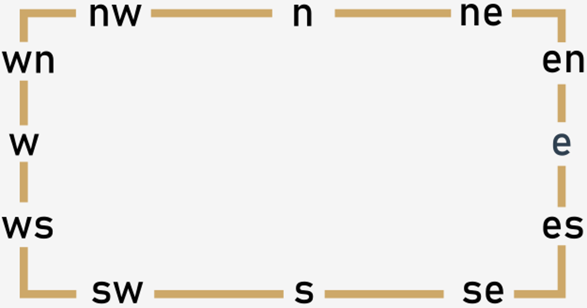

# A small lexicon of widgets
Now we’re ready to present a systematized set of some of the `tkinter` widgets. We aren’t able to describe all of them, however – it would bloat our course to an unmanageable size. We’re convinced that our collection is large enough to make you familiar with `tkinter` standards and habits, and at the same time will encourage you to carry out your own experiments and tests.

You already know some of the widgets. In these cases, we’ll limit our descriptions to the necessary minimum.

### Part 1: Clickable widgets
Each `tkinter` widget is created by a **constructor** of its class. The very first argument of the constructor invocation is always the **master widget** i.e., the widget that owns the newly created object.
```python
widget = Widget(master, option, ... )
```
The master widget is just the main window in most cases, but can be also a `Frame` or a `LabelFrame` (described in the next section).

The constructor accepts a set of arguments that configure the widget. Different widgets use different sets of arguments.

As we mentioned before, all widgets fall into two categories: **clickable** and **non-clickable**. We’ll start with the first.

We think the `Button` doesn’t require any special attention, as we’ve used it many times before. You already know what it looks like and how it works, so we’re going to limit ourselves to enumerating the most usable properties of the widget, along with its specific methods.

| Button property | Property meaning                                                                                                                                                                                                                                                                |
|-----------------|---------------------------------------------------------------------------------------------------------------------------------------------------------------------------------------------------------------------------------------------------------------------------------|
| `command`       | the **callback** being invoked when the button is clicked                                                                                                                                                                                                                       |
| `justify`       | the way in which the inner text is justified: possible (self-describing) values are: `LEFT`, `CENTER`, and `RIGHT`                                                                                                                                                              |
| `state`         | if you set the property to `DISABLED`, the button becomes deaf and doesn’t react to clicks, while its title is shown in gray; setting it to `NORMAL` restores normal button functioning; when the mouse is located above the button, the property changes its value to `ACTIVE` |

| Button method | Method role                                                                                                                                                                                                               |
|---------------|---------------------------------------------------------------------------------------------------------------------------------------------------------------------------------------------------------------------------|
| `flash()`     | the button **flashes** a few times but doesn’t change its state                                                                                                                                                           |
| `invoke()`    | activates the **callback** assigned to the widget and returns the same value the callback returned; note: this is the **only way** to invoke your own callback explicitly, as the event manager must be aware of the fact |

Analyze and run the code in the editor – we wrote it to show you some of the button’s properties and methods in action.
```python
import tkinter as tk


def switch():
    if button_1.cget('state') == tk.DISABLED:
        button_1.config(state=tk.NORMAL)
        button_1.flash()
    else:
        button_1.flash()
        button_1.config(state=tk.DISABLED)


def mouseover(ev):
    button_1['bg'] = 'green'


def mouseout(ev):
    button_1['bg'] = 'red'


window = tk.Tk()
button_1 = tk.Button(window, text="Enabled", bg="red")
button_1.bind("<Enter>", mouseover)
button_1.bind("<Leave>", mouseout)
button_1.pack()
button_2 = tk.Button(window, text="Enable/Disable", command=switch)
button_2.pack()
window.mainloop()
```
The `Checkbutton` is a **two-state** switch that can be ticked (checked) or not; thus, it is a handy tool to represent _yes/no_ user choices.

Let's start with its properties:

| Checkbutton property | Property meaning                                                                                                                                 |
|----------------------|--------------------------------------------------------------------------------------------------------------------------------------------------|
| `bd`                 | the `checkbutton` frame **width** (default is two pixels)                                                                                        |
| `command`            | the **callback** being invoked when the `checkbutton` changes its state                                                                          |
| `justify`            | the same as for `Button`                                                                                                                         |
| `state`              | the same as for `Button`                                                                                                                         |
| `variable`           | an observable `IntVar` variable reflecting the widget’s state; defaultly it’s set to `1` when the `checkbutton` is checked, and to `0` otherwise |
| `offvalue`           | the non-default value being assigned to a `variable` when the `checkbutton` is not checked                                                       |
| `onvalue`            | the non-default value being assigned to a `variable` when the `checkbutton` is checked                                                           |

And now some of its methods:

| Checkbutton method | Method role                                                     |
|--------------------|-----------------------------------------------------------------|
| `deselect()`       | **unchecks** the widget                                         |
| `flash()`          | the same as for `Button`                                        |
| `invoke()`         | the same as for `Button`                                        |
| `select()`         | **checks** the widget                                           |
| `toggle()`         | **toggles** the widget (changes its state to the opposite one)  |

Take a look at the code in the editor pane. The sample we’ve prepared for you makes use of the `checkbutton` and does two things:
```python
import tkinter as tk
from tkinter import messagebox


def count():
    global counter
    counter += 1

def show():
    messagebox.showinfo("","counter=" + str(counter) + ",state=" + str(switch.get()))


window = tk.Tk()
switch = tk.IntVar()
counter = 0
button = tk.Button(window, text="Show", command=show)
button.pack()
checkbutton = tk.Checkbutton(window, text="Tick", variable=switch, command=count)
checkbutton.pack()
window.mainloop()
```
- counts all the `checkbutton`’s state changes and stores the result in cnt variable;
- presents the current `cnt` value and the `checkbutton`’s state after clicking the `Show` button.

The next sample shows how the `invoke()` invocation triggers the checkbutton. Analyze the code.
```python
import tkinter as tk
from tkinter import messagebox


def count():
    global counter
    counter += 1


def show():
    messagebox.showinfo("", "counter=" + str(counter) + ",state=" + str(switch.get()))


window = tk.Tk()
switch = tk.IntVar()
counter = 0
button = tk.Button(window, text="Show", command=show)
button.pack()
checkbutton = tk.Checkbutton(window, text="Tick", variable=switch, command=count)
checkbutton.pack()
window.mainloop()
```

The `Radiobutton` is usable when you **group** (couple) a number (>1) of these widgets – as only one of them can be **mutually selected** (checked), it’s a good tool to represent one of many user choices. Assigning the same observable variable to more than one `Radiobutton` creates a group.

This also means that when two `Radiobuttons` use **different** observable variables, they belong to **different** groups by definition.
```python
rdbutton = Radiobutton(master, option, ...)
```
Here are some of the `Radiobutton`’s properties:

Let's start with its properties:

| Radiobutton property | Property meaning                                                                                                                                                                            |
|----------------------|---------------------------------------------------------------------------------------------------------------------------------------------------------------------------------------------|
| `command`            | the **callback** being invoked when the `Radiobutton` (not the group it belongs to!) changes its state                                                                                      |
| `justify`            | the same as for `Button`                                                                                                                                                                    |
| `state`              | the same as for `Button`                                                                                                                                                                    |
| `variable`           | an observable `IntVar` or `StringVar` variable reflecting the **current** selection within the `Radiobutton`’s group; changing the variable’s value automatically **changes** the selection |
| `value`              | a unique (inside the group) value **identifying** the `Radiobutton`; can be an integer value or a string, and should be compatible with the variable’s type                                 |

Some of the `Radiobutton`’s methods are shown here.

Note: there is no `toggle()` method as a single `Radiobutton` performs such an operation.

| Radiobutton method | Method role            |
|--------------------|------------------------|
| `deselect()`       | unchecks the widget    |
| `flash()`          | the same as for Button |
| `invoke()`         | the same as for Button |
| `select()`         | checks the widget      |

Run the sample code we've provided in the editor.
```python
import tkinter as tk
from tkinter import messagebox


def show():
    messagebox.showinfo("", "radio_1=" + str(radio_1_var.get()) +
                        ",radio_2=" + str(radio_2_var.get()))


def command_1():
    radio_2_var.set(radio_1_var.get())


def command_2():
    radio_1_var.set(radio_2_var.get())


window = tk.Tk()
button = tk.Button(window, text="Show", command=show)
button.pack()
radio_1_var = tk.IntVar()
radio_1_1 = tk.Radiobutton(window, text="pizza", variable=radio_1_var, value=1, command=command_1)
radio_1_1.select()
radio_1_1.pack()
radio_1_2 = tk.Radiobutton(window, text="clams", variable=radio_1_var, value=2, command=command_1)
radio_1_2.pack()
radio_2_var = tk.IntVar()
radio_2_1 = tk.Radiobutton(window, text="FR", variable=radio_2_var, value=2, command=command_2)
radio_2_1.pack()
radio_2_2 = tk.Radiobutton(window, text="IT", variable=radio_2_var, value=1, command=command_2)
radio_2_2.select()
radio_2_2.pack()
window.mainloop()
```
The program defines two separate Radiobutton groups, consisting of two `Radiobuttons`. These groups are **coupled**, as their callbacks change the opposite group to reflect the state of their own group. Thanks to that, you can choose a meal and change country, or you can change country and the meal will select itself automatically.

Let’s say “Goodbye” now – we’ll meet again soon to discuss some non-clickable widgets!

### Part 2: Non-clickable widgets
The next four widgets fall into the **non-clickable** category. They’re designed to present **textual** information and don’t have a `command` property, although you can use `bind()` to simulate similar behavior.

The `Label` widget displays some lines of text inside the window:
```python
label = Label(master, option, ...)
```
The `Label` widget contains two usable properties, but you need to remember that they are mutually exclusive.

Here you are:

| Label property | Property meaning                                                                                                                                                       |
|----------------|------------------------------------------------------------------------------------------------------------------------------------------------------------------------|
| `text`         | a string which will be **shown** within the `Label`; note: newline characters (`\n`) are interpreted in the `usual way`                                                |
| `textvariable` | the same as for `text`, but makes use of an observable `StringVar` variable, so if you change the variable’s alteration, it will be immediately visible on the screen. |

The Label widget has no usable methods – sorry!

The sample in the editor shows how the `textvariable` accompanied by an observable variable can be used to **continuously** update the `Label`’s contents.
```python
import tkinter as tk


def to_string(x):
    return "Current counter\nvalue is:\n" + str(x)


def plus():
    global counter
    counter += 1
    text.set(to_string(counter))


counter = 0
window = tk.Tk()
button = tk.Button(window, text="Go on!", command=plus)
button.pack()
text = tk.StringVar()
label = tk.Label(window, textvariable=text, height=4)
text.set(to_string(counter))
label.pack()
window.mainloop()
```
The `Message` widget is very similar to the `Label` (among other things, it has the **same properties**) but is able to **format** the presented text by fitting it automatically to the widget’s size.
```python
message = Message(master, option, ...)
```
The sample code will tell you more.
```python
import tkinter as tk


def do_it_again():
    text.set(text.get() + "and again...")


window = tk.Tk()
button = tk.Button(window, text="Go ahead!", command=do_it_again)
button.pack()
text = tk.StringVar()
message = tk.Message(window, textvariable=text, width=400)
text.set("You did it again... ")
message.pack()
window.mainloop()
```
Run it and see how the `Message` widget reacts to the `tx` variable updates.

The `Frame` widget is, in fact, a `container` designed to store other widgets. This means that the `Frame` can be used to separate a **rectangular part** of the window and to treat it as a kind of _local window_. Such a window works as a **master widget** for all the widgets embedded within it. Moreover, the `Frame` has its **own coordinate system**, so when you place a widget inside a `Frame`, you measure its location relative to the `Frame`’s **upper-left corner**, not the window’s one. It also means that if you move the `Frame` to a new position, all its inner widgets will go with it.

Note: the `Frame` can grasp virtually any widget – including another `Frame`.

The `Frame` has one interesting property:

| Frame property | Property meaning                                                                                                                                                     |
|----------------|----------------------------------------------------------------------------------------------------------------------------------------------------------------------|
| `takefocus`    | normally, the `Frame` **doesn’t take the focus** (which would seem to be obvious) but if you really want it to behave in this way, you can set the property to `1`.  |

Take a look at the example in the editor.
```python
import tkinter as tk

window = tk.Tk()

frame_1 = tk.Frame(window, width=200, height=100, bg='white')
frame_2 = tk.Frame(window, width=200, height=100, bg='yellow')

button_1_1 = tk.Button(frame_1, text="Button #1 inside Frame #1")
button_1_2 = tk.Button(frame_1, text="Button #2 inside Frame #1")
button_2_1 = tk.Button(frame_2, text="Button #1 inside Frame #2")
button_2_2 = tk.Button(frame_2, text="Button #2 inside Frame #2")

button_1_1.place(x=10, y=10)
button_1_2.place(x=10, y=50)
button_2_1.grid(column=0, row=0)
button_2_2.grid(column=1, row=1)

frame_1.pack()
frame_2.pack()

window.mainloop()
```
We’ve defined two separate frames and filled them with two buttons each. Note: we’ve used different geometry managers for both `Frames`. This is another advantage of the `Frame` – it helps you arrange the window in the most convenient way.

Pay attention to all four of the `Buttons`’ constructors – how have we described a master widget there?

The `LabelFrame` widget is a `Frame` enriched with a **visible border** and a **title** (also visible). The title may be located at one of 12 possible places on the border line.
```python
lfrm = LabelFrame(master, option, ...)
```
Some of the usable `LabelFrame` properties are gathered here:

| LabelFrame property | Property meaning                                                                                                                                                           |
|---------------------|----------------------------------------------------------------------------------------------------------------------------------------------------------------------------|
| `takefocus`         | the same as for the `Frame`                                                                                                                                                |
| `text`              | the `LabelFrame`’s title                                                                                                                                                   |
| `labelanchor`       | the **title’s location**, defined as a string containing a quasi-compass coordinate (as shown by the image) </br> <p align="center"></p> |

We’ve rebuilt our previous example to employ a `LabelFrame` instead of a `Label` – look at the updated code we've provided in the editor.
```python
import tkinter as tk

window = tk.Tk()
label_frame_1 = tk.LabelFrame(window, text="Frame #1",
                              width=200, height=100, bg='white')
label_frame_2 = tk.LabelFrame(window, text="Frame #2",
                              labelanchor='se', width=200, height=100, bg='yellow')

button_1_1 = tk.Button(label_frame_1, text="Button #1 inside Frame #1")
button_1_2 = tk.Button(label_frame_1, text="Button #2 inside Frame #1")
button_2_1 = tk.Button(label_frame_2, text="Button #1 inside Frame #2")
button_2_2 = tk.Button(label_frame_2, text="Button #2 inside Frame #2")

button_1_1.place(x=10, y=10)
button_1_2.place(x=10, y=50)
button_2_1.grid(column=0, row=0)
button_2_2.grid(column=1, row=1)

label_frame_1.pack()
label_frame_2.pack()
window.mainloop()
```
Run it and find the differences.