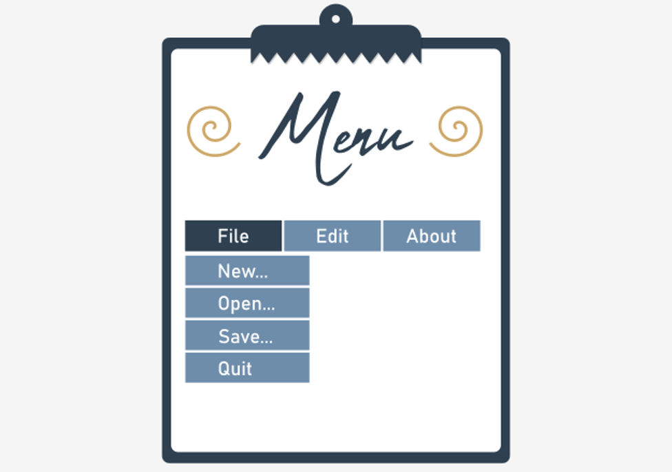
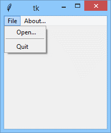

# A small lexicon of widgets
Now we’re ready to present a systematized set of some of the `tkinter` widgets. We aren’t able to describe all of them, however – it would bloat our course to an unmanageable size. We’re convinced that our collection is large enough to make you familiar with `tkinter` standards and habits, and at the same time will encourage you to carry out your own experiments and tests.

You already know some of the widgets. In these cases, we’ll limit our descriptions to the necessary minimum.

### Part 1: Clickable widgets
Each `tkinter` widget is created by a **constructor** of its class. The very first argument of the constructor invocation is always the **master widget** i.e., the widget that owns the newly created object.
```python
widget = Widget(master, option, ... )
```
The master widget is just the main window in most cases, but can be also a `Frame` or a `LabelFrame` (described in the next section).

The constructor accepts a set of arguments that configure the widget. Different widgets use different sets of arguments.

As we mentioned before, all widgets fall into two categories: **clickable** and **non-clickable**. We’ll start with the first.

We think the `Button` doesn’t require any special attention, as we’ve used it many times before. You already know what it looks like and how it works, so we’re going to limit ourselves to enumerating the most usable properties of the widget, along with its specific methods.

| Button property | Property meaning                                                                                                                                                                                                                                                                |
|-----------------|---------------------------------------------------------------------------------------------------------------------------------------------------------------------------------------------------------------------------------------------------------------------------------|
| `command`       | the **callback** being invoked when the button is clicked                                                                                                                                                                                                                       |
| `justify`       | the way in which the inner text is justified: possible (self-describing) values are: `LEFT`, `CENTER`, and `RIGHT`                                                                                                                                                              |
| `state`         | if you set the property to `DISABLED`, the button becomes deaf and doesn’t react to clicks, while its title is shown in gray; setting it to `NORMAL` restores normal button functioning; when the mouse is located above the button, the property changes its value to `ACTIVE` |

| Button method | Method role                                                                                                                                                                                                               |
|---------------|---------------------------------------------------------------------------------------------------------------------------------------------------------------------------------------------------------------------------|
| `flash()`     | the button **flashes** a few times but doesn’t change its state                                                                                                                                                           |
| `invoke()`    | activates the **callback** assigned to the widget and returns the same value the callback returned; note: this is the **only way** to invoke your own callback explicitly, as the event manager must be aware of the fact |

Analyze and run the code in the editor – we wrote it to show you some of the button’s properties and methods in action.
```python
import tkinter as tk


def switch():
    if button_1.cget('state') == tk.DISABLED:
        button_1.config(state=tk.NORMAL)
        button_1.flash()
    else:
        button_1.flash()
        button_1.config(state=tk.DISABLED)


def mouseover(ev):
    button_1['bg'] = 'green'


def mouseout(ev):
    button_1['bg'] = 'red'


window = tk.Tk()
button_1 = tk.Button(window, text="Enabled", bg="red")
button_1.bind("<Enter>", mouseover)
button_1.bind("<Leave>", mouseout)
button_1.pack()
button_2 = tk.Button(window, text="Enable/Disable", command=switch)
button_2.pack()
window.mainloop()
```
The `Checkbutton` is a **two-state** switch that can be ticked (checked) or not; thus, it is a handy tool to represent _yes/no_ user choices.

Let's start with its properties:

| Checkbutton property | Property meaning                                                                                                                                 |
|----------------------|--------------------------------------------------------------------------------------------------------------------------------------------------|
| `bd`                 | the `checkbutton` frame **width** (default is two pixels)                                                                                        |
| `command`            | the **callback** being invoked when the `checkbutton` changes its state                                                                          |
| `justify`            | the same as for `Button`                                                                                                                         |
| `state`              | the same as for `Button`                                                                                                                         |
| `variable`           | an observable `IntVar` variable reflecting the widget’s state; defaultly it’s set to `1` when the `checkbutton` is checked, and to `0` otherwise |
| `offvalue`           | the non-default value being assigned to a `variable` when the `checkbutton` is not checked                                                       |
| `onvalue`            | the non-default value being assigned to a `variable` when the `checkbutton` is checked                                                           |

And now some of its methods:

| Checkbutton method | Method role                                                     |
|--------------------|-----------------------------------------------------------------|
| `deselect()`       | **unchecks** the widget                                         |
| `flash()`          | the same as for `Button`                                        |
| `invoke()`         | the same as for `Button`                                        |
| `select()`         | **checks** the widget                                           |
| `toggle()`         | **toggles** the widget (changes its state to the opposite one)  |

Take a look at the code in the editor pane. The sample we’ve prepared for you makes use of the `checkbutton` and does two things:
```python
import tkinter as tk
from tkinter import messagebox


def count():
    global counter
    counter += 1

def show():
    messagebox.showinfo("","counter=" + str(counter) + ",state=" + str(switch.get()))


window = tk.Tk()
switch = tk.IntVar()
counter = 0
button = tk.Button(window, text="Show", command=show)
button.pack()
checkbutton = tk.Checkbutton(window, text="Tick", variable=switch, command=count)
checkbutton.pack()
window.mainloop()
```
- counts all the `checkbutton`’s state changes and stores the result in cnt variable;
- presents the current `cnt` value and the `checkbutton`’s state after clicking the `Show` button.

The next sample shows how the `invoke()` invocation triggers the checkbutton. Analyze the code.
```python
import tkinter as tk
from tkinter import messagebox


def count():
    global counter
    counter += 1


def show():
    messagebox.showinfo("", "counter=" + str(counter) + ",state=" + str(switch.get()))


window = tk.Tk()
switch = tk.IntVar()
counter = 0
button = tk.Button(window, text="Show", command=show)
button.pack()
checkbutton = tk.Checkbutton(window, text="Tick", variable=switch, command=count)
checkbutton.pack()
window.mainloop()
```

The `Radiobutton` is usable when you **group** (couple) a number (>1) of these widgets – as only one of them can be **mutually selected** (checked), it’s a good tool to represent one of many user choices. Assigning the same observable variable to more than one `Radiobutton` creates a group.

This also means that when two `Radiobuttons` use **different** observable variables, they belong to **different** groups by definition.
```python
rdbutton = Radiobutton(master, option, ...)
```
Here are some of the `Radiobutton`’s properties:

Let's start with its properties:

| Radiobutton property | Property meaning                                                                                                                                                                            |
|----------------------|---------------------------------------------------------------------------------------------------------------------------------------------------------------------------------------------|
| `command`            | the **callback** being invoked when the `Radiobutton` (not the group it belongs to!) changes its state                                                                                      |
| `justify`            | the same as for `Button`                                                                                                                                                                    |
| `state`              | the same as for `Button`                                                                                                                                                                    |
| `variable`           | an observable `IntVar` or `StringVar` variable reflecting the **current** selection within the `Radiobutton`’s group; changing the variable’s value automatically **changes** the selection |
| `value`              | a unique (inside the group) value **identifying** the `Radiobutton`; can be an integer value or a string, and should be compatible with the variable’s type                                 |

Some of the `Radiobutton`’s methods are shown here.

Note: there is no `toggle()` method as a single `Radiobutton` performs such an operation.

| Radiobutton method | Method role            |
|--------------------|------------------------|
| `deselect()`       | unchecks the widget    |
| `flash()`          | the same as for Button |
| `invoke()`         | the same as for Button |
| `select()`         | checks the widget      |

Run the sample code we've provided in the editor.
```python
import tkinter as tk
from tkinter import messagebox


def show():
    messagebox.showinfo("", "radio_1=" + str(radio_1_var.get()) +
                        ",radio_2=" + str(radio_2_var.get()))


def command_1():
    radio_2_var.set(radio_1_var.get())


def command_2():
    radio_1_var.set(radio_2_var.get())


window = tk.Tk()
button = tk.Button(window, text="Show", command=show)
button.pack()
radio_1_var = tk.IntVar()
radio_1_1 = tk.Radiobutton(window, text="pizza", variable=radio_1_var, value=1, command=command_1)
radio_1_1.select()
radio_1_1.pack()
radio_1_2 = tk.Radiobutton(window, text="clams", variable=radio_1_var, value=2, command=command_1)
radio_1_2.pack()
radio_2_var = tk.IntVar()
radio_2_1 = tk.Radiobutton(window, text="FR", variable=radio_2_var, value=2, command=command_2)
radio_2_1.pack()
radio_2_2 = tk.Radiobutton(window, text="IT", variable=radio_2_var, value=1, command=command_2)
radio_2_2.select()
radio_2_2.pack()
window.mainloop()
```
The program defines two separate Radiobutton groups, consisting of two `Radiobuttons`. These groups are **coupled**, as their callbacks change the opposite group to reflect the state of their own group. Thanks to that, you can choose a meal and change country, or you can change country and the meal will select itself automatically.

Let’s say “Goodbye” now – we’ll meet again soon to discuss some non-clickable widgets!

### Part 2: Non-clickable widgets
The next four widgets fall into the **non-clickable** category. They’re designed to present **textual** information and don’t have a `command` property, although you can use `bind()` to simulate similar behavior.

The `Label` widget displays some lines of text inside the window:
```python
label = Label(master, option, ...)
```
The `Label` widget contains two usable properties, but you need to remember that they are mutually exclusive.

Here you are:

| Label property | Property meaning                                                                                                                                                       |
|----------------|------------------------------------------------------------------------------------------------------------------------------------------------------------------------|
| `text`         | a string which will be **shown** within the `Label`; note: newline characters (`\n`) are interpreted in the `usual way`                                                |
| `textvariable` | the same as for `text`, but makes use of an observable `StringVar` variable, so if you change the variable’s alteration, it will be immediately visible on the screen. |

The Label widget has no usable methods – sorry!

The sample in the editor shows how the `textvariable` accompanied by an observable variable can be used to **continuously** update the `Label`’s contents.
```python
import tkinter as tk


def to_string(x):
    return "Current counter\nvalue is:\n" + str(x)


def plus():
    global counter
    counter += 1
    text.set(to_string(counter))


counter = 0
window = tk.Tk()
button = tk.Button(window, text="Go on!", command=plus)
button.pack()
text = tk.StringVar()
label = tk.Label(window, textvariable=text, height=4)
text.set(to_string(counter))
label.pack()
window.mainloop()
```
The `Message` widget is very similar to the `Label` (among other things, it has the **same properties**) but is able to **format** the presented text by fitting it automatically to the widget’s size.
```python
message = Message(master, option, ...)
```
The sample code will tell you more.
```python
import tkinter as tk


def do_it_again():
    text.set(text.get() + "and again...")


window = tk.Tk()
button = tk.Button(window, text="Go ahead!", command=do_it_again)
button.pack()
text = tk.StringVar()
message = tk.Message(window, textvariable=text, width=400)
text.set("You did it again... ")
message.pack()
window.mainloop()
```
Run it and see how the `Message` widget reacts to the `tx` variable updates.

The `Frame` widget is, in fact, a `container` designed to store other widgets. This means that the `Frame` can be used to separate a **rectangular part** of the window and to treat it as a kind of _local window_. Such a window works as a **master widget** for all the widgets embedded within it. Moreover, the `Frame` has its **own coordinate system**, so when you place a widget inside a `Frame`, you measure its location relative to the `Frame`’s **upper-left corner**, not the window’s one. It also means that if you move the `Frame` to a new position, all its inner widgets will go with it.

Note: the `Frame` can grasp virtually any widget – including another `Frame`.

The `Frame` has one interesting property:

| Frame property | Property meaning                                                                                                                                                     |
|----------------|----------------------------------------------------------------------------------------------------------------------------------------------------------------------|
| `takefocus`    | normally, the `Frame` **doesn’t take the focus** (which would seem to be obvious) but if you really want it to behave in this way, you can set the property to `1`.  |

Take a look at the example in the editor.
```python
import tkinter as tk

window = tk.Tk()

frame_1 = tk.Frame(window, width=200, height=100, bg='white')
frame_2 = tk.Frame(window, width=200, height=100, bg='yellow')

button_1_1 = tk.Button(frame_1, text="Button #1 inside Frame #1")
button_1_2 = tk.Button(frame_1, text="Button #2 inside Frame #1")
button_2_1 = tk.Button(frame_2, text="Button #1 inside Frame #2")
button_2_2 = tk.Button(frame_2, text="Button #2 inside Frame #2")

button_1_1.place(x=10, y=10)
button_1_2.place(x=10, y=50)
button_2_1.grid(column=0, row=0)
button_2_2.grid(column=1, row=1)

frame_1.pack()
frame_2.pack()

window.mainloop()
```
We’ve defined two separate frames and filled them with two buttons each. Note: we’ve used different geometry managers for both `Frames`. This is another advantage of the `Frame` – it helps you arrange the window in the most convenient way.

Pay attention to all four of the `Buttons`’ constructors – how have we described a master widget there?

The `LabelFrame` widget is a `Frame` enriched with a **visible border** and a **title** (also visible). The title may be located at one of 12 possible places on the border line.
```python
lfrm = LabelFrame(master, option, ...)
```
Some of the usable `LabelFrame` properties are gathered here:

| LabelFrame property | Property meaning                                                                                                                                                                                    |
|---------------------|-----------------------------------------------------------------------------------------------------------------------------------------------------------------------------------------------------|
| `takefocus`         | the same as for the `Frame`                                                                                                                                                                         |
| `text`              | the `LabelFrame`’s title                                                                                                                                                                            |
| `labelanchor`       | the **title’s location**, defined as a string containing a quasi-compass coordinate (as shown by the image) </br> <p align="center"></p> |

We’ve rebuilt our previous example to employ a `LabelFrame` instead of a `Label` – look at the updated code we've provided in the editor.
```python
import tkinter as tk

window = tk.Tk()
label_frame_1 = tk.LabelFrame(window, text="Frame #1",
                              width=200, height=100, bg='white')
label_frame_2 = tk.LabelFrame(window, text="Frame #2",
                              labelanchor='se', width=200, height=100, bg='yellow')

button_1_1 = tk.Button(label_frame_1, text="Button #1 inside Frame #1")
button_1_2 = tk.Button(label_frame_1, text="Button #2 inside Frame #1")
button_2_1 = tk.Button(label_frame_2, text="Button #1 inside Frame #2")
button_2_2 = tk.Button(label_frame_2, text="Button #2 inside Frame #2")

button_1_1.place(x=10, y=10)
button_1_2.place(x=10, y=50)
button_2_1.grid(column=0, row=0)
button_2_2.grid(column=1, row=1)

label_frame_1.pack()
label_frame_2.pack()
window.mainloop()
```
Run it and find the differences.

### Part 3
There are two remaining widgets we want to tell you about – the first one is just a widget, while the second is, in fact, a **set of cooperating widgets**.

The `Entry` widget not only presents a line of text, but is also able to **edit** the text according to the user’s actions. Using an `Entry` is necessary when you are going to ask the user for any textual information: name, password, email, etc. The widget implements all standard edit operations like inserting, removing, scrolling, selecting, copying and pasting, etc..

We’ll show you only the basic possibilities of the widget, as it’s full equipment is extremely complex. Fortunately, we don’t need its entire flexibility when we just want to enter and validate a line of text.

Here are some of `Entry`’s properties:

| Entry property | Property meaning                                                                                                                                                                                                                                                                                                     |
|----------------|----------------------------------------------------------------------------------------------------------------------------------------------------------------------------------------------------------------------------------------------------------------------------------------------------------------------|
| `command`      | although `Entry` is obviously a clickable widget, it doesn’t allow you to bind a callback through the `command` property. You can observe and control all occurring changes instead by setting the **tracer function** for the observable variable which cooperates with `Entry` (we’ll show you this – be patient!) |
| `show`         | a string assigned to this property will be displayed instead of the **actual** characters entered into the input field; e.g., if you set `show='*'`, this will enable the widget to safely edit the user’s password                                                                                                  |
| `state`        | the same as for `Button`                                                                                                                                                                                                                                                                                             |
| `textvariable` | an observable `StringVar` reflecting the current state of the input field                                                                                                                                                                                                                                            |
| `width`        | the input field’s width (in characters)                                                                                                                                                                                                                                                                              |

And now, some of Entry’s methods:

| Entry method               | Method role                                                                                                                                                                                                                                                                  |
|----------------------------|------------------------------------------------------------------------------------------------------------------------------------------------------------------------------------------------------------------------------------------------------------------------------|
| `get()`                    | returns the current input field’s contents as a string                                                                                                                                                                                                                       |
| `set(s)`                   | sets the whole input field’s contents with the s string                                                                                                                                                                                                                      |
| `delete(first, last=None)` | deletes a part of the input field’s contents; `first` and `last` can be integers with values indexing the string; if the `last` argument is omitted, a single character is deleted; if `last` is specified as `END`, it points to the place after the last field’s character |
| `insert(index, s)`         | inserts the `s` string at the field position pointed to by `index`                                                                                                                                                                                                           |

Our sample program in the editor shows you how to use an **observable variable** along with the **trace callback** (tracer) to force a user to enter **only digits** – all other characters will be silently **ignored**.

The tracer is invoked each time the input field is **modified**. The tracer remembers its previous state (using the `last_s` variable) and restores the field to this state if its current contents are invalid.

Note: we’ve had to use the `focus_set()` method, as the widget doesn’t take the focus itself.

Run the code and test its behavior.
```python
import tkinter as tk


def digits_only(*args):
    global last_string
    string = text.get()
    if string == '' or string.isdigit():  # Field's content is valid.
        last_string = string
    else:
        text.set(last_string)


last_string = ''
window = tk.Tk()
text = tk.StringVar()
entry = tk.Entry(window, textvariable=text)
text.set(last_string)
text.trace('w', digits_only)
entry.pack()
entry.focus_set()
window.mainloop()
```
Try to modify the code to allow the user to enter not more than five digits.

The last part of our story will tell you about **menus**.
```python
mnu = Menu(master, option, ...)
```
Let’s summarize the most important menu traits:

- a classic menu is actually a **horizontal bar** located at the top of the application window;
- the bar contains a number of horizontally deployed **options**, often referred to as **items** or **entries**;
- these options can have **hot-keys** (keyboard shortcuts enabling the user to quickly access selected operations without using a mouse; usually, hot-keys are triggered by pressing Alt-hotkey on the keyboard)
- **selecting a menu’s option** (it doesn’t matter whether through a hotkey or by a mouse click) causes one of **two effects**:
  - **it launches** a callback bound to the option;
  - **it unrolls** a new menu (actually a submenu)
- if you want to have such a menu within your Tkinter application, you have to:
  - **create** a top-level menu object;
  - **embed** it inside the window;
  - **bind** a number of required submenus (this is called a **cascade**) or connect a single callback.

We’ll show you the whole process step-bystep. Track all our movements carefully.

<p align="center">
  
</p>

```python
import tkinter as tk
from tkinter import messagebox


def about_app():
    messagebox.showinfo("App", "The application\nthat does nothing")


window = tk.Tk()

# main menu creation
main_menu = tk.Menu(window)
window.config(menu=main_menu)

# 1st main menu item: an empty (as far) submenu
sub_menu_file = tk.Menu(main_menu)
main_menu.add_cascade(label="File", menu=sub_menu_file)

# 2nd main menu item: a simple callback
sub_menu_help = tk.Menu(main_menu)
main_menu.add_command(label="About...", command=about_app)

window.mainloop()
```
Our steps are as follows:
- line 5: we define a simple callback which displays the `About` dialog;
- line 9: main window creation (nothing special at all)
- line 12: we create the **main menu** object...
- line 13: and **embed** it into the main window (note the way in which the `config()` method is used and which property we utilize to bind the menu)
- line 16: we create a submenu object (note the master window argument specification)
- line 17: we add the submenu to the main menu’s first item (note the `add_cascade()` method invocation)
- line 20: we create another submenu object…
- line 21: ...and bind a callback to it (note the `add_command()` method invocation)

Run the code and test it. Do you see that strange dashed line visible when you click the `File` main menu item?

<p align="center">
  
</p>

Don’t worry, this it’s normal. We’ll deal with it soon.

A menu like this has one important **disadvantage** – it’s hard to use it without a mouse. Of course, you can use the _Alt_ key to activate the menu and navigate through it using the cursor keys and _Enter_ (you can test this), but we need something quicker and more convenient.

Look at the code below. We’ve made two changes – we’ve added two underlined property specifications to the `Menu()` invocations:
```python
import tkinter as tk
from tkinter import messagebox


def about_app():
    messagebox.showinfo("App", "The application\nthat does nothing")


window = tk.Tk()

main_menu = tk.Menu(window)
window.config(menu=main_menu)
sub_menu_file = Menu(main_menu)
# setting the hotkey to "Alt-F"
main_menu.add_cascade(label="File", menu=sub_menu_file, underline=0)
sub_menu_help = tk.Menu(main_menu)
# setting the hotkey to "Alt-B"
main_menu.add_command(label="About...", command=about_app, underline=1)

window.mainloop()
```
- at line 15: `underline=0` (sets `Alt-F` as a hotkey)
- at line 18: `underline=1` (sets `Alt-B` as a hotkey)

Check if it works – we hope it does.

<p align="center">
  
</p>

Note: you’re obliged to ensure that all hotkeys are unique!

Now we’ll extend the `File` submenu and add a `Quit` option to this.

The option’s action will be implemented by a simple callback giving the user the chance to change their mind.

We’ll use the `add_command()` method to achieve this goal.

This is what we get:

<p align="center">
  
</p>

```python
import tkinter as tk
from tkinter import messagebox


def about_app():
    messagebox.showinfo("App", "The application\nthat does nothing")


def are_you_sure():
    if messagebox.askyesno("", "Are you sure you want to quit the App?"):
        window.destroy()


window = tk.Tk()

main_menu = tk.Menu(window)
window.config(menu=main_menu)
sub_menu_file = tk.Menu(main_menu)
main_menu.add_cascade(label="File", menu=sub_menu_file, underline=0)
# add the QUIT action to the submenu
sub_menu_file.add_command(label="Quit", underline=0, command=are_you_sure)
sub_menu_help = tk.Menu(main_menu)
main_menu.add_command(label="About...", command=about_app, underline=1)

window.mainloop()
```
Check line #21 – this will tell you everything. Run the code.

The strange dashed line appearing at the top of the `File` submenu is called the **tear-off**, an archaic detail used by very old GUIs. We don’t need it. We don’t even want to know how it worked in the past.

Let’s get rid of it in a very simple way.
```python
import tkinter as tk
from tkinter import messagebox


def about_app():
    messagebox.showinfo("App", "The application\nthat does nothing")


def are_you_sure():
    if messagebox.askyesno("", "Are you sure you want to quit the App?"):
        window.destroy()


window = tk.Tk()

main_menu = tk.Menu(window)
window.config(menu=main_menu)
# we don't want the tear-off here  
sub_menu_file = tk.Menu(main_menu, tearoff=0)
main_menu.add_cascade(label="File", menu=sub_menu_file, underline=0)
sub_menu_file.add_command(label="Quit", underline=0, command=are_you_sure)
sub_menu_help = tk.Menu(main_menu)
main_menu.add_command(label="About...", command=about_app, underline=1)

window.mainloop()
```
Analyze line #19, and run the code to see the difference.

<p align="center">
  
</p>

Of course, you can add as many submenu items as you want. We’ve added one now – can you see it?


<p align="center">
  
</p>

```python
import tkinter as tk
from tkinter import messagebox


def about_app():
    messagebox.showinfo("App", "The application\nthat does nothing")


def are_you_sure():
    if messagebox.askyesno("", "Are you sure you want to quit the App?"):
        window.destroy()


def open_file():
    messagebox.showinfo("Open doc", "We'll open a file here...")


window = tk.Tk()

main_menu = tk.Menu(window)
window.config(menu=main_menu)
sub_menu_file = tk.Menu(main_menu, tearoff=0)
main_menu.add_cascade(label="File", menu=sub_menu_file, underline=0)
# a new submenu item is here!
sub_menu_file.add_command(label="Open...", underline=0, command=open_file)
sub_menu_file.add_command(label="Quit", underline=0, command=are_you_sure)
sub_menu_help = tk.Menu(main_menu)
main_menu.add_command(label="About...", command=about_app, underline=1)

window.mainloop()
```
Yes, it’s `Open`, and we added it to line #25.

If you want the submenu to display its contents in a more readable way, you can add a separator to it. This is done by a method named... `add_separator()`, of course.
```python
import tkinter as tk
from tkinter import messagebox


def about_app():
    messagebox.showinfo("App", "The application\nthat does nothing")


def are_you_sure():
    if messagebox.askyesno("", "Are you sure you want to quit the App?"):
        window.destroy()


def open_file():
    messagebox.showinfo("Open doc", "We'll open a file here...")


window = tk.Tk()

main_menu = tk.Menu(window)
window.config(menu=main_menu)
sub_menu_file = tk.Menu(main_menu, tearoff=0)
main_menu.add_cascade(label="File", menu=sub_menu_file, underline=0)
sub_menu_file.add_command(label="Open...", underline=0, command=open_file)
# separator is here!
sub_menu_file.add_separator()
sub_menu_file.add_command(label="Quit", underline=0, command=are_you_sure)
sub_menu_help = tk.Menu(main_menu)
main_menu.add_command(label="About...", command=about_app, underline=1)

window.mainloop()
```
It’s invoked in line #21. Check how the separator presents itself inside the submenu.

<p align="center">
  
</p>

If any of the submenu’s items should unroll another cascade, you can add it using the well-know `add_cascade()` method, just like in lines #23 and #27:
```python
import tkinter as tk
from tkinter import messagebox


def about_app():
    messagebox.showinfo("App", "The application\nthat does nothing")


def are_you_sure():
    if messagebox.askyesno("", "Are you sure you want to quit the App?"):
        window.destroy()


def open_file():
    messagebox.showinfo("Open doc", "We'll open a file here...")


window = tk.Tk()

main_menu = tk.Menu(window)
window.config(menu=main_menu)
sub_menu_file = tk.Menu(main_menu, tearoff=0)
main_menu.add_cascade(label="File", menu=sub_menu_file, underline=0)
sub_menu_file.add_command(label="Open...", underline=0, command=open_file)

sub_sub_menu_file = tk.Menu(sub_menu_file, tearoff=0)
sub_menu_file.add_cascade(label="Open recent file...", underline=5, menu=sub_sub_menu_file)

sub_menu_file.add_separator()
sub_menu_file.add_command(label="Quit", underline=0, command=are_you_sure)
sub_menu_help = tk.Menu(main_menu)
main_menu.add_command(label="About...", command=about_app, underline=1)

window.mainloop()
```

<p align="center">
  
</p>

Adding an item (or items) to the newly added cascade requires some steps you already know – look, we’ve engaged the `for` loop to simulate the presence of eight recently opened files (lines #28 through #30):
```python
import tkinter as tk
from tkinter import messagebox


def about_app():
    messagebox.showinfo("App", "The application\nthat does nothing")


def are_you_sure():
    if messagebox.askyesno("", "Are you sure you want to quit the App?"):
        window.destroy()


def open_file():
    messagebox.showinfo("Open doc", "We'll open a file here...")


window = tk.Tk()

main_menu = tk.Menu(window)
window.config(menu=main_menu)
sub_menu_file = tk.Menu(main_menu, tearoff=0)
main_menu.add_cascade(label="File", menu=sub_menu_file, underline=0)
sub_menu_file.add_command(label="Open...", underline=0, command=open_file)
sub_sub_menu_file = tk.Menu(sub_menu_file, tearoff=0)
sub_menu_file.add_cascade(label="Open recent file...", underline=5, menu=sub_sub_menu_file)

for i in range(8):
    number = str(i + 1)
    sub_sub_menu_file.add_command(label=number + ". file.txt", underline=0)

sub_menu_file.add_separator()
sub_menu_file.add_command(label="Quit", underline=0, command=are_you_sure)
sub_menu_help = tk.Menu(main_menu)
main_menu.add_command(label="About...", command=about_app, underline=1)

window.mainloop()
```
<p align="center">
  
</p>

If you want some of the (sub)menu items to be accessible through a dedicated **hot-key**, you have to perform two steps:
- **set** the item’s property named `accelerator` with a string **naming** the hot-key (note: this has no other effect than just displaying the right-aligned string inside the item – **no callback is set at the moment**)
- make a **global binding** linking the hot-key with a proper callback.

<p align="center">
  
</p>

```python
import tkinter as tk
from tkinter import messagebox


def about_app():
    messagebox.showinfo("App", "The application\nthat does nothing")


def are_you_sure(event=None):
    if messagebox.askyesno("", "Are you sure you want to quit the App?"):
        window.destroy()


def open_file():
    messagebox.showinfo("Open doc", "We'll open a file here...")


window = tk.Tk()

main_menu = tk.Menu(window)
window.config(menu=main_menu)
sub_menu_file = tk.Menu(main_menu, tearoff=0)
main_menu.add_cascade(label="File", menu=sub_menu_file, underline=0)
sub_menu_file.add_command(label="Open...", underline=0, command=open_file)
sub_sub_menu_file = tk.Menu(sub_menu_file, tearoff=0)
sub_menu_file.add_cascade(label="Open recent file...", underline=5, menu=sub_sub_menu_file)

for i in range(8):
    number = str(i + 1)
    sub_sub_menu_file.add_command(label=number + ". file.txt", underline=0)

sub_menu_file.add_separator()
sub_menu_file.add_command(label="Quit", accelerator="Ctrl-Q",
                          underline=0, command=AreYouSure)
sub_menu_help = tk.Menu(main_menu)
main_menu.add_command(label="About...", command=about_app, underline=1)

window.bind_all("<Control-q>", are_you_sure)
window.mainloop()
```
Look – we’ve applied these steps to our code making _Ctrl-Q_ a shortcut designed to close the application – it happens in lines #9 (we modified the `AreYouSure()` function header), #33 (we added the `accelerator` property) and #38 (global binding to `<Control-q>`).

Note: you cannot modify any of the (sub)menu item by using the standard `config()` method invocation, because from `tkinter`'s point of view, the **item is not a widget** – it’s only a very specific widget **component**.

If you want to manipulate a menu’s item, you should use a dedicated method named `entryconfigure()`. The method accepts two parameters:
```python
item.entryconfigure(i, prop=value)
```
- the first is an integer **index** of the modified item (entry)
- the second is a keyworded argument pointing to the **modified property**.

The snippet shows you how it works – it plays with the second entry’s `state` property – run the code, and observe its behavior:
```python
import tkinter as tk


def on_off():
    global accessible
    if accessible == tk.DISABLED:
        accessible = tk.ACTIVE
    else:
        accessible = tk.DISABLED
    sub_menu.entryconfigure(1, state=accessible)


accessible = tk.DISABLED
window = tk.Tk()
menu = tk.Menu(window)
window.config(menu=menu)
sub_menu = tk.Menu(menu, tearoff=0)
menu.add_cascade(label="Menu", menu=sub_menu)
sub_menu.add_command(label="On/Off", command=on_off)
sub_menu.add_command(label="Switch", state=tk.DISABLED)
window.mainloop()
```

<p align="center">
  
</p>


Let’s gather together some of the menu’s properties and methods:

| Property       | Property role                                                                                                              |
|----------------|----------------------------------------------------------------------------------------------------------------------------|
| `postcommand`  | a **callback** invoked every time a menu’s item is activated                                                               |
| `tearoff`      | set to zero **removes** the tear-off decoration from the top of the cascade                                                |
| `state`        | when set to `DISABLED`, the menu item is grayed and inaccessible; setting it to `ACTIVE` restores its normal functionality |
| `accelerator`  | a **string** describing a hot-key bound to the menu’s item                                                                 |

| Method                            | Method role                                                   |
|-----------------------------------|---------------------------------------------------------------|
| `add_cascade(prop=val, ...)`      | adds a **cascade** to the menu’s item                         |
| `add_command(prop=val, ...)`      | assigns an action to the menu’s item                          |
| `add_separator()`                 | adds an **separator** line to the menu                        |
| `entryconfigure(i, prop=val,...)` | modifies the i<sup>th</sup> menu item’s property named `prop` |

Now we’re going to show some ways of shaping the main window’s appearance.
