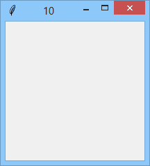
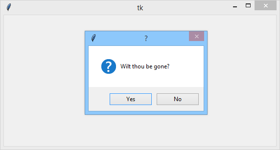
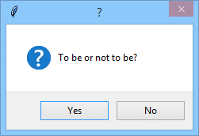
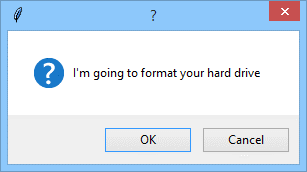
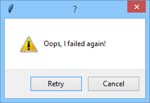

# Shaping the main window and conversing with the user

The main window is a very specific construct, as its fate is shared among **two** masters: **you** (supported by `tkinter`) and your **operating system**. This means than you cannot manage the window like any other widget, as the OS must be **aware** of anything you do with the main window.

The first main window property that you may want to change is its **title**. The title is defaultly set to `Tk`, no matter what your application is named, or even if it's unnamed.

To change the window’s title, you would use a method named `title()`.
```python
import tkinter as tk


def click(*args):
    global counter
    if counter > 0:
        counter -= 1
    window.title(str(counter))


counter = 10
window = tk.Tk()
window.title(str(counter))
window.bind("<Button-1>", click)
window.mainloop()
```
Our sample code shows a window which changes its title each time you click over it, until you do it ten times, after which the title remains `0`.

<p align="center">
  
</p>

Changing the main window’s icon is more troublesome if you want to do in a portable way. Here’s one working solution, although we agree it’s not very elegant.

Take a look at the code we've provided in the editor.
```python
import tkinter as tk

window = tk.Tk()
window.title('Icon?')
window.tk.call('wm', 'iconphoto', window._w, PhotoImage(file='logo.png'))
window.bind("&lt;Button-1&gt;", lambda e: window.destroy())
window.mainloop()
```
The key to success is line #5 – it directly invokes one of the `tkinter` internal, low-level mechanisms directly communicating with the OS’s window manager. The call asks the OS to exchange the window’s icon with the one provided by you. The icon is transferred by the last method’s argument, but if you want this to work successfully, you have to:
- **prepare** an icon as a PNG image;
- **put** the image in the same directory where the application resides;
- **use** a `PhotoImage` class constructor to convert the PNG file into an internal `tkinter` representation (`PhotoImage()` is a part of `tkinter`, and we’re going to tell you more about it soon)

<p align="center">
  
</p>

Note: we’ve used the Python Institute’s logo as the application icon (logo.png). Feel free to replace it with whatever you choose.

If you want your main window to be sized in a non-default way, you have to use a low-level method named `geometry()`, whose only argument looks a bit exotic, as it’s a **string**. Yes, a string.

The string is constructed in the following way:
```
width x height
```
where `width` and `height` are decimal numbers specifying both dimensions in pixels.

Note: you can use this invocation at any time, but you have to take into consideration how the change can influence all your widgets.

Our sample code in the editor shows you how to use it.
```python
import tkinter as tk


def click(*args):
    global size, grows
    if grows:
        size += 50
        if size >= 500:
            grows = False
    else:
        size -= 50
        if size <= 100:
            grows = True
    window.geometry(str(size) + "x" + str(size))


size = 100
grows = True
window = tk.Tk()
window.geometry("100x100")
window.bind("<Button-1>", click)
window.mainloop()
```
Look – clicking the window changes its size, and the window gets bigger and smaller periodically.

Note the method we use to build a `geometry()` argument.

As you probably know, you can usually change the main window’s size on your own by **dragging the window’s bottom-right corner**.

If you want your window not to be less than a desired value, you can use the method named `minsize()`, with two possible arguments (you can use either of them, or both) with self-describing names: `width` and `height`.
```python
import tkinter as tk

window = tk.Tk()
window.minsize(width=250, height=200)
window.geometry("500x500")
window.mainloop()
```
Run our sample code and check if the method does what it promises.

There’s also a method called `maxsize()`, which protects the window from **becoming too large**.

Check the code in the editor window to see how it works.
```python
import tkinter as tk

window = tk.Tk()
window.maxsize(width=500, height=300)
window.geometry("200x200")
window.mainloop()
```

If you want your window to be completely **inflexible** and stiff, you’ll make use of the method named `resizable()`. It uses two parameters named `width` and `height`, but they accept Boolean values, not integer values. Their meaning is:
- `True` – the user can change this dimension;
- `False` – the user can’t change this dimension.

Setting both arguments to `False` will stiffen your window completely.

Check it out!
```python
import tkinter as tk

window = tk.Tk()
window.resizable(width=False, height=False)
window.geometry("400x200")
window.mainloop()
```
Normally, destroying any of the existing widgets causes the event manager to run an event named `<Delete>`, which enables the other widgets to react. Unfortunately, this doesn’t work with the main window.

If you want to bind your own callback to the main window’s close operation (which can be caused by the user clicking the window’s closing button), you can use a low-level `tkinter` method named `protocol()` in the following way:
```
protocol("WM_DELETE_WINDOW", callback)
```

The sample shows one of the possible ways of using this mechanism.

<p align="center">
  
</p>

```python
import tkinter as tk
from tkinter import messagebox


def really():
    if messagebox.askyesno("?", "Wilt thou be gone?"):
        window.destroy()


window = tk.Tk()
window.protocol("WM_DELETE_WINDOW", really)
window.mainloop()
```

Usually, when you want to announce something to the user or to ask any simple question (e.g., yes/no), you don’t need to create your own means – you can use one of the predefined functions gathered within the `messagebox` module. We showed you some of its possibilities before, but now we want to summarize the issue and to present all of the most useful tools.

All these functions display a modal dialog window and wait for a user response. The dialog’s behavior is determined by three parameters:
- `title` – a string displayed in the dialog’s title bar (it can’t be very long, of course);
- `message` – a string displayed inside the dialog; note: the `\n` plays its normal role and breaks up the message’s lines;
- `options` – a set of options shaping the dialog in a non-default way, two of which are useful to us:
  - `default` – sets the **default** (pre-focused) answer; usually, it’s focused on the button located first from the left; this can be changed by setting the keyword argument with identifiers like `CANCEL`, `IGNORE`, `OK`, `NO`, `RETRY`, and `YES`;
  - `icon` – sets the non-default **icon** for the dialog: possible values are: `ERROR`, `INFO`, `QUESTION`, and `WARNING`.

The first of the functions we’re going to show you is `askyesno()`, designed to get _yes/no_ user responses. The function creates a dialog which:
- contains an **icon** with a **question** mark in it;
- returns `True` if the user’s response is Yes and `False` otherwise (e.g., when the user closes the dialog using its close button)

```python
import tkinter as tk
from tkinter import messagebox


def question():
    answer = messagebox.askyesno("?", "To be or not to be?")
    print(answer)


window = tk.Tk()
button = tk.Button(window, text="Ask the question!", command=question)
button.pack()
window.mainloop()
```
In the editor we've provided a simple sample code showing the function in action. Note: the code outputs its messages to the console. Don’t overlook them.

<p align="center">
  
</p>

The `askokcancel()` function is very similar, but it creates a dialog equipped with two buttons titled `OK` and `Cancel` (it returns `True` for `OK` and `False` otherwise).

```python
import tkinter as tk
from tkinter import messagebox


def question():
    answer = messagebox.askokcancel("?", "I'm going to format your hard drive")
    print(answer)


window = tk.Tk()
button = tk.Button(window, text="What are your plans?", command=question)
button.pack()
window.mainloop()
```
You can observe its behavior by running the code we've provided in the editor.

<p align="center">
  
</p>

The `askretrycancel()` function creates a dialog containing a **warning** sign instead of a question mark and two buttons titled `Retry` and `Cancel` (it returns `True` for `Retry` and `False` otherwise).

```python
import tkinter as tk
from tkinter import messagebox


def question():
    answer = messagebox.askretrycancel("?", "I'm going to format your hard drive")
    print(answer)


window = tk.Tk()
button = tk.Button(window, text="What are your plans?", command=question)
button.pack()
window.mainloop()
```
Check it out!

<p align="center">
  
</p>

The `askquestion()` function uses a different return value. It displays two buttons titled `Yes` and `No` along with a question mark icon, but returns a string `Yes` when the user’s answer is positive and No otherwise.

Check the code in the editor to see this in action.
```python
import tkinter as tk
from tkinter import messagebox


def question():
    answer = messagebox.askquestion("?", "I'm going to format your hard drive")
    print(answer)


window = Tk()
button = tk.Button(window, text="What are your plans?", command=question)
button.pack()
window.mainloop()
```

If you need to display some **error** information, you can use the `showerror()` function. It displays a **red warning** icon and doesn’t ask any questions – its only button is titled `OK`.

It also returns a string `OK` in every case.

See the sample code we've provided in the editor.
```python
import tkinter as tk
from tkinter import messagebox


def question():
    answer = messagebox.showerror("!", "Your code does nothing!")
    print(answer)


window = tk.Tk()
button = tk.Button(window, text="Alarming message", command=question)
button.pack()
window.mainloop()
```

When you want to **warn** your user about any threat, use the `showwarning()` function – it’ll present a warning icon and always returns `OK`.

```python
import tkinter as tk
from tkinter import messagebox


def question():
    answer = messagebox.showwarning("Be careful!", "Big Brother is watching you!")
    print(answer)


window = tk.Tk()
button = tk.Button(window, text="What's going on?", command=question)
button.pack()
window.mainloop()
```