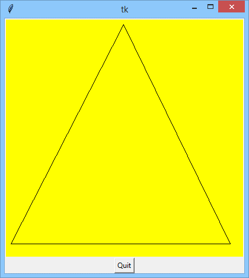
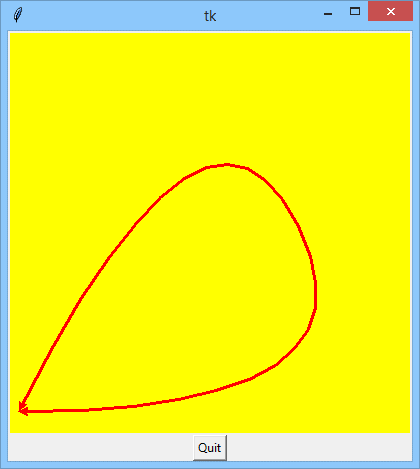
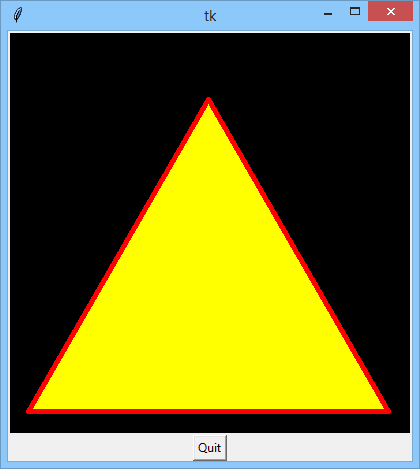
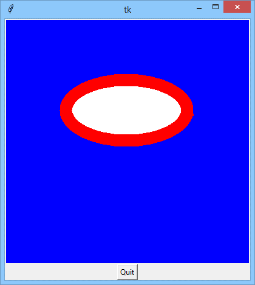
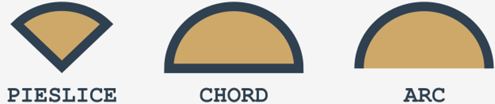
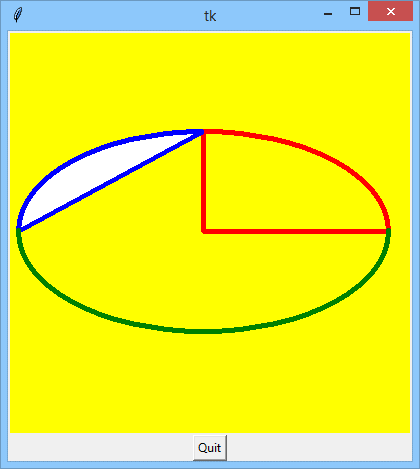
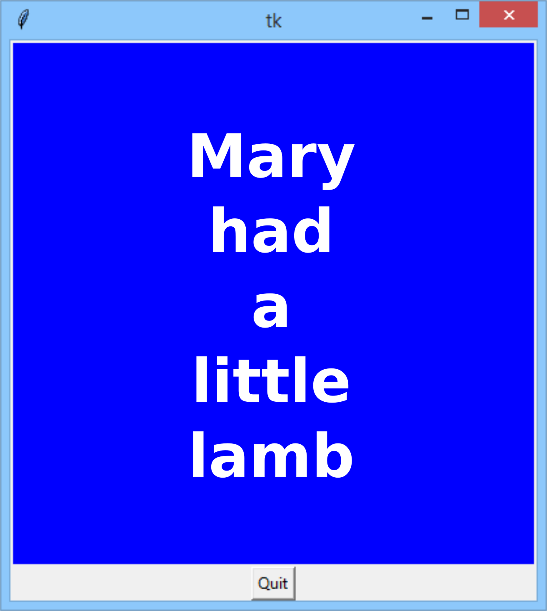
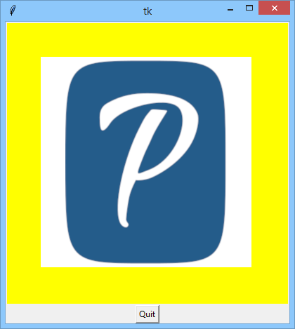
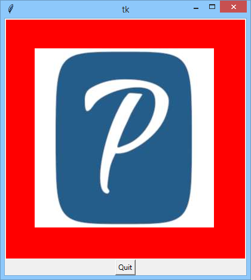

# Canvas
Our last meeting is devoted to the `Canvas` – a widget that behaves like a... **canvas**. It’s a flat, rectangular surface that you can cover with drawings, text, frames, and other widgets. Please treat this story as a basic introduction to the `Canvas` facilities. It can do much more for you – for example, it can scroll itself and react to many events – we hope you’ll explore these issues on your own while we show you how to start your new adventure.

This will require neither palette nor easel – `Canvas` brings you all you need.

Let’s start with a simple example.

Take a look at the code.
```python
import tkinter as tk


window = tk.Tk()
canvas = tk.Canvas(window, width=400, height=400, bg='yellow')
canvas.create_line(10, 380, 200, 10, 380, 380, 10, 380)
button = tk.Button(window, text="Quit", command=window.destroy)
canvas.grid(row=0)
button.grid(row=1)
window.mainloop()
```
It creates a 400 x 400-pixel **canvas** with a **yellow** background. Next, it draws a line (precisely: a polygonal **chain**) consisting of three line segments. The application can be terminated using the _Quit_ button.

Can you find the parts of the code responsible for all these actions?

<p align="center">
  
</p>

First, we’ll show you how to create a canvas. This is done with a constructor named `Canvas()`.
```python
c = Canvas(master, options...)
```
Its first argument specifies the master widget (as usual). A set of keyword arguments specifies the properties of the canvas. The most usable of them are as follows:

| Property name     | Property role                                                                  |
|-------------------|--------------------------------------------------------------------------------|
| `borderwidth`     | canvas border’s **width** in pixels (default: 2)                               |
| `background (bg)` | canvas border’s **color** (default: the same as the underlying window’s color) |
| `height`          | canvas **height** (in pixels)                                                  |
| `width`           | canvas **width** (in pixels)                                                   |

An existing `Canvas` offers a set of methods designed to create different graphical constructs. To create a polygonal chain, you need to use the one named `create_line()`:
```
canvas.create_line(x0, y0, x1, y1, ..., xn, yn, option...)
```
The method draws a line connecting the points of specified coordinates (x<sub>i</sub>,y<sub>i</sub>), starting at (x<sub>0</sub>,y<sub>0</sub>) and ending at (x<sub>n</sub>,y<sub>n</sub>) – as you can see, each pair of positional arguments describes **one** point.

If you want to draw just one segment, you need to specify four values (i.e., the coordinates of two points).

The most interesting `create_line()` options are as follows:

| Option name | Option meaning                                                                                                                                                                                                                                                                    |
|-------------|-----------------------------------------------------------------------------------------------------------------------------------------------------------------------------------------------------------------------------------------------------------------------------------|
| `arrow`     | normally, the chain ends aren’t marked in any special way, but you may want them to be finished with **arrowheads**; setting the arrow option to `FIRST` results in drawing an arrowhead at the chain’s beginning, `LAST` at the chain’s end, `BOTH` at both sides of the chain.  |
| `fill`      | chain **color** (setting the option to an empty string causes the line to be transparent)                                                                                                                                                                                         |
| `smooth`    | setting it to `True` rounds the chain’s corners using a set of connected parabolas                                                                                                                                                                                                |
| `width`     | line **width** (default: 1 pixel)                                                                                                                                                                                                                                                 |

Let’s see them in action.

Look at the sample code we've provided in the editor. We’ve drawn the same chain, but we’ve added some options to the `create_line()` invocation.
```python
import tkinter as tk

window = tk.Tk()
canvas = tk.Canvas(window, width=400, height=400, bg='yellow')
canvas.create_line(10, 380, 200, 10, 380, 380, 10, 380,
                   arrow=tk.BOTH, fill='red', smooth=True, width=3)
button = tk.Button(window, text="Quit", command=window.destroy)
canvas.grid(row=0)
button.grid(row=1)
window.mainloop()
```
Can you predict what the result will look like?

<p align="center">
  
</p>

Are you surprised? Of course, you are!

Drawing a rectangle can be done by the `create_rectangle()` method:
```python
canvas.create_line(x0,y0,x1,y1, ...,xn,yn,option...)
```
The method draws a rectangle specified with two opposite vertices at the (x<sub>0</sub>,y<sub>0</sub>) and (x<sub>1</sub>,y<sub>1</sub>) points.

Some of the possible invocation options are:

| Option name | Option meaning                                                                      |
|-------------|-------------------------------------------------------------------------------------|
| `outline`   | rectangle **edge color** (if specified as an empty string, the edge is transparent) |
| `fill`      | rectangle **interior color**                                                        |
| `width`     | rectangle **edge width** in pixels (default: 1)                                     |

Take a look at the code in the editor. This example’s effect is easy to predict, isn’t it?
```python
import tkinter as tk

window = tk.Tk()
canvas = tk.Canvas(window, width=400, height=400, bg='black')
canvas.create_rectangle(200, 100, 300, 300, outline='white', width=5, fill='red')
button = tk.Button(window, text="Quit", command=window.destroy)
canvas.grid(row=0)
button.grid(row=1)
window.mainloop()
```

Drawing a **polygon** looks very similar to drawing a line, with the difference being that the last segment (connecting the first and the last points) in the chain is drawn **automatically** (you don’t need to specify the same point as the first and the last (x,y) pair:
```python
canvas.create_polygon(x0, y0, x1, y1, xn, yn, option...)
```
The method uses the same set of options as `create_polygon()`.

Do you want to see it in action? Check out the code we've provided in the editor.
```python
import tkinter as tk

window = tk.Tk()
canvas = tk.Canvas(window, width=400, height=400, bg='black')
canvas.create_polygon(20, 380, 200, 68, 380, 380, outline='red', width=5, fill='yellow')
button = tk.Button(window, text="Quit", command=window.destroy)
canvas.grid(row=0)
button.grid(row=1)
window.mainloop()
```
Analyze it and try to predict the shape it produces.

<p align="center">
  
</p>

Drawing an **ellipse** (and a **circle** is, in fact, a specific ellipse) needs a method named `create_oval()`:
```python
c.create_eclipse(x0,y0,x1,y1,xn,yn,option...)
```
The method draws an ellipse inscribed in a rectangle with vertices at the points (x<sub>0</sub>,y<sub>0</sub>) and (x<sub>1</sub>,y<sub>1</sub>).

If the rectangle is a **square**, the ellipse becomes a **circle**.

The options are the same as for `create_polygon()`.

Let’s test it. Run the code we've provided in the editor.
```python
import tkinter as tk

window = tk.Tk()
canvas = tk.Canvas(window, width=400, height=400, bg='blue')
canvas.create_oval(100, 100, 300, 200, outline='red', width=20, fill='white')
button = tk.Button(window, text="Quit", command=window.destroy)
canvas.grid(row=0)
button.grid(row=1)
window.mainloop()
```
Is it an ellipse or a circle? What do you think?

<p align="center">
  
</p>

If you want to draw an **arc** (a part of an ellipse) you’ll use the `create_arc()` method:
```python
canvas.create_arc(x0,y0,x1,y1,option...)
```
The method draws the arc of an ellipse inscribed inside a rectangle with vertices at points (x<sub>0</sub>,y<sub>0</sub>) and (x<sub>1</sub>,y<sub>1</sub>).

The options are the same as for `create_polygon()`, and define a set of three new ones, specific to the method:

| Option name | Option meaning                                                                                                                                                                               |
|-------------|----------------------------------------------------------------------------------------------------------------------------------------------------------------------------------------------|
| `style`     | can be set to one of the following: `PIESLICE` (default), `CHORD` and `ARC`; the **shape** of the resulting drawing is presented here:</br><p align="center"></p>  |
| `start`     | the **angle** (in degrees) of the arc’s start relative to the X-axis (e.g., 90 means the highest point of the ellipse, while 0 is the right-most point. The default is 0)                    |
| `extent`    | the **arc**’s span (in degrees) relative to the start point; note: the span is calculated counter-clockwise. The default is 90 (a quarter of an ellipse)                                     |

Take a look at the code in the editor, this is how we’ve done it. Try to imagine what it looks like!
```python
import tkinter as tk

window = tk.Tk()
canvas = tk.Canvas(window, width=400, height=400, bg='yellow')
canvas.create_arc(10, 100, 380, 300, outline='red', width=5)
canvas.create_arc(10, 100, 380, 300, outline='blue', width=5,
                  style=tk.CHORD, start=90, fill='white')
canvas.create_arc(10, 100, 380, 300, outline='green', width=5,
                  style=tk.ARC, start=180, extent=180)
button = tk.Button(window, text="Quit", command=window.destroy)
canvas.grid(row=0)
button.grid(row=1)
window.mainloop()
```

<p align="center">
  
</p>

The `create_text()` method puts text on the `Canvas`. The text is placed inside a rectangle whose center is located at point (x,y):
```python
c.create_text(x, y, option...)
```
The method makes use of the following options:

| Option name | Option meaning                                                                                                                     |
|-------------|------------------------------------------------------------------------------------------------------------------------------------|
| `fill`      | text **color**                                                                                                                     |
| `font`      | text **font**                                                                                                                      |
| `justify`   | text **justification**: `LEFT` (default), `CENTER`, `RIGHT`                                                                        |
| `text`      | **text** to display (`\n` works as expected)                                                                                       |
| `width`     | normally, the rectangle is as wide as the **longest text line**; using the width option forces the text to be aligned to that size |

```python
import tkinter as tk

window = tk.Tk()
canvas = tk.Canvas(window, width=400, height=400, bg='blue')
canvas.create_text(200, 200, text="Mary\nhad\na\nlittle\nlamb",
                   font=("Arial","40","bold"),
                   justify=tk.CENTER,
                   fill='white')
button = tk.Button(window, text="Quit", command=window.destroy)
canvas.grid(row=0)
button.grid(row=1)
window.mainloop()
```
This is what the `create_text()` method can do for you (and much more as well).

<p align="center">
  
</p>

The `create_image()` method draws an image (a bitmap) on the Canvas. The image is placed inside a rectangle whose center is located at point `(x, y)`:
```python
canvas.create_image(x, y, option...)
```
The method needs an image to display, and the **image** is passed as a keyword argument:

| Option name      | Option meaning                                                                                                                                                                                                                                                       |
|------------------|----------------------------------------------------------------------------------------------------------------------------------------------------------------------------------------------------------------------------------------------------------------------|
| `image`          | an object of the `PhotoImage` class containing the image itself; the `PhotoImage` class constructor needs a keyword argument named `file` pointing to a **bitmap file** (note: only GIF and PNG formats are accepted); the argument should specify the file’s path   |

Let's see it inside our code.
```python
import tkinter as tk

window = tk.Tk()
canvas = tk.Canvas(window, width=400, height=400, bg='yellow')
image = tk.PhotoImage(file='logo.png')
canvas.create_image(200, 200, image=image)
button = tk.Button(window, text="Quit", command=window.destroy)
canvas.grid(row=0)
button.grid(row=1)
window.mainloop()
```
Do you like our logo? We love it!

<p align="center">
  
</p>

If you want to use a **JPEG** bitmap, some additional steps are required – you need to:
- import the `Image` and `ImageTk` classes from the **PIL** (Python Image Library) module;
- build an object of the `Image()` class and use its `open()` method to fetch the bitmap from the file (the argument should specify the file’s path)
- convert this object into a `PhotoImage` class object using an `ImageTk` function of the same name;
- continue as usual.

The example in the editor will tell you more.
```python
import tkinter as tk
import PIL

window = tk.Tk()
canvas = tk.Canvas(window, width=400, height=400, bg='red')
jpg = PIL.Image.open('logo.jpg')
image = PIL.ImageTk.PhotoImage(jpg)
canvas.create_image(200, 200, image=image)
button = tk.Button(window, text="Quit", command=window.destroy)
canvas.grid(row=0)
button.grid(row=1)
window.mainloop()
```
This is how it works.

<p align="center">
  
</p>

So... we gave you a canvas, paints, and brushes – are you ready to paint a masterpiece?