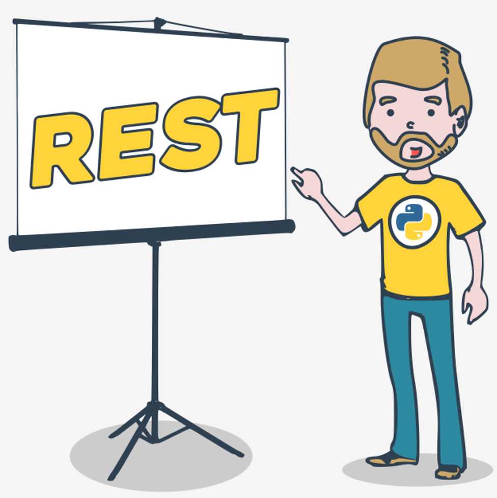
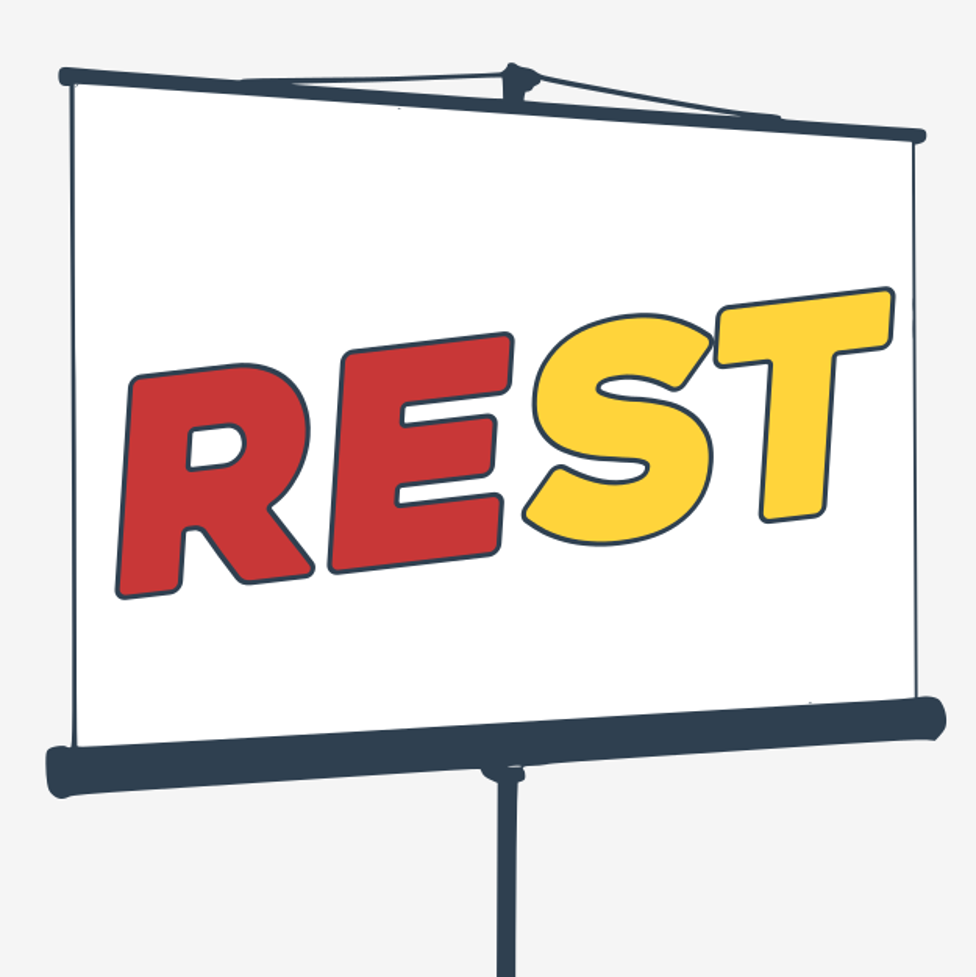
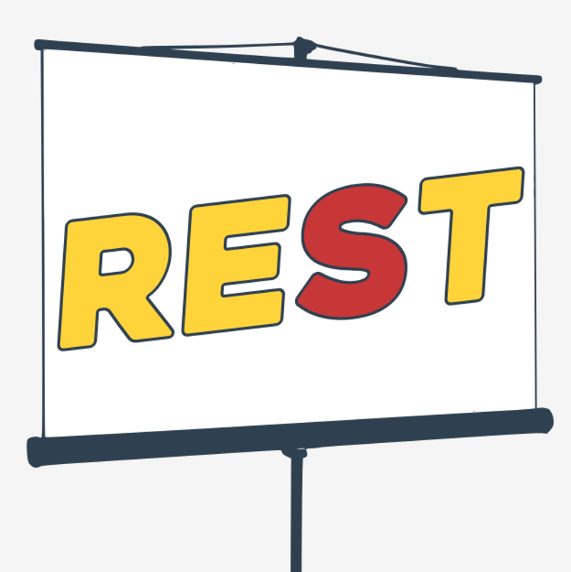
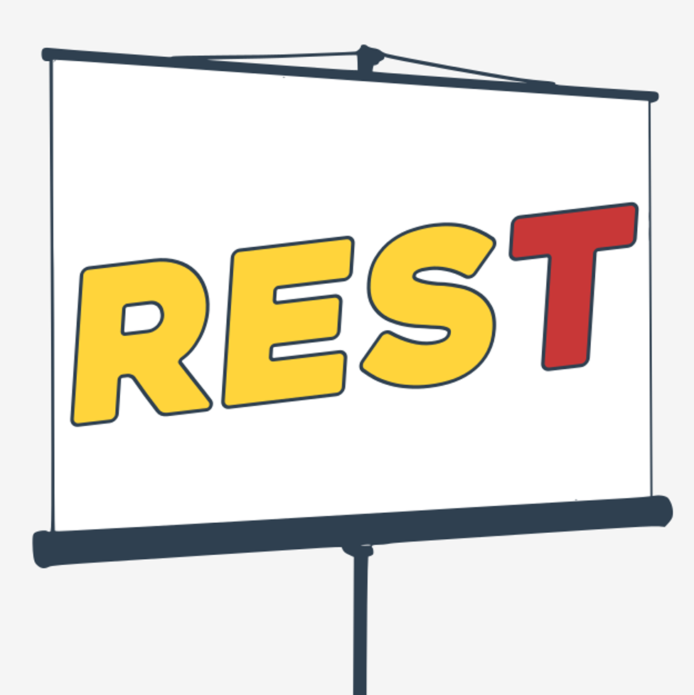
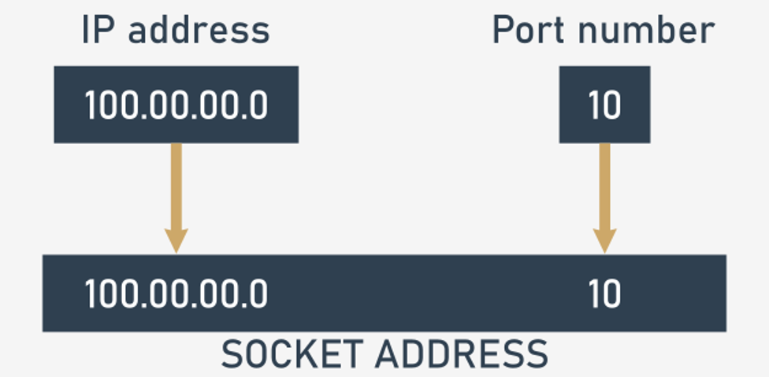
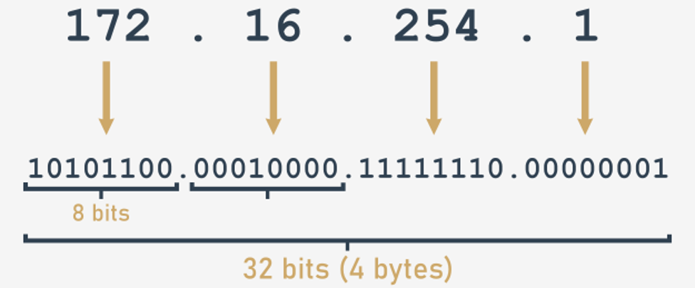
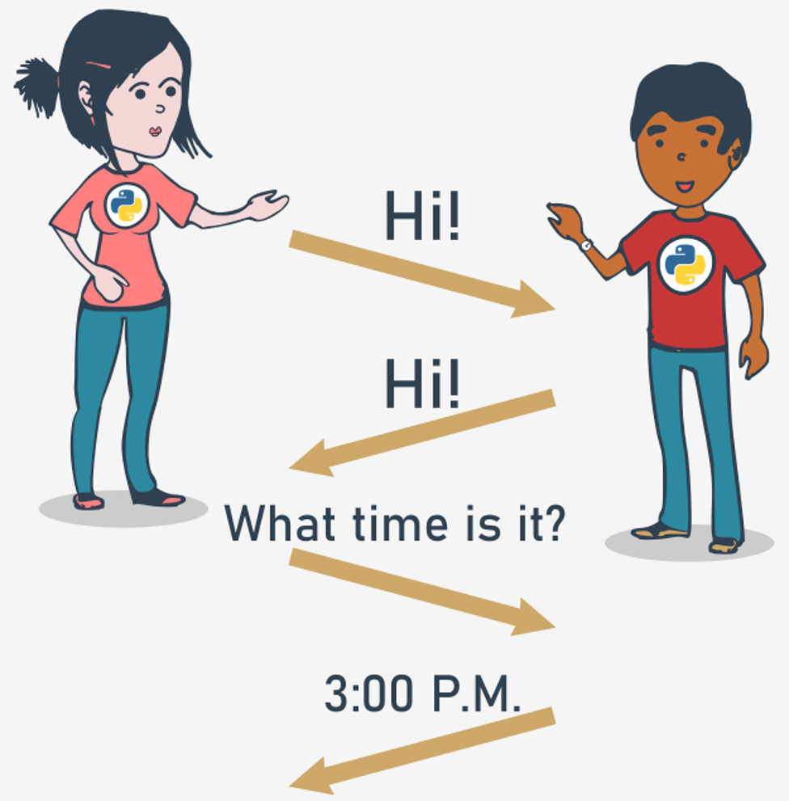
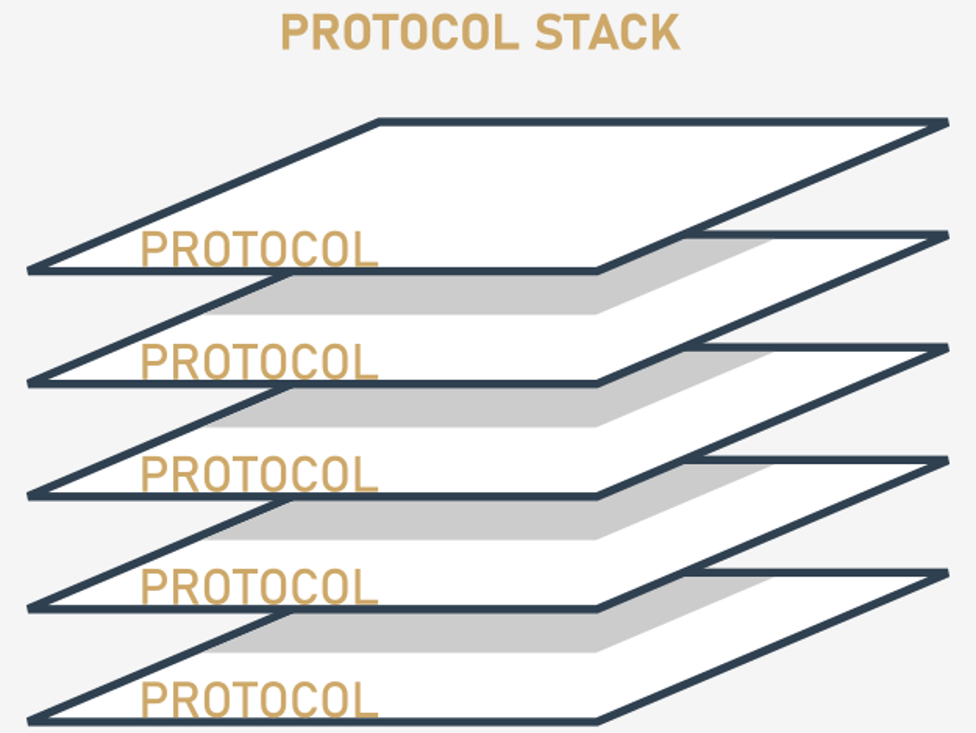
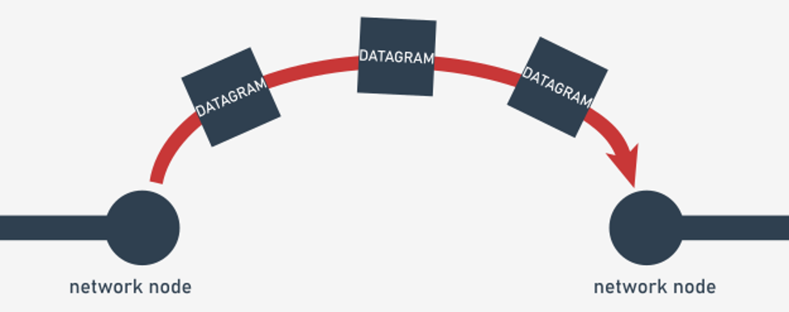
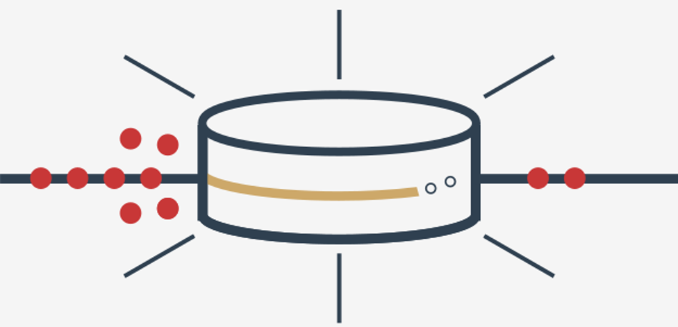

# Basic Concepts of Network Programming

## Networks, layers and the Internet
### Some words about REST
The word you see below may look a little enigmatic:

  

Are we going to convince you to take a rest? Not at all. On the contrary, we want to encourage you to start the next part of our adventure - very demanding and completely new. We'll show you not Python itself, but a very specific kind of machinery (do not take this literally) which drives lots of contemporary computer systems, especially those which work on the Internet; moreover, which cannot work without the Internet.

REST isn't actually a word - it's an acronym. It comes from three words of equal importance:
- **RE**presentational
- **S**tate
- **T**ransfer

Let's look at them separately.

#### Representational

  

**RE** stands for _Representational_. It means that our machinery **stores, transmits and receives representations**, while the term representation reflects the way in which **data or states are retained inside the system and presented to the users** (humans or computers).

REST uses a very curious way of representing its data - it's always **text**. Pure, plain text.

"It must be a joke," you may think now. "How is it possible to send and receive all kinds of data using plain text?"

It's a very good question. Probably the best question that can be put now. REST is focused on a very specific kind of data - the data which reflects **states**.

We'll tell you more about this very shortly. Let's now make a jump to the next part of the acronym.

#### State

  

**S** stands for _State_. The word state is key to understanding what REST is and what it could be used for.

We think that your knowledge of classes and objects can be very helpful here. We want you to use it. Imagine any object. The object contains a set (the most preferable set is a non-empty one) of **properties**. We can say that the values of all the object's properties constitute its state. If any of the properties changes its value, this inevitably entails the effect of changing the whole object's state. Such a change is often called a **transition**.

Now imagine that the object is stored somewhere else, not on your computer, but on a server located over the hill and far away. Of course, you can access the server's resources using the network, but you can't just get the object and transfer it into your computer. Why not? Because it has to be accessible to many (maybe a few, maybe a million) users. It must stay on the server.

Imagine that you want to (or you must) **affect the object's state through the network**. No, you are not able to invoke any of its methods. Sorry, that's impossible. You can't do it directly. But you can do it using REST. How? We'll show you very soon. Let's now take a look at the last part of the acronym.

#### Transfer

  

**T** stands for _Transfer_. The network (not only the Internet) is able to act as a **carrier allowing you to transmit states' representations to and from the server**.

Note: not the object, but its states, or actions able to change the states, are subject to the transfer. We can say (it's a very poor analogy, but it will work here) that transferring the states enables you to achieve results similar to those caused by method invocations.

**Representational State Transfer** - We hope the term is less mysterious now. Don't be afraid - we won't leave you alone with your doubts. There is a long road ahead of us.

Let's start our journey from the very first step - from a story about how the network works and how it is possible to send and receive something through it. Not only states - literally anything. This is why we want to tell you about **sockets**. It's a very good place to hit the road.

### BSD sockets
The sockets we want to tell you about have nothing to do with electricity - we're not going to plug anything into them and we won't draw energy from them.

A socket (in the sense that interests us now) is a kind of **end-point**. An end-point is **a point where the data is available to get it from and where the data may be sent to**. Your Python program can connect to the end-point and use it to interchange messages between itself and another program working somewhere far away on the Internet.

The history of sockets started in 1983 at the University of California in Berkeley, where the concept was formulated and where the first successful implementation was carried out.

  

The resulting solution was a universal set of functions suitable for implementation in nearly all operating systems and available in all modern programming languages. It was named BSD sockets - the name was borrowed from _Berkeley Software Distribution_, the name of a Unix-class operating system, where the sockets were deployed for the very first time.

After some amendments, the standard was adopted by POSIX (a standard of contemporary Unix-class operating systems) as **POSIX sockets**.

We can say that all modern OSs implement BSD sockets in a more or less accurate way. Despite their differences, the general idea remains the same and this is what we are going to tell you about.

We don't want our course to be a schooling on network programming, so be aware that we'll present to you only the absolutely essential information on how network traffic is managed. We focus - as always - on programming in Python. By the way: BSD sockets were originally implemented in the "C" programming language.

The main idea behind BSD sockets is closely connected to Unix philosophy contained in the words everything is a file. A socket may be often treated as very specific kind of file. Writing to a socket results in sending the data through a network. Reading from a socket enables you to receive the data coming from the network.

By the way, **MS Windows reimplements BSD sockets in the form of the WinSock**. Fortunately, you're not able to feel the difference when programming in Python. Python hides them very thoroughly. We like Python for this (and not only for this).

Be prepared to assimilate many new terms and notions. Are you ready?

### Socket domains
Initially, BSD sockets were designed to organize communication in two different domains (not to be confused with internet domains like `pythoninstitute.org` - these terms have nothing in common). The two domains were:
- **Unix domain** (_Unix_ for short) - a part of BSD sockets used to communicate programs working within one operating system (i.e., simultaneously present in the same computer system)
- **Internet domain** (_INET_ in short) - a part of BSD socket API used to communicate programs working within different computer systems, connected together using a TCP/IP network (note: this doesn't preclude the use of INET sockets to communicate processes working in the same system)

In the next part, we'll deal with sockets working in the INET domain.

### Socket address
The two programs wanting to exchange their data must be able to identify each other - to be precise, they must have the ability to clearly indicate the socket they want to connect through.

INET domain sockets are identified (addressed) by pairs of values:
- the IP address of the computer system inside which the socked is located;
- the port number (more often referred to as service number)

  

### IP address
An IP address (more precisely: **IP4** address) is **a 32-bit long value used to identify computers connected to any TCP/IP network**. The value is usually presented as four numbers from the range 0..255 (i.e., eight bits long) coupled together with dots (e.g., 87.98.239.87).

There is also a newer IP standard, named **IP6**, using 128 bits for the same purpose. Due to its slight prevalence (according to data published in August 2016, less than 20% of computers in the world are reachable by IP6 addressing) we will limit our considerations to IP4.

  

### Socket/service number
The socket/service number is **a 16-bit long integer number identifying a socket within a particular system**. As you may have guessed already, there are 65,536 (2 ** 16) possible socket/service numbers.

The term service number came from the fact that many standard network services usually use the same, constant socket numbers e.g., **the HTTP protocol, a carrier of data used by REST, usually uses port 80**.

### Protocol
A protocol is **a standardized set of rules allowing processes to communicate with each other**. We may say that a protocol is a kind of _network savoir-vivre_ specifying the rules of behaviour for all participants.

  

### Protocol stack
A protocol stack is **a multilayer** (hence the name) **set of cooperating protocols providing a unified repertoire of services**. The TCP/IP protocol stack is designed to cooperate with networks based on the IP protocol (the IP networks).

  

The conceptual model of network services describes the protocol stack in a way where the most basic, **elementary services are located at the bottom of the stack**, while the most advanced and abstractive lie on the top.

It is assumed that any higher layer implements its functionalities using services provided by the adjoining lower layer (note: it is the same as in the other parts of the operating system, e.g., you program implements its functionality using OS services and OS services implement their functionalities using hardware facilities).

### IP
The IP (_Internetwork Protocol_) is one of the lowest parts of TCP/IP protocol stack. Its functionality is very simple - it is able to **send a packet of data (a datagram) between two network nodes**.

  

IP is a very unreliable protocol. It doesn't guarantee that:
- any of the sent datagrams will reach the target (moreover, if any of the datagrams is lost, it may remain undetected)
- the datagram will reach the target intact;
- a pair of sent datagrams will reach the target in the same order as they were sent.

The upper layers are able to compensate all these IP's infirmities.

### TCP
The TCP (**Transmission Control Protocol**) is the highest part of the TCP/IP protocol stack. It **uses datagrams** (provided by the lower layers) and **handshakes** (an automated process of synchronizing the flow of data) **to construct a reliable communication channel able to transmit and receive single characters**.

Its functionality is very complex, as it guarantees that:
- a stream of data reaches the target, or the sender is informed that communication has failed;
- data reaches the target intact.

  

### UDP
The UDP (_User Datagram Protocol_) lies at the higher part of TCP/IP protocol stack, but lower than the TCP. It doesn't use handshakes, which has two serious consequences:
- it is faster than TCP (due to fewer overheads)
- it is less reliable than TCP.

  

This means that:
- TCP is a first-choice protocol for applications where data safety is more important that efficiency (e.g., WWW, REST, mail transfer, etc.)
- UDP is more adequate **for applications where response time is crucial** (DNS, DHCP, etc.)

### Connection-oriented vs. connectionless communication
A form of communication which **demands some preliminary steps to establish the connection and other steps to finish it** is _connection-oriented communication_.

Usually, both parties involved in the process aren't symmetrical i.e., their roles and routines are different. Both sides of the communication are aware that the other party is connected.

A phone call is a perfect example of connection-oriented communication.

Look:
- the roles are strictly defined: there is a caller and there is a callee;
- the caller must dial the callee's number and wait till the network routes the connection;
- the caller must wait for the callee to answer the call (the callee may reject the connection, or just not answer the call)
- the actual communication won't start until all the previous steps are completed successfully;
- the communication ends when either of the parties hangs-up.

TCP/IP networks use the following names for both sides of the communication:
- the side that initiates the connection (caller) is named **client**;
- the side that answers the client (callee) is named **server**.

Connection-oriented communications are usually built on top of TCP.

A communication which **can be established ad-hoc** (snap - just like that) is _connectionless communication_. Both parties usually have equal rights, but neither of the parties is aware of the other side's state.

Using walkie-talkies is a very good analogy for connectionless communication, because:
- either of the parties of communication may initiate the communication at any time; it only requires pushing the _talk_ button;
- talking to the mic doesn't guarantee that anybody will hear (it’s necessary to wait for an incoming answer to be sure)

Connectionless communications are usually built on top of UDP.

Okay. Taking such a dose of theory requires some practice as soon as possible. Let's do it.