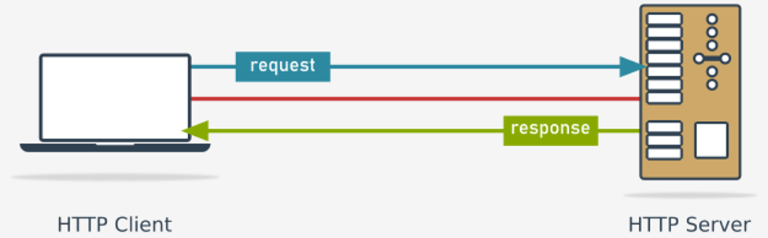

# How to use sockets in Python

## How to fetch a document from a server using Python
We are going to write our first program making use of network sockets. Of course, we'll harness Python for this purpose.

Here are our goals:
- we want to write **a program which reads the address of a WWW site** (e.g., pythoninstitute.org) using the standard `input()` function and **fetches the root document** (the main HTML document of the WWW site) of the specified site;
- the program **outputs the document** to the screen;
- the program **uses TCP to connect to the HTTP server**.

Our program has to perform the following steps:
1. **create a new socket** able to handle connection-oriented transmissions based on TCP;
2. **connect the socket to the HTTP server** of a given address;
3. **send a request to the server** (the server wants to know what we want from it)
4. **receive the server's response** (it will contain the requested root document of the site)
5. **close the socket** (end the connection)

This is our road map. Let's follow the route.

<p align="center">
  
</p>

### Importing a socket
We are in need - we need a socket. How do we obtain a socket? Can we order it from an Internet store? Is it free?

Yes, it's free. As you probably suspect, we need a specialized module. Python offers just such a module. You won't be surprised if we tell you that the module is named socket, will you?

This is what we'll put at the top of our code:
```python
import socket
```

### Obtaining user input
We also need **the name of the HTTP server** we're going to connect to. In fact, it's not our problem. The user knows it better. Let's ask him or her:
```python
import socket

server_addr = input("What server do you want to connect to? ")
```
The user input may can take two different forms:
- it can be **the domain name of the server** (like www.pythoninstitute.org, but without the leading http://)
- it can be **the IP address of the server** (like 87.98.235.184), but it must be said firmly that this variant is potentially ambiguous. Why? Because **there can be more than one HTTP server located at the same IP address** - the server you will reach may be not the server you intended to connect to.

It may sound cynical - it's not our problem which of these two ways our users choose. They know better. The customer is always right.

### The `socket` module: creating a socket
The `socket` module contains all the tools we need to deal with sockets. We aren't going to present all its capabilities - as we mentioned before, we aren't and won't be focusing on network programming. We want to show you how the TCP/IP works and how it is able to act as a **carrier for REST**.

We can say that TCP/IP is interesting for us only to the extent that it is able to transport HTTP traffic, and HTTP is interesting for us only to the extent that it is able to act as a relay for REST. If you want to get fully accustomed with networks, you may need to continue your reading using another of our courses.

The `socket` module provides a class named `socket` (what a coincidence!) which encapsulates a bundle of properties and activities related to the actual sockets' behaviour. This means that the first step is to **create an object of the class** - this is how we carry out the creation:
```python
import socket

server_addr = input("What server do you want to connect to? ")
sock = socket.socket(socket.AF_INET, socket.SOCK_STREAM)
```
As you can see, the constructor takes two arguments, both declared within the module. Let us tell you about them:
- the former argument is a domain code (we may use the `AF_INET` symbol here to **specify the Internet socket domain** - do you remember?

  We told you about Unix and INET domains in the previous section); as different domains require completely different socket countenance, the target domain has to be known at the moment;

- the latter argument is a socket type code (we may use the `SOCK_STREAM` symbol here to **specify a high-level socket able to act as a character device** - a device that can handle single characters, as we are interested in transferring data byte by byte, not as fixed sized blocks (e.g., a terminal is a character device, while a disk isn't)

Such a socket is prepared to work on top of TCP protocol - it's the default socket configuration.

If you want to create a socket to cooperate with another protocol, like UDP, you will need to use a different constructor syntax.

As you can see, the newly created socket object will be referenced by a variable named `sock`. No, it's not about the clothes. Really.

### Connecting to a server
If we use a socket on the client's side, we are ready to make use of it. The server, however, has a few more steps to take. In general, servers are usually more complex than clients (as one server serves many clients simultaneously) - this is the moment where our telephone analogies stop working.

The configured socket (just like ours) is able to be connected to its counterpart on the server's side. Look at the code in the editor - this is how we perform the connection.
```python
import socket

server_addr = input("What server do you want to connect to? ")
sock = socket.socket(socket.AF_INET, socket.SOCK_STREAM)
sock.connect((server_addr, 80))
```
The `connect()` method does what it promises - it tries to connect your socket to the service of the specified address and port (service) number.

Note: we make use of the variant where the two values are passed to the method as elements of a tuple. This is why you see two pairs of parentheses there. Omitting one of them will obviously cause an error.

Note: the form of the target service address (a pair consisting of the actual address and port number) is **specific for the INET domain**. Don't expect it to look the same in other domains.

You may ask - why 80? Can I put something else instead of this? No, you can’t. 80 is a well-known service number for HTTP. Any Internet browser will try to connect to port number 80 by default, so we do it, too.

Is it possible that the connection attempt will fail? Of course it is. There are lots of possible reasons: a malformed address of the service, a non-existent server, a connection error, and more. How we can discover such unpleasant events?

If something goes wrong, the `connect()` method (and any other method whose results may be unsuccessful) **raises an exception**. Let us postpone the issue for a moment. For the moment we can assume then everything goes smoothly.

Yes, we know. The awakening from this dream can be painful.

The connection is ready. The server has accepted our connection and is very curious about what it will hear from us. Don't let it wait too long.

But... what do we really want to tell the server anyway? How do we talk to the HTTP server to be sure that it understands us? We have to speak in HTTP, of course.

### The GET method
The HTTP protocol is one of the simplest Internet protocols, but it is still too complex to discuss fully here. For now, we'll tell you how to get a root document from the WWW site. Of course, we'll tell you more about it later.

A conversation with the HTTP server consists of **requests (sent by the client) and responses (sent by the server)**.

HTTP defines a set of acceptable requests - these are **the request methods or HTTP words**. The method asking the server to send a particular document of a given name is called `GET` (it's rather self-explanatory, isn't it?).

To get a root document from a site named _www.site.com_ the client should send the request containing a correctly formed `GET` method description:
```
GET / HTTP/1.1\r\n
Host: www.site.com\r\n
Connection: close\r\n
\r\n
```
The `GET` method requires:
- a line containing the method name (i.e., `GET`) followed by the name of the resource the client wants to receive; the root document is specified as a single slash (i.e., `/`); the line must also include the HTTP protocol version (i.e., `HTTP/1.1`) and must end with the characters `\r\n`; note: all lines must end the same way;
- a line containing the name of the site (e.g., _www.site.com_) preceded by the parameter name (i.e., `Host:`)
- a line containing a parameter named `Connection:` along with its value `close`, which forces the server to close the connection after the first request is served; it will simplify our client's code;
- an empty line is a **request terminator**.

It doesn’t look very clear, but it doesn't exceed our capabilities, does it?

Okay, we know now that HTTP won't be our favourite language, but how we can send such a request to the server? It's simple. We have to invoke a method from within the socket object.

Its name is... can you guess?

### Requesting a document from a server
Yes, it's `send` - look at how we combine it with our code from the previous lesson:
```python
sock.send(b"GET / HTTP/1.1\r\nHost: " +
          bytes(server_addr, "utf8") +
          b"\r\nConnection: close\r\n\r\n")
```
The `send()` method doesn't natively accept strings - this is why we have to use the `b` prefix before the literal parts of the request string (it silently translates the string into bytes - an immutable vector consisting of values from the range 0..255, which `send()` likes most) and this is also why we should invoke `bytes()` to translate the string variable in the same manner.

Note: the bytes' second argument specifies the encoding used to store the server's name. UTF8 seems to be the best choice for most modern OSs.

The action performed by the `send()` method is extremely complicated - it engages not only many layers of the OS, but also lots of network equipment deployed on the route between the client and server, and obviously the server itself.

Fortunately, we don't need to worry about it.

Of course, if anything inside this complex mechanism fails, `send` will fail, too. As you may expect, **an exception is raised** then.

Anyway, the die is cast. The request has been sent. What can we expect from the server?

If the server is functional and there is a root document ready to send to us, we are allowed to receive it. We'll do it now without hesitation.

Look at the final version of our code. We've provided it in the editor.
```python
import socket

server_addr = input("What server do you want to connect to? ")
sock = socket.socket(socket.AF_INET, socket.SOCK_STREAM)
sock.connect((server_addr, 80))
sock.send(b"GET / HTTP/1.1\r\nHost: " +
          bytes(server_addr, "utf8") +
          b"\r\nConnection: close\r\n\r\n")
```

### Requesting a document from a server: continued
The `recv()` method (in our humble opinion, not a very fortunate abbreviation of receive) waits for the server's response, gets it, and puts it inside a newly created object of type `bytes`. Look at the code we've provided in the editor.
```python
import socket

server_addr = input("What server do you want to connect to? ")
sock = socket.socket(socket.AF_INET, socket.SOCK_STREAM)
sock.connect((server_addr, 80))
sock.send(b"GET / HTTP/1.1\r\nHost: " +
          bytes(server_addr, "utf8") +
          b"\r\nConnection: close\r\n\r\n")
reply = sock.recv(10000)
```
The argument specifies the maximal acceptable length of the data to be received. If the server's response is longer than this limit, it will remain unreceived.

You will need to invoke `recv()` again (maybe more than once) to get the remaining part of the data. It's a general practice to invoke recv() as long as it returns some data.

There are lots of bad things which can spoil our game. For example, the server may not want to talk with us.

The transmission may cause some errors, too. All these fatalities will raise exceptions.

What next?

### Closing the connection
As we want to neither send nor receive anything more, we ought to announce it to the server. We will do it in a very simple form, just like here:
```python
import socket

server_addr = input("What server do you want to connect to? ")
sock = socket.socket(socket.AF_INET, socket.SOCK_STREAM)
sock.connect((server_addr, 80))
sock.send(b"GET / HTTP/1.1\r\nHost: " +
          bytes(server_addr, "utf8") +
          b"\r\nConnection: close\r\n\r\n")
reply = sock.recv(10000)
sock.shutdown(socket.SHUT_RDWR)
```
Invoking `shutdown()` is like a message whispered directly into the server's ear: "We have no more to say to you. We don't want to hear from you, either. The rest is silence."

Thanks to that, the server is aware of our intentions.

The following function arguments say more about our views for the future:
- `socket.SHUT_RD` - we aren't going to read the server's messages anymore (we declare ourselves deaf)
- `socket.SHUT_WR` - we won't say a word (actually, we'll be dumb)
- `socket.SHUT_RDWR` - specifies the conjunction of the two previous options.

Is there anything more we should do now?

As our `GET` request demanded that the server close the connection as soon the response is sent and the server has been advised of our next steps (or rather of the fact that we've already done what we wanted to), we can assume that **the connection is fully terminated at this moment**.

Some would say that closing it explicitly is an exaggerated diligence. We don't share this view and prefer to close the connection by expressing it literally.

The parameterless `close()` method will do it for us - see our code in the editor.
```python
import socket

server_addr = input("What server do you want to connect to? ")
sock = socket.socket(socket.AF_INET, socket.SOCK_STREAM)
sock.connect((server_addr, 80))
sock.send(b"GET / HTTP/1.1\r\nHost: " +
          bytes(server_addr, "utf8") +
          b"\r\nConnection: close\r\n\r\n")
reply = sock.recv(10000)
sock.shutdown(socket.SHUT_RDWR)
sock.close()
```
Okay. We've received something. Is it worth seeing with our own eyes? We won't see until we see.

### What did we get?
Don't expect our code to be able to display the received document in the same way as the Internet browser shows it to you. A code able to do anything like this won't fit on your screen.

Moreover, we don't want to write a new browser. We just want to check whether the data we received looks reasonable.

We'll do it in the simplest (but a very elegant) way - we'll just print it out using the built-in `repr()` function, which takes care of the clear (almost) **textual presentation of any object**. We don't need anything more.

This is why the last line of our code look as follows: `print(repr(answ))`.
```python
import socket

server_addr = input("What server do you want to connect to? ")
sock = socket.socket(socket.AF_INET, socket.SOCK_STREAM)
sock.connect((server_addr, 80))
sock.send(b"GET / HTTP/1.1\r\nHost: " +
          bytes(server_addr, "utf8") +
          b"\r\nConnection: close\r\n\r\n")
reply = sock.recv(10000)
sock.shutdown(socket.SHUT_RDWR)
sock.close()
print(repr(reply))
```
Our code is complete - let's see it in all its glory in the editor window.

### What can we expect from the server's response?
If everything went successfully (the user entered a valid address, the Internet worked as expected, the server was willing to cooperate, etc.) you may see something like this on your screen:
```
What server do you want to connect to?  www.site.com
b'HTTP/1.1 200 OK\r\nDate: Fri, 08 Mar 2019 08:24:41 GMT\r\nServer: UltraDNS Client Redirection Server\r\nLast-Modified: Fri, 08 Mar 2019 08:24:41 GMT\r\nAccept-Ranges: none\r\nConnection: close\r\nContent-Type: text/html\r\n\r\n\r\n\r\n\r\n\r\n\r\n\r\n\r\n\r\n\r\n'
```
Does it look friendly? Of course not. So... what do we see here actually?

In fact, we see two separate parts:
- the first is the response header. We'll tell you a little secret - the topmost line is the most important, as is says whether the server sent back the requested document or not. Look, there is a very significant three-digit number: `200`.

  It's your lucky number, as it's the status code. The number `200` is your best friend, as it announces that the mission was fully successful and you've got your document. The next few lines describe many important details, but we don't need them now. Skip your focus to the first empty line. It's very momentous as it separates the header from...

- the document. Yes, this is the place where it starts. It may very bloated (it usually is) and we don't want to present it in full.

  It's not important now. We're not going to study HTML. Not here, anyhow.

We'll to dive into something else - what happens if something goes wrong. The Internet is an unfriendly space - many things may fail. For example...

### Entering a non-existing/malformed address
The user has entered a non-existent or malformed address (no matter whether it’s expressed as a domain name or IP address). What will happen then? You can see such accidents here:
```
What server do you want to connect to? a.non.existent.name
Traceback (most recent call last):
  File "cli.py", line 5, in <module>
    sock.connect((srvaddr, 80))
socket.gaierror: [Errno -2] Name or service not known

What server do you want to connect to? anonexistentname
Traceback (most recent call last):
  File "cli.py", line 5, in <module>
    sock.connect((srvaddr, 80))
socket.gaierror: [Errno -2] Name or service not known
```
The connect function throws an exception named `socket.gaierror` and its name comes from the name of a low-level function (usually provided not by Python but by the OS kernel) named getaddrinfo(). The function tries - among others - to find the full address information regarding the received argument.

As you probably guess, `connect()` uses `getaddrinfo()` to marshal a new connection with the server. If `getaddreinfo()` fails, an exception is thrown and the journey ends before it begins. Sad but true.

Note: `socket.gaierror` covers more than one possible reason for the failure. Our example shows two of them - the former when the address is syntactically correct but doesn't correspond to any existing server, and the latter when the address is obviously malformed.

As you can see, the exception is the same, but it carries different accompanied information about the reasons.

It is also possible that a server of a specified address exists and it is working but doesn't provide the desired service. For example, a dedicated mail server may not respond to the connections addressed to port number 80.

If you want to provoke such an event, replace 80 in the `connect()` invocation with any five-digit number not exceeding `65535` (`11111` seems to be a good idea) and run the code.

We bet you'll see something like this:
```
What server do you want to connect to? dedicated.server
Traceback (most recent call last):
  File "cli2.py", line 6, in <module>
    sock.connect((srvaddr, 11111))
ConnectionRefusedError: [Errno 111] Connection refused
```
As you can see, the exception is different than before - its name announces that the server has refused our connection. In other words, the server isn't intended to provide the services we want to utilize.

### The socket.timeout exception
The last exception we want to tell you about is `socket.timeout`. This exception is raised when the server's reaction doesn't occur in a reasonable time - the length of our patience can be set using a method named `settimeout()`, but we don't want to go into details. We hope you'll forgive us.

If you really want to induce such an exception, you'll have to do something naughty like break the network connection in the middle of a transfer, or shut down the server at a precisely chosen moment. We don't want you to do this. We want you to remember that such a situation may occur. Be prepared. Rust never sleeps.

Armed with a basic knowledge about TCP/IP, we are ready to continue our trip. See you at the next stop.