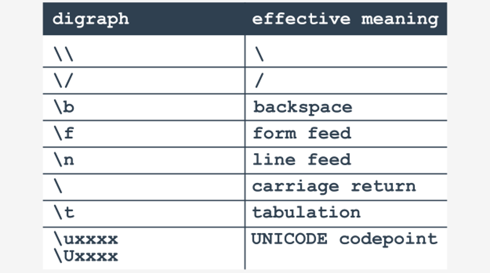
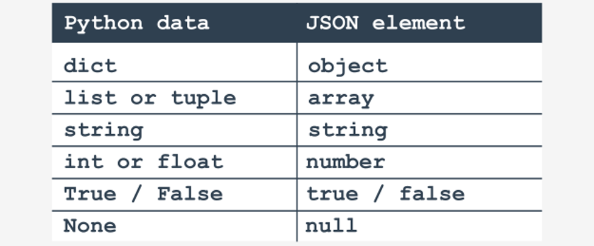

# JSON – our new friend

### Hi, I'm JSON
Do you sometimes feel that coping with IT issues is a continuous struggle with acronyms? Well, you’re not alone. We share this opinion. An old anecdote says that computer technology development is in fact based on TLA. What is TLA? It's simple – it's a Three-Letter Acronym. Close your eyes, strain your mind and try to recall five acronyms commonly used in the IT world.

We bet four of them will be TLA.

And – look! – TLA is a TLA too. What a coincidence!

Now it’s time to break this pattern. The acronym we'll present to you now is four letters long. What a nice change!

<p align="center">
  
</p>

Let us explain its meaning:
- Java...
- ...Script
- Object
- Notation

As you can see, there’s a little riddle inside the name. It may be a bit disturbing, too, and some sudden questions may have appeared in your mind just now, e.g., “Java? Do you want me to learn Java? Or even JavaScript?”

No, we don't. Fortunately, the notation we want to tell you about, although created with JavaScript environments in mind, works perfectly without JavaScript. In fact, it can be used by virtually all modern programming environments thanks to the standardized libraries of functions and unified services. It doesn't matter what programming language has been used to implement a certain solution – JSON is a kind of universal bridge able to move data between seemingly incompatible parties.

JSON is the answer to quite a basic need – the need to transfer data that is the content of an object or set of objects. The mechanism which solves it should be portable and platform independent.

How can we meet such a requirement?

The problem we need to struggle with is **how to represent an object** (understood as a set of data of different types, including other objects) or even a single value in a way that can survive network transfers and inter-platform conversions.

JSON solves the problem using two simple tricks:
- it uses **UTF-8 coded text** – this means that no machine/platform-dependent formats are used; it also means that the data JSON carries is readable (poorly, but always readable) and comprehensible by humans;
- it uses a simple and not very expanded **format** (we can call it syntax, or even grammar) to represent mutual dependencies and relations between different parts of objects, and is able to transfer not only the values of objects’ properties, but also their names.

In JSON, it can be an unnamed value like a number, a string, a Boolean or… nothing , although this is not what we like most about JSON. JSON is able to carry far more complex data, collected and aggregated in larger compounds.

If you want to transfer not only raw data but also all the names bound to it (like the way in which objects hold their properties), JSON offers a syntax which looks like a close relative of Python's dictionary, which is, in fact, a set of `key:value` pairs. Making such an assumption leads us to the following question – can we use Python's syntax to code and decode network messages in `REST`?

Yes, we can, but it won't be JSON. If you want your data to be widely understood (not only by Python counterparts), you should use JSON.

Let’s start with a very simple example. We want to build a message encapsulating an object containing just one property named prop along with its real (floating-point) value of `2.78`.

This is how JSON comes to this:
```json
{ "prop": 2.78 }
```
Simple? Absolutely!

Now we’re ready to go deeper. Let us show you how JSON represents values of common types.

Note: our presentation is rather comprehensive. If you need more details, refer to the original JSON documentation available here: http://www.ecma-international.org/publications/files/ECMA-ST/ECMA-404.pdf.

If you want to encode an integer value (e.g., 123) you will specify this in the following way:
```json
123
```
Looks familiar, doesn't it? Don’t get carried away just yet. JSON's integer literals use **some different tricks** to those of Python. In general, you may expect no surprises when you use regular decimal integers, but keep in mind that **JSON knows nothing about numbers written using radices different to 10**, so literals like these:
- `0x10`
- `0o10`
- `0b10`

won't be recognized in the JSON environment. Feel free to use a minus sign to put negative numbers inside the JSON text. **Don't use a plus sign** to show that a number is positive. Moreover, **don't use leading zeros**. That's an order.

**Real numbers** in JSON are the same as in Python, including utilization of scientific notation.

Here’s an example:
```json
3.141592653589
3.0857E16
−1.6021766208E−19
```
JSON **strings** may look familiar, but there is one important difference – **you must not use apostrophes** to delimit the text. The only delimiter allowed is a quote, like here:
```json
"Python"
```
This means that you can’t just insert a quote inside the string – you have to use our old friend backslash (`\ `) followed by a quote instead.

Nothing exciting – but we’re used to that:
```json
"\"Monty Python's\""
```
Just like in Python, there are some more digraphs and moregraphs (we’re joking, don’t let us confuse you) starting with \ in JSON. We’ve collected all of them here:

<p align="center">
  
</p>

Note that in Python you don’t have to precede `/` with `\ `.

The `\u` (or `\U`) digraph starts a hexadecimal UNICODE code point and must contain exactly **four hexadecimal digits** (it doesn't matter if the letters are upper- or lower-case).

Don't forget that JSON strings **cannot be split over multiple lines** – each string must fit entirely on one line (of course, there may be more than one string on the same line).

**Boolean values** are represented (like in Python) by two specific identifiers (the literal name tokens): **true** and **false**:
```json
true
false
```
Note: you have to **preserve the case of the literals**, as this is the only acceptable form.

There is one more literal name token in JSON, whose meaning is similar to the one known in Python as `None` – it may be used to represent no value, or a value without any meaning.

It is called `null` in JSON:
```json
null
```

In JSON, all the above values may be combined (or packed) in two ways:
- inside **arrays** (which are a very close relative to Python lists);
- inside **objects** (which resemble Python dictionaries more than objects)

It should be noted that both ways can recursively incorporate any of the two, e.g., a list may contain an object which contains an object which contains a list and so on.

Any JSON object property may contain (or carry) an array. The syntax JSON uses to encode arrays is very similar to the one used by Python to describe lists. For example, it uses square brackets (or just brackets) to delimit array content and uses commas to separate an array's elements – just like here:
```json
[1, 2, 3]
```
An **empty array** is denoted simply as a pair of brackets – just like in Python:
```json
[ ]
```
Contrary to an array, a JSON object is a set of property specifications surrounded by a pair of braces (curly brackets) – just like here – we’ve marked them in red:
```json
{ "prop": 2.78 }
```
The property specification is a `name:value` pair with a colon as a separator where the name must be **enclosed in quotes**.

It's worth mentioning that braces are commonly used in all C-derived programming languages and play a role similar to the one known from Python nesting – they mark the boundaries of data definitions or blocks of code. No wonder, then, that they appear in JSON, as JavaScript derives from the C-language too. The similarity to Python dictionary syntax is unintentional.

In this approach, a JSON object is a **set of property specifications separated by commas**.

One important (and very surprising) thing should be stated here. There are **no restrictions on property names**. No, not at all. These names don't identify variables, so they don’t have to be unique. They don't have to start with a letter. They can even contain a colon, which may seem a little weird at first glance.

This doesn't mean that you have to use weird property names. We suggest you don’t do that at all. It only means that the property name's semantic isn't a part of the JSON standard. In other words, JSON is semantically blind when it comes to property names. It's none of its business how you name your properties.

If you want to express the fact that a particular **object is empty**, you need to leave the braces and ensure that there is no content between them – just like here:
```json
{ }
```
When there is more than one property in an object, you can specify all of them in **any order** using commas to separate the items from each other. As JSON ignores white spaces (including tabs) which aren't a part of strings, you can format (or unformat) the text in any way.

For example, both these JSON objects are the same:
```json
{ 
x: 123,
y: -1
}
```
```json
{x:123, y:-1}
```
The first is easier to read (for humans), while the second is cheaper to transmit (it occupies fewer bytes).

Of course, you may incorporate **different types** of data inside one object:
```json
	{ me: "Python",
	pi: 3.141592653589,
	parsec: 3.0857E16, 
	electron: −1.6021766208E−19
	friend: "JSON",
	off: true,
	on: false,
	set: null }
```
Any of the previously described elements can be put **inside an array**, and this rule may be applied recursively, which means that an array can contain another array which may contain another complete object, and so on.

The example shows a very specific and not very practical, but completely correct, compound:
```json
{ob:{ar:["a", 1, 3.14, false]}}
```
The JSON object contains another object named `ob`, which consists of one property, which is an array.

Okay. We met a new friend which came to us from a distant country. How do we speak to him (*) in Python in order to be understood? Is it even possible?

(*) yes! him because it's a SON!

## Working with the JSON module in Python
How do we start a new adventure? It's obvious, and we're sure that you knew it before we asked:
```python
import json
```
The first JSON module's power is the ability to automatically **convert Python data** (not all of it and not always) into a JSON string. If you want to carry out such an operation, you may use a function named `dumps()`.

Note: the `’s` at the end of the function's name means string. There is a very similar function with the name deprived of this suffix which **writes the JSON string to the file** for file-like streams.

The function does what it promises – it takes data (even somewhat complicated data) and produces a string filled with a JSON message. Of course, `dumps()` isn't a prophet and it's not able to read your mind, so don't expect miracles.

Let’s start with some simple snippets.

The first of our samples takes a number and outputs a number – we don't expect anything more:
```python
import json

electron = 1.602176620898E10−19
print(json.dumps(electron))
```
The code outputs:
```
16021766189.98
```
Note: the notation is different but the value remains the same. Check it yourself.

Let's do the same but with a **string**, like this:
```python
import json

comics = '"The Meaning of Life" by Monty Python\'s Flying Circus'
print(json.dumps(comics))
```
The code outputs:
```
"\"The Meaning of Life\" by Monty Python's Flying Circus"
```
As you can see, all JSON requirements have been met.

Now’s a good moment to introduce a **list**. What do you think about this example?
```python
import json

my_list = [1, 2.34, True, "False", None, ['a', 0]]
print(json.dumps(my_list))
```
As you can see, there are actually two lists. Is that a problem? Not at all!

The code prints:
```
[1, 2.34, True, "False", null, ["a", 0]]
```
We want to ask you a question here – what will happen if we use a tuple instead of a list? The answer is predictable – nothing. As JSON cannot distinguish between lists and tuples, both of these are converted into JSON arrays.

Let’s check a **dictionary**. Here’s a simple test:
```python
import json

my_dict = {'me': "Python", 'pi': 3.141592653589, 'data': (1, 2, 4, 8), 'set': None}
print(json.dumps(my_dict))
```
And this is the output of the code:
```
{"me": "Python", "pi": 3.141592653589, "data": [1, 2, 4, 8], "friend": "JSON", "set": null}
```
Now we’re ready to draw some conclusions.

As you can see, Python uses a small set of simple rules to build JSON messages from its native data. Here it is:

<p align="center">
  
</p>

It looks simple and consistent. So where’s the trap?

The trap is here:
```python
import json


class Who:
    def __init__(self, name, age):
        self.name = name
        self.age = age


some_man = Who('John Doe', 42)
print(json.dumps(some_man))
```
The output you'll see is extremely disappointing:
```
TypeError: Object of type 'Class' is not JSON serializable
```
Yes, that's the clue. You cannot just dump the content of an object, even an object as simple as this one.

Of course, if you don't need anything more than a set of object properties and their values, you can perform a (somewhat dirty) trick and dump not the object itself, but its `__dict__` property content. It will work, but we expect more.

What should we do?

There are at least two options we can make use of. The first of them is based on the fact that we can **substitute** the function `dumps()` uses to obtain a textual representation of its argument. There are two steps to take:
- **write your own function** knowing how to handle your objects;
- **make `dumps()` aware of it** by setting the keyword argument named default;

### The first approach
Now look at the code in the editor window. The example shows a simple implementation of the idea.
```python
import json


class Who:
    def __init__(self, name, age):
        self.name = name
        self.age = age


def encode_who(w):
    if isinstance(w, Who):
        return w.__dict__
    else:
        raise TypeError(w.__class__.__name__ + ' is not JSON serializable')


some_man = Who('John Doe', 42)
print(json.dumps(some_man, default=encode_who))
```
The code prints:
```
{"name": "John Doe", "age": 42}
```
Note: we decided to use the dictionary as a target for the JSON message. Thanks to that we’ll save the property names along with their values. It’ll make JSON easier to read and more understandable for humans.

Note: raising a `TypeError` exception is obligatory – this is the only way to inform `dumps()` that your function isn't able to convert objects other than those derived from the class `Who`.

Note: the process in which an object (stored internally by Python) is **converted into textual or any other portable aspect** is often called **serialization**. Similarly, the reverse action (from portable into internal) is called **deserialization**.

As you can see, we’ve converted (serialize) our object into a dictionary – `dumps()` will turn it into a JSON object.

### The second approach 
The second approach is based on the fact that the serialization is actually done by the method named `default()`, which is a part of the `json.JSONEncoder` class. It gives you the opportunity to overload the method defining a `JSONEncoder`'s subclass and to pass it into `dumps()` using the keyword argument named `cls` – just like in the code we've provided in the editor.
```python
import json


class Who:
    def __init__(self, name, age):
        self.name = name
        self.age = age


class MyEncoder(json.JSONEncoder):
    def default(self, w):
        if isinstance(w, Who):
            return w.__dict__
        else:
            return super().default(self, z)


some_man = Who('John Doe', 42)
print(json.dumps(some_man, cls=MyEncoder))
```
As you can see, we are released from the obligation to raise any exceptions. Nice, isn't it?

The code produces the same output as the previous one:
```
{"name": "John Doe", "age": 42}
```
It seems that we know enough about how to travel from Python land to JSON world, but still know anything about how to return. Let's take care of it.

The function which is able to **get a JSON string and to turn it into Python data** is named `loads()` – it takes a string (hence the s at the end of its name) and tries to create a Python entity corresponding to the received data.

This is how it goes:
```python
import json

jstr = '16021766189.98'
electron = json.loads(jstr)
print(type(electron))
print(electron)
```
The code prints:
```
<class 'float'>
16021766189.98
```
The `loads()` function is able to cope with **strings**, too. Take a look at the snippet:
```python
import json

jstr = '"\\"The Meaning of Life\\" by Monty Python\'s Flying Circus"'
comics = json.loads(jstr)
print(type(comics))
print(comics)
```
Can you see the double backslashes inside the `jstr`? Are they really needed?

Yes, they are, as we have to deliver an exact JSON string into the `loads()`. This means that the backslash must precede all quotes existing within the string. Removing any of them will make the string invalid and `loads()` will not like it for sure.

The code outputs:
```
<class 'str'>
"The Meaning of Life" by Monty Python's Flying Circus
```

And what about **lists**? Is `loads()` smart enough to interpret them correctly?

Yes, it is – take a look:
```python
import json

jstr = '[1, 2.34, true, "False", null, ["a", 0]]'
my_list = json.loads(jstr)
print(type(mylist))
print(mylist)
```
The code prints:
```
<class 'list'>
[1, 2.34, True, 'False', None, ['a', 0]]
```
We expect that the JSON **object** will be processed correctly.

Yes, it will:
```python
import json

json_str = '{"me":"Python","pi":3.141592653589, "data":[1,2,4,8],"friend":"JSON","set": null}'
my_dict = json.loads(json_str)
print(type(my_dict))
print(my_dict)
```
The code prints:
```
<class 'dict'>
{'me': 'Python', 'pi': 3.141592653589, 'data': [1, 2, 4, 8], 'friend': 'JSON', 'set': None}
```
Our tests show that the table we presented before works successfully in both directions. There’s only one specific difference: if a number encoded inside a JSON string **doesn't have any fraction part**, Python will create an **integer** number, or a **float number otherwise**.

But what about Python's objects – can we deserialize them in the same way as we performed the serialization?

As you probably expect, deserializing an object may require some additional steps. Yes, indeed. As `loads()` isn't able to guess what object (of which class) you actually need to deserialize, you have to provide this information.

Take a look at the snippet we've provided in the editor window.
```python
import json


class Who:
    def __init__(self, name, age):
        self.name = name
        self.age = age


def encode_who(w):
    if isinstance(w, Who):
        return w.__dict__
    else:
        raise TypeError(w.__class__.__name__ + 'is not JSON serializable')


def decode_who(w):
    return Who(w['name'], w['age'])


old_man = Who("Jane Doe", 23)
json_str = json.dumps(old_man, default=encode_who)
new_man = json.loads(json_str, object_hook=decode_who)
print(type(new_man))
print(new_man.__dict__)
```
As you can see, there’s a keyword argument name `object_hook`, which is used to point to the function responsible for creating a brand new object of a needed class and for filling it with actual data.

Note: the `decode_who()` function receives a Python entity, or more specifically – a **dictionary**. As `Who`'s constructor expects two _ordinary values_, a string and a number, not a dictionary, we have to use a little trick – we've employed the double `*` operator to turn the directory into a **list of keyword arguments** built out of the dictionary's `key:value` pairs. Of course, the keys in the dictionary must have the same names as the constructor's parameters.

Note: the function, specified by the `object_hook` will be invoked only when the JSON string describes a JSON object. Sorry, there are no exceptions to this rule.

As previously, a purer object approach is also possible, and is based on redefining the `JSONDecoder` class. Unfortunately, this variant is more **complicated** than its encoding counterpart.

We don't need to rewrite any method, but we do have to **redefine the superclass constructor**, which makes our job a little more painstaking. The new constructor is intended to do just one trick – set a function for object creation.
```python
import json


class Who:
    def __init__(self, name, age):
        self.name = name
        self.age = age


class MyEncoder(json.JSONEncoder):
    def default(self, w):
        if isinstance(w, Who):
            return w.__dict__
        else:
            return super().default(self, z)


class MyDecoder(json.JSONDecoder):
    def __init__(self):
        json.JSONDecoder.__init__(self, object_hook=self.decode_who)

    def decode_who(self, d):
        return Who(**d)


some_man = Who('Jane Doe', 23)
json_str = json.dumps(some_man, cls=MyEncoder)
new_man = json.loads(json_str, cls=MyDecoder)

print(type(new_man))
print(new_man.__dict__)
```
As you can see, this is exactly the same thing we did before, but expressed at a different level.

We're glad to inform you that we’ve now gathered enough knowledge to move on to the next level. We’re going to return to some network issues, but we also want to show you some handy new tools.
