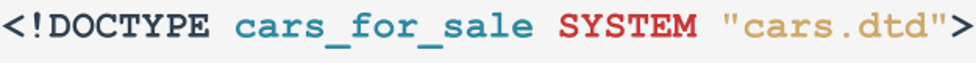
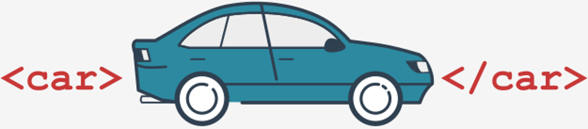

# What is XML and why do we prefer to use JSON?

## Working with XML files
Can you see it? We've brought another TLA to you – here it is:

<p align="center">
  
</p>

**XML** is a **language**. Anyway, this is what it thinks about itself. Note – it isn't a programming language, and although it is possible to build a real programming language on top of XML, it wasn't (and still isn't) its native niche. XML is – like JSON – a **universal and transparent carrier** of any type of data. You can use it to store and transfer documents of virtually any type. For example, the document format produced by MS Office applications (the newer one with file extensions ending with _x_ like _docx_) utilizes XML to create such different data as spreadsheets, presentations, or texts.

As you probably suspect, XML is much older than JSON. Moreover, it's heavier and less flexible. We can even say that XML seems to be bloated compared to JSON.

We’re not going to teach you how to use XML in Python. We only want to show you how it’s built and what the most important differences between XML and JSON are. It can be intriguing how different they are, although both the solutions were invented for nearly the same purpose.

Take a look – it's a simple sample XML document:
```xml
<?xml version = "1.0" encoding = "utf-8"?>
<!-- cars.xml - List of cars ready to sell -->
<!DOCTYPE cars_for_sale SYSTEM "cars.dtd">
<cars_for_sale>
   <car>
      <id>1</id>
      <brand>Ford</brand>
      <model>Mustang</model>
      <production_year>1972</production_year>
      <price currency="USD">35900</price>
   </car>
   <car>
      <id>2</id>
      <brand>Aston Martin</brand>
      <model>Rapide</model>
      <production_year>2010</production_year>
      <price currency="GBP">32000</price>
   </car>
</cars_for_sale>
```
The document contains a part of an offer published by a very exclusive second-hand car store. It's not a regular store – it's a store with the most legendary cars of all time. Don't expect to be able to buy “just a car” here. They sell special cars for special owner at special prices adjusted to the prestige these cars bring. Moreover, the store has some branches around the world, so your car prices may be expressed in many different currencies.

How does XML cope with such a problem?

Let us lead you through the document and show you some essential aspects.

Let's start with the first line – it plays a very important role:
```xml
<?xml version = "1.0" encoding = "utf-8"?>
<!-- cars.xml - List of cars ready to sell -->
<!DOCTYPE cars_for_sale SYSTEM "cars.dtd">
<cars_for_sale>
   <car>
      <id>1</id>
      <brand>Ford</brand>
      <model>Mustang</model>
      <production_year>1972</production_year>
      <price currency="USD">35900</price>
   </car>
   <car>
      <id>2</id>
      <brand>Aston Martin</brand>
      <model>Rapide</model>
      <production_year>2010</production_year>
      <price currency="GBP">32000</price>
   </car>
</cars_for_sale>
```
First of all, it **declares that the document contains XML text**. Note the very original “parentheses” in which the line is enclosed: <? and ?> .

As you can see, XML uses **plain text**, and that's what makes it similar to JSON, but we should note that the similarities end at this point.

Note the two phrases built according to the following pattern:
```
attribute = value
```
The first (header) line contains two attribute names: `version` and `encoding`. We don’t think you’ll have any problem identifying their meaning: the first informs you which **version of the XML** has been used to encode the document (in fact, there are two versions currently in use: 1.0 and 1.1) while the second says how the document's **text is encoded** (as you may expect, UTF-8 is a natural choice here).

Thanks to this line, a program responsible for parsing a file’s content is calm about the future. It knows what to expect next.

The second line isn't very important – do you know why?
```xml
<?xml version = "1.0" encoding = "utf-8"?>
<!-- cars.xml - List of cars ready to sell -->
<!DOCTYPE cars_for_sale SYSTEM "cars.dtd">
<cars_for_sale>
   <car>
      <id>1</id>
      <brand>Ford</brand>
      <model>Mustang</model>
      <production_year>1972</production_year>
      <price currency="USD">35900</price>
   </car>
   <car>
      <id>2</id>
      <brand>Aston Martin</brand>
      <model>Rapide</model>
      <production_year>2010</production_year>
      <price currency="GBP">32000</price>
   </car>
</cars_for_sale>
```
It's a **comment**. It means nothing. The XML parser will ignore it completely.

How do we recognize a comment inside the XML document? It's easy: a comment starts with:
```
<!--
```
and ends with:
```
-->
```
Simple, isn't it?

Of course, a comment, like any other XML element, can be spread over more than one line. XML is flexible with that.

The third line is very curious, as it isn't actually XML:
```xml
<?xml version = "1.0" encoding = "utf-8"?>
<!-- cars.xml - List of cars ready to sell -->
<!DOCTYPE cars_for_sale SYSTEM "cars.dtd">
<cars_for_sale>
   <car>
      <id>1</id>
      <brand>Ford</brand>
      <model>Mustang</model>
      <production_year>1972</production_year>
      <price currency="USD">35900</price>
   </car>
   <car>
      <id>2</id>
      <brand>Aston Martin</brand>
      <model>Rapide</model>
      <production_year>2010</production_year>
      <price currency="GBP">32000</price>
   </car>
</cars_for_sale>
```
In general, XML documents may be built in two ways:
- **the document content isn't defined at all** – we may say that this kind of document is **self-defining**; it's easy but it lacks one very important feature – the parser is not able to check if the document contains all the needed data and whether the data it contains is valid;
- the document is equipped with an additional document (or rather a meta-document) which **describes the desired document content**, which remedies the problem caused by the first method; having such a helper, the parser is able to fully check the document's correctness.

The meta-document is a _document type definition_ (hence the `dtd` suffix visible in the third line.

If you want to aggregate your document with its external definition, you should put the `DOCTYPE` line inside your XML document. The definition may be located anywhere: it can be placed beforehand at the target parsing server, or it may be put in any Internet location (in this case the DOCTYPE line contains the full URL/URI of the DTD).

To make a long story short, the DOCTYPE line contains:
- the **name** of the XML document being defined (`cars_for_sale`);
  <p align="center"></p>
- one of two (in XML 1.0) possible keywords: `SYSTEM` or `PUBLIC`; `PUBLIC` means that the DTD is available publicly and its description is determined by two factors: the **FPI** (Formal Public Identifier – a string which uniquely names the DTD on the scale of the universe) and its location (a URI); `SYSTEM` means that the DTD is used privately (to a limited extent, e.g., by one specific organization) and the only information needed about it is its URI (which may be just a file name recognizable by the target server);
  <p align="center"></p>
- the **URI** of the DTD.
  <p align="center"></p>
Note: DTDs use a specialized language named SGML in order to fully describe XML document content. We won't deal with it here. It's a separate and very complicated story – sorry.
<p align="center"></p>

It's a bit ironic that we had to move through three complete lines to finally reach something that is **actually XML**:
```xml
<?xml version = "1.0" encoding = "utf-8"?>
<!-- cars.xml - List of cars ready to sell -->
<!DOCTYPE cars_for_sale SYSTEM "cars.dtd">
<cars_for_sale>
   <car>
      <id>1</id>
      <brand>Ford</brand>
      <model>Mustang</model>
      <production_year>1972</production_year>
      <price currency="USD">35900</price>
   </car>
   <car>
      <id>2</id>
      <brand>Aston Martin</brand>
      <model>Rapide</model>
      <production_year>2010</production_year>
      <price currency="GBP">32000</price>
   </car>
</cars_for_sale>
```
The XML document consists of **elements**. Each element is marked by a **pair of tags**: an **opening** tag and a **closing** tag. Both tags look nearly identical, but the closing tag's name starts with `/`. Tags can be easily identified as they are enclosed inside `<` and `>`.

This means that the element named `CuriousTag` starts where the following tag is placed:
```
<CuriousTag>
```
and ends in the same location where the closing tag exists:
```
</CuriousTag>
```
All the text within these tags is the element's content (or simply element’s text).

Note: there are also **empty elements**, which can be specified in a more comprehensive way. For example, if you need to specify an element like this:
```xml
<empty></empty>
```
(note: there is no content between the tags!) you may want to use the shorter form:
```xml
<empty/>
```
Be aware that an empty element may not be the same as an absent element – the omission of a particular element may be treated as an error by the parser.

<p align="center"></p>

Look at the example – the document contains one **top-level element** (not contained by any other element) named `cars_for_sale`. This is the **root element**, which must occur **exactly once** inside the XML document.

Let's dive into it.

Try to answer the following question: how many cars can you buy here?
```xml
<?xml version = "1.0" encoding = "utf-8"?>
<!-- cars.xml - List of cars ready to sell -->
<!DOCTYPE cars_for_sale SYSTEM "cars.dtd">
<cars_for_sale>
   <car>
      <id>1</id>
      <brand>Ford</brand>
      <model>Mustang</model>
      <production_year>1972</production_year>
      <price currency="USD">35900</price>
   </car>
   <car>
      <id>2</id>
      <brand>Aston Martin</brand>
      <model>Rapide</model>
      <production_year>2010</production_year>
      <price currency="GBP">32000</price>
   </car>
</cars_for_sale>
```
Yes, two. The answer is obvious as **there are two elements named** `car` inside the root element. Each of them starts with the tag `<car>` and ends with the tag `</car>`.

Simple? Yes, indisputably.

Let's get into the car and look around.

<p align="center"></p>

What can we learn about each of the cars?
```xml
<?xml version = "1.0" encoding = "utf-8"?>
<!-- cars.xml - List of cars ready to sell -->
<!DOCTYPE cars_for_sale SYSTEM "cars.dtd">
<cars_for_sale>
   <car>
      <id>1</id>
      <brand>Ford</brand>
      <model>Mustang</model>
      <production_year>1972</production_year>
      <price currency="USD">35900</price>
   </car>
   <car>
      <id>2</id>
      <brand>Aston Martin</brand>
      <model>Rapide</model>
      <production_year>2010</production_year>
      <price currency="GBP">32000</price>
   </car>
</cars_for_sale>
```
As you can see, the car is described by:
- an `id`, which is (most likely) an integer number; note: XML defines neither primitive types nor literals (while JSON does); anything you want to put inside an XML document has to be defined and interpreted by you; if you use a DTD, you can define some additional syntax for your data, and the XML parser will be ready to honor it, but these steps are taken outside XML land; this is one of the most important distinctions between XML and JSON;
- the `brand`, which is just text – longer or shorter, but still text;
- the `model`, as above;
- the `production_year`, which is an integer number from a quite predictable range;
- the `price`, which is (in general) a floating-point number from a completely unpredictable range.

Note: there is something very intriguing inside the opening `<price>` tag – can you see it?

Note, there is something new inside the tag:
```xml
<?xml version = "1.0" encoding = "utf-8"?>
<!-- cars.xml - List of cars ready to sell -->
<!DOCTYPE cars_for_sale SYSTEM "cars.dtd">
<cars_for_sale>
   <car>
      <id>1</id>
      <brand>Ford</brand>
      <model>Mustang</model>
      <production_year>1972</production_year>
      <price currency="USD">35900</price>
   </car>
   <car>
      <id>2</id>
      <brand>Aston Martin</brand>
      <model>Rapide</model>
      <production_year>2010</production_year>
      <price currency="GBP">32000</price>
   </car>
</cars_for_sale>
```
This is the **attribute**.

What is this needed for?

Some values are absolute or almost absolute. For example, a year number is a good example of such an absolute value. We can say that most customers from all over the world when told that the car was built in 1972 will know exactly how old the vehicle is.

But if we tell them that it cost 35,900, they'll immediately ask “in which currency?”.

This is why we need attributes. Of course, we can make some specialized tags named, e.g., `<price_in_usd>` or `<price_in_gpb>` but it will be neither easy to parse nor elegant. Attributes work much better here.

As you can see, the `<price>` tag uses one attribute named **currency**. Its value can be taken from an international standard named ISO4217, which can make the record absolutely unequivocal.

We should also add that XML allows us to put **as many attributes inside a tag as we need**.

We hope that XML is clear now, but there is one question that has to be put here: **how do we process XML documents in Python**?

The question (fortunately or not) has more than one answer. Moreover, it involves some further questions, and one of them seems to be particularly interesting – what is the best model of XML document structure?

The question may surprise you: it's a **tree**. Of course, not the one with wide branches and green leaves, but the one which is called a **graph** by mathematicians and computer scientists.

Take a look:
```
cars_for_sale
|
|____ car
|     |_ id:1
|	 |_ brand: Ford
|	 |_ model: Mustang
|	 |_ production_year: 1972
|	 |_ price(USD): 35900
|
|____ car
	|_ id:2
	   |_ brand: Aston Martin
	   |_ model: Rapide
	   |_ production_year: 2010
	   |_ price(GPB): 32500
```
Does it remind you of something? A directory tree on your computer's disk, for example?

Okay. It definitely looks nice, but what can we learn from it?

There are many possible Python tools allowing you to create, write, read, parse, and modify XML files. Most of them treat an XML document as a tree consisting of objects, while the objects represent elements.

One of these tools is a package named `xml.etree` and we’re going to show you two simple snippets that make use of it.

Look at the first snippet in the editor.
```python
import xml.etree.ElementTree

cars_for_sale = xml.etree.ElementTree.parse('cars.xml').getroot()
print(cars_for_sale.tag)
for car in cars_for_sale.findall('car'):
    print('\t', car.tag)
    for prop in car:
        print('\t\t', prop.tag, end='')
        if prop.tag == 'price':
            print(prop.attrib, end='')
    print(' =', prop.text)
```
<p align="center"></p>

Let’s comment on the code:
- line 1: `import` – nothing special;
- line 3: the `parse()` function reads the XML document, builds the tree, and returns it; we use the tree object to invoke its fundamental method named `getroot()` which returns what it promises – the root element of the tree;
- line 4: each tree element (i.e., each object containing the element) has a property named `tag` which stores the textual representation of the element's name – we use it to print the root element's name;
- line 5: now we start to traverse the tree using the `findall()` method of the root object; the method's arguments name the elements we are interested in;
- line 6: we print the `tag`'s (element's) name – yes, we know that it's `car` (we wanted to find it so it isn't surprising)
- line 7: we initiate the iterations which should reveal all `car`'s components
- line 8: we print the found `tag`'s name...
- line 9: ...and if it is `price`...
- line 10: ...we make use of the `attrib` property which is, in fact, a Python dictionary grouping all of `tag`'s attributes (as attributes occur in pairs, a dictionary is the best tool to store them)
- line 11: we print `tag`'s content – it is available as a value returned from the `text` property.

The code produces the following output:
```
cars_for_sale
	 car
		 id = 1
		 brand = Ford
		 model = Mustang
		 production_year = 1972
		 price{'currency': 'USD'} = 35900
	 car
		 id = 2
		 brand = Aston Martin
		 model = Rapide
		 production_year = 2010
		 price{'currency': 'GBP'} = 32000
```

[Download cars.xml (zipped)](https://drive.google.com/file/d/1IckitVilZikNFCaVbGM6eVE1t-K8XRJ3/view?usp=sharing).

The `xml.etree.ElementTree` module may be also used to create, modify and write XML files.

We’ll use it to remove one car from our offer (theFord Mustang) and add a new car to it – look at the editor and see how we did it.
```python
import xml.etree.ElementTree

tree = xml.etree.ElementTree.parse('cars.xml')
cars_for_sale = tree.getroot()
for car in cars_for_sale.findall('car'):
    if car.find('brand').text == 'Ford' and car.find('model').text == 'Mustang':
        cars_for_sale.remove(car)
        break
new_car = xml.etree.ElementTree.Element('car')
xml.etree.ElementTree.SubElement(new_car, 'id').text = '4'
xml.etree.ElementTree.SubElement(new_car, 'brand').text = 'Maserati'
xml.etree.ElementTree.SubElement(new_car, 'model').text = 'Mexico'
xml.etree.ElementTree.SubElement(new_car, 'production_year').text = '1970'
xml.etree.ElementTree.SubElement(new_car, 'price', {'currency': 'EUR'}).text = '61800'
cars_for_sale.append(new_car)
tree.write('newcars.xml', method='')
```
Some explanations will make the sample code clearer – here they go:
- line 1: no comment needed;
- line 3: parse the file and fetch an object storing all elements – we’ll name it `tree`;
- line 4: find the root of the tree and store it in `cars_for_sale` (in fact, this is the same step as done previously, but divided into two parts)
- line 5: let's traverse the tree...
- line 6: ...in order to search the `car` whose brand name is Ford and its model name is `Mustang`;
- line 7: yes! We've found it! Now we invoke the `remove()` method from within the `car` object and the whole element disappears from the tree;
- line 8: we can leave the loop immediately;
- line 9: we create a brand new and completely empty `car` element – it’s stored inside the `new_car` variable (note: the `Element()` method requires one argument: a string containing the element's (`tag`'s) name;
- lines 10 through 13: we call the `SubElement()` method as many times as the number of sub-elements (the inner tags) we need; each invocation needs **two arguments**: a **parent element object** (`new_car` here) and a **sub-element name** (as a string); note: the function returns an object for the newly created element; in fact, we need it only once, for a very specific purpose: we use it to set the `text` associated with the tag – this is why we access the `text` property and set it with the desired value;
- line 14 is slightly different – can you see it? The invocation contains **one more argument**: a dictionary; the function will use is to embed an attribute (`price`) inside the sub-element;
- line 15: now we’re ready to append the newly created element into the tree, and we do it;
- line 16: the `write()` method invoked from within the tree object creates a new file and fills it with the modified XML document.

As you can see, working with XML doesn't require you to be a rocket scientist, but – if we’re being honest – JSON is more convenient and – last but most important – most currently implemented services use JSON, not XML. It's highly possible that you may encounter a server which implements communication on exchanging XML documents, but JSON is much more popular.

We think you can judge for yourself now where this section’s title came from.