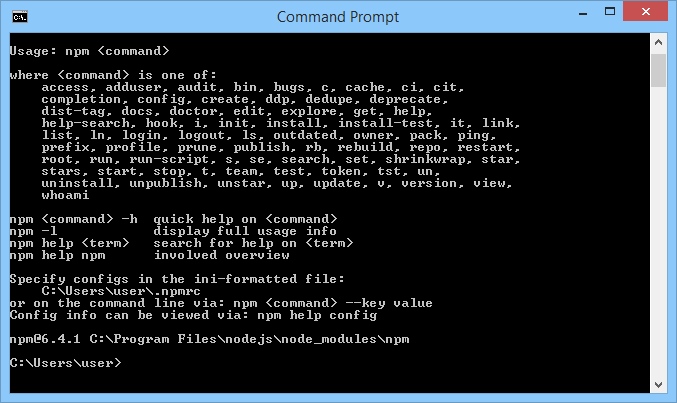
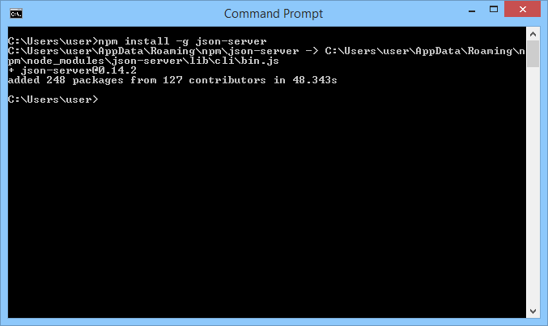
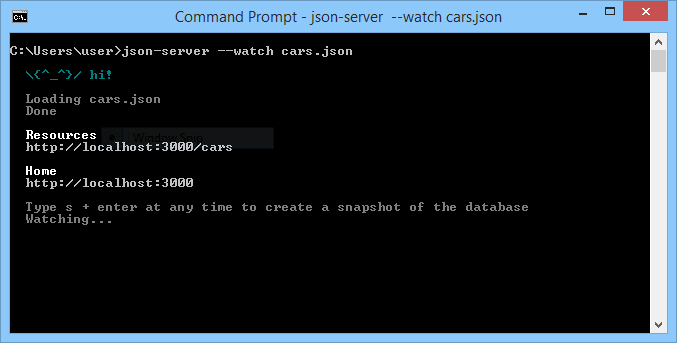
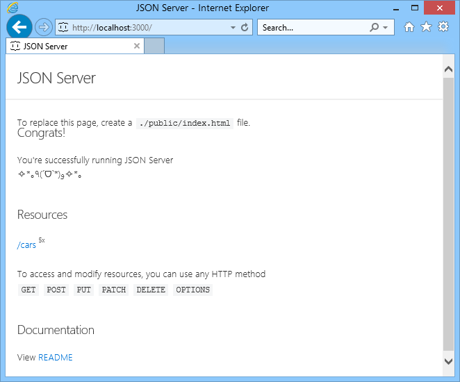

# Making life easier with the requests module

We have reached the point where we can start the final stage of our journey – we know enough to communicate with the web service using JSON as an information carrier. Unfortunately, our knowledge needs to be supplemented – we need a **server serving** a web **service** (sorry for all these serv..., we weren't able to avoid them) and we also need a tool simpler than the `socket` module to talk with the **service** (we beg your pardon).

“Wait,” you may ask here. “Doesn't the socket module already fit our needs?”

It does, but it’s **too good**. It's too choosy and too powerful. It exposes lots of details which aren't necessary available at the higher levels of software design. The socket module is perfect when you want to understand network issues at the TCP level and to learn which challenges the OS faces when it tries to establish, maintain, and close internet connections. This is why we used it before when we wanted you to enter the world of network communications, but at the same time, the socket is too bloated and too heavy when you just want to have a **little chat** with a web service.

Which of these demands (server or tool) should be satisfied earlier? The server, of course. We need our own, private HTTP server which will work only for us and successfully play the role of a RESTFul API foundation.

<p align="center"></p>

We’ve decided to use a free and open package named `json-server`, implemented on top of the `Node.js` environment. `Node.js` is – as Wikipedia claims – _an open-source, cross-platform JavaScript run-time environment that executes JavaScript code outside of a browser_. Don't be afraid – we’re going to encounter JavaScript again, but we aren't going to force you to write any code in it. It’ll act as a **black box** for us, and we don't want to persuade you to look inside it.

Okay. Let's start.

First of all, we need to have Node.js installed on our computer. The steps you should take depend on the OS you use. So...
- ...if you're a Windows user, point your browser to https://nodejs.org/en/download, download and run the Windows installer (a file with a name that looks like node-vxx.yy.z-x86.msi) from the LTS (Long Time Support) branch; accept all the default settings and let the installer do the job; after successful installation you should see an entry named Node.js in the Windows® start menu;
- ...if you're a macOS user, go to the address https://nodejs.org/en/download, download the pkg file and run the installer. Whole process looks the same as on Windows® - just accept all the default settings and let the installer do the job;
- ...if you're a Linux user, you have to go to the address https://nodejs.org/en/download/package-manager and obtain some more specific assistance; unfortunately, some Linuxes offer their own, native Node.js packages matching the specific system needs, and these packages can be installed using the built-in package manager, while others require manual installation; sorry, we can’t help you with this issue.

The next step is to open your OS console and...
- ...if you're a Windows user, run the CMD.EXE program (as an ordinary user) and wait till a black (unless you've changed its color) rectangle appears on the screen;
- if you're a Linux or macOS user, start your favorite terminal emulator (note: administrative rights may be needed and your OS may require it – sudo is your friend).

The next steps will be almost the same in all the above platforms.

`Node.js` utilizes its own native tool for installing and updating components. Its name is the same under all the platforms covered, so when you issue the following command:
```
npm
```
(which is short for node.js package manager) you should see a short help screen similar to the one presented here:

<p align="center"></p>

Now we’re going to ask the `npm` to download and install the `json-server` package, along with all the packages needed to run it, so you should expect some delay – be patient and issue the following command:
```
npm install -g json-server
```
After successful installation, your screen should look like ours:

<p align="center"></p>

We need to perform a brief test to ensure that the server is operating correctly. Do the following actions:
- download the JSON file `cars.json` from here: [Download cars.json (zip archive)](https://drive.google.com/file/d/1yC2JYEpW__h0Ra6R2LOlRZXdTvC6uWIw/view?usp=sharing) and save it in your home directory or any other directory you have the right to write into;
- return to the system console and issue the following command:
```
json-server --watch cars.json
```
Note: the file name you put after `–-watch` should be specified absolutely, i.e., it has to contain the path leading to the downloaded file. Due to the fact that we’ve placed the file in our home directory (`C:\User\user`), the same directory in which we work during the tests (see the command prompt) we don't need to use the complete path. This doesn't mean you don't need it, either!

If everything went correctly, you'll see the following screen:

<p align="center"></p>

This means that the server is working and is ready to serve incoming connections. Don't let it wait. Let's connect to it!

Now open your favorite Internet browser and type the following URL into the address line:
```
http://localhost:3000
```
This means that you order the browser to connect to **the same machine** you're currently working on (`localhost`) and you want the client to go to the **port number 3000** (`json-server`'s default port).

You should see something like this:

<p align="center"></p>

Congratulations! You have your server running and operational!

Press **Crtl-C** in the console if you want to terminate the server, but for now leave it running – we’ll need it and the resources it serves!

Note: if the client doesn't specify the resource it wants to get, `json-server` sends the **welcome screen** you saw previously. If you want the server to behave in another way, follow these steps:
- in the folder where `cars.json` exists, create a subfolder named `public`;
- inside the `public` folder, create a file named `index.html`, fill it with some text, and save.

We created such a file containing one line:
```
CARS DATABASE
```
Then we switched back to the browser and pressed **F5**. This is what we saw:

<p align="center"></p>

Now we’re well enough equipped to start a discussion on the `requests` module – let's dive into it!

The first program makes very basic use of the power of the `requests` module. Take a look:
```python
import requests

reply = requests.get('http://localhost:3000')
print(reply.status_code)
```
The HTTP protocol operates by using **methods**. We can say that the **HTTP method** is a **two-way interaction between the client and the server** (note: the client initiates the transmission) dedicated to the execution of a certain action. `GET` is one of them, and is used to convince the server to transfer some resources asked for by the client.

A `requests` function named `get()` initiates execution of the HTTP `GET` method and receives the server's response. As you can see, the code is extremely **simple and compact** – we don't need to cope with a myriad of mysterious constants, symbols, functions, and notions.

It's like we said “Hey, server, send me your default resource”.

The only details we need to provide are the **server’s address** and the **service port number** – just like we did while using the browser’s address line. Note: the port number can be omitted if it is equal to **80**, HTTP’s default port.

Of course, it is possible that the server resides somewhere far away from our desk, for example, in the other hemisphere. The only thing we’ll change then is the server address – it would be formed as an IP address or fully qualified domain name (FQDN), but it doesn’t matter for get() – its behavior is always the same – it will try to connect the server, form a GET request, and accept the answer.

As you can see, the `get()` function returns a result. It’s an **object** containing all the information describing the `GET` method’s execution.

Of course, the most important thing we need to know is whether the `GET` method has **succeeded**. This is why we make use of the `status_code` property – it contains a standardized number describing the server’s response.

If you run the code and everything works as expected, you will see a very short and simple result:
```
200
```
As the HTTP protocol defines it, code 200 means “okay”.

Good news.

All response codes used by HTTP are gathered here: https://en.wikipedia.org/wiki/List_of_HTTP_status_codes

The requests module offers many different ways of specifying and recognizing **status codes**.

Look at the code:
```python
import requests

print(requests.codes.__dict__)
```
It dumps the contents of a status dictionary. The output is very long and jumbled – we won't put it here, but we encourage you to study it carefully, comparing the values you see with those presented at Wikipedia.

Anyway, you can use the `codes` property to test status codes in a more verbose way than by comparing them to bare integer values. What do you think about such a snippet?
```python
if reply.status_code == requests.codes.ok:
```
It looks far better than just `200`, doesn't it?

When you know that the **server's response is correct**, you would like to know **the response itself**, wouldn’t you?

The server's response consists of two parts: the **header** and the **contents**. Both parts have their representation in the object returned by the `get()` function. Let's start with the header.

The response's header is stored inside the property named `headers` (it's a dictionary). Let's take a look at it:
```python
import requests

reply = requests.get('http://localhost:3000')
print(reply.headers)
```
The program produces the following output:
```
{'X-Powered-By': 'Express', 'Vary': 'Origin, Accept-Encoding', 'Access-Control-Allow-Credentials': 'true', 'Accept-Ranges': 'bytes', 'Cache-Control': 'public, max-age=0', 'Last-Modified': 'Thu, 02 May 2019 12:38:41 GMT', 'ETag': 'W/"e-16a788dd2ec"', 'Content-Type': 'text/html; charset=UTF-8', 'Content-Length': '14', 'Date': 'Thu, 02 May 2019 14:17:27 GMT', 'Connection': 'keep-alive'}
```
As you can see, the response's header consists of a number of fields with associated values (actually, each field occupies one line of the response). Most of them aren't of any interest to us, although some are crucial, e.g., `Content-Type`, which describes what the server response's contents really are.

You can access it directly using a routine dictionary lookup, just like this:
```
reply.headers['Content-Type']
```

The raw response's contents are stored by the `text` property:
```python
import requests

reply = requests.get('http://localhost:3000')
print(reply.text)
```
The property contains bare text taken as-is directly from the data stream, hence it is just a **string**. No conversions are applied.

The code produces the following output:
```
CARS DATABASE
```
Note: when both client and server are aware of the fact that the contents (no matter which part sent them) contain a JSON message, it is also possible to use a method named `json()` which returns exactly what we may expect – a **dictionary or a list of dictionaries**. We’ll show you that in the next section.

In general, the HTTP protocol defines the following methods:
- `GET` is intended to fetch a piece of information (a resource) from the server; of course, a simple server offers more than one resource, so the `GET` method has the means of enabling the client to precisely specify its demands; if the client has no demands and initiates `GET` without resource identification, the server's answer will contain the **root document** – this is exactly what we saw some time ago, when our own server sent us this simple text `CARS DATABASE`.
- in other words – if you want the server to give you something, `GET` is the way to ask for it.
- `POST`, like `GET`, is used to transfer a resource, but in the opposite direction: from the client to the server; just like in `GET`, the identification of the resource has to be given (the server wants to know what to name the piece of information it has received); it is also assumed that the resource the client sends is **new to the server** – it doesn't replace or overwrite any of the previously collected data;
- to make a long story short – if you want to give the server something new, `POST` is ready to be your deliverer.
- `PUT`, similarly to `POST`, transfers a resource from the client to the server, but the **intention is different** – the resource being sent is intended to **replace** the previously stored data;
- simply put – if you want to update something that the server is currently keeping, `PUT` will know the way.
- `DELETE` – this name leaves no doubt: it is used to order the server to remove a resource from a given identification; the resource is unavailable from then on;
- we’re sorry, but there is no simpler way to explain that, we think; we aren't wrong, are we?

<p align="center"></p>

We aren't going to discuss them here, but feel free to deepen your knowledge by yourself.

As you probably suspect, all the listed HTTP methods have their reflections (or rather siblings) within the requests module.

Yes, you're absolutely right:

<p align="center"></p>

The diagram, although extremely simplified and deprived of important details, shows us the most important tools we’ll use soon to play a game with our server. Don't be afraid, we'll acquaint you with all additional means and arguments.

It seems that we missed one important issue: what’ll happen **if anything goes wrong**? The server may fail, transmission media may be down, etc, etc, etc. How do we defend against all these miseries?

All `requests` functions are in the habit of raising an exception when they encounter any kind of communication problem, although some of the problems seem to be more common than others.

<p align="center"></p>

For example, let's take a look at a crucial issue named `timeout`.

It's normal for the server not to respond immediately – making connections, transmitting data, searching resources – all these steps take time. Okay, we know that, but our patience is limited, too. Usually, we know very well how long we agree to wait and don't want to wait any longer. Can our expectations be met?

Of course they can, and one exception will be very helpful – look:
```python
import requests

try:
    reply = requests.get('http://localhost:3000', timeout=1)
except requests.exceptions.Timeout:
    print('Sorry, Mr. Impatient, you didn\'t get your data')
else:
    print('Here is your data, my Master!')
```
As you can see, the `get()` function takes one additional argument named `timeout` – it's the maximum time (measured in seconds and expressed as a real number) we agree to wait for a server's response. If the time is exceeded, `get()` will raise an exception named `requests.exceptions.Timeout`.

If the server is ready and not very busy, one second is more than enough to process such a simple request, so you should expect good news – the program will write:
```
Here is your data, my Master!
```
But if you change the timeout radically to a disturbingly small value like `0.00001`, it's highly probable that you will have to endure the following bad news:
```
Sorry, Mr. Impatient, you didn't get your data.
```
Of course, **problems may appear much earlier**, e.g., while establishing the connection:
```python
import requests

try:
    reply = requests.get('http://localhost:3001', timeout=1)
except requests.exceptions.ConnectionError:
    print('Nobody\'s home, sorry!')
else:
    print('Everything fine!')
```
This code has no chance of running properly – it’s addressing its efforts to port **3001**, while our server is listening at port **3000**. No helping hand will fix this misunderstanding – client and server won't meet and an **exception will be raised**. Its name is:
```
requests.exceptions.ConnectionError
```

To err is human, so it is also possible that you or another developer may leave the resource’s URI in a somewhat malformed state. Look at the code in the editor window.
```python
import requests

try:
    reply = requests.get('http:////////////')
except requests.exceptions.InvalidURL:
    print('Recipient unknown!')
else:
    print('Everything fine!')
```
Disasters of this kind are served by an exception named:
```
requests.exceptions.InvalidURL
```
We’ve gathered all the requests exceptions in one place and presented them as a tree – this is what it looks like:
```
RequestException
|___HTTPError
|___ConnectionError
|   |___ProxyError	
|   |___SSLError	
|___Timeout
|   |___ConnectTimeout
|   |___ReadTimeout
|___URLRequired
|___TooManyRedirects
|___MissingSchema
|___InvalidSchema
|___InvalidURL
|   |___InvalidProxyURL
|___InvalidHeader
|___ChunkedEncodingError
|___ContentDecodingError
|___StreamConsumedError
|___RetryError
|___UnrewindableBodyError
```
Something nice for everyone.

Now that we are well acquainted with the world of `requests`, we can take the next step and enter the world of web services. Are you ready?