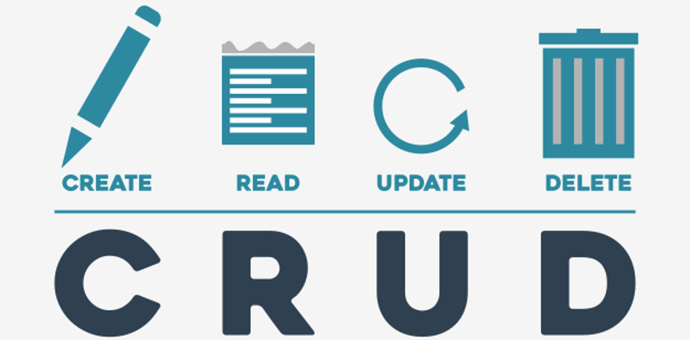

# Four magic letters: CRUD

We’ve reached the point in which we are ready to gather all new facts and tools and glue all these pieces into one functional block. You already know how HTTP works, how it’ is mounted on top of the TCP stack and how the HTTP server is able to do much more for us than just store and publish fancy images and funny videos.

In fact, a properly trained web server can be a very **effective and convenient gateway** to very complicated and heavy databases or other services designed for storing and processing information. Moreover, the structure of the database (or the service) may vary, e.g., it may be a simple relational database residing in a single file, or on the contrary, a huge, distributed cloud of cooperating servers; but the interface provided to the user (you) will always look the same.

We can say that that's what REST was invented for. Thanks to it, very different programs written in very different technologies can utilize shared data through one, **universal interface**.

The interface itself enables the user to perform a basic set of operations – they are elementary, but complex enough to build complex services. A set of four operations hides beneath the following mysterious acronym:

<p align="center"></p>

Note – this is a four-letter acronym which makes it really special. Let's shed some light on it.

### C means Create
If you are able to “create”, you can add new items to data collection, for example, write a new blog post, add a new picture to the gallery, store a new client's data in a customer database, etc.

At REST level, the creation of new items is implemented by the `POST` HTTP method.

### R means Read or, if you prefere, retrieve
Reading/retrieving is the very basic ability to browse data stored in a collection, e.g., reading posts on somebody's blog, viewing pictures in a gallery, studying customers' records in a database, etc.

At REST level, the retrieving of items is implemented by the `GET` HTTP method.

### U means Update
You update data inside a collection when you modify the contents of the selected item without removing it, e.g., you edit your blog post, resize a picture in the gallery, enter the current customer’s sales information, etc.

At REST level, updating existing data is implemented by the `PUT` HTTP method.

### To make our set complete, we need D for Delete.
Deletion occurs when you remove your post from the blog, purge a picture from the gallery or cancel a customer’s account.

At REST level, deleting existing data is implemented by the `DELETE` HTTP method.

***

Now we’re ready to carry out some simple but instructive experiments with JSON. We’ll use it as an intermediate language to communicate with the HTTP server, implementing CRUD and storing a sample collection of data.

These are our assumptions:
- we'll make use of the previously presented `json-server` – we'll try to get it to work hard with all four letters making up CRUD;
- our initial database, processed on our demands by the `json-server`, will be a collection of retro cars written down in the `cars.json` file ([Download cars.json zip file](https://drive.google.com/file/d/1yC2JYEpW__h0Ra6R2LOlRZXdTvC6uWIw/view?usp=sharing)); the `json-server` will read the file in and will handle its contents according to our actions;
- each car is described by:
  - `id` – a unique item number; note – each item in the collection must have the property of this name – this is how the server identifies each item and differentiates the items from each other;
  - `brand` – a string;
  - `model` – a string;
  - `production_year` – an integer number;
  - `convertible` – a Boolean value;
- the initial file contains data for six cars – don't be surprised if the server modifies its contents; if you want to reset the collection to the initial state, stop the server (use **Ctrl-C** for this purpose), replace the file with its original version (you can always download it from our site) and start the server again.

We’re ready to start now. Open the console, locate the directory where your `cars.json` is located and launch the server:
```
json-server --watch cars.json
```
**Note (very important)** – the fact that the `json-server` serves the data initially encoded as JSON has absolutely nothing to do with the fact that we will transmit JSON messages between the client (our code) and the server (`json-server`). The way the server is used to initialize and store data is actually a black-box for us (unless we are implementing the server itself). Different servers may use different means – it's none of our business when we are the clients.

<p align="center"></p>

We'll start our journey with the letter **R (read)**. We’ll try to convince the server to show us all the cars it offers.

Note: `json-server` assumes that the data collection inherits its name from the source data file name. As we named the file `cars`, the server will publish the data as `cars`, too. You have to use the name in the URI unless you want to get the default (root) document, which is completely useless to us.

```python
import requests

try:
    reply = requests.get("http://localhost:3000/cars")
except requests.RequestException:
    print("Communication error")
else:
    if reply.status_code == requests.codes.ok:
        print(reply.text)
    else:
        print("Server error")
```
Look at the code in the editor. It's very basic so far, but will grow soon – we promise:
- line 1: we import the `requests` module;
- line 3: we’re going to connect to the server inside the `try` block – this will allow us to protect ourselves against the possible effects of connection problems;
- line 4: we form the `GET` request and address it to the resource named `cars` located at the server working at the address specified as `localhost`, listening at port number 300;
- line 5: have we succeeded?
- line 6: unfortunately, we have failed; it seems that the server isn't working, or is inaccessible;
- line 8: good news – the server's responded! Let's check the status code;
- line 9: we print the data the server has sent us (rather boring); the response's contents are stored as a text property of the response object;
- line 11: bad news – the server likes neither us nor our request.

If everything goes well, we should see the full contents of the `cars.json` file printed on the screen. Of course, this is not a very special achievement, but now we’re sure that the server is ready to serve us, and we are ready to command it.

The HTTP server is able to transfer virtually any kind of data: text, image, video, sound, and many others. The question we have to face and to answer is: how do **we recognize that we’ve actually got the JSON message**?

Yes, of course, it’s obvious that we received what we expected, but it’s rather impossible to install “naked eye” into each piece of client code. Fortunately, there is a simpler way to resolve this issue. The server response's header contains a field named `Content-Type`. The field's value is analyzed by the `requests` module, and if its value announces JSON, a method named `json()` returns the string containing the received message.
```python
import requests

try:
    reply = requests.get("http://localhost:3000/cars")
except:
    print("Communication error")
else:
    if reply.status_code == requests.codes.ok:
        print(reply.headers['Content-Type'])
        print(reply.json())
    else:
        print("Server error")
```
We've modified the code a bit - look into the editor and analyze the lines:

Line 9: we print the `Content-Type` field's value;

Line 10: we print the text returned by the `json()` method.

This is what we've got:
```
application/json; charset=utf-8
[{'id': 1, 'brand': 'Ford', 'model': 'Mustang', 'production_year': 1972, 'convertible': False}, {'id': 2, 'brand': 'Chevrolet', 'model': 'Camaro', 'production_year': 1988, 'convertible': True}, {'id': 3, 'brand': 'Aston Martin', 'model': 'Rapide', 'production_year': 2010, 'convertible': False}, {'id': 4, 'brand': 'Maserati', 'model': 'Mexico', 'production_year': 1970, 'convertible': False}, {'id': 5, 'brand': 'Nissan', 'model': 'Fairlady', 'production_year': 1974, 'convertible': False}, {'id': 6, 'brand': 'Mercedes Benz', 'model': '300SL', 'production_year': 195 q7, 'convertible': True}]
```
Note the line starting with `application/json` – this is a premise used by the `requests` module to diagnose the response's contents.

Reading raw JSON messages isn't a lot of fun. To be honest, it's not fun at all. Let's make things a bit more fun, and write some uncomplicated code to present server responses in an elegant and clear way.
```python
import requests

key_names = ["id", "brand", "model", "production_year", "convertible"]
key_widths = [10, 15, 10, 20, 15]


def show_head():
    for (n, w) in zip(key_names, key_widths):
        print(n.ljust(w), end='| ')
    print()


def show_car(car):
    for (n, w) in zip(key_names, key_widths):
        print(str(car[n]).ljust(w), end='| ')
    print()


def show(json):
    show_head()
    for car in json:
        show_car(car)


try:
    reply = requests.get('http://localhost:3000/cars')
except requests.RequestException:
    print('Communication error')
else:
    if reply.status_code == requests.codes.ok:
        show(reply.json())
    else:
        print('Server error')
```
Look at the code in the editor. This is our attempt at this ambitious challenge.

Let's analyze it:
- Line 3: we've collected all the properties' names in one place – we’ll use them to perform look-ups through JSON data and to print a beautiful header line over the table;
- Line 4: these are the widths occupied by the properties;
- Line 7: we’ll use this function to print the table's header;
- Line 8: we iterate through key_names and key_widths coupled together by the `zip()` function;
- Line 9: we print each property's name expanded to the desired length and put a bar at the end;
- Line 10: it's time to complete the header line;
- Line 13: we’ll use this function to print one line filled with each car's data;
- Line 14: the iteration is exactly the same as in `showhead()`, but...
- Line 15: ...we print the selected property value instead of the column title;
- Line 19: we’ll use this function to print the contents of the JSON message as a list of items;
- Line 20: we’re going to present the user with a charming table with a header...
- Line 21 and 19: ...and a dataset of all the cars from the list, one car per line;
- Line 31: we make use of our brand new code here.
The output looks as follows now:
```
id        | brand          | model     | production_year     | convertible    | 
1         | Ford           | Mustang   | 1972                | False          |
2         | Chevrolet      | Camaro    | 1988                | True           | 
3         | Aston Martin   | Rapide    | 2010                | False          | 
4         | Maserati       | Mexico    | 1970                | False          | 
5         | Nissan         | Fairlady  | 1974                | False          | 
6         | Mercedes Benz  | 300SL     | 1957                | True           | 
```

If you don't need all the contents of the resource, you can prepare a specific `GET` request which requires only one item and uses id as a key. A URI looks like this then:
```
http://server:port/resource/id
```
We’re going to test it now but our code needs some improvement to behave properly – look at the code in the editor. Let's analyze it:
```python
import requests

key_names = ["id", "brand", "model", "production_year", "convertible"]
key_widths = [10, 15, 10, 20, 15]


def show_head():
    for (n, w) in zip(key_names, key_widths):
        print(n.ljust(w), end='| ')
    print()


def show_empty():
    for w in key_widths:
        print(' '.ljust(w), end='| ')
    print()


def show_car(car):
    for (n, w) in zip(key_names, key_widths):
        print(str(car[n]).ljust(w), end='| ')
    print()


def show(json):
    show_head()
    if type(json) is list:
        for car in json:
            show_car(car)
    elif type(json) is dict:
        if json:
            show_car(json)
        else:
            show_empty()


try:
    reply = requests.get('http://localhost:3000/cars/2')
except requests.RequestException:
    print('Communication error')
else:
    if reply.status_code == requests.codes.ok:
        show(reply.json())
    elif reply.status_code == requests.codes.not_found:
        print("Resource not found")
    else:
        print('Server error')
```
Lines 26 through 34: we must be prepared for the fact that the server won't send a list of items if we ask for one.

Lines 44 through 45: if there is no item of the requested `id`, the server will set the status code to `404` (“not found”) – this is how we handle this issue.

Note the URI we used there.

The program prints:
```
id        | brand          | model     | production_year     | convertible    | 
2         | Chevrolet      | Camaro    | 1988                | True           | 
```
Try to change the `id` and test the program's behavior.

A particular server **may provide some additional facilities e.g., it may manipulate data before sending it to the client**. The `json-server` is able to sort the items using any of the properties as a sort key (by default, it sorts items by their ids). Usually, the URI does the trick, but remember that there is no common standard covering such additional functions – consult the server's documentation to learn more.

The `json-server` assumes that a URI formed in the following way:
```
http://server:port/resource?_sort=property
```
causes the response to be sorted in ascending order using a property named `prop`. Note the `?` character – it separates the resource identification from additional request parameters.

Let's try it. Look at the code in the editor (the lines we've changed: lines 37 through 47).
```python
import requests

key_names = ["id", "brand", "model", "production_year", "convertible"]
key_widths = [10, 15, 10, 20, 15]


def show_head():
    for (n, w) in zip(key_names, key_widths):
        print(n.ljust(w), end='| ')
    print()


def show_empty():
    for w in key_widths:
        print(' '.ljust(w), end='| ')
    print()


def show_car(car):
    for (n, w) in zip(key_names, key_widths):
        print(str(car[n]).ljust(w), end='| ')
    print()


def show(json):
    show_head()
    if type(json) is list:
        for car in json:
            show_car(car)
    elif type(json) is dict:
        if json:
            show_car(json)
        else:
            show_empty()


try:
    reply = requests.get('http://localhost:3000/cars?_sort=production_year')
except requests.RequestException:
    print('Communication error')
else:
    if reply.status_code == requests.codes.ok:
        show(reply.json())
    elif reply.status_code == requests.codes.not_found:
        print("Resource not found")
    else:
        print('Server error')
```
We've got the following output:

The output looks as follows now:
```
id        | brand          | model     | production_year     | convertible    | 
6         | Mercedes Benz  | 300SL     | 1957                | True           | 
4         | Maserati       | Mexico    | 1970                | False          | 
1         | Ford           | Mustang   | 1972                | False          | 
5         | Nissan         | Fairlady  | 1974                | False          | 
2         | Chevrolet      | Camaro    | 1988                | True           | 
3         | Aston Martin   | Rapide    | 2010                | False          | 
```

The `json-server` is also able to reverse the sort order – you just have to rewrite the URI in the following way:
```
http://server:port/resource?_sort=property&_order=desc
```
Note the `&` character – it separates additional request parameters from each other.

The amended code is in the editor.
```python
import requests

key_names = ["id", "brand", "model", "production_year", "convertible"]
key_widths = [10, 15, 10, 20, 15]


def show_head():
    for (n, w) in zip(key_names, key_widths):
        print(n.ljust(w), end='| ')
    print()


def show_empty():
    for w in key_widths:
        print(' '.ljust(w), end='| ')
    print()


def show_car(car):
    for (n, w) in zip(key_names, key_widths):
        print(str(car[n]).ljust(w), end='| ')
    print()


def show(json):
    show_head()
    if type(json) is list:
        for car in json:
            show_car(car)
    elif type(json) is dict:
        if json:
            show_car(json)
        else:
            show_empty()


try:
    reply = requests.get('http://localhost:3000/cars?_sort=production_year&_order=desc')
except requests.RequestException:
    print('Communication error')
else:
    if reply.status_code == requests.codes.ok:
        show(reply.json())
    elif reply.status_code == requests.codes.not_found:
        print("Resource not found")
    else:
        print('Server error')
```
And here's the output:
```
id        | brand          | model     | production_year     | convertible    | 
3         | Aston Martin   | Rapide    | 2010                | False          | 
2         | Chevrolet      | Camaro    | 1988                | True           | 
5         | Nissan         | Fairlady  | 1974                | False          | 
1         | Ford           | Mustang   | 1972                | False          | 
4         | Maserati       | Mexico    | 1970                | False          | 
6         | Mercedes Benz  | 300SL     | 1957                | True           | 
```
Some servers can do much more, e.g., they can perform full-text searches, make slices, or analyze complex filtering expressions. The sky’s the limit.

By default, a server implementing **HTTP version 1.1** works in the following manner:
- it **waits** for the client's connection;
- it **reads** the client's request;
- it **sends** its response;
- it **keeps** the connection **alive**, waiting for the client's next request;
- if the client is **inactive for some time**, the server silently closes the connection; this means that the client is obliged to set up a new connection again if it wants to send another request.

The server informs the client whether the connection is kept or not by using a field named Connection, placed in the response's header.

Look at the code in the editor. Let's check it (note line 37).
```python
import requests

key_names = ["id", "brand", "model", "production_year", "convertible"]
key_widths = [10, 15, 10, 20, 15]


def show_head():
    for (n, w) in zip(key_names, key_widths):
        print(n.ljust(w), end='| ')
    print()


def show_empty():
    for w in key_widths:
        print(' '.ljust(w), end='| ')
    print()


def show_car(car):
    for (n, w) in zip(key_names, key_widths):
        print(str(car[n]).ljust(w), end='| ')
    print()


def show(json):
    show_head()
    if type(json) is list:
        for car in json:
            show_car(car)
    elif type(json) is dict:
        if json:
            show_car(json)
        else:
            show_empty()


try:
    reply = requests.get('http://localhost:3000/cars')
except requests.RequestException:
    print('Communication error')
else:
    print('Connection=' + reply.headers['Connection'])
    if reply.status_code == requests.codes.ok:
        show(reply.json())
    elif reply.status_code == requests.codes.not_found:
        print("Resource not found")
    else:
        print('Server error')
```
The program prints:
```
Connection=keep-alive
```
`close` means that the server is going to close the connection as soon as the response is fully transmitted (this was the server’s default behavior in HTTP 1.0).

If the client knows that it won't bother the server with subsequent requests for some time, it may encourage the server to temporarily change its habits and close the connection immediately. It will conserve the server's resources.

How do we do that?

Now we’re going to switch letters and make R our current hero. We'll show you how to delete a car from our offer.

As you already know, this is done by using the **DELETE** method, which is covered by the `delete()` function. Moreover, we'll do something more – we’ll divide our action into two stages:
1. we'll ask the server to delete one car of a specified id knowing that the server will keep the connection alive;
2. we’ll ask the server to present the current contents of the offer while suggesting that the connection should be closed immediately after the transmission.

```python
import requests

key_names = ["id", "brand", "model", "production_year", "convertible"]
key_widths = [10, 15, 10, 20, 15]


def show_head():
    for (n, w) in zip(key_names, key_widths):
        print(n.ljust(w), end='| ')
    print()


def show_empty():
    for w in key_widths:
        print(' '.ljust(w), end='| ')
    print()


def show_car(car):
    for (n, w) in zip(key_names, key_widths):
        print(str(car[n]).ljust(w), end='| ')
    print()


def show(json):
    show_head()
    if type(json) is list:
        for car in json:
            show_car(car)
    elif type(json) is dict:
        if json:
            show_car(json)
        else:
            show_empty()


headers = {'Connection': 'Close'}
try:
    reply = requests.delete('http://localhost:3000/cars/1')
    print("res=" + str(reply.status_code))
    reply = requests.get('http://localhost:3000/cars/', headers=headers)
except requests.RequestException:
    print('Communication error')
else:
    print('Connection=' + reply.headers['Connection'])
    if reply.status_code == requests.codes.ok:
        show(reply.json())
    elif reply.status_code == requests.codes.not_found:
        print("Resource not found")
    else:
        print('Server error')
```
Analyze the code in the editor:

Line 37: we prepare our own request header which will supplement the default one that is silently being sent along with each request – it's a dictionary with the key `Connection` (this is the same name as the one sent by the server) and the value set to `Close`; we’ll send it to the server soon;

Line 39: we make use of `delete()` – note the URI which describes the item to delete;

Line 40: we print the server's status code;

Line 41: we ask the server to show us the complete car list, but we also send our request to close the connection – this is done by setting a parameter named `headers`;

Line 46: we'd like to check if the server has honored our recommendation.

And this is our output:
```
res=200
Connection=close
id        | brand          | model     | production_year     | convertible    | 
2         | Chevrolet      | Camaro    | 1988                | True           | 
3         | Aston Martin   | Rapide    | 2010                | False          | 
4         | Maserati       | Mexico    | 1970                | False          | 
5         | Nissan         | Fairlady  | 1974                | False          | 
6         | Mercedes Benz  | 300SL     | 1957                | True           | 
```
As you can see, the deletion was successful (there is no car with id `1` in the list), the server responded with `200` (“okay”) and complied with our request.

Let's add a new car to our offer. It means that now we’ll invite the letter C onto the stage. Adding a new item means that we’ll have to send the item to the server. Be careful, as this will require some additional steps.
```python
import json
import requests

key_names = ["id", "brand", "model", "production_year", "convertible"]
key_widths = [10, 15, 10, 20, 15]


def show_head():
    for (n, w) in zip(key_names, key_widths):
        print(n.ljust(w), end='| ')
    print()


def show_empty():
    for w in key_widths:
        print(' '.ljust(w), end='| ')
    print()


def show_car(car):
    for (n, w) in zip(key_names, key_widths):
        print(str(car[n]).ljust(w), end='| ')
    print()


def show(json):
    show_head()
    if type(json) is list:
        for car in json:
            show_car(car)
    elif type(json) is dict:
        if json:
            show_car(json)
        else:
            show_empty()


h_close = {'Connection': 'Close'}
h_content = {'Content-Type': 'application/json'}
new_car = {'id': 7,
           'brand': 'Porsche',
           'model': '911',
           'production_year': 1963,
           'convertible': False}
print(json.dumps(new_car))
try:
    reply = requests.post('http://localhost:3000/cars', headers=h_content, data=json.dumps(new_car))
    print("reply=" + str(reply.status_code))
    reply = requests.get('http://localhost:3000/cars/', headers=h_close)
except requests.RequestException:
    print('Communication error')
else:
    print('Connection=' + reply.headers['Connection'])
    if reply.status_code == requests.codes.ok:
        show(reply.json())
    elif reply.status_code == requests.codes.not_found:
        print("Resource not found")
    else:
        print('Server error')
```
The new steps are encoded in line 1, and lines 21 through 53:

Line 1: we add `json` to the import list – we’ll need it to make a textual representation of the new item/car;

Line 39: if we’re going to send anything to the server, the server must be aware of what it actually is; as you already know, the server informs us about the type of the contents using the `Content-Type` field; we can use the same technique to warn the server that we’re sending something more than a bare request. This is why we prepare our `Content-Type` field with the appropriate value;

Line 40: look! This is our new car! We prepared all the data needed and packed it inside a Python dictionary – of course, we'll convert it into JSON before we send it out into the world;

Line 45: we want to check how the resulting JSON message looks – prevention is better than a cure;

Line 47: this is where the most important things happen – we invoke the `post()` function (note the URI – it just points to the resource, not the particular item) and set two additional parameters: one (`headers`) to complement the request header with the `Content-Type` field, and the second (`data`) to pass the JSON message to the request.

Keep your fingers crossed as we’re going to run it now.

This is the output:
```
{"id": 7,"brand":"Porsche","model":"911","production_year":1963,"convertible":false}
reply=201
Connection=close
id        | brand          | model     | production_year     | convertible    | 
2         | Chevrolet      | Camaro    | 1988                | True           | 
3         | Aston Martin   | Rapide    | 2010                | False          | 
4         | Maserati       | Mexico    | 1970                | False          | 
5         | Nissan         | Fairlady  | 1974                | False          | 
6         | Mercedes Benz  | 300SL     | 1957                | True           | 
7         | Porsche        | 911       | 1963                | False          | 
```

Wow! It worked! What a joy! Note the server's status code – it's `201` ("created").

The last remaining letter is U, so now we'll update one of the existing items. Updating an item is actually similar to adding one.

Take a look at the code in the editor. Let's analyze it.
```python
import requests, json

key_names = ["id", "brand", "model", "production_year", "convertible"]
key_widths = [10, 15, 10, 20, 15]


def show_head():
    for (n, w) in zip(key_names, key_widths):
        print(n.ljust(w), end='| ')
    print()


def show_empty():
    for w in key_widths:
        print(' '.ljust(w), end='| ')
    print()


def show_car(car):
    for (n, w) in zip(key_names, key_widths):
        print(str(car[n]).ljust(w), end='| ')
    print()


def show(json):
    show_head()
    if type(json) is list:
        for car in json:
            show_car(car)
    elif type(json) is dict:
        if json:
            show_car(json)
        else:
            show_empty()


h_close = {'Connection': 'Close'}
h_content = {'Content-Type': 'application/json'}
car = {'id': 6,
       'brand': 'Mercedes Benz',
       'model': '300SL',
       'production_year': 1967,
       'convertible': True}
try:
    reply = requests.put('http://localhost:3000/cars/6', headers=h_content, data=json.dumps(car))
    print("res=" + str(reply.status_code))
    reply = requests.get('http://localhost:3000/cars/', headers=h_close)
except requests.RequestException:
    print('Communication error')
else:
    print('Connection=' + reply.headers['Connection'])
    if reply.status_code == requests.codes.ok:
        show(reply.json())
    elif reply.status_code == requests.codes.not_found:
        print("Resource not found")
    else:
        print('Server error')
```
Line 33: the header is the same as previously, as we'll send `json` to the server;

Lines 34 through 38: this is the new data for the item with `id` equal to `6`; note – we've updated the production year (it should be 1967 instead of 1957)

Line 40: now we invoke the `put()` function; note – we have to make a URI that clearly indicates the item being modified; moreover, we must send the complete item, not only the changed property.

And this is what we see on the screen:
```
reply=200
Connection=close
id        | brand          | model     | production_year     | convertible    | 
2         | Chevrolet      | Camaro    | 1988                | True           | 
3         | Aston Martin   | Rapide    | 2010                | False          | 
4         | Maserati       | Mexico    | 1970                | False          | 
5         | Nissan         | Fairlady  | 1974                | False          | 
6         | Mercedes Benz  | 300SL     | 1967                | True           | 
7         | Porsche        | 911       | 1963                | False          | 
```
Congratulations! The update was fully successful!

Moreover, we’ve completed our trip through the lands of CRUD and REST. It was a long but very satisfactory journey.