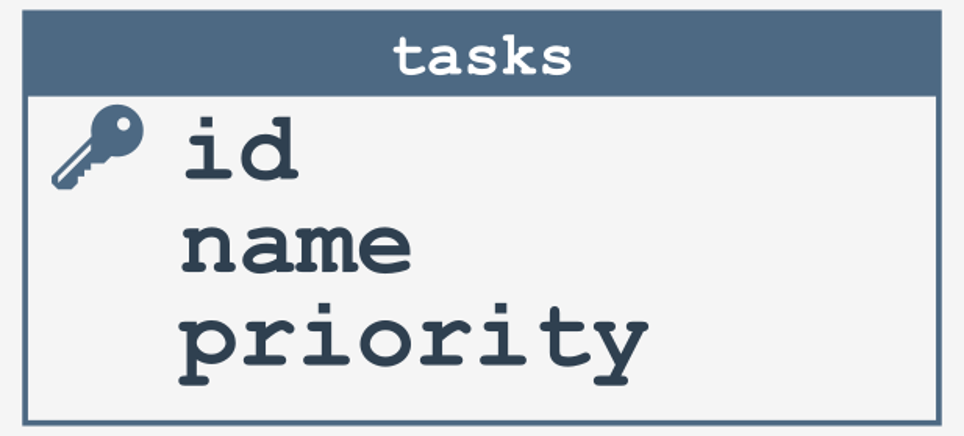

# What is SQLite and why to use it

## What is SQLite and why should you use it?
Before you create your first database, we'll say a few words about SQLite, one of the most popular database management systems in the world. SQLite is actually a C library which allows the user to read and write data directly to a file. You're surprised?

The complete SQLite database is stored in only one file. Unlike other database management systems, SQLite doesn't require a separate server process to be running in order to communicate with the database.

What's more, it doesn't require any configuration at all, because it's a self-contained library enclosed in one source file. SQLite also supports transactions, which are a set of database operations that must be executed in full, or rolled back if one of them fails.

<p align="center"></p>

SQLite has found many uses in mobile applications (on both Android and iOS platforms) to store information about their status. In addition, it's used by companies producing software for cars and airplanes. The database file is cross-platform, which means it can be copied between 32- and 64-bit systems.

Isn't it amazing that you can transfer the database created in this course to the airplane software?

### How to work with an SQLite database using Python
You've probably already used the standard library with built-in modules many times during your adventures with Python. In this part of the course, you'll have the opportunity to learn about a new module that will allow you to create amazing applications using SQLite databases. Can you guess what it’s called? If not, don't worry, everything will be clear in a moment.

The standard Python library has a module called `sqlite3`, providing an interface compliant with the DB-API 2.0 specification described by [PEP 249](https://peps.python.org/pep-0249/). The purpose of the DB-API 2.0 specification is to define a common standard for creating modules to work with databases in Python.

Imagine three cars that have the same necessary equipment, but were made by other manufacturers. It's exactly the same with modules implementing the DB-API 2.0 interface. Each of them has the same method required by the specification, but can be written by different programmers, and even by you.

To use the `sqlite3` module, you must import it in your script:
```python
import sqlite3
```

> [!NOTE]
> The sqlite3 module has been available in Python since version 2.5.

### sqlite3 – creating a database
As we already said, the SQLite database is a single file, which is saved on your computer. Each file, regardless of the operating system used, has its location (a path to a specific disk space). When you create a database, you can create it in your current working directory, or in any other location. To create a database, use the `connect` method provided by the `sqlite3` module:
```python
import sqlite3

conn = sqlite3.connect('hello.db')
```
The `connect` method returns the database representation as a `Connection` object. In the example above, the method takes only the database name as the argument. This means that the database will be created in the same directory as the script that wants to access it. If you'd like to create a database in the `sqlite3` directory on your C disk you can do this as follows:
```python
import sqlite3

conn = sqlite3.connect('C:\sqlite\hello.db')
```
It's also possible to use a special name, `:memory:`, which creates a database in RAM:
```python
import sqlite3

conn = sqlite3.connect(':memory:')
```
Remember that the `connect` method creates a database only if it cannot find a database in the given location. If a database exists, SQLite connects to it.

<p align="center"></p>

### A few words about SQL
You’ve already learned how to create a database in Python using the `sqlite3` module. It's now time to discuss how we can create its structure. For this purpose, we’ll need some knowledge of SQL.

SQL is a **Structured Query Language** for creating, modifying, and managing relational databases. It’s used by the most popular database management systems such as MySQL, PostgreSQL, and our favorite SQLite. The SQL language was developed in the 70s by IBM. Over the years, SQL has been modified by many companies that have implemented it in their products. Therefore, it became necessary to introduce a standard that would standardize its syntax.

Since the first production deployments, the following standards have been created: SQL-86, SQL-89, SQL-92, SQL:1999, SQL:2003, SQL:2006, SQL:2008, SQL:2011, SQL:2016, SQL:2019. Detailed information on each of the standards can be found in the Internet resources. It’s worth mentioning that SQLite generally implements the SQL-92 standard, with some exceptions that you can read about [here](https://www.sqlite.org/lang.html).

SQL syntax and its standards are extensive topics. Fortunately, there are many free materials available on the Internet to help you acquire some basic knowledge. We encourage you to familiarize yourself with them.

If you've never dealt with SQL before, don't worry. All examples including SQL will be explained in detail.

<p align="center"></p>

### sqlite3 – the TODO application
Have you ever forgotten to do anything during the day? If so, it's time to finally solve this problem. Let's create a simple project called **TODO**, during which we’ll create a database to store tasks (to do) along with their priorities. The structure of our database will consist of only one table called `tasks`:

<p align="center"></p>

To create the above table, we’ll need to use the SQL statement `CREATE TABLE`. Its syntax looks like this:
```
CREATE TABLE table_name (
column1 datatype,
column2 datatype,
column3 datatype,
…
columnN datatype
);
```
The `CREATE TABLE` statement creates a new table in the database. In our case, it will be a table called `tasks` consisting of three columns: `id`, `name` and `priority`.

The `id` column is a primary key that allows you to uniquely identify records stored in the table. The second column called `name` is responsible for storing the names of the tasks we’ll have to do. It's not difficult to guess that these will be textual values.

For this purpose, we’ll use the `TEXT` type. The last column called `priority` defines the priority of our tasks and should store integers.

Below is the SQL code that we’ll use later in the course to create our table using the `sqlite3` module. Note the name and priority columns that contain the `NOT NULL` constraint. This will avoid creating tasks with fields equal to `NULL`.
```
CREATE TABLE tasks (
id INTEGER PRIMARY KEY,
name TEXT NOT NULL,
priority INTEGER NOT NULL
);
```
You’ll find more information on all types available in SQLite [here](https://www.sqlite.org/datatype3.html).

### sqlite3 – creating tables
When connecting to the database using the `connect` method, a `Connection` object is created. It has a very useful method called `cursor`. The method creates a `Cursor` object that allows any SQL statements to be executed in the database. What does it look like in practice? Let's look at the code responsible for creating the table called `tasks`:
```python
import sqlite3

conn = sqlite3.connect('todo.db')
c = conn.cursor()
c.execute('''CREATE TABLE tasks (
id INTEGER PRIMARY KEY,
name TEXT NOT NULL,
priority INTEGER NOT NULL
);''')
```
Calling the `execute` method executes the `CREATE TABLE` statement in our database. The `execute` method takes any single SQL statement and optional parameters necessary to execute the query. The variant with optional parameters will be presented when we discuss inserting data in the database.

**NOTE**: Running the above program twice will throw an exception with the following message: `sqlite3.OperationError: table tasks already exists.` This is because the statement is trying to re-create a table with the same name. The solution to this problem is to modify the query as follows:
```python
CREATE TABLE IF NOT EXISTS tasks (
id INTEGER PRIMARY KEY,
name TEXT NOT NULL,
priority INTEGER NOT NULL
);
```

### sqlite3 – inserting data
Congratulations. You’ve just created your first table in the database. It's time to fill it with data. Once again, a little knowledge of the SQL language will be invaluable, namely the `INSERT INTO` statement.

The `INSERT INTO` statement is used to insert records in a table. Its syntax is as follows:
```
INSERT INTO table_name (column1, column2, column3, ..., columnN)
VALUES (value1, value2, value3, ..., value4);
```
Using the above formula, we’re able to prepare a query that will allow us to save our first task in the database:
```
INSERT INTO tasks (id, name, priority) VALUES (1, 'My first task', 1);
```
or
```
INSERT INTO tasks (name, priority) VALUES ('My first task', 1);
```
You've probably noticed that in the second variant the `id` column is omitted. In this case, we inform the database management system of the desire to use auto-incrementation (a unique value is generated for us when a new record is inserted).

Of course, we can define the value of the `id` column ourselves, but it's more convenient not to worry about it.

The `INSERT INTO` statement also has a short form in which we can omit the column names:
```
INSERT INTO table_name VALUES (value1, value2, value3, ..., valueN);
```

Let's look at how to use the `INSERT INTO` statement in our TODO project. Analyze the code in the editor.
```python
import sqlite3

conn = sqlite3.connect('todo.db')
c = conn.cursor()
c.execute('''CREATE TABLE IF NOT EXISTS tasks (
id INTEGER PRIMARY KEY,
name TEXT NOT NULL,
priority INTEGER NOT NULL
);''')
c.execute('INSERT INTO tasks (name, priority) VALUES (?,?)', ('My first task', 1))
```
The mysterious characters `?` used in the `INSERT INTO` statement are query parameters that are replaced with the correct values during the execution of the statement. In the above example, the first character `?` will be replaced with `My first task`, while the second will be replaced with `1`.

This is to avoid an SQL injection attack in which malicious SQL is appended to a query that could possibly destroy our database. You can find more information about SQL injection and possible safeguard measures on the Internet.

The `execute` method, as we mentioned before, has an optional argument in the form of an array of parameters. In our case, it takes a tuple, but it can be a simple array containing the same number of elements as the query parameters.

Our code isn't working properly yet, but don't worry. In a moment, you’ll learn a new method that will fix this problem.

We’re only one step away from inserting our first task in the database. All we're missing is to call the `commit` method provided by the `Connection` object. Look at the code in the editor.
```python
import sqlite3

conn = sqlite3.connect('todo.db')
c = conn.cursor()
c.execute('''CREATE TABLE IF NOT EXISTS tasks (
id INTEGER PRIMARY KEY,
name TEXT NOT NULL,
priority INTEGER NOT NULL
);''')
c.execute('INSERT INTO tasks (name, priority) VALUES (?,?)', ('My first task', 1))
conn.commit()
conn.close()
```
The `commit` method confirms our changes (the current transaction). If you forget to call it, your changes won't be visible in the database.

In the example above, another method of the `Connection` object is used. The `close` method closes the database connection, e.g., after inserting all tasks.

**NOTE**: Restarting the program will create another task with the same name and priority, but with a different value that is auto-incremental.

### sqlite3 – the `executemany()` method
Performing many queries is not very efficient when we can use just one that performs the same task. Imagine a situation where you want to add three tasks to the database. If we used the `execute` method, we would have to do three separate queries.

This isn't good practice. Fortunately, the `Cursor` object offers us a method called `executemany`. Look at the code in the editor.
```python
import sqlite3

conn = sqlite3.connect('todo.db')
c = conn.cursor()
c.execute('''CREATE TABLE IF NOT EXISTS tasks (
id INTEGER PRIMARY KEY,
name TEXT NOT NULL,
priority INTEGER NOT NULL
);''')
tasks = [
    ('My first task', 1),
    ('My second task', 5),
    ('My third task', 10),
]
c.executemany('INSERT INTO tasks (name, priority) VALUES (?,?)', tasks)
conn.commit()
conn.close()
```
The `executemany` method allows you to insert multiple records at once. As an argument, it accepts an SQL statement and an array containing any number of tuples.

### Application refactoring
**Refactoring** is a very important process during software development. The main purpose of refactoring is to improve the quality of the code. Every programmer in their career will have to refactor either their own or someone else’s code sooner or later.

A very common mistake made by young adepts of the art of programming is to repeat the same pieces of code in different places in the application. In this case, refactoring consists of creating a function containing repetitive fragments. As a result, the code’s volume is reduced, and it becomes more readable.

You've probably noticed that adding new functionalities to our **TODO** application would be very difficult. This is a sign that our application requires refactoring. Below are suggestions for changes we can make:
1. creating a class called `TODO` that will connect to the database in the constructor. If you want, you can implement a separate method called `connect` for this purpose;
2. moving the code responsible for creating the `tasks` table to the method named `create_tasks_table`;
3. creating a method called `add_task` that will get the task name and priority from the user instead of using hardcoded values.

Will we be able to easily implement, for example, the data display functionality after these changes? Find out about this later in the course.
```python
import sqlite3

class Todo:
    def __init__(self):
        self.conn = sqlite3.connect('todo.db')
        self.c = self.conn.cursor()
        self.create_task_table()
        
    def create_task_table(self):
        self.c.execute('''CREATE TABLE IF NOT EXISTS tasks (
                     id INTEGER PRIMARY KEY,
                     name TEXT NOT NULL,
                     priority INTEGER NOT NULL
                     );''')
    
    def add_task(self):
        name = input('Enter task name: ')
        priority = int(input('Enter priority: '))
        
        self.c.execute('INSERT INTO tasks (name, priority) VALUES (?,?)', (name, priority))
        self.conn.commit()

app = Todo()
app.add_task()
```

### sqlite3 – reading data
So far, we haven't displayed any information on the screen about the inserted tasks. It's time to change that. Let's see what’s in our database. We’ll first need the appropriate SQL statement, named `SELECT`.

The `SELECT` statement allows you to read data from one or more tables. Its syntax looks like this:
```
SELECT column FROM table_name;
```
or
```
SELECT column1, column2, column3, …, columnN FROM table_name;
```
or
```
SELECT * FROM table_name;
```
In the first variant, we decide to read the values saved in only one column. If we'd like to read only the names of the tasks saved in the `tasks` table, we could use the following query:
```
SELECT name FROM tasks;
```
The second variant allows you to read values from more columns. If we'd like to read the task names and their priorities, we could use the following query:
```
SELECT name, priority FROM tasks;
```
If we don’t have any specific requirements, we can read the values from all columns:
```
SELECT * FROM tasks;
```
The last variant will display the values saved in the `id`, `name` and `priority` columns.

It probably won’t surprise you to learn that reading data saved in the database is done with the well-known `Cursor` object. After calling the `execute` method with the appropriate `SELECT` statement, the `Cursor` object is treated as an iterator. Look at the code in the editor.
```python
import sqlite3

conn = sqlite3.connect('todo.db')
c = conn.cursor()
for row in c.execute('SELECT * FROM tasks'):
    print(row)
conn.close()
```
Result:
```
(1, 'My first task', 1)
(2, 'My second task', 5)
(3, 'My third task', 10)
```
The variable `row` in each iteration takes a row in the form of a tuple. Access to individual columns is done using an index, e.g., `print(row[0])` will display the values saved in the `id` column.

If you don't want to treat the `Cursor` object as an iterator, you can use its method called `fetchall`. The `fetchall` method fetches all records (those not yet fetched from the query result). Look at the code in the editor.
```python
import sqlite3

conn = sqlite3.connect('todo.db')
c = conn.cursor()
c.execute('SELECT * FROM tasks')
rows = c.fetchall()
for row in rows:
    print(row)
conn.close()
```
Result:
```
(1, 'My first task', 1)
(2, 'My second task', 5)
(3, 'My third task', 10)
```
The `fetchall` method is less efficient than the iterator, because it reads all records into the memory and then returns a list of tuples. For small amounts of data, it doesn't matter, but if your table contains a huge number of records, this can cause memory issues.

> [!NOTE]
> The `fetchall` method returns an empty list when no rows are available.

In addition to the iterator and the `fetchall` method, the `Cursor` object provides a very useful method called `fetchone` to retrieve the next available record. Look at the code in the editor.
```python
import sqlite3

conn = sqlite3.connect('todo.db')
c = conn.cursor()
c.execute('SELECT * FROM tasks')
row = c.fetchone()
print(row)
row = c.fetchone()
print(row)
conn.close()
```
Result:
```
(1, 'My first task', 1)
(2, 'My second task', 5)
```

> [!NOTE]
> The `fetchone` method returns `None` if there is no data to read.

### sqlite3 – updating data
Each of the tasks created has its own priority, but what if we decide that one of them should be done earlier than the others. How can we increase its priority? We have to use the SQL statement called `UPDATE`.

The `UPDATE` statement is used to modify existing records in the database. Its syntax is as follows:
```
UPDATE table_name
SET column1 = value1, column2 = value2, column3 = value3, …, columnN = valueN
WHERE condition;
```
If we'd like to set the priority to 20 for a task with `id` equal to 1, we can use the following query:
```
UPDATE tasks SET priority = 20 WHERE id = 1;
```
**NOTE**: If you forget about the `WHERE` clause, all data in the table will be updated.

As before, we execute all SQL statements using the `execute` method. Look at the code in the editor.
```python
import sqlite3

conn = sqlite3.connect('todo.db')
c = conn.cursor()
c.execute('UPDATE tasks SET priority = ? WHERE id = ?', (20, 1))
c.commit()
c.close()
```

### sqlite3 – deleting data
After completing a task, we would like to remove it from our database. To do this, we must use the SQL statement called `DELETE`:
```
DELETE FROM table_name WHERE condition;
```
Let's look at what removing the task with `id = 1` might look like:
```
DELETE FROM tasks WHERE id = 1;
```
**NOTE**: If you forget about the `WHERE` clause, all data in the table will be deleted.

Look at the code in the editor to see how to delete a record using the `sqlite3` module.
```python
import sqlite3

conn = sqlite3.connect('todo.db')
c = conn.cursor()
c.execute('DELETE FROM tasks WHERE id = ?', (1,))
c.commit()
c.close()
```